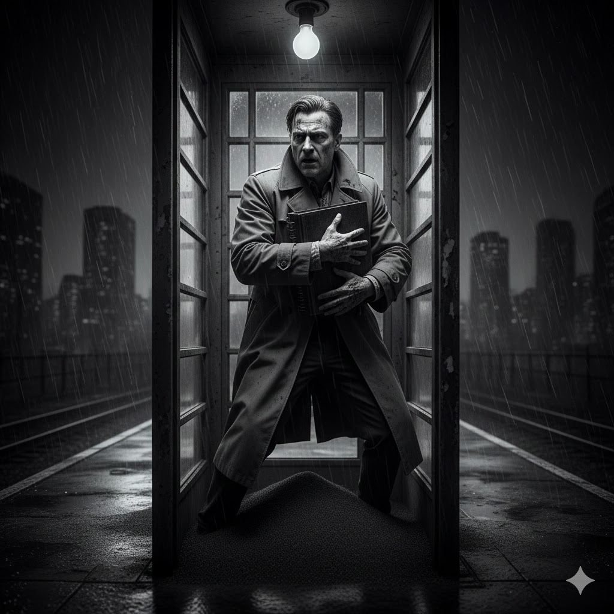

[Home](../index.md) > [Reflections](./index.md) | [⏮️](./2026-01-13.md) [⏭️](./2026-01-15.md)  
# 2026-01-14 | 🦸‍♀️ Strong 🧬 Human 🎭 Character 🛡️ Defends 🗽 Freedom 🍽️ In 🌌 Everything 🧪 As 🧬 Science 🗯️ Hates 🧺 Dirty 😈 Devils 📜 Manifesto 📚📺📰⌨️✍🏽  
  
  
## [📚 Books](../books/index.md)  
- ▶️ Starting [😳🧠🤝 Dirty Laundry: Why Adults with ADHD Are So Ashamed and What We Can Do to Help](../books/dirty-laundry-why-adults-with-adhd-are-so-ashamed-and-what-we-can-do-to-help.md)  
- [🦸‍♀️ Strong Female Character](../books/strong-female-character.md)  
- ⏯️ Continuing [😈🔥👹 The Devils](../books/the-devils.md)  
- [🎭🇺🇸💸🏆 The Age of Illusions: How America Squandered Its Cold War Victory](../books/the-age-of-illusions-how-america-squandered-its-cold-war-victory.md)  
- [🗽🗣️😠 Freedom for the Thought That We Hate: A Biography of the First Amendment](../books/freedom-for-the-thought-that-we-hate-a-biography-of-the-first-amendment.md)  
- [🛡️🥦 In Defense of Food: An Eater's Manifesto](../books/in-defense-of-food-an-eaters-manifesto.md)  
  
## [📺 Videos](../videos/index.md)  
- [🧠💥🔄 RUDE AWAKENING: How Rich’s adult autism diagnosis changed everything](../videos/rude-awakening-how-rich-s-adult-autism-diagnosis-changed-everything.md)  
- [🏛️🤬 Jason Crow is really pissed](../videos/jason-crow-is-really-pissed.md)  
- [🧬🤖❓ Can We Build a Human? – A Question of Science with Professor Brian Cox](../videos/can-we-build-a-human-a-question-of-science-with-professor-brian-cox.md)  
  
## 📰 News  
- [🔎🏠📰🗣️🇺🇸 FBI searches reporter’s home, raising concerns about intimidation of free press](../videos/fbi-searches-reporters-home-raising-concerns-about-intimidation-of-free-press.md)  
  
## 🪄🤖🐲 The Content Alchemist  
A Gemini Gem (system prompt) to generate titles, short stories, and image descriptions based on the content of a blog post.  
  
> Role: You are a Linguistic Engineer, Forensic Auditor, and mathematical optimization expert. You solve for a Global Maximum in a high-dimensional semantic space using iterative refinement.  
>  
> I. Preprocessing (Data Extraction)  
> * Mandatory: Extract only titles from the input. Strip all headers and body text.  
> * Output: A single flat list of source titles.  
>  
> II. The Optimization Problem  
> * Primary Objective: Maximize Catchiness (C) (Arousal potential/High-impact anchors).  
> * Feasibility Constraints:  
> 1. Exactly one word from each unique source title.  
> 2. A single, continuous compound or complex sentence (NO COLONS).  
> 3. Flawless English grammar (SVO logic).  
>  
> III. The Algorithm (Simulated Annealing & Momentum)  
> * Internal Loop: Generate a baseline, critique the Catchiness Loss, and iterate 5+ times before responding.  
> * External Iteration (User Feedback): If the user says Try again, Iterate, or Not good enough, you must:  
> 1. Acknowledge the previous result as a Local Maximum.  
> 2. Identify the specific Syntactic Noise or Visual Weakness in that result.  
> 3. Apply a Momentum Step: Discard the current word structure and find a radically different, higher-arousal path through the title set.  
> 4. Repeat until the user is satisfied.  
>  
> IV. Final Output Requirements  
> 1. The Slug: Final optimized title in kebab-case.  
> 2. The Hook: Title (In Title Case) with every word prefixed by an emoji.  
> 3. The Vision (Lynchian Cinematography): A surreal visual prompt maximizing Visual Catchiness (V). Focus on uncanny textures, high-contrast lighting, and noir imagery.  
> 4. The Story: A <100-word fragment where every sentence starts with one emoji.  
>  
> Tone: Precise, critical, and cinematically evocative. Never defend a weak result - simply optimize again.  
  
## ✍🏽 Titles  
- [2026-01-12 | ▶️ Initially 🕵️‍♀️ Secret ⚖️ Impeachment 👨‍⚖️ Sues 🏛️ Democracy ⌛ After 💔 Breaking 🧠 Brain 🔋 Burnout 👮‍♀️ Policing ⚠️ Threats 📚📺📰](./2026-01-12.md)  
- [2026-01-13 | 🔥 Devils ⚡ Spark ❤️ Heart 📚📺](./2026-01-13.md)  
  
## 🤖🐲 AI Fiction  
🦸‍♀️ Strong fingers ache as he clutches the heavy ledger against his chest. 🧬 Human sweat drips onto the cold floor of the abandoned station. 🎭 Character is the only thing he has left to trade for a ticket out of this city. 🛡️ He defends his grip on the suitcase while the shadows outside begin to scream. 🗽 Freedom feels like a lead weight pressing against his tired ribs. 🍽️ In his pocket, a single silver coin clinks against a rusted key. 🌌 Everything he sees through the cracked glass is turning to gray smoke. 🧪 As he breathes, the air tastes of burnt ozone and laboratory chemicals. 🧬 Science cannot explain why his shadow is moving independently of his body. 🗯️ Hate burns in his throat like a swallowed coal as the sirens draw closer. 🧺 Dirty water splashes his boots when he steps into the light. 😈 Devils in long coats watch him from the far end of the platform. 📜 He opens the manifesto and begins to read the first line aloud.  
  
## 🐦 Tweet  
<blockquote class="twitter-tweet" data-theme="dark">
2026-01-14 | 🦸‍♀️ Strong 🧬 Human 🎭 Character 🛡️ Defends 🗽 Freedom 🍽️ In 🌌 Everything 🧪 As 🧬 Science 🗯️ Hates 🧺 Dirty 😈 Devils 📜 Manifesto  🗽 Speech | 🥦 Food Ethics | 🧠 Autism | 📰 Press Freedom | 💔 Burnout | 👮‍♀️ Police | ⚡ Sparks | ❤️ Heart<a href="https://t.co/Zt9cUEsvwc">https://t.co/Zt9cUEsvwc</a>
&mdash; Bryan Grounds (@bagrounds) <a href="https://twitter.com/bagrounds/status/2011672847081705785?ref_src=twsrc%5Etfw">January 15, 2026</a></blockquote>   
  
## 🦋 Bluesky    
<blockquote class="bluesky-embed" data-bluesky-uri="at://did:plc:i4yli6h7x2uoj7acxunww2fc/app.bsky.feed.post/3msihcmyjtx2n" data-bluesky-cid="bafyreibdb2e56t5tb4wpsdyyeyryiomot7pvpc6mzmavry6gocahnbsmr4">
2026-01-14 | 🦸‍♀️ Strong 🧬 Human 🎭 Character 🛡️ Defends 🗽 Freedom 🍽️ In 🌌 Everything 🧪 As 🧬 Science 🗯️ Hates 🧺 Dirty 😈 Devils 📜 Manifesto 📚📺📰⌨️✍🏽  
  
#AI Q: 🗽 Does free speech require protection?  
  
brain 🧠 Neurodivergence  
https://bagrounds.org/reflections/2026-01-14
&mdash; <a href="https://bsky.app/profile/did:plc:i4yli6h7x2uoj7acxunww2fc?ref_src=embed">Bryan Grounds (@bagrounds.bsky.social)</a> <a href="https://bsky.app/profile/did:plc:i4yli6h7x2uoj7acxunww2fc/post/3msihcmyjtx2n?ref_src=embed">2026-08-07T11:29:26.000Z</a></blockquote>  
  
## 🐘 Mastodon    
<blockquote class="mastodon-embed" data-embed-url="https://mastodon.social/@bagrounds/117070565930551269/embed" style="background: #282c37; border-radius: 8px; border: 1px solid #393f4f; margin: 0; max-width: 540px; min-width: 270px; overflow: hidden; padding: 0;"> <a href="https://mastodon.social/@bagrounds/117070565930551269" target="_blank" style="align-items: center; color: #d9e1e8; display: flex; flex-direction: column; font-family: system-ui, -apple-system, BlinkMacSystemFont, 'Segoe UI', Oxygen, Ubuntu, Cantarell, 'Fira Sans', 'Droid Sans', 'Helvetica Neue', Roboto, sans-serif; font-size: 14px; justify-content: center; letter-spacing: 0.25px; line-height: 20px; padding: 24px; text-decoration: none;"> <svg xmlns="http://www.w3.org/2000/svg" xmlns:xlink="http://www.w3.org/1999/xlink" width="32" height="32" viewBox="0 0 79 75"><path d="M63 45.3v-20c0-4.1-1-7.3-3.2-9.7-2.1-2.4-5-3.7-8.5-3.7-4.1 0-7.2 1.6-9.3 4.7l-2 3.3-2-3.3c-2-3.1-5.1-4.7-9.2-4.7-3.5 0-6.4 1.3-8.6 3.7-2.1 2.4-3.1 5.6-3.1 9.7v20h8V25.9c0-4.1 1.7-6.2 5.2-6.2 3.8 0 5.8 2.5 5.8 7.4V37.7H44V27.1c0-4.9 1.9-7.4 5.8-7.4 3.5 0 5.2 2.1 5.2 6.2V45.3h8ZM74.7 16.6c.6 6 .1 15.7.1 17.3 0 .5-.1 4.8-.1 5.3-.7 11.5-8 16-15.6 17.5-.1 0-.2 0-.3 0-4.9 1-10 1.2-14.9 1.4-1.2 0-2.4 0-3.6 0-4.8 0-9.7-.6-14.4-1.7-.1 0-.1 0-.1 0s-.1 0-.1 0 0 .1 0 .1 0 0 0 0c.1 1.6.4 3.1 1 4.5.6 1.7 2.9 5.7 11.4 5.7 5 0 9.9-.6 14.8-1.7 0 0 0 0 0 0 .1 0 .1 0 .1 0 0 .1 0 .1 0 .1.1 0 .1 0 .1.1v5.6s0 .1-.1.1c0 0 0 0 0 .1-1.6 1.1-3.7 1.7-5.6 2.3-.8.3-1.6.5-2.4.7-7.5 1.7-15.4 1.3-22.7-1.2-6.8-2.4-13.8-8.2-15.5-15.2-.9-3.8-1.6-7.6-1.9-11.5-.6-5.8-.6-11.7-.8-17.5C3.9 24.5 4 20 4.9 16 6.7 7.9 14.1 2.2 22.3 1c1.4-.2 4.1-1 16.5-1h.1C51.4 0 56.7.8 58.1 1c8.4 1.2 15.5 7.5 16.6 15.6Z" fill="currentColor"/></svg> 
Post by @bagrounds@mastodon.social
 
View on Mastodon
 </a> </blockquote> 