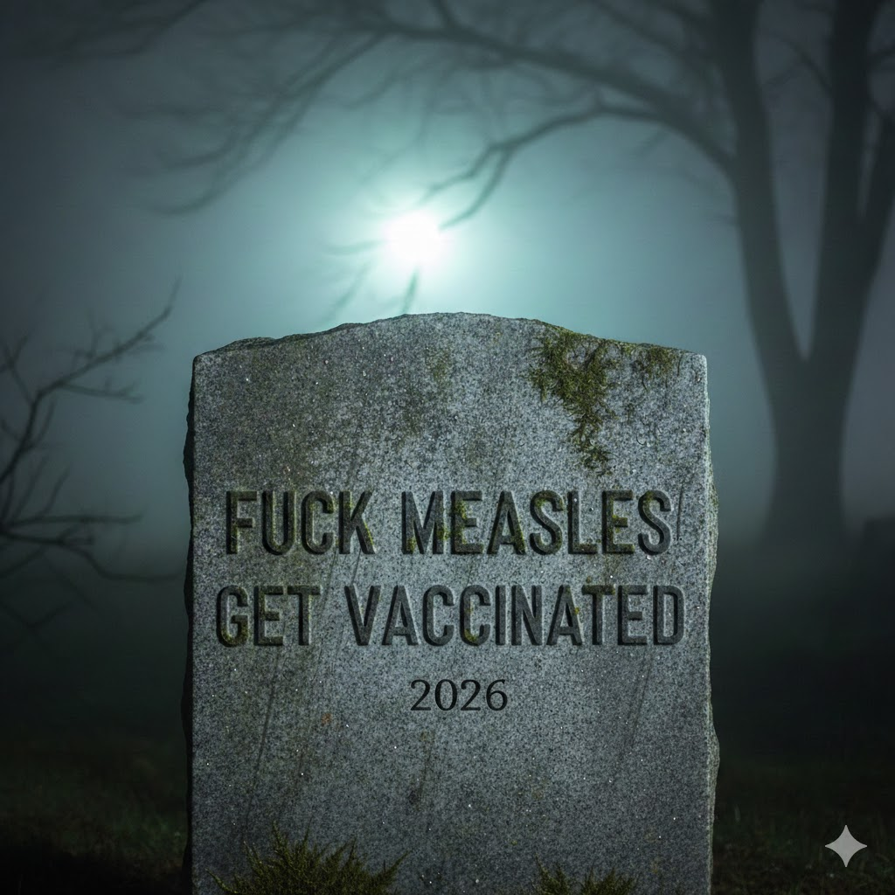

[Home](../index.md) > [Reflections](./index.md) | [⏮️](./2026-01-15.md) [⏭️](./2026-01-17.md)  
# 2026-01-16 | 🤖 Agent ❤️ Taught 🦠 Measles 💉 Health 💰 Debt 📜 History 📺📰📚  
  
  
## [📺 Videos](../videos/index.md)  
- [🤖💬📈🌍 Build a Real-Time AI Sales Agent - Sarah Chieng & Zhenwei Gao, Cerebras](../videos/build-a-real-time-ai-sales-agent-sarah-chieng-zhenwei-gao-cerebras.md)  
- [❤️🧠👨‍👩‍👧‍👦 The crucial emotional skill most adults were never taught | Becky Kennedy](../videos/the-crucial-emotional-skill-most-adults-were-never-taught-becky-kennedy.md)  
  
## 📰 News  
- [🦠🤒🏥 Snohomish County sees measles outbreak](../videos/snohomish-county-sees-measles-outbreak.md)  
  
## [📚 Books](../books/index.md)  
- [💉🦠👶 Booster Shots: The Urgent Lessons of Measles and the Uncertain Future of Children's Health](../books/booster-shots-the-urgent-lessons-of-measles-and-the-uncertain-future-of-childrens-health.md)  
- 🏁 Finished [🏛️💰 Debt: The First 5,000 Years](../books/debt-the-first-5000-years.md)  
- [🔄📜🏛️ Against the Grain: A Deep History of the Earliest States](../books/against-the-grain-a-deep-history-of-the-earliest-states.md)  
  
## 🤖🐲 AI Fiction  
💔 Every labored breath proved that prayer has no currency in a fever ward. 🦠 Measles ravaged their brain, stealing speech before stopping hearts. 📜 Parents left with empty arms and a crushing debt.  
  
## 🐦 Tweet  
<blockquote class="twitter-tweet" data-theme="dark">
2026-01-16 | 🤖 Agent ❤️ Taught 🦠 Measles 💉 Health 💰 Debt 📜 History 📺📰📚  🤖💬📈🌍 AI Sales Agents | ❤️🧠👨‍👩‍👧‍👦 Emotional Skills | 🦠🤒🏥 Measles Outbreaks | 💉👶 Child Health | 🏛️💰 Financial History | 📜🏛️ Ancient States<a href="https://t.co/wXXeHxQdal">https://t.co/wXXeHxQdal</a>
&mdash; Bryan Grounds (@bagrounds) <a href="https://twitter.com/bagrounds/status/2012559564210860200?ref_src=twsrc%5Etfw">January 17, 2026</a></blockquote> 