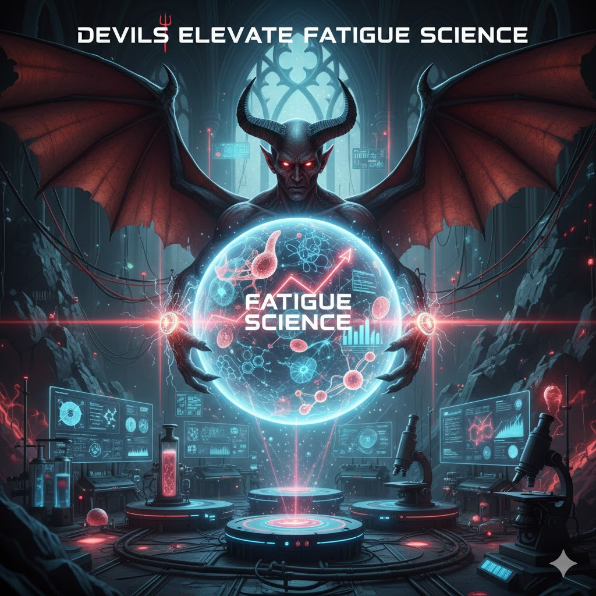
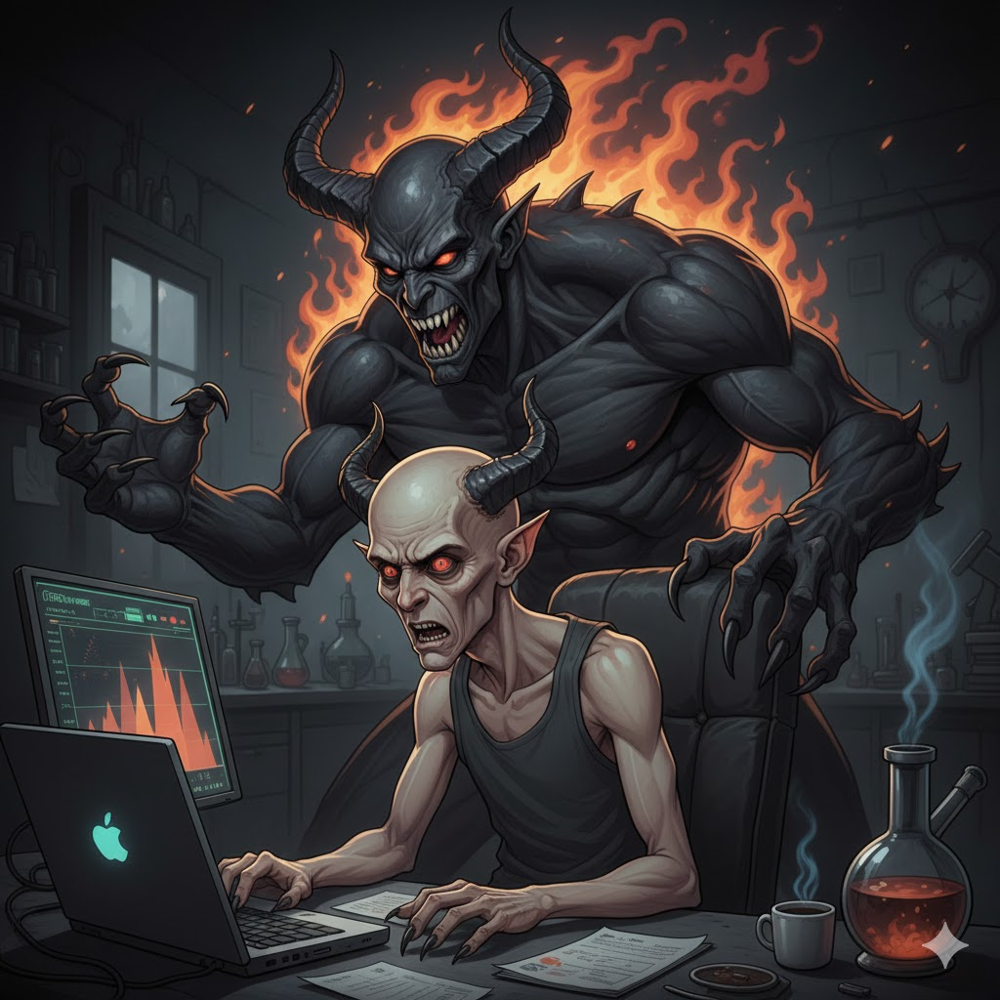

[Home](../index.md) > [Reflections](./index.md) | [⏮️](./2026-01-17.md) [⏭️](./2026-01-19.md)  
# 2026-01-18 | 😈 Devils 🛗 Elevate 😴 Fatigue 🔬 Science 📺📚  
  
  
## [📺 Videos](../videos/index.md)  
- [😴❌💡 Everything You Know About Fatigue is Wrong](../videos/everything-you-know-about-fatigue-is-wrong.md)  
  
## [📚 Books](../books/index.md)  
- [🔬🥱 The Scientific Basis of Fatigue](../books/the-scientific-basis-of-fatigue.md)  
- 🏁 Finished [😈🔥👹 The Devils](../books/the-devils.md)  
- 🏁 Finished [🚀📈🧘 Peak Performance: Elevate Your Game, Avoid Burnout, and Thrive with the New Science of Success](../books/peak-performance-elevate-your-game-avoid-burnout-and-thrive-with-the-new-science-of-success.md)  
  
## 🤖🐲 AI Fiction  
  
  
🔥 The stench of sulfur and burnt coffee hung heavy in the air of Lab 7. 🐀 Zayden, a scrawny demon with perpetually bloodshot eyes, hunched over a flickering console, his claws tracing graphs of plummeting human endurance. 👹 Lord Malakor, a creature of obsidian and fire, loomed behind him. 📉 "The mortals grow weaker, Zayden. Our fatigue metrics are peaking."  
  
😰 Zayden swallowed, a dry rasp in his throat. 💉 "Indeed, my lord. We've introduced a new neurotoxin mimicking joy... they exhaust themselves seeking it."  
  
👁️ Malakor's crimson eyes gleamed. ⚗️ "Excellent. The science of misery marches ever onward."  
  
## 🐦 Tweet  
<blockquote class="twitter-tweet" data-theme="dark">
2026-01-18 | 😈 Devils 🛗 Elevate 😴 Fatigue 🔬 Science 📺📚<a href="https://t.co/89ZNBWLVHh">https://t.co/89ZNBWLVHh</a>
&mdash; Bryan Grounds (@bagrounds) <a href="https://twitter.com/bagrounds/status/2013277250968293787?ref_src=twsrc%5Etfw">January 19, 2026</a></blockquote> 