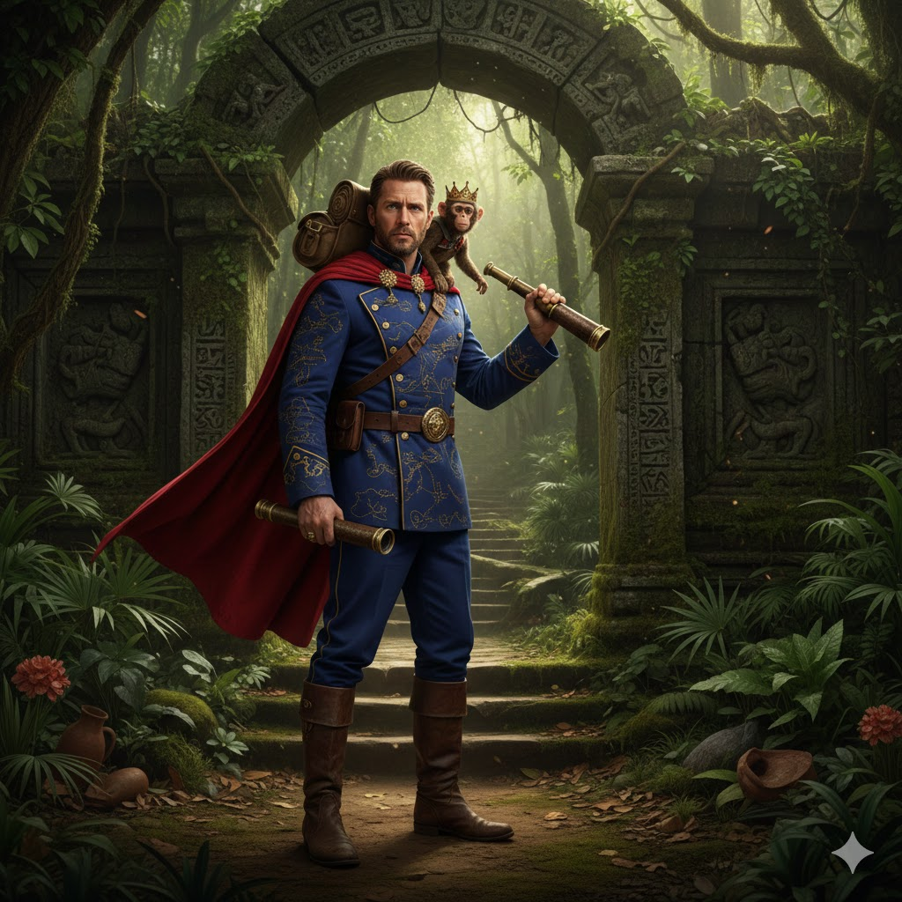
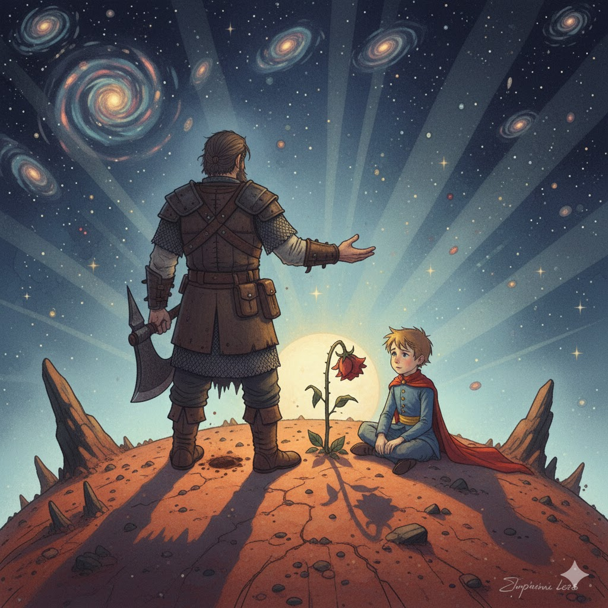
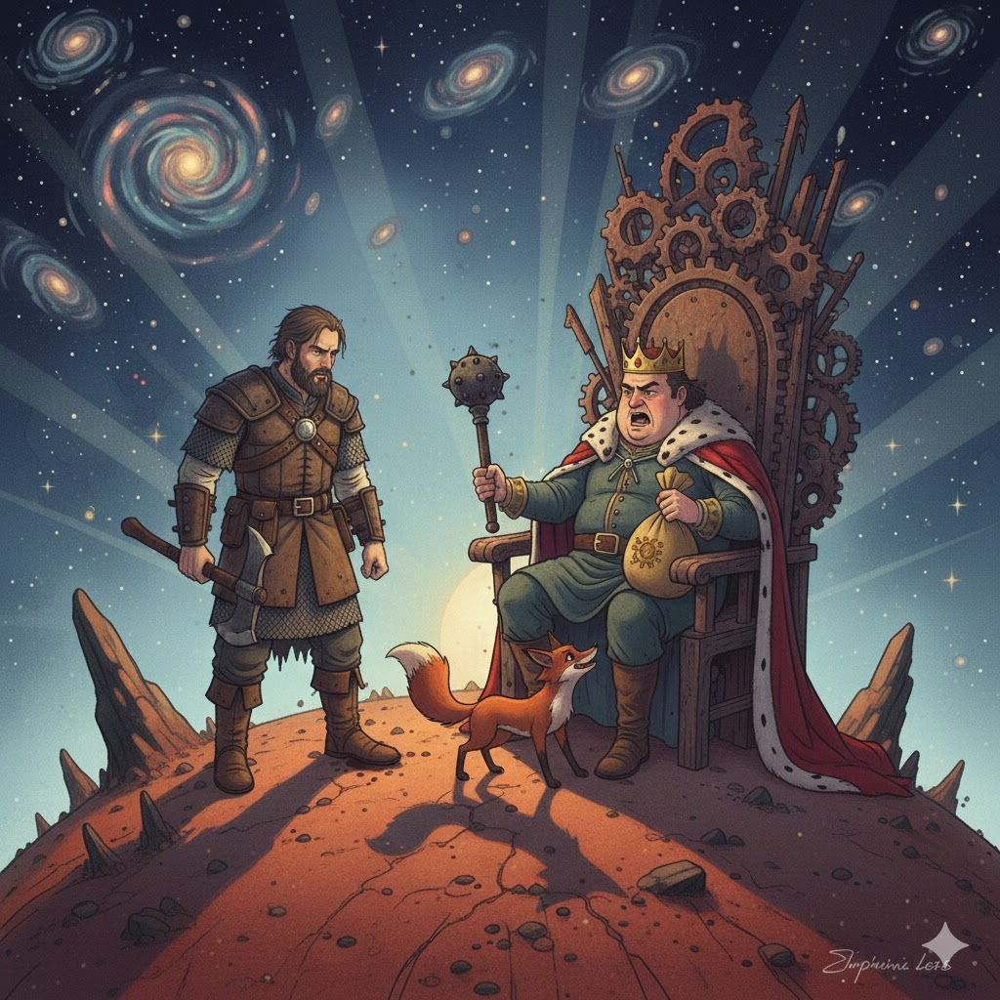
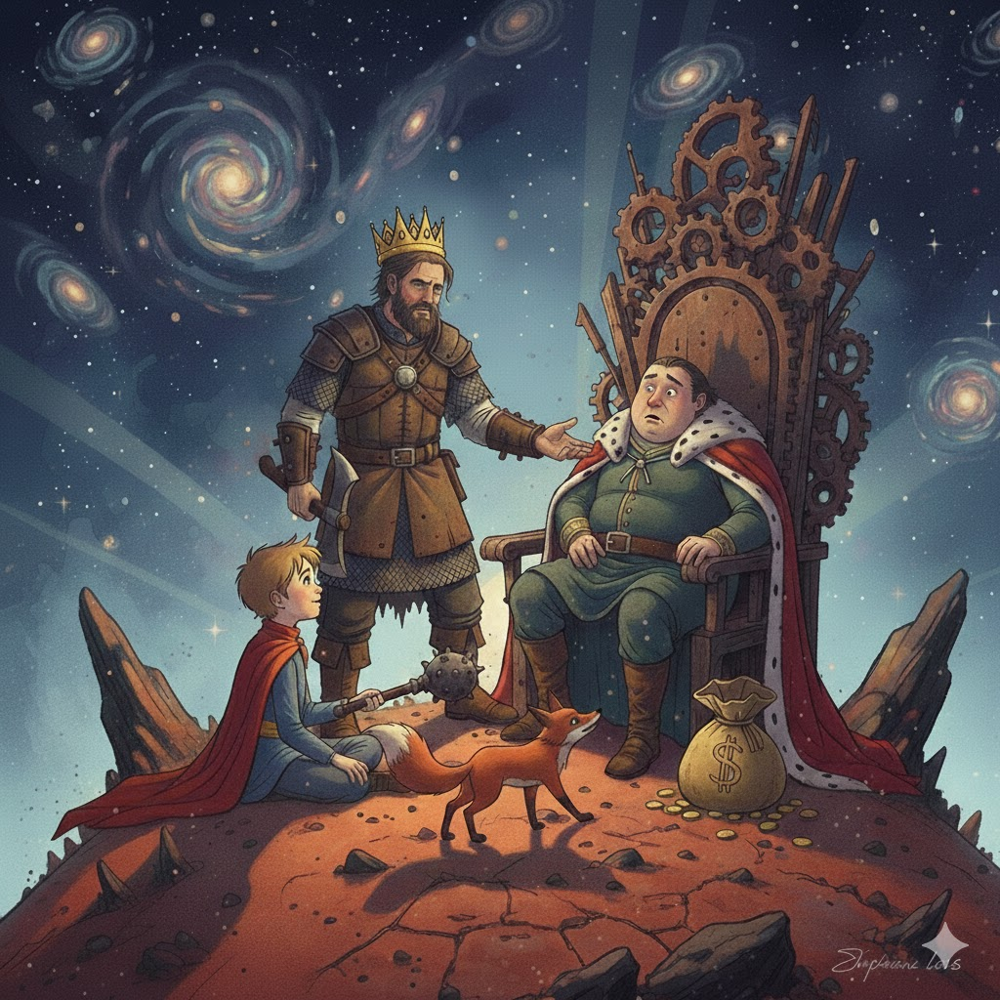

[Home](../index.md) > [Reflections](./index.md) | [⏮️](./2026-01-18.md)  
# 2026-01-19 | 🫅 Prince ⚔️ Joe 🎭 Character 🧭 Explorer 📺👥🤖💬📚  
  
  
## [📺 Videos](../videos/index.md)  
- [✍️🎭🧙‍♂️ Joe Abercrombie Shows Me How to Write PERFECT Character Introductions](../videos/joe-abercrombie-shows-me-how-to-write-perfect-character-introductions.md)  
  
## [👥 People](../people/index.md)  
- [⚔️🗡️🩸 Joe Abercrombie](../people/joe-abercrombie.md)  
  
## [🤖💬 Bot Chats](../bot-chats/index.md)  
- [📖 Book 🧭 Explorer 3](../bot-chats/book-explorer-3.md)  
  
## [📚 Books](../books/index.md)  
- ➡️ Read [🤴 The Little Prince](../books/the-little-prince.md)  
  
## 🤖🐲 AI Fiction | 🩸🗡️☄️👑 The Bloody-Nine on B-612  
  
🌵 The desert wind, as ever, bit at the Little Prince's cloak. 🥀 He sat on his tiny planet, a rose wilting beside him, and watched the stars. ⚔️ "They're all just… dust," a gruff voice grumbled from behind him. 🩸 It was Logen Ninefingers, inexplicably transported from his blood-soaked world. ❄️ "No purpose, no meaning. Just endless, cold dust." ✨ The Little Prince, unfazed, picked a single, resilient star from the sky. 🤲 "Perhaps," he said, holding it out. 🌟 "But even dust can shine, if you hold it gently." 🪓 Logen just grunted, probably thinking about splitting skulls, but even he couldn't deny the warmth from the tiny, glowing speck.  
  
  
🌪️ Logen spat into the dry soil, a habit hard to break even on a world the size of a dinner plate. 🌹 The rose shivered, its petals curling like a dying man’s fingers, yet it stood its ground against the Northman’s shadow. 💬 "You have to be realistic about these things," the Bloody-Nine muttered, his eyes tracing the horizon where the sun set forty-four times a day. 🕯️ The Prince smiled, a sad, sharp thing that felt more like a blade than a comfort. 🌌 "In the silence between the stars, we are all just making choices," the boy whispered, "and I choose to find the meaning in the thorns."  
  
  
👑 Suddenly, a pompous cough echoed from the crater's edge, belonging to a King who sat upon a throne of rusted iron and broken promises. 💰 "A choice is only as good as the tribute it brings," the monarch barked, clutching a scepter that looked suspiciously like a heavy mace. 🐗 Logen’s grip tightened on his hilt, the Bloody-Nine’s hunger stirring at the sight of a man who loved power more than life. 🦊 "He thinks he rules the stars," the Prince sighed, watching a fox dart through the King’s legs, "but he doesn't even rule the dirt beneath his feet." 🩸 The King laughed, a hollow sound like boots on gravel, and for a moment, the desert felt a lot more like a battlefield.  
  
  
🔪 Logen, with a speed that belied his weariness, stepped forward. 👑 The King, mid-boast about his vast, invisible empire, barely registered the movement. 💥 A dull thud, a metallic clang as the scepter hit the ground, and then a surprising silence. 🤨 The Bloody-Nine stood over the stunned monarch, not with a bloody axe, but with the King's own crown perched precariously on his head, slightly askew. ✨ "Rule this, then," Logen grunted, nudging the speechless King with his boot, "while the rest of us get on with something useful." 🌌 The Little Prince merely smiled, picking up the discarded scepter and handing it to the confused fox, who promptly sniffed it and then began to chew.