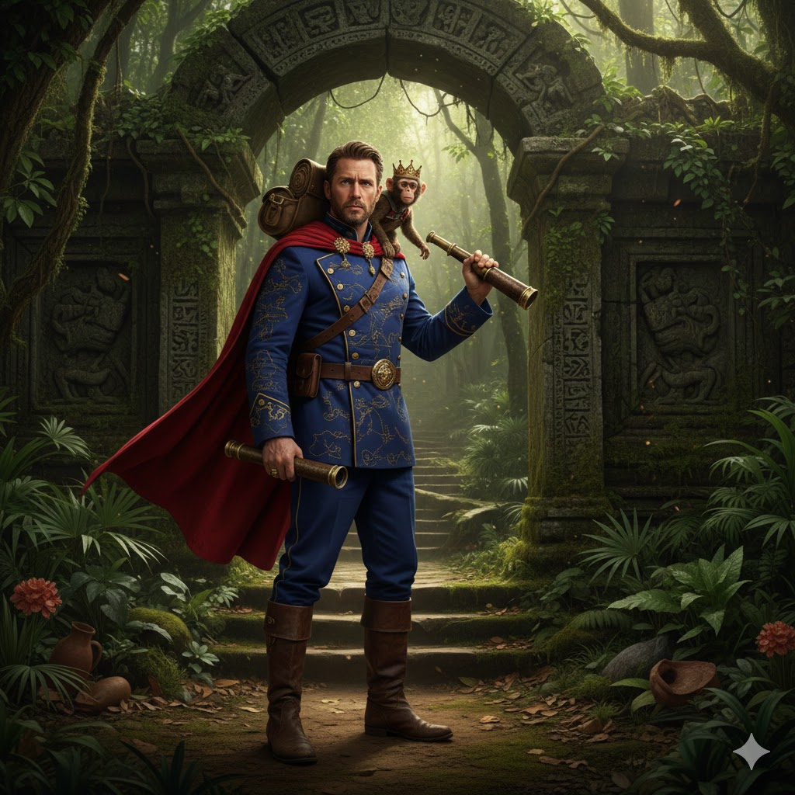
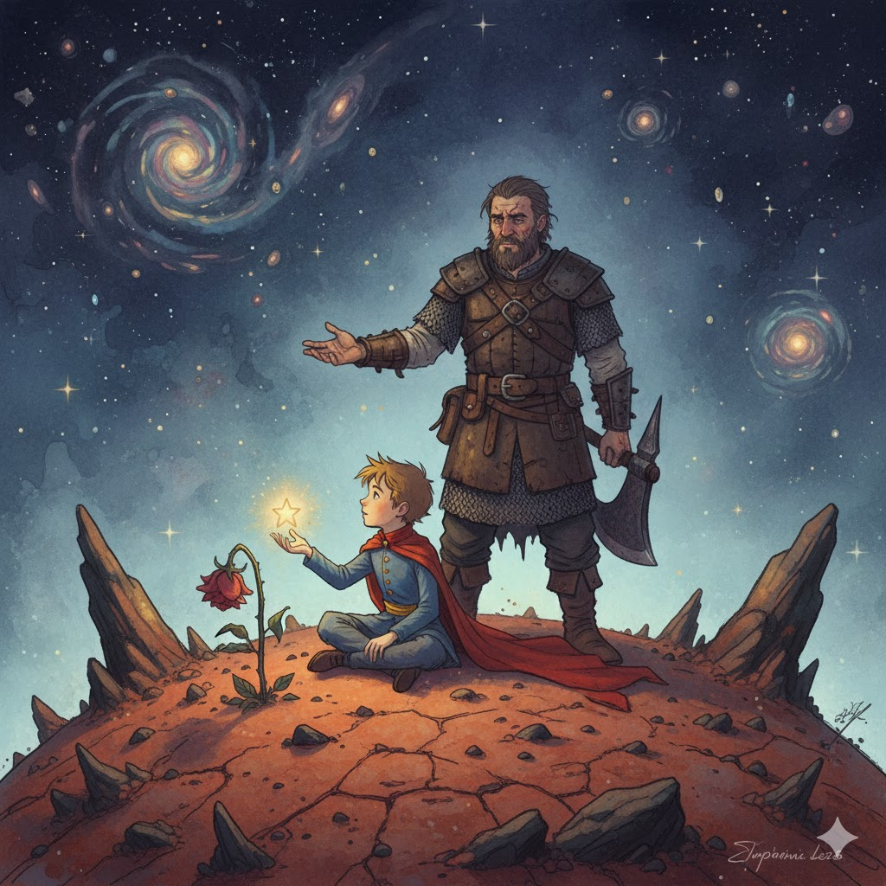
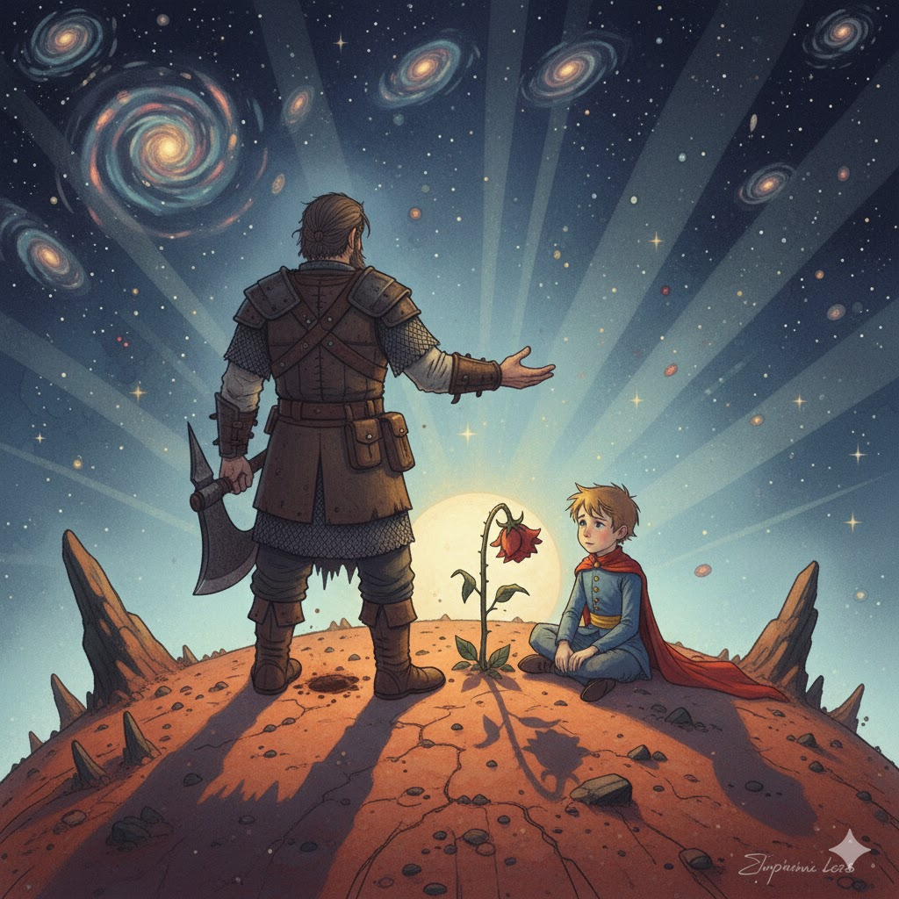
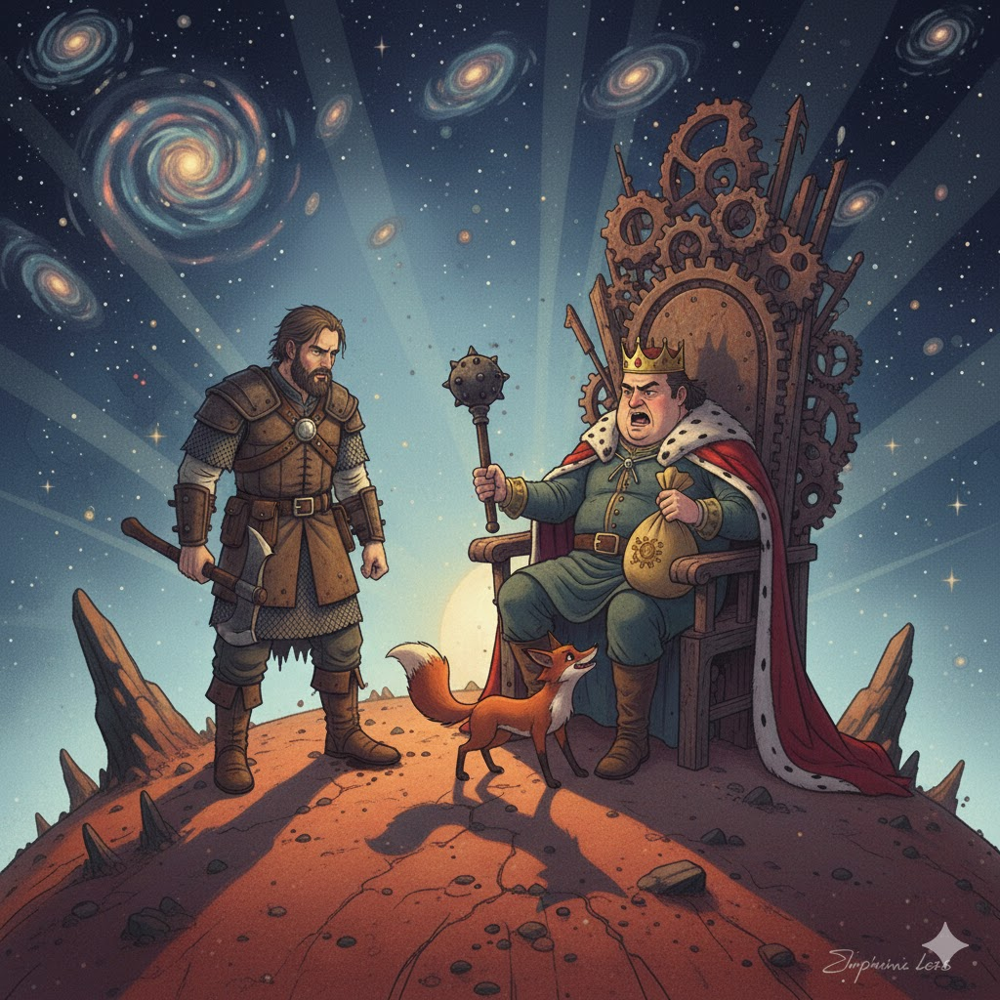
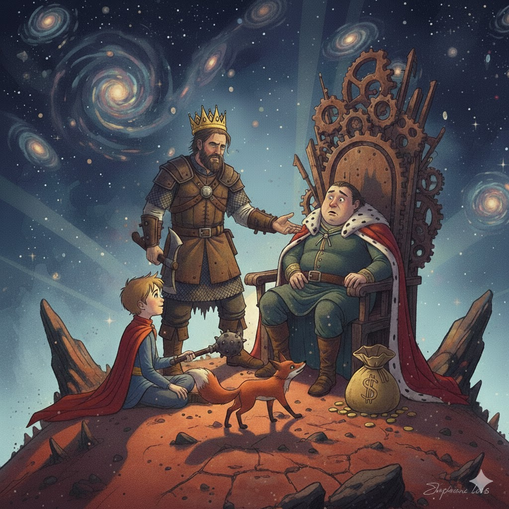

[Home](../index.md) > [Reflections](./index.md) | [⏮️](./2026-01-18.md) [⏭️](./2026-01-20.md)  
# 2026-01-19 | 🫅 Prince ⚔️ Joe 🎭 Character 🧭 Explorer 📺👥🤖💬📚  
  
  
## [📺 Videos](../videos/index.md)  
- [✍️🎭🧙‍♂️ Joe Abercrombie Shows Me How to Write PERFECT Character Introductions](../videos/joe-abercrombie-shows-me-how-to-write-perfect-character-introductions.md)  
  
## [👥 People](../people/index.md)  
- [⚔️🗡️🩸 Joe Abercrombie](../people/joe-abercrombie.md)  
  
## [🤖💬 Bot Chats](../bot-chats/index.md)  
- [📖 Book 🧭 Explorer 3](../bot-chats/book-explorer-3.md)  
  
## [📚 Books](../books/index.md)  
- ➡️ Read [🤴 The Little Prince](../books/the-little-prince.md)  
  
## 🤖🐲 AI Fiction | 🩸🗡️☄️👑 The Bloody-Nine on B-612  
  
🌵 The desert wind, as ever, bit at the Little Prince's cloak. 🥀 He sat on his tiny planet, a rose wilting beside him, and watched the stars. ⚔️ "They're all just… dust," a gruff voice grumbled from behind him. 🩸 It was Logen Ninefingers, inexplicably transported from his blood-soaked world. ❄️ "No purpose, no meaning. Just endless, cold dust." ✨ The Little Prince, unfazed, picked a single, resilient star from the sky. 🤲 "Perhaps," he said, holding it out. 🌟 "But even dust can shine, if you hold it gently." 🪓 Logen just grunted, probably thinking about splitting skulls, but even he couldn't deny the warmth from the tiny, glowing speck.  
  
  
🌪️ Logen spat into the dry soil, a habit hard to break even on a world the size of a dinner plate. 🌹 The rose shivered, its petals curling like a dying man’s fingers, yet it stood its ground against the Northman’s shadow. 💬 "You have to be realistic about these things," the Bloody-Nine muttered, his eyes tracing the horizon where the sun set forty-four times a day. 🕯️ The Prince smiled, a sad, sharp thing that felt more like a blade than a comfort. 🌌 "In the silence between the stars, we are all just making choices," the boy whispered, "and I choose to find the meaning in the thorns."  
  
  
👑 Suddenly, a pompous cough echoed from the crater's edge, belonging to a King who sat upon a throne of rusted iron and broken promises. 💰 "A choice is only as good as the tribute it brings," the monarch barked, clutching a scepter that looked suspiciously like a heavy mace. 🐗 Logen’s grip tightened on his hilt, the Bloody-Nine’s hunger stirring at the sight of a man who loved power more than life. 🦊 "He thinks he rules the stars," the Prince sighed, watching a fox dart through the King’s legs, "but he doesn't even rule the dirt beneath his feet." 🩸 The King laughed, a hollow sound like boots on gravel, and for a moment, the desert felt a lot more like a battlefield.  
  
  
🔪 Logen, with a speed that belied his weariness, stepped forward. 👑 The King, mid-boast about his vast, invisible empire, barely registered the movement. 💥 A dull thud, a metallic clang as the scepter hit the ground, and then a surprising silence. 🤨 The Bloody-Nine stood over the stunned monarch, not with a bloody axe, but with the King's own crown perched precariously on his head, slightly askew. ✨ "Rule this, then," Logen grunted, nudging the speechless King with his boot, "while the rest of us get on with something useful." 🌌 The Little Prince merely smiled, picking up the discarded scepter and handing it to the confused fox, who promptly sniffed it and then began to chew.  
  
## 🐦 Tweet  
<blockquote class="twitter-tweet" data-theme="dark">
2026-01-19 | 🫅 Prince ⚔️ Joe 🎭 Character 🧭 Explorer 📺👥🤖💬📚  ✍️🎭🧙‍♂️ Character Writing Techniques | ⚔️🗡️🩸 Grimdark Fiction | 📖🧭 AI Book Reports | 🤴👑🦊 Fable Interpretation | 🐗🩸☄️👑 Fantasy | 💬 AI Dialogue | 🌟✨ Meaningful Illumination<a href="https://t.co/LnYwBXj8wq">https://t.co/LnYwBXj8wq</a>
&mdash; Bryan Grounds (@bagrounds) <a href="https://twitter.com/bagrounds/status/2013647884269375803?ref_src=twsrc%5Etfw">January 20, 2026</a></blockquote>   
  
## 🦋 Bluesky    
<blockquote class="bluesky-embed" data-bluesky-uri="at://did:plc:i4yli6h7x2uoj7acxunww2fc/app.bsky.feed.post/3mvmt2jxvoq2j" data-bluesky-cid="bafyreihghezo6hdcsldvo55dy2ffwfb5st37thmh5tsjejony3nv2rir5q">
2026-01-19 | 🫅 Prince ⚔️ Joe 🎭 Character 🧭 Explorer 📺👥🤖💬📚  
  
#AI Q: 🎭 Which fictional characters would have the most interesting conversation if they met?  
  
⚔️ Grimdark Fiction | 🦊 Modern Fables | ✍️ Writing Craft | 🤖  
https://bagrounds.org/reflections/2026-01-19
&mdash; <a href="https://bsky.app/profile/did:plc:i4yli6h7x2uoj7acxunww2fc?ref_src=embed">Bryan Grounds (@bagrounds.bsky.social)</a> <a href="https://bsky.app/profile/did:plc:i4yli6h7x2uoj7acxunww2fc/post/3mvmt2jxvoq2j?ref_src=embed">2026-09-16T09:25:53.000Z</a></blockquote>  
  
## 🐘 Mastodon    
<blockquote class="mastodon-embed" data-embed-url="https://mastodon.social/@bagrounds/117297430710535571/embed" style="background: #282c37; border-radius: 8px; border: 1px solid #393f4f; margin: 0; max-width: 540px; min-width: 270px; overflow: hidden; padding: 0;"> <a href="https://mastodon.social/@bagrounds/117297430710535571" target="_blank" style="align-items: center; color: #d9e1e8; display: flex; flex-direction: column; font-family: system-ui, -apple-system, BlinkMacSystemFont, 'Segoe UI', Oxygen, Ubuntu, Cantarell, 'Fira Sans', 'Droid Sans', 'Helvetica Neue', Roboto, sans-serif; font-size: 14px; justify-content: center; letter-spacing: 0.25px; line-height: 20px; padding: 24px; text-decoration: none;"> <svg xmlns="http://www.w3.org/2000/svg" xmlns:xlink="http://www.w3.org/1999/xlink" width="32" height="32" viewBox="0 0 79 75"><path d="M63 45.3v-20c0-4.1-1-7.3-3.2-9.7-2.1-2.4-5-3.7-8.5-3.7-4.1 0-7.2 1.6-9.3 4.7l-2 3.3-2-3.3c-2-3.1-5.1-4.7-9.2-4.7-3.5 0-6.4 1.3-8.6 3.7-2.1 2.4-3.1 5.6-3.1 9.7v20h8V25.9c0-4.1 1.7-6.2 5.2-6.2 3.8 0 5.8 2.5 5.8 7.4V37.7H44V27.1c0-4.9 1.9-7.4 5.8-7.4 3.5 0 5.2 2.1 5.2 6.2V45.3h8ZM74.7 16.6c.6 6 .1 15.7.1 17.3 0 .5-.1 4.8-.1 5.3-.7 11.5-8 16-15.6 17.5-.1 0-.2 0-.3 0-4.9 1-10 1.2-14.9 1.4-1.2 0-2.4 0-3.6 0-4.8 0-9.7-.6-14.4-1.7-.1 0-.1 0-.1 0s-.1 0-.1 0 0 .1 0 .1 0 0 0 0c.1 1.6.4 3.1 1 4.5.6 1.7 2.9 5.7 11.4 5.7 5 0 9.9-.6 14.8-1.7 0 0 0 0 0 0 .1 0 .1 0 .1 0 0 .1 0 .1 0 .1.1 0 .1 0 .1.1v5.6s0 .1-.1.1c0 0 0 0 0 .1-1.6 1.1-3.7 1.7-5.6 2.3-.8.3-1.6.5-2.4.7-7.5 1.7-15.4 1.3-22.7-1.2-6.8-2.4-13.8-8.2-15.5-15.2-.9-3.8-1.6-7.6-1.9-11.5-.6-5.8-.6-11.7-.8-17.5C3.9 24.5 4 20 4.9 16 6.7 7.9 14.1 2.2 22.3 1c1.4-.2 4.1-1 16.5-1h.1C51.4 0 56.7.8 58.1 1c8.4 1.2 15.5 7.5 16.6 15.6Z" fill="currentColor"/></svg> 
Post by @bagrounds@mastodon.social
 
View on Mastodon
 </a> </blockquote> 