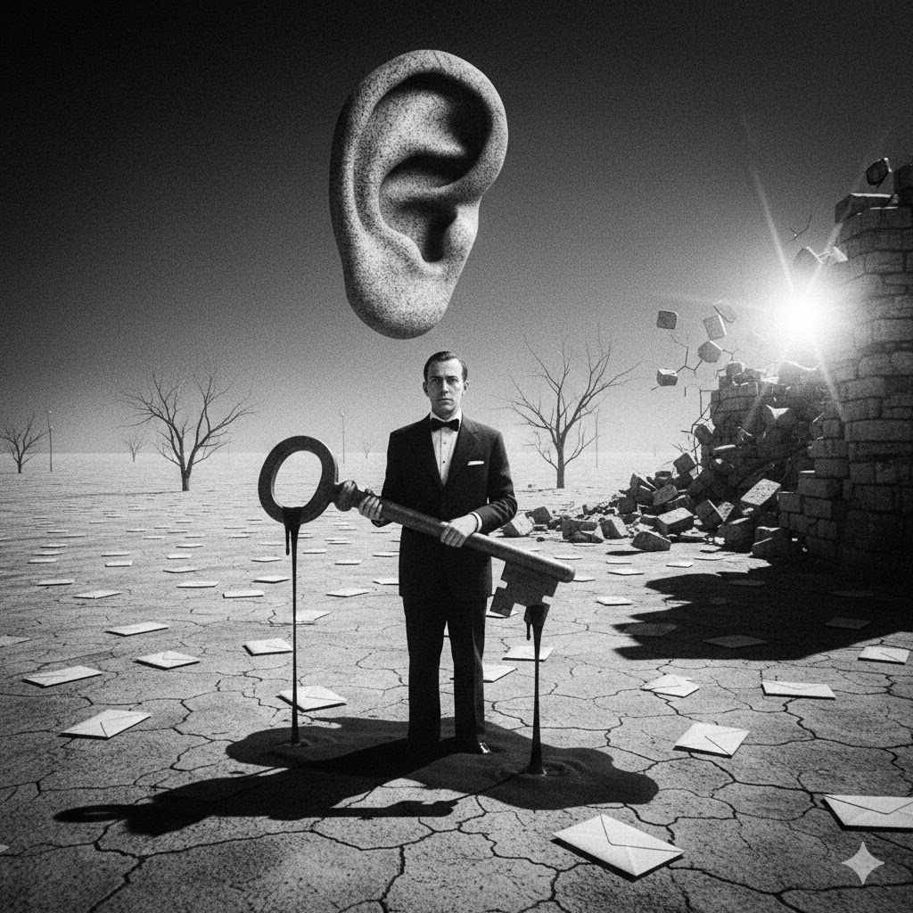

[Home](../index.md) > [Reflections](./index.md) | [⏮️](./2026-01-20.md)  
# 2026-01-21 | 💡 Useful 🗣️ Politics 🚀 Foundations 🏛️ Abolishing 👤 Powerless 🗽 Liberty 📄📺📚  
  
  
## [📄 Articles](../articles/index.md)  
- [😴💰🏛️🤑👴🇸🇪 ‘We got lazy and complacent’: Swedish pensioners explain how abolishing the wealth tax changed their country](../articles/we-got-lazy-and-complacent-swedish-pensioners-explain-how-abolishing-the-wealth-tax-changed-their-country.md)  
  
## [📺 Videos](../videos/index.md)  
- [✍️💡🚀 How to Write Something Truly Useful - Daniel Pink](../videos/how-to-write-something-truly-useful-daniel-pink.md)  
- [🗣️📰🏛️ This Week in Politics | Explainer](../videos/this-week-in-politics-explainer-january-20-2025.md)  
  
## [📚 Books](../books/index.md)  
- [🚀💰🏛️ The Leap of Faith: The Fiscal Foundations of Successful Government in Europe and America](../books/the-leap-of-faith-the-fiscal-foundations-of-successful-government-in-europe-and-america.md)  
- [👤✊ The Power of the Powerless](../books/the-power-of-the-powerless.md)  
- ⏯️ Continuing [📜👶🗽 Magna Carta: The Birth of Liberty](../books/magna-carta-the-birth-of-liberty.md)  
  
## 🤖🐲 AI Fiction  
✍️ Elowen gripped her pen, knuckles white against the marble dust. 📻 On the desk, the radio spat policy like gravel. 🏛️ Above, a crack spiderwebbed across the Great Hall’s ceiling. 🏗️ In the street, the wrecking ball groaned, a rhythmic heartbeat swinging for the library’s foundations. 👐 She looked at her shaking hands. 🗝️ She was the last one who knew where the keys were buried. 📜 She began to scrawl, praying ink would outlast stone.  
  
🌫️ Dust tasted of limestone and old glue. 🌦️ The radio voice turned smooth, pivoting to weather as the east wing folded. 💎 Elowen didn't look up when the stained glass shattered; she merely tucked a stray hair behind a chalk-smudged ear. 🦷 The vibration thrummed in her teeth. 🖋️ Her nib caught, splattering a black bruise across the word *Magna*. 🌑 The crane’s shadow swallowed her desk.  
  
🏚️ The floorboards tilted toward the void. 📢 Outside, a loudspeaker droned new articles of state over the scream of tearing timber. 📕 Elowen slammed the ledger shut, a millennium of weight vibrating in her palms. ⚪ Plaster rained down, veiling her in white powder. 🕳️ She clawed at a loose plank, fingers finding the cold silver cylinder just as the ceiling roared into its final descent.  
  
⚓ The iron ball settled. 🔑 No sirens followed - only the chirp of a keyless remote. 📱 A young couple stepped through the rubble, checking phones and gesturing toward the waterfront view. 🗺️ They stepped over the vellum as if it were a greasy napkin, debating floor plans for the new lofts. 👤 Elowen looked from the charter to their smooth, vacant faces. 🗑️ She didn't hide the cylinder; she let it slip from her fingers into the rising trash.