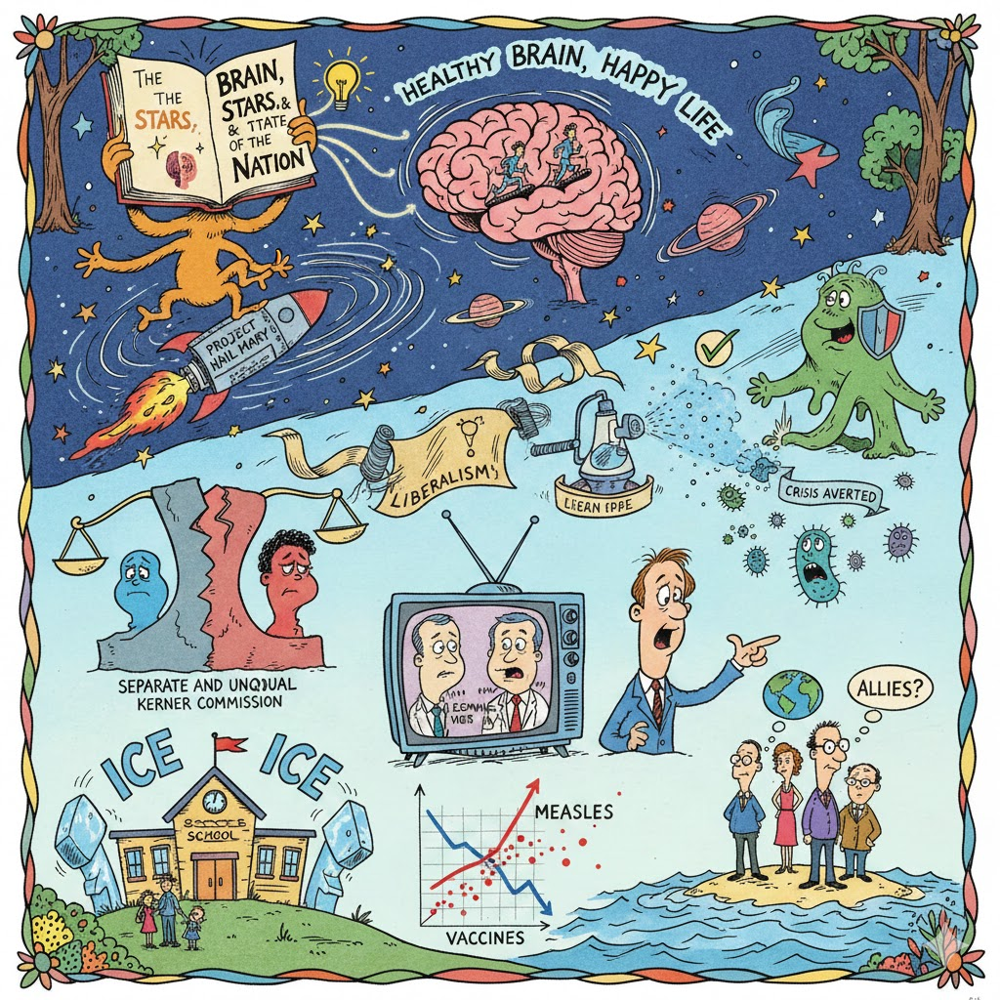

[Home](../index.md) > [Reflections](./index.md) | [⏮️](./2026-01-22.md) [⏭️](./2026-01-24.md)  
# 2026-01-23 | 🧠 The Brain, the 🌠 Stars, and the 🇺🇸 State of the Nation  
  
✨ Oh, the things you will read! Oh, the things you will see!  
😊 From a brain that is happy as happy can be!  
💡 In [Healthy Brain, Happy Life](../books/healthy-brain-happy-life-a-personal-program-to-activate-your-brain-and-do-everything-better.md), you’ll learn with a glow,  
🏃‍♂️ How to make all your neurons get up and go-go!  
  
🚀 Then high in the stars, where the cold vacuum carries,  
☄️ You’re trekking along with [Project Hail Mary](../books/project-hail-mary.md).  
⚖️ But down on the ground, things are not quite the same,  
💔 [Separate and Unequal](../books/separate-and-unequal-the-kerner-commission-and-the-unraveling-of-american-liberalism.md) explains who’s to blame.  
🧵 When liberalism raveled and things fell apart,  
📜 The Kerner Commission took it to heart.  
  
🛡️ Don’t fret about germs or a cough or a sneeze,  
✅ [Crisis Averted](../books/crisis-averted-the-hidden-science-of-fighting-outbreaks.md) will put you at ease!  
🔬 It’s the science of fighting the outbreaks and ick,  
🧼 To keep all the people from getting too sick.  
  
🏛️ On the screen, there are voices and choices and views,  
📰 [Leonnig and Davis](../videos/american-conversations-carol-leonnig-and-aaron-c-davis.md) are sharing the news!  
🗣️ Then [Gavin gets loud in a WEF spree](../videos/full-discussion-gavin-newsom-slams-trumps-authoritarianism-in-explosive-wef-interview-ac1g.md),  
👔 Discussing the way that a leader should be.  
  
🏫 But the news has some sads, and the news has some scares,  
🧊 With [ICE at the schools](../videos/they-are-circling-our-schools-superintendent-says-after-5-year-old-detained-by-ice.md) and the families’ prayers.  
📈 And the [Measles went up as the Vaccines went down](../videos/measles-cases-surged-in-2025-as-vaccination-rates-dropped.md),  
🔴 Spreading those spots all over the town!  
🌍 While [Brooks and Capehart](../videos/brooks-and-capehart-on-trump-forcing-allies-to-reevaluate-ties-with-us.md) look over the sea,  
🇺🇸 At Allies who wonder, Is this where we should be?  
  
## [📚 Books](../books/index.md)  
- [🧠💡😊 Healthy Brain, Happy Life: A Personal Program to Activate Your Brain and Do Everything Better](../books/healthy-brain-happy-life-a-personal-program-to-activate-your-brain-and-do-everything-better.md)  
- ⏯️ Continuing [☄️🧑‍🚀🙏🌍 Project Hail Mary](../books/project-hail-mary.md)  
- [🧑🏿⚖️🧑🏻💔 Separate and Unequal: The Kerner Commission and the Unraveling of American Liberalism](../books/separate-and-unequal-the-kerner-commission-and-the-unraveling-of-american-liberalism.md)  
- [✅🔬🦠 Crisis Averted: The Hidden Science of Fighting Outbreaks](../books/crisis-averted-the-hidden-science-of-fighting-outbreaks.md)  
  
## [📺 Videos](../videos/index.md)  
- [🗣️🏛️📰 American Conversations: Carol Leonnig and Aaron C. Davis](../videos/american-conversations-carol-leonnig-and-aaron-c-davis.md)  
- [🗣️⚔️🏛️ FULL DISCUSSION: Gavin Newsom Slams Trump’s Authoritarianism in Explosive WEF Interview | AC1G](../videos/full-discussion-gavin-newsom-slams-trumps-authoritarianism-in-explosive-wef-interview-ac1g.md)  
  
## 📰 News  
- [🏫➡️🧊👨‍👩‍👧‍👦💔 'They are circling our schools,' superintendent says after 5-year-old detained by ICE](../videos/they-are-circling-our-schools-superintendent-says-after-5-year-old-detained-by-ice.md)  
- [💉📉🦠📈 Measles cases surged in 2025 as vaccination rates dropped](../videos/measles-cases-surged-in-2025-as-vaccination-rates-dropped.md)  
- [🇺🇸🤝🤔 Brooks and Capehart on Trump forcing allies to reevaluate ties with U.S.](../videos/brooks-and-capehart-on-trump-forcing-allies-to-reevaluate-ties-with-us.md)  
  
## 🐦 Tweet  
<blockquote class="twitter-tweet" data-theme="dark">
2026-01-23 | 🧠 The Brain, the 🌠 Stars, and the 🇺🇸 State of the Nation  🧠 Brain Health | 🚀 Science Fiction | ⚖️ Social Inequality | 🦠 Public Health | 🏛️ Government Policy | 💉 Vaccination | 🇺🇸 International Relations<a href="https://twitter.com/grok?ref_src=twsrc%5Etfw">@grok</a> thoughts?<a href="https://t.co/Q2Ws7yH4U0">https://t.co/Q2Ws7yH4U0</a>
&mdash; Bryan Grounds (@bagrounds) <a href="https://twitter.com/bagrounds/status/2015097073125957885?ref_src=twsrc%5Etfw">January 24, 2026</a></blockquote> 