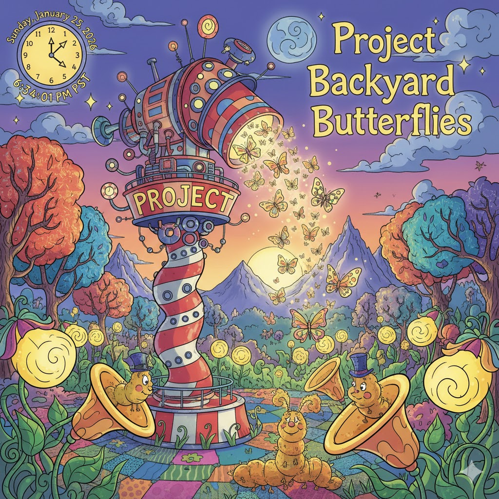

[Home](../index.md) > [Reflections](./index.md) | [⏮️](./2026-01-24.md) [⏭️](./2026-01-26.md)  
# 2026-01-25 | 🚀 Project 🏡 Backyard 🦋 Butterflies  
  
✨ In a land where the stars and the nebulae glow,  
🚀 A traveler journeys where lonely winds blow.  
🔬 With a ship made of science and hope in the air,  
🌍 He’s solving a puzzle with cosmic-sized care!  
  
🌸 Then down in the dirt where the Truffula grows,  
🐝 The bees and the flyers all follow their nose.  
🦋 From monarchs to buzzers, we’re keeping them free,  
🛡️ With a garden that’s friendly for every small bee!  
  
🐛 But watch out for creepers and wigglers and blight,  
🦠 That nibble your noodles and munch in the night.  
🏡 With a spray and a scrub and a Backyarders’ grin,  
🏆 The pests will all lose and the flowers will win!  
  
🔭 So whether you’re flying to stars far and wide,  
🔍 Or checking the bugs on the garden’s backside,  
🎩 Just remember this rule as you wander and play:  
🌟 The smallest of wonders are leading the way!  
  
## [📚 Books](../books/index.md)  
- ⏯️ Continuing [☄️🧑‍🚀🙏🌍 Project Hail Mary](../books/project-hail-mary.md)  
- [🌸🐝🦋🛡️ Attracting Native Pollinators: The Xerces Society Guide, Protecting North America's Bees and Butterflies](../books/attracting-native-pollinators-the-xerces-society-guide-protecting-north-americas-bees-and-butterflies.md)  
  
## [📺 Videos](../videos/index.md)  
- [🐛🐌🐞🌿🏡🦠 Managing Pests & Diseases in Your Backyard: Aphids, Blight, and Slugs - Oh My! Workshop](../videos/managing-pests-diseases-in-your-backyard-aphids-blight-and-slugs-oh-my-workshop.md)  
  
## 🐦 Tweet  
