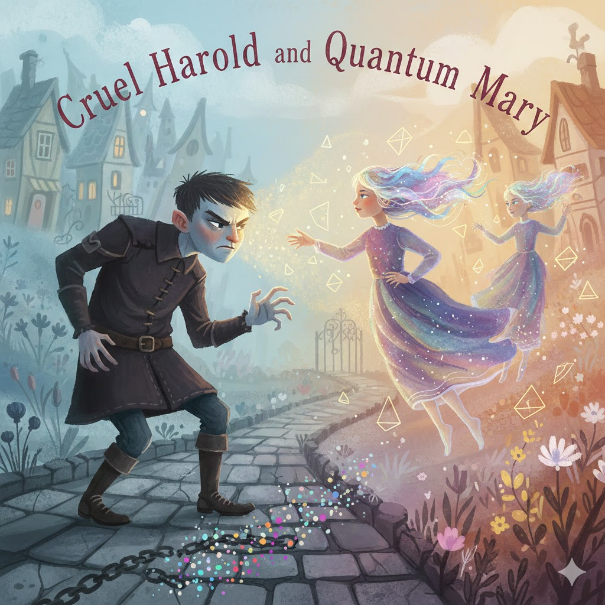

[Home](../index.md) > [Reflections](./index.md) | [⏮️](./2026-01-27.md) [⏭️](./2026-01-29.md)  
# 2026-01-28 | 💀 Cruel 👦 Harold ⚛️ And 🧑‍🚀 Quantum 👩‍🚀 Mary 📚  
  
  
👦 Cruel Harold was a bitter boy,  
🔒 Who kept his feelings locked,  
😠 He’d steal a smile and hide a toy,  
🏘️ While all the village mocked.  
  
🗿 He thought the world was fixed in place,  
🪙 Like heavy stones or lead,  
😒 With bitterness upon his face,  
❄️ And winter in his head.  
  
✨ But then came Mary, strange and bright,  
⭐ With stardust in her hair,  
🕯️ She flickered like a candle light,  
🌌 In two places—here and there.  
  
🌊 The world is soft, she told the lad,  
🎲 It’s built of waves and chance,  
☀️ You needn’t be so very bad,  
💃 Just join the cosmic dance!  
  
🧤 Harold tried to catch her hand,  
🧱 To pull her to the ground,  
⏳ But Mary was a grain of sand,  
🚫 That never could be found.  
  
☁️ She was a cloud, she was a spark,  
👻 A ghost within the gate,  
🔦 She shone a light into his dark,  
🔄 To change his heavy state.  
  
👀 He looked at her and blinked his eyes,  
🌀 The world began to blur,  
🌟 The more he saw her glowing size,  
🧬 The more he felt like her.  
  
⛓️ His cruelty, a solid chain,  
🕯️ Began to melt away,  
🌦️ Like April mist or summer rain,  
⚛️ In a probabilistic spray.  
  
😊 Now Harold isn't quite so mean,  
🔑 Since Mary shared the key:  
👁️ The universe is rarely seen,  
🧍 Until you choose to be.  
  
## [📚 Books](../books/index.md)  
- ⏯️ Continuing [☄️🧑‍🚀🙏🌍 Project Hail Mary](../books/project-hail-mary.md)  
- [⚛️ℹ️👶 Quantum Information for Babies](../books/quantum-information-for-babies.md)  
- [👦🟣🖍️ Harold and the Purple Crayon](../books/harold-and-the-purple-crayon.md)  
- [💀⭐ The Cruel Stars](../books/the-cruel-stars.md)