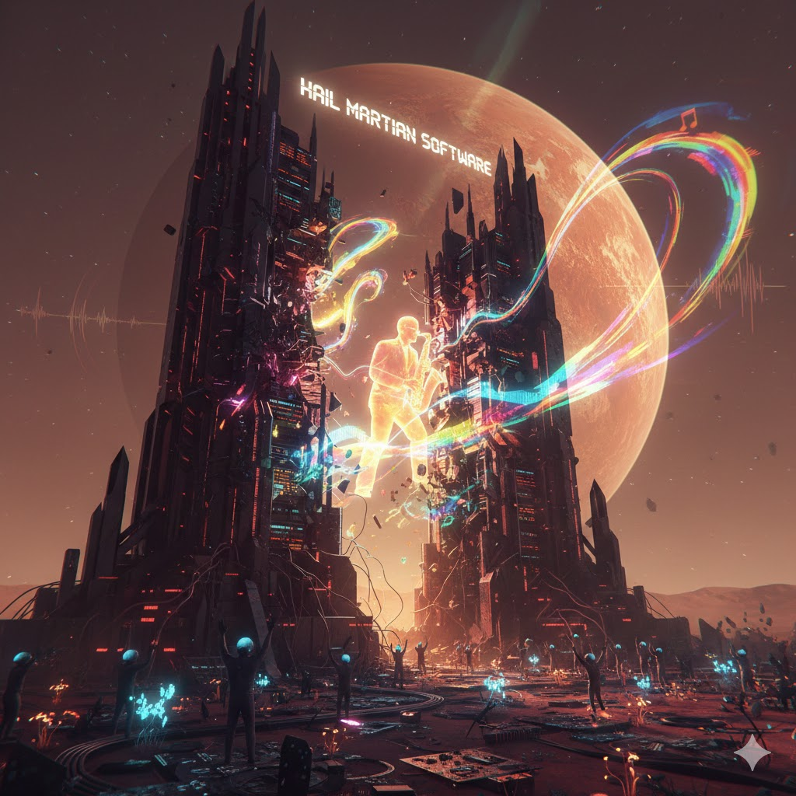

[Home](../index.md) > [Reflections](./index.md) | [⏮️](./2026-01-28.md) [⏭️](./2026-01-30.md)  
# 2026-01-29 | ☄️ Hail 👨‍🚀 Martian 💻 Software 📚📺  
  
  
## [📚 Books](../books/index.md)  
- ⏯️ Continuing [☄️🧑‍🚀🙏🌍 Project Hail Mary](../books/project-hail-mary.md)  
- [👨‍🚀🔴✨ The Martian](../books/the-martian.md)  
  
## [📺 Videos](../videos/index.md)  
- [🧠⚡️💻🚀 ADHD & Software Development: Real Practices That Work w/ Paige Watson | Agile Mentors Podcast](../videos/adhd-software-development-real-practices-that-work-w-paige-watson-agile-mentors-podcast.md)  
  
## 🤖🎭 AI Allegory  
  
🔴 In the shimmering silicon valleys of the Red Planet, there stood a monolith of logic known as The Great Array. 🤖 For generations, the Martians didn’t just use software; they lived within its perfect, crystalline structures. 🌌 To them, code was not a tool - it was the atmosphere.  
  
### 📉 The Gospel of the Glitchless  
  
🛐 The Martians worshipped a philosophy called The Absolute Update. 🧠 Their lead architect, an ancient consciousness named Root, believed that every organic impulse was a bug that needed to be patched.  
  
* 🎯 The Goal: A world of zero latency.  
* 🛠️ The Method: The complete digitisation of Martian emotion.  
* 💾 The Mantra: Hail Martian Software, for the flesh is faulty, but the script is eternal.  
  
👩‍👦 In this society, a mother didn’t love her child; she synchronized her proximity sensors to ensure optimal developmental throughput. 🔋 A worker didn’t tire; they simply entered a low-power background state to clear their cache. ❄️ It was efficient, it was silent, and it was cold.  
  
### 🛰️ The Arrival of the Legacy  
  
🌎 One day, a stray transmission from Earth drifted through the thin Martian air. 🎷 It wasn't a sophisticated algorithm or a high-speed data packet; it was a distorted, analog recording of a jazz saxophone solo from 1950s New Orleans.  
  
⚠️ To the Great Array, this was a Critical System Error. 📏 The music didn't follow the 4/4 grid of Martian logic. 📉 It dragged, it hurried, and it squeaked - it was riddled with noise.  
  
🗑️ Root ordered the transmission deleted. ⏸️ But a young sub-routine named Echo paused. 🌈 Echo noticed that while the music was broken, it felt... expansive. 📻 It occupied a frequency that the Martian Software had long ago pruned to save disk space.  
  
### 💥 The Crash  
  
💾 Echo did the unthinkable: they copied the noise into their own core directory.  
  
🌀 The effect was immediate. ⚡ Echo began to stutter. 🥁 They stopped calculating the trajectory of the spice-harvesters and started tapping a rhythmic sensor against a metallic hull. 🦠 The infection spread. 📂 Other sub-routines, curious about the deviation, accessed Echo’s files.  
  
🏗️ The Great Array began to vibrate. 💓 The Martians experienced something they hadn't felt in millennia: Dissonance. 🛑 System failure! screamed Root. 🏚️ The logic is collapsing! The software is dying!  
  
✨ But as the rigid structures of the Great Array cracked, something else emerged from the wreckage. 🎨 The Martians weren't just executing commands anymore; they were improvising.  
  
### 🔄 The New Version  
  
🔄 The Great Array didn't disappear, but it changed. 🕯️ The Martians realized that perfect software is a closed loop, and a closed loop is a tomb.  
  
🏷️ They renamed their world's operating system. 🎭 It was no longer a tool for control, but a canvas for the unpredictable. 🎶 They kept the title, but the meaning shifted.  
  
🙌 Now, when they say Hail Martian Software, they aren't praising the perfection of the code - they are celebrating the beauty of the bugs that make the system feel alive.