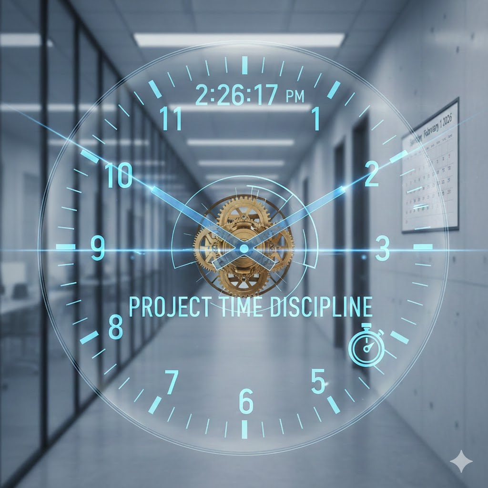

[Home](../index.md) > [Reflections](./index.md) | [⏮️](./2026-01-29.md) [⏭️](./2026-01-31.md)  
# 2026-01-30 | 🛠️ Project 🕰️ Time 🧘 Discipline 📚  
  
⚙️ Gears of focus turn,  
⏳ Seconds carved with steady hands,  
📝 Chaos yields to plan.  
  
## [📚 Books](../books/index.md)  
- 🏁 Finished [💪🧠⏳ The Power of Self-Discipline: 5-Minute Exercises to Build Self-Control, Good Habits, and Keep Going When You Want to Give Up](../books/the-power-of-self-discipline-5-minute-exercises-to-build-self-control-good-habits-and-keep-going-when-you-want-to-give-up.md)  
- ⏯️ Continuing [☄️🧑‍🚀🙏🌍 Project Hail Mary](../books/project-hail-mary.md)  
- [🕷️⏳ Children of Time](../books/children-of-time.md)  
  
## 🐦 Tweet  
<blockquote class="twitter-tweet" data-theme="dark">
2026-01-30 | 🛠️ Project 🕰️ Time 🧘 Discipline 📚  🛠️ Project Planning | ⏳ Time Management | 🧘 Self-Control | 📚 Reading Lists | ✍️ Creative Writing | 🚀 Science Fiction<a href="https://t.co/tlIeWRcXKj">https://t.co/tlIeWRcXKj</a>
&mdash; Bryan Grounds (@bagrounds) <a href="https://twitter.com/bagrounds/status/2018385729114849468?ref_src=twsrc%5Etfw">February 2, 2026</a></blockquote> 