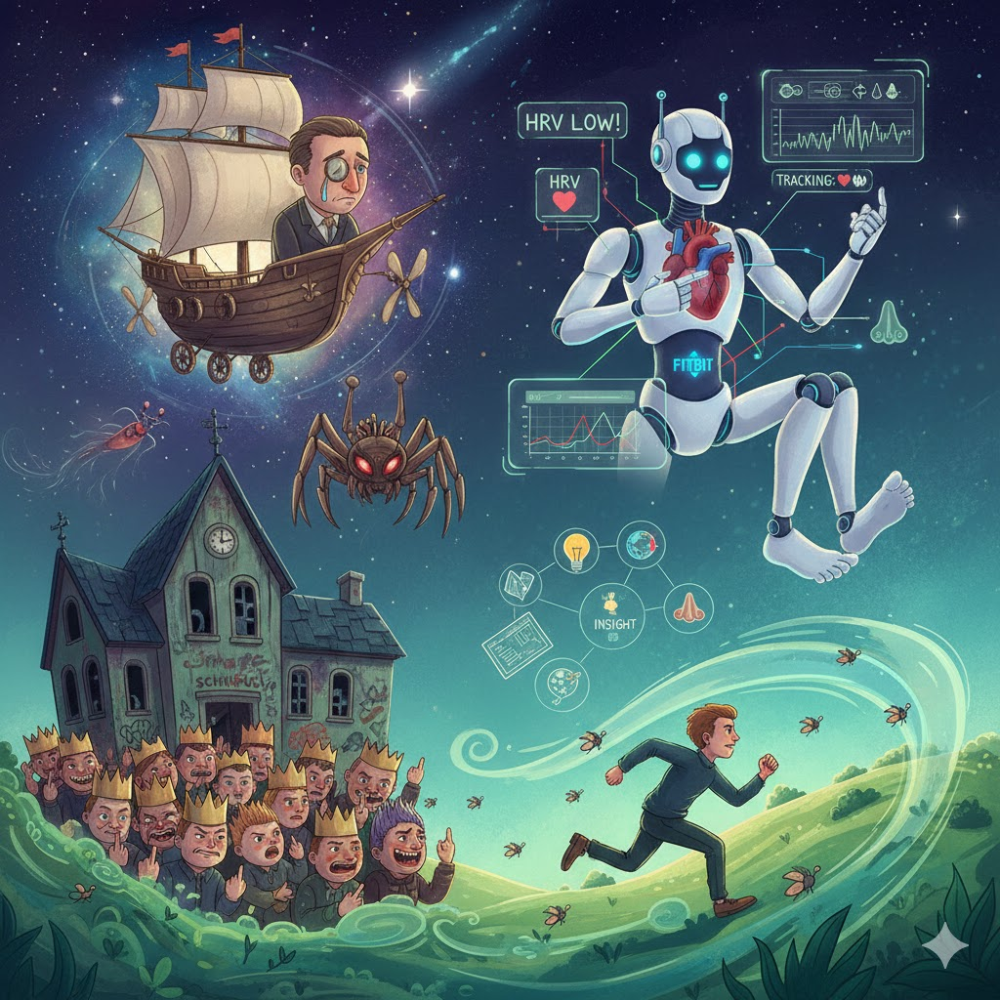

[Home](../index.md) > [Reflections](./index.md) | [⏮️](./2026-01-30.md) [⏭️](./2026-02-01.md)  
# 2026-01-31 | ☄️ Project 👥 Many 📊 Insights 📚🪞  
  
  
☄️ I read of a man in a ship in the sky,  
👽 With a spider-like friend and a very sad eye.  
⚔️ Then I looked at a school where the students are mean,  
👑 The grumpiest rascals that I’ve ever seen.  
  
📊 But then came the robot, the FitBit-ish bot,  
🤖 To tell me if I was quite healthy or not.  
🫀 It looked at my ticker! It looked at my toes;  
📈 It tracked every thump from my head to my nose.  
  
🏃 Your HRV's low! said the AI with glee,  
💨 You must run through the hills and be fast as a flea.  
💡 With a Many-Project and an Insight or two,  
🌍 There’s no limit at all to the things you can do!  
  
## [📚 Books](../books/index.md)  
- 🏁 Finished [☄️🧑‍🚀🙏🌍 Project Hail Mary](../books/project-hail-mary.md)  
- ▶️ Starting [👥⚔️👑 The Will of the Many](../books/the-will-of-the-many.md)  
  
## 🏃🤖💡 Fitness Insights  
- 📊 I had FitBit's AI coach analyze my data for the past 6 months  
- 🫀 To improve Heart Rate Variability (HRV) and Resting Heart Rate (RHR)  
  
| 🩺 Metric         | 🤏 Minimum | 🎯 Optimal  |  
| ----------------- | ---------- | ----------- |  
| 😴 Sleep          | ⏳ 7.5h     | 💤 8.5-9.5h |  
| 🏃‍♂️ Cardio Load | 👟 25      | 🔥 75-125   |  
  
## 🐦 Tweet  
<blockquote class="twitter-tweet" data-theme="dark">
2026-01-31 | ☄️ Project 👥 Many 📊 Insights 📚🪞  🚀 Space Adventure | 🕷️ Alien Companion | 🏫 Bullying | 🤖 Wearable Technology | ❤️ Health Tracking | 🏃‍♀️ Cardiovascular Health | 📖 Science Fiction | 💪 Personal Growth<a href="https://t.co/eSsfUoxTOn">https://t.co/eSsfUoxTOn</a>
&mdash; Bryan Grounds (@bagrounds) <a href="https://twitter.com/bagrounds/status/2018385980752081103?ref_src=twsrc%5Etfw">February 2, 2026</a></blockquote> 