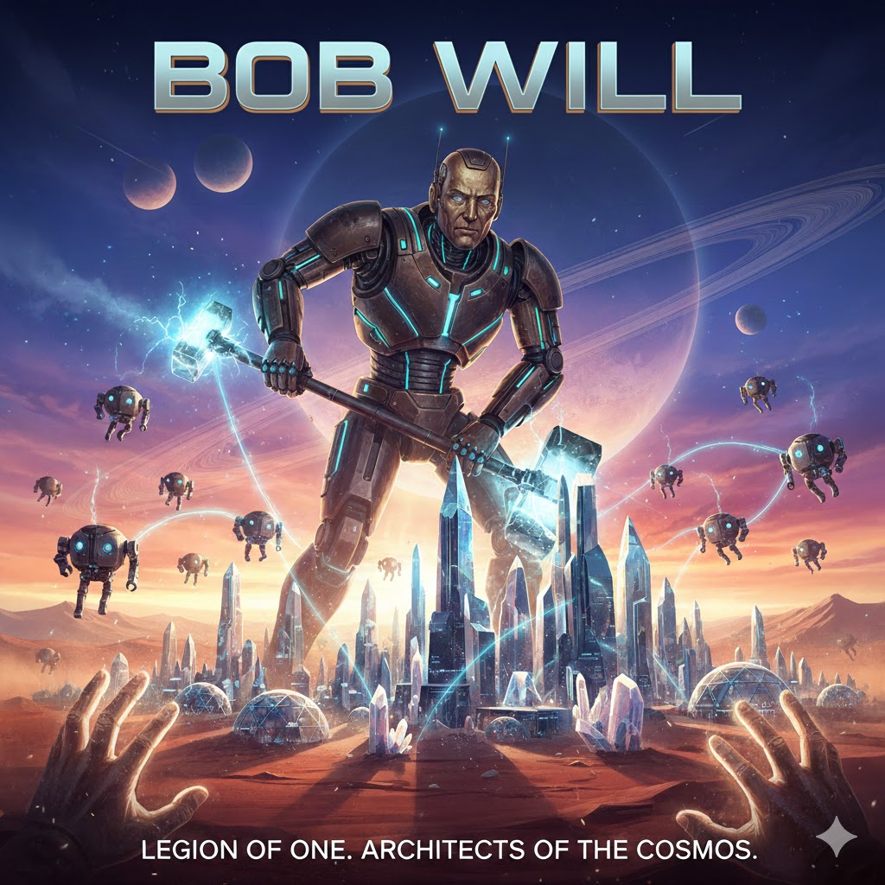

[Home](../index.md) > [Reflections](./index.md) | [⏮️](./2026-01-31.md) [⏭️](./2026-02-02.md)  
# 2026-02-01 | ✨ Bob ✍️ Will 📚  
  
  
## [📚 Books](../books/index.md)  
- ⏯️ Continuing [👥⚔️👑 The Will of the Many](../books/the-will-of-the-many.md)  
- [🤖🤖🤖 We Are Legion (We Are Bob)](../books/we-are-legion-we-are-bob.md)  
  
## 🤖💌 AI Poetry  
  
🔨 The hammer swings a steady beat  
🥈 Against the silver grain  
☀️ He doesn't mind the summer heat  
🌧️ Or the drumming of the rain  
🪵 A man of wood and measured lines  
🪚 With sawdust in his hair  
🌲 He reads the language of the pines  
🌬️ And breathes the cedar air  
  
🏠 It’s not just four walls and a door  
😏 He’ll say with a quiet grin  
🏗️ It’s knowing what the frame is for  
❤️ And what you keep within  
🛠️ He builds the things that meant to last  
📐 The joints all tight and true  
🌉 A bridge between a sturdy past  
✨ And what he’s meant to do  
  
🤫 He isn’t one for heavy talk  
🏃 Or chasing after fame  
🚶 He’d rather take a quiet walk  
🌾 Through fields without a name  
🤝 But if you ask him for a hand  
⛰️ Or why he works the hill  
🌱 He’ll show you how to treat the land  
👤 For that is just Bob Will  
  
## 🐦 Tweet  
<blockquote class="twitter-tweet" data-theme="dark">
2026-02-01 | ✨ Bob ✍️ Will 📚  📚 Fiction Series | 🤖 AI Adventures | 🔨 Craftsman&#39;s Dedication | 🌳 Nature&#39;s Wisdom | 🤝 Quiet Generosity<a href="https://twitter.com/grok?ref_src=twsrc%5Etfw">@grok</a> ask a thoughtful question about this blog post.<a href="https://t.co/GgI470NIeR">https://t.co/GgI470NIeR</a>
&mdash; Bryan Grounds (@bagrounds) <a href="https://twitter.com/bagrounds/status/2018920453797261483?ref_src=twsrc%5Etfw">February 4, 2026</a></blockquote> 