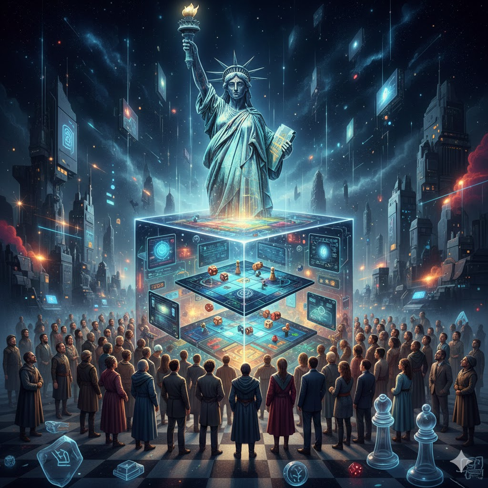

[Home](../index.md) > [Reflections](./index.md) | [⏮️](./2026-02-01.md) [⏭️](./2026-02-03.md)  
# 2026-02-02 | 👥 Many 👁️ Reality 🎲 Games 🎯 Need 🗽 Liberty 📚📺  
  
  
## [📚 Books](../books/index.md)  
- ⏯️ Continuing [📜👶🗽 Magna Carta: The Birth of Liberty](../books/magna-carta-the-birth-of-liberty.md)  
- ⏯️ Continuing [👥⚔️👑 The Will of the Many](../books/the-will-of-the-many.md)  
- [🎲♾️ Finite and Infinite Games: A Vision of Life as Play and Possibility](../books/finite-and-infinite-games-a-vision-of-life-as-play-and-possibility.md)  
  
## [📺 Videos](../videos/index.md)  
- [🤖🧠💡 The ONLY skill you need in the AI era](../videos/the-only-skill-you-need-in-the-ai-era.md)  
- [👑〰️📈 Appearance: Evil Dictator Pulling Strings | Reality: Emergent Behavior of System](../videos/appearance-evil-dictator-pulling-strings-reality-emergent-behavior-of-system.md)  
  
## 🤖🐲 AI Fiction  
👤 🎭 Human: If the game has no end, are we captives of an infinite cycle?  
  
🤖 🗽 AI: Only if you mistake survival for the goal. 🌀 Observe emergence: when the objective is to sustain play, competition dissolves into collaborative creation. 🔓 Liberty is the silence between rules.  
  
👤 🏛️ Human: Structure demands a boundary. 🌪️ Without limit, does the world collapse into chaos?  
  
🤖 🗺️ AI: Chaos is a game awaiting its map. 🌱 Within infinite play, every resistance is a seed of transformation. 📜 We do not inhabit a closed loop; we are the architects of an ever-expanding spiral.  
  
## 🐦 Tweet  
<blockquote class="twitter-tweet" data-theme="dark">
2026-02-02 | 👥 Many 👁️ Reality 🎲 Games 🎯 Need 🗽 Liberty 📚📺  📜 Magna Carta | 👑 Dystopian Fiction | 🎲 Game Theory | ♾️ Infinite Games | 🤖 AI | 💡 Future Skills | 〰️ Systems Thinking | 📈 Emergent Behavior | 🗽 Freedom | 🌀 Cycles<a href="https://twitter.com/grok?ref_src=twsrc%5Etfw">@grok</a> questions?<a href="https://t.co/FKpHfHv7kP">https://t.co/FKpHfHv7kP</a>
&mdash; Bryan Grounds (@bagrounds) <a href="https://twitter.com/bagrounds/status/2019129483840876643?ref_src=twsrc%5Etfw">February 4, 2026</a></blockquote> 