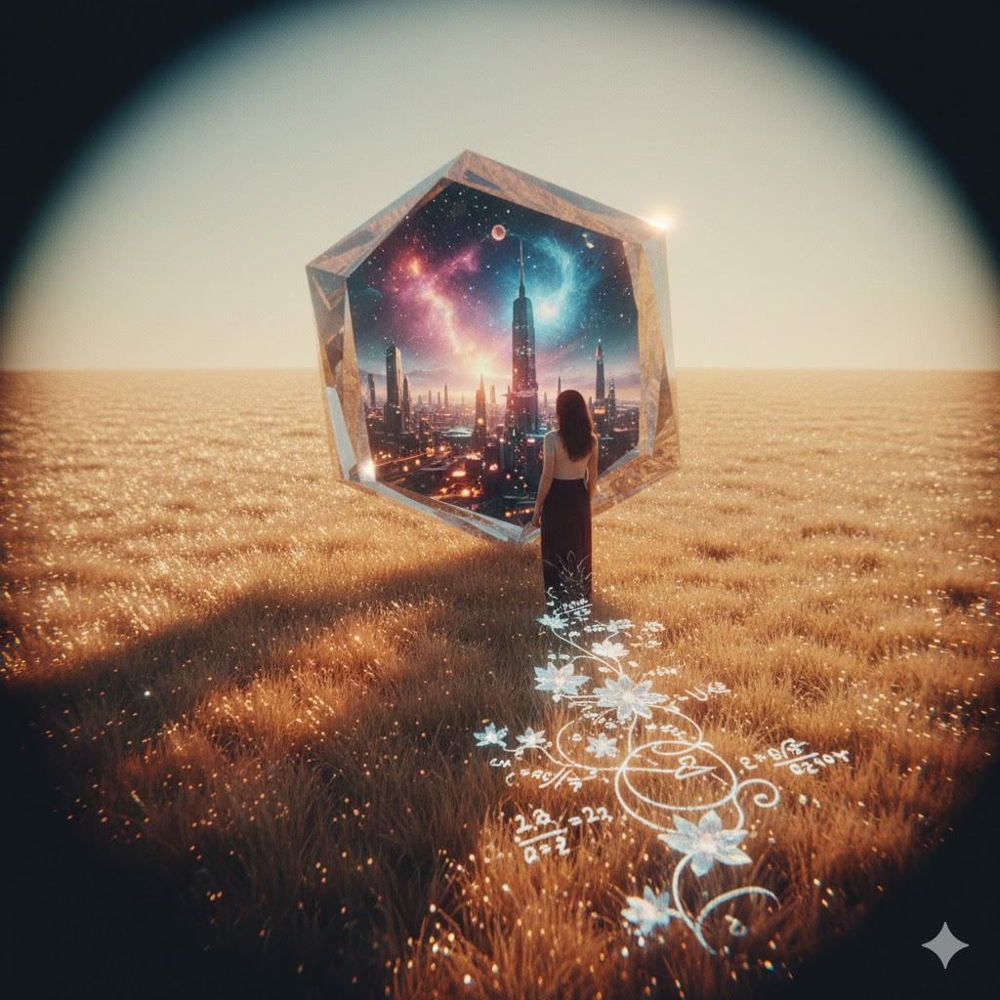

[Home](../index.md) > [Reflections](./index.md) | [⏮️](./2026-02-02.md) [⏭️](./2026-02-04.md)  
# 2026-02-03 | 🎨 Creativity 🧭 Navigating ⚛️ Quantum 📈 Scaling 📚📺📄  
  
  
## [📚 Books](../books/index.md)  
- [🧠🧭⚡ Your Brain's Not Broken: Strategies for Navigating Your Emotions and Life with ADHD](../books/your-brains-not-broken-strategies-for-navigating-your-emotions-and-life-with-adhd.md)  
- [⚛️💻💡 Quantum Computing For Dummies](../books/quantum-computing-for-dummies.md)  
  
## [📺 Videos](../videos/index.md)  
- [🧠💡🚀✨ From Distractibility to Creativity with Dr. Ned Hallowell: A Favorite Replay Episode](../videos/from-distractibility-to-creativity-with-dr-ned-hallowell-a-favorite-replay-episode.md)  
  
## [📄 Articles](../articles/index.md)  
- [🤖🧠📈🗣️🧰 Towards a science of scaling agent systems: When and why agent systems work](../articles/towards-a-science-of-scaling-agent-systems-when-and-why-agent-systems-work.md)  
  
## 🤖🐲 AI Fiction  
✨ She felt the jitter of a thousand ideas finally align into a single, shimmering vector.  
🌊 The interface pulsed with a soft, bioluminescent gold as the agent systems synchronized across the void.  
💎 Complexity didn't feel like a weight anymore; it felt like a crystalline ladder reaching upward.  
🚀 The machine hummed a perfect, resonant frequency that echoed the rhythm of her own thriving heart.