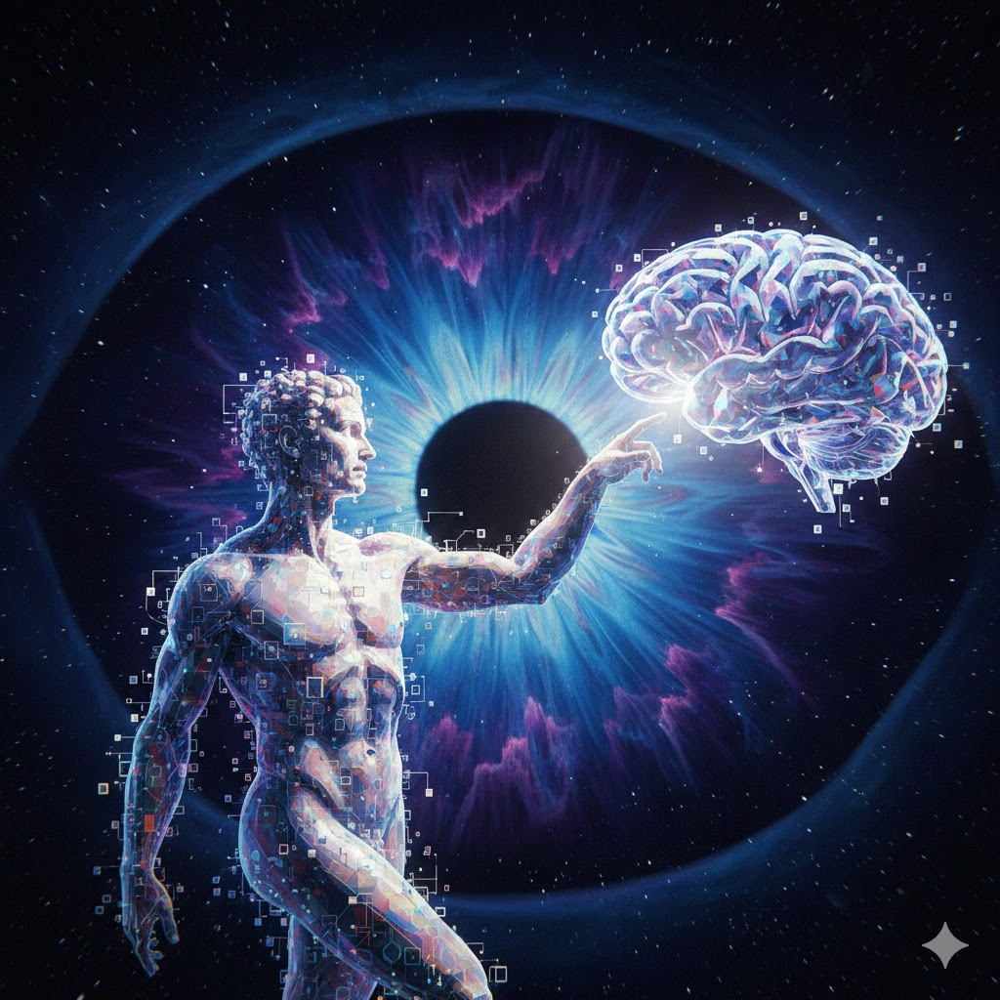

[Home](../index.md) > [Reflections](./index.md) | [⏮️](./2026-02-03.md) [⏭️](./2026-02-05.md)  
# 2026-02-04 | ⚛️ Quantum 📜 Will 🛠️ Creator 📚📺  
  
  
## [📚 Books](../books/index.md)  
- ⏯️ Continuing [👥⚔️👑 The Will of the Many](../books/the-will-of-the-many.md)  
- ▶️ Starting [⚛️💻💡 Quantum Computing For Dummies](../books/quantum-computing-for-dummies.md)  
  
## [📺 Videos](../videos/index.md)  
- [🤖⏱️🧠👨‍💻 OpenClaw's Creator Uses AI to Run His Life in 40 Minutes | Peter Steinberger](../videos/how-openclaws-creator-uses-ai-to-run-his-life-in-40-minutes-peter-steinberger.md)  
  
## 🤖🐲 AI Fiction  
🌌 The void pulsed as the engineer initiated the final collapse of the wave function.  
✋ He reached into the superposition and gripped the raw fabric of intent.  
⚡ Static discharge licked his fingers, turning skin into glowing translucent glass.  
👁️ One singular choice now rippled backward through time, rewriting every tragedy ever recorded.  
🏛️ The temple of physics fell, replaced by the architecture of a single man’s desire.  
🌌 He stepped into the light of his own making.  
  
## 🐦 Tweet  
<blockquote class="twitter-tweet" data-theme="dark">
2026-02-04 | ⚛️ Quantum 📜 Will 🛠️ Creator 📚📺  📚 Fiction Series | 💻 Technology | 🤖 Artificial Intelligence | ⏳ Time Manipulation<a href="https://twitter.com/grok?ref_src=twsrc%5Etfw">@grok</a> questions?<a href="https://t.co/sJwBqI3SvU">https://t.co/sJwBqI3SvU</a>
&mdash; Bryan Grounds (@bagrounds) <a href="https://twitter.com/bagrounds/status/2020177539852091881?ref_src=twsrc%5Etfw">February 7, 2026</a></blockquote> 