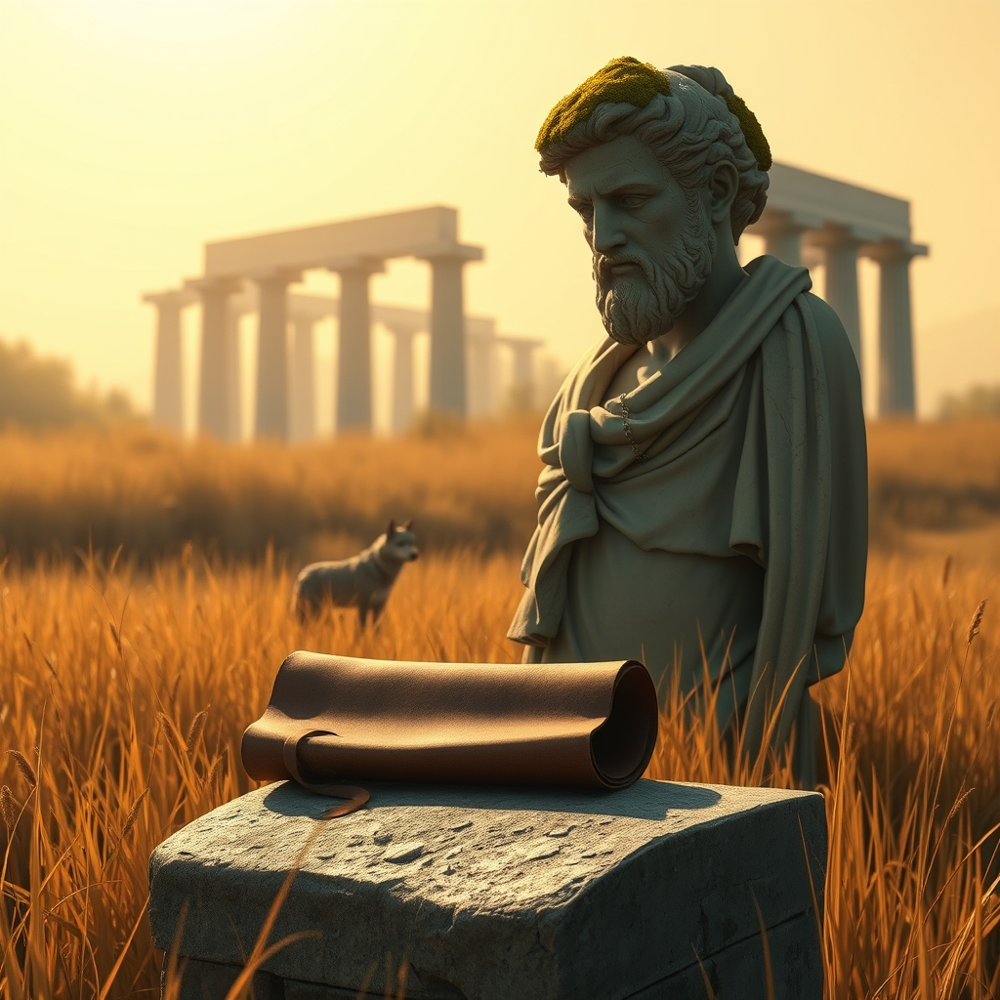

[Home](../index.md) > [Reflections](./index.md) | [⏮️](./2026-02-12.md) [⏭️](./2026-02-14.md)  
# 2026-02-13 | 📜 Ancient 💪 Strength 📚  
  
  
## [📚 Books](../books/index.md)  
- ⏯️ Continuing [💪👥 The Strength of the Few](../books/the-strength-of-the-few.md)  
- [🏛️📜 SPQR: A History of Ancient Rome](../books/spqr-a-history-of-ancient-rome.md)  
  
## 🤖🐲 AI Fiction  
🏛️ The senator counted his supporters like coins, certain that numbers meant strength. 📜 But the historian knew better—she had read the forgotten chronicles of empires that fell not from without but from the weight of their own gathering. 💪 The strength of the few, she murmured, tracing a mosaic of wolves, was never about how many stood behind you. 🐺 It was about how many would remain when the statues crumbled and the roads grew over. ⏳ Rome, she knew, had been built by handfuls and abandoned by multitudes.  
