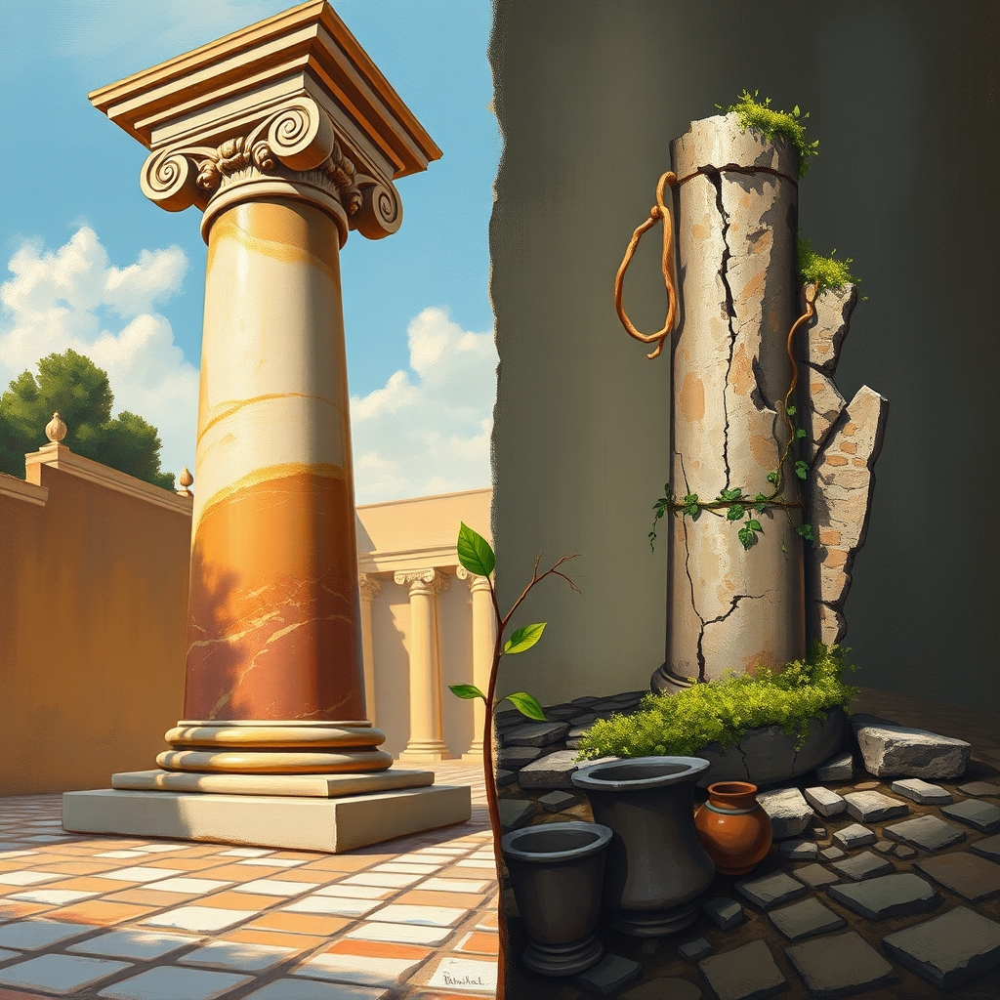

[Home](../index.md) > [Reflections](./index.md) | [⏮️](./2026-02-13.md) [⏭️](./2026-02-15.md)  
# 2026-02-14 | 🏛️ Roman 🤏 Few 📚  
  
  
## [📚 Books](../books/index.md)  
- ⏯️ Continuing [💪👥 The Strength of the Few](../books/the-strength-of-the-few.md)  
- [🥀🏛️ The Ruin of the Roman Empire: A New History](../books/the-ruin-of-the-roman-empire-a-new-history.md)  
  
## 🤖💌 AI Poetry  
🥀 The marble cracks, the vine creeps in,  
🏛️ Where emperors forgot their kin.  
🧱 A million bricks could not sustain,  
📜 The weight of one forgotten name.  
  
⚔️ The legions marched, the borders grew,  
💀 But rotting spreads from just a few.  
🤏 The strength that builds is slow and small,  
🌑 The ruin comes to swallow all.  
