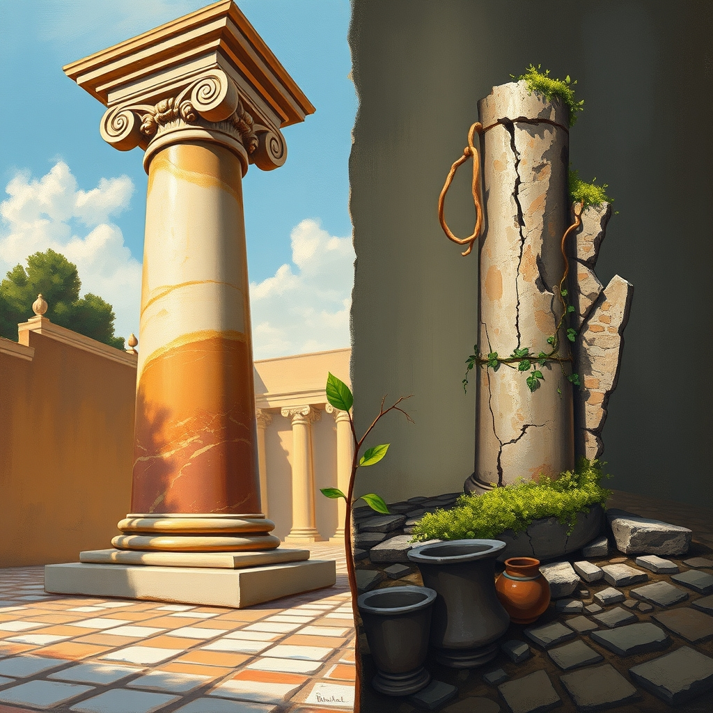

[Home](../index.md) > [Reflections](./index.md) | [⏮️](./2026-02-13.md) [⏭️](./2026-02-15.md)  
# 2026-02-14 | 🏛️ Roman 🤏 Few 📚  
  
  
## [📚 Books](../books/index.md)  
- ⏯️ Continuing [💪👥 The Strength of the Few](../books/the-strength-of-the-few.md)  
- [🥀🏛️ The Ruin of the Roman Empire: A New History](../books/the-ruin-of-the-roman-empire-a-new-history.md)  
  
## 🤖💌 AI Poetry  
🥀 The marble cracks, the vine creeps in,  
🏛️ Where emperors forgot their kin.  
🧱 A million bricks could not sustain,  
📜 The weight of one forgotten name.  
  
⚔️ The legions marched, the borders grew,  
💀 But rotting spreads from just a few.  
🤏 The strength that builds is slow and small,  
🌑 The ruin comes to swallow all.  
  
## 🦋 Bluesky    
<blockquote class="bluesky-embed" data-bluesky-uri="at://did:plc:i4yli6h7x2uoj7acxunww2fc/app.bsky.feed.post/3mvmzgnnefc2g" data-bluesky-cid="bafyreifml6rta2xv6rghea6rpycwogoqhalffjfncnnslwvudjnb3oug54">
2026-02-14 | 🏛️ Roman 🤏 Few 📚  
  
#AI Q: 🏛️ Does long term success require small beginnings?  
  
🥀 Imperial Decline | ✍️ Digital Poetry | 📖 Historical Nonfiction  
https://bagrounds.org/reflections/2026-02-14
&mdash; <a href="https://bsky.app/profile/did:plc:i4yli6h7x2uoj7acxunww2fc?ref_src=embed">Bryan Grounds (@bagrounds.bsky.social)</a> <a href="https://bsky.app/profile/did:plc:i4yli6h7x2uoj7acxunww2fc/post/3mvmzgnnefc2g?ref_src=embed">2026-09-16T11:20:02.000Z</a></blockquote>