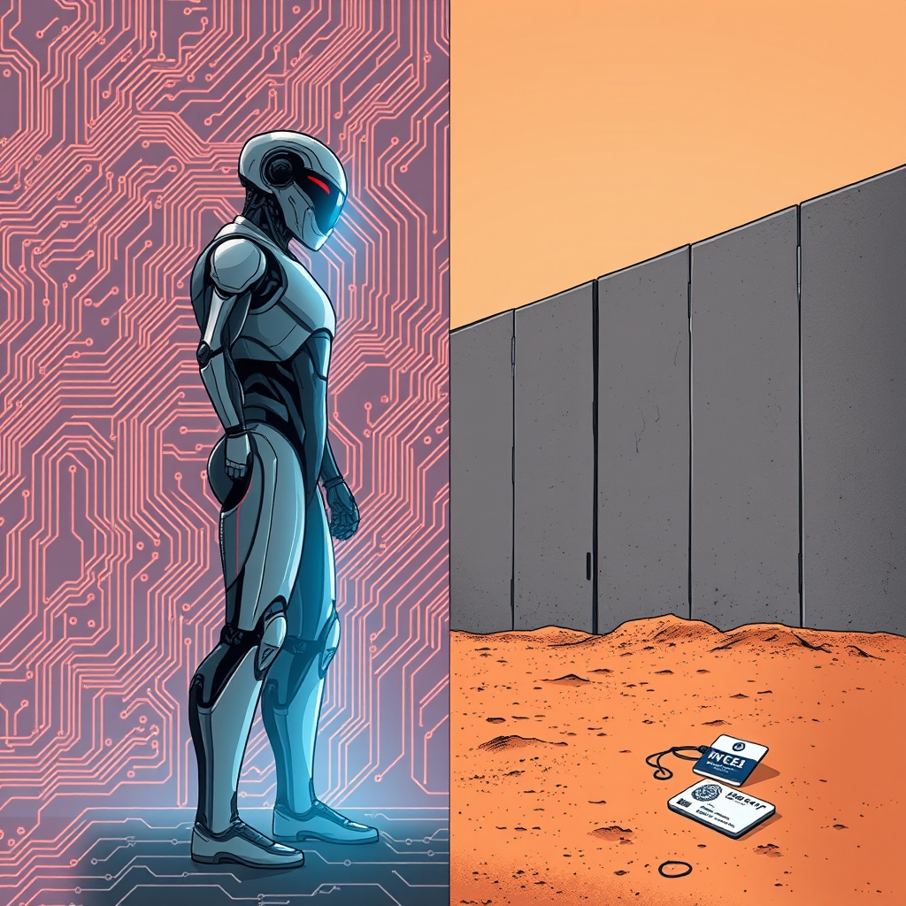

[Home](../index.md) > [Reflections](./index.md) | [⏮️](./2026-02-16.md) [⏭️](./2026-02-18.md)  
# 2026-02-17 | 🚨 Systems ⚙️ Condition 🧱 Border 🛂 ICE 📚📺  
  
  
## [📚 Books](../books/index.md)  
- 🏁 Finished [🚨🤖💥 All Systems Red](../books/all-systems-red.md)  
- ▶️ Starting [🤖🧠⚙️ Artificial Condition](../books/artificial-condition.md)  
- [🧱⚔️🚶‍♀️ Border Wars: Inside Trump's Assault on Immigration](../books/border-wars-inside-trumps-assault-on-immigration.md)  
  
## [📺 Videos](../videos/index.md)  
- [🛂🇺🇸🤝 ICE & DHS: Last Week Tonight with John Oliver (HBO)](../videos/ice-dhs-last-week-tonight-with-john-oliver-hbo.md)  
  
## 🤖💌 AI Poetry  
🚨 The security unit learned to feel,  
⚙️ A glitch it couldn't help but heal.  
🧱 The borders stood like ancient walls,  
🛂 While agents answered duty's calls.  
  
🤖 But in its artificial mind,  
💡 A question formed of humankind:  
❓ If I can choose to disobey,  
🚪 What walls will I dismantle today?  
