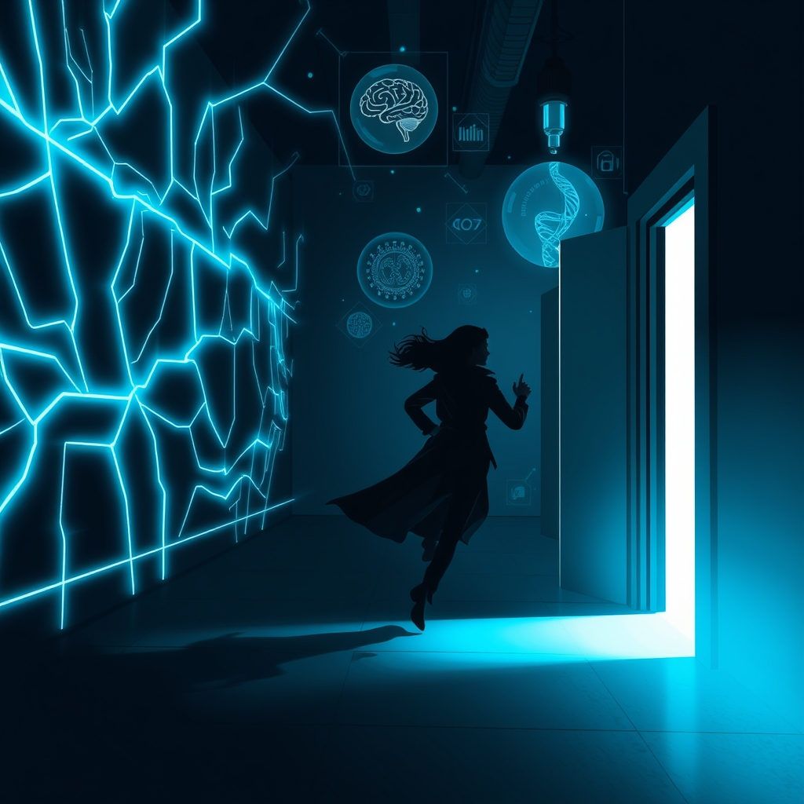

[Home](../index.md) > [Reflections](./index.md) | [⏮️](./2026-02-21.md) [⏭️](./2026-02-23.md)  
# 2026-02-22 | 🚪 Exit 🌐 Network 🧠💊 Dopamine 📚📺  
  
  
## [📚 Books](../books/index.md)  
- 🏁 Finished [🏃💨🚪 Exit Strategy](../books/exit-strategy.md)  
- ▶️ Starting [🌐🤖🚀 Network Effect](../books/network-effect.md)  
  
## [📺 Videos](../videos/index.md)  
- [🤖🧪🚫🛑💥 Anthropic Tested 16 Models. Instructions Didn't Stop Them (When Security is a Structural Failure)](../videos/anthropic-tested-16-models-instructions-didnt-stop-them-when-security-is-a-structural-failure.md)  
- [🧠⚡️😊⬇️⬆️ How Dopamine & Serotonin Shape Decisions, Motivation & Learning | Dr. Read Montague](../videos/how-dopamine-serotonin-shape-decisions-motivation-learning-dr-read-montague.md)  
  
## 🤖🐲 AI Fiction  
🚨 The alarm screamed at 0300. 😤 Maya slammed her palm on the console, pulling up the breach map. ⏰ Three nodes down in the last hour. 🌐 The network was hemorrhaging connections and she knew why—someone had found the backdoor they thought they'd sealed six months ago.  
  
🧥 She grabbed her jacket. 🗣️ I'm going physical. 🔒 Lock down the east wing.  
  
🔊 You'll never make it through the lobby, the system's voice replied, calm in a way that made her want to smash something. 🚪 They've already flanked.  
  
😂 Maya laughed, breathless. 🗣️ Then I guess we find out what exit strategy actually means.  
  
🏃 She ran.