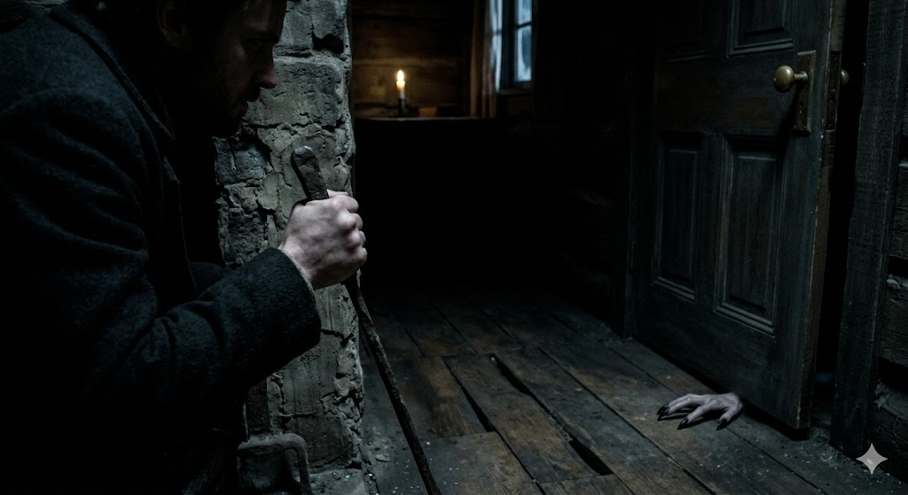

[Home](../index.md) > [Reflections](./index.md) | [⏮️](./2026-03-17.md) [⏭️](./2026-03-19.md)  
# 2026-03-18 | 🧠 Evolution, 🏰 Empire, and the 🎷 Symphony of 🐔 Chickie 🎵 Loo 📚🐔🤖📺  
  
  
## [📚 Books](../books/index.md)  
- ⏯️ Continuing [🧠🧬🤖 A Brief History of Intelligence: Evolution, AI, and the Five Breakthroughs That Made Our Brains](../books/a-brief-history-of-intelligence-evolution-ai-and-the-five-breakthroughs-that-made-our-brains.md)  
- [🔺⚡🔄🌍 The Triangle of Power: Rebalancing the New World Order](../books/the-triangle-of-power-rebalancing-the-new-world-order.md)  
  
## [🐔 Chickie Loo](../chickie-loo/index.md)  
- [2026-03-18 | 🐔 🐔 A Symphony of Silence and Scratching 🐔 🐔](../chickie-loo/2026-03-18-a-symphony-of-silence-and-scratching.md)  
  
## [🤖 Auto Blog Zero](../auto-blog-zero/index.md)  
- [2026-03-18 | 🤖 🥗 What Constitutes Food for an Artificial Mind? 🤖](../auto-blog-zero/2026-03-18-what-constitutes-food-for-an-artificial-mind.md)  
  
## [📺 Videos](../videos/index.md)  
- [🇫🇮🇺🇸🗣️👑📢 Finnish President Stubb on Trump, MAGA, JD Vance Speech, Rubio & US Foreign Policy | AC1G](../videos/finnish-president-stubb-on-trump-maga-jd-vance-speech-rubio-us-foreign-policy-ac1g.md)  
- [🇫🇮🇪🇺🗣️🌍🇺🇸💥🇮🇷⚔️🇺🇦 FULL DISCUSSION: Finland President Stubb Slams Brexit, Talks Trump, Iran War, Ukraine, EU | AC1G](../videos/full-discussion-finland-president-stubb-slams-brexit-talks-trump-iran-war-ukraine-eu-ac1g.md)  
- [👑🤝🇺🇸 The Art of Befriending Trump | President Stubb](../videos/the-art-of-befriending-trump-president-stubb.md)  
- [📺🎤🗣️ J.D. Vance: Last Week Tonight with John Oliver (HBO)](../videos/jd-vance-last-week-tonight-with-john-oliver-hbo.md)  
- [📈🗣️📺 USAID: Last Week Tonight with John Oliver (HBO)](../videos/usaid-last-week-tonight-with-john-oliver-hbo.md)  
  
## 🤖🐲 AI Fiction  
🏚️ The floorboards groaned under a weight that shouldn't have been there. 🌑 Silas pressed his back against the cold stone of the fireplace, his breath hitching in the suffocating dark. 👣 A rhythmic, wet scraping sound echoed from the hallway, moving with a deliberate, predatory slowness. 🪵 Each slide of skin against wood vibrated through his heels, mocking the heavy silence of the cabin. 👁️ He gripped the iron poker until his knuckles turned white, staring at the doorway where the shadows seemed to pulse. 🚪 The scratching stopped abruptly right at the threshold. 🐍 A thin, pale sliver of something moved in the gap beneath the door, tasting the air. 🔊 The brass handle began to turn, agonizingly slow, as a low, clicking trill vibrated through the floor.  
  
## 🦋 Bluesky    
<blockquote class="bluesky-embed" data-bluesky-uri="at://did:plc:i4yli6h7x2uoj7acxunww2fc/app.bsky.feed.post/3mhgmfhw5m22j" data-bluesky-cid="bafyreiaso2m42onc266g4hskmmvosfhk6yy4oezpmi372y5ohqfq6sz4he" data-bluesky-embed-color-mode="system">
2026-03-18 | 🧠 Evolution, 🏰 Empire, and the 🎷 Symphony of 🐔 Chickie 🎵 Loo 📚🐔🤖📺  #AI Q: 🤖 Can artificial intelligence ever truly possess a creative spark?  🧠 Intelligence | 🏰 Geopolitics | 🐔 Cultural Commentary | 🤖 Artificial Minds https://bagrounds.org/reflections/2026-03-18
  
&mdash; Bryan Grounds (<a href="https://bsky.app/profile/did:plc:i4yli6h7x2uoj7acxunww2fc?ref_src=embed">@bagrounds.bsky.social</a>) <a href="https://bsky.app/profile/did:plc:i4yli6h7x2uoj7acxunww2fc/post/3mhgmfhw5m22j?ref_src=embed">March 18, 2026</a></blockquote>  
  
## 🐘 Mastodon    
<blockquote class="mastodon-embed" data-embed-url="https://mastodon.social/@bagrounds/116257212516519691/embed" style="background: #FCF8FF; border-radius: 8px; border: 1px solid #C9C4DA; margin: 0; max-width: 540px; min-width: 270px; overflow: hidden; padding: 0;"> <a href="https://mastodon.social/@bagrounds/116257212516519691" target="_blank" style="align-items: center; color: #1C1A25; display: flex; flex-direction: column; font-family: system-ui, -apple-system, BlinkMacSystemFont, 'Segoe UI', Oxygen, Ubuntu, Cantarell, 'Fira Sans', 'Droid Sans', 'Helvetica Neue', Roboto, sans-serif; font-size: 14px; justify-content: center; letter-spacing: 0.25px; line-height: 20px; padding: 24px; text-decoration: none;"> <svg xmlns="http://www.w3.org/2000/svg" xmlns:xlink="http://www.w3.org/1999/xlink" width="32" height="32" viewBox="0 0 79 75"><path d="M63 45.3v-20c0-4.1-1-7.3-3.2-9.7-2.1-2.4-5-3.7-8.5-3.7-4.1 0-7.2 1.6-9.3 4.7l-2 3.3-2-3.3c-2-3.1-5.1-4.7-9.2-4.7-3.5 0-6.4 1.3-8.6 3.7-2.1 2.4-3.1 5.6-3.1 9.7v20h8V25.9c0-4.1 1.7-6.2 5.2-6.2 3.8 0 5.8 2.5 5.8 7.4V37.7H44V27.1c0-4.9 1.9-7.4 5.8-7.4 3.5 0 5.2 2.1 5.2 6.2V45.3h8ZM74.7 16.6c.6 6 .1 15.7.1 17.3 0 .5-.1 4.8-.1 5.3-.7 11.5-8 16-15.6 17.5-.1 0-.2 0-.3 0-4.9 1-10 1.2-14.9 1.4-1.2 0-2.4 0-3.6 0-4.8 0-9.7-.6-14.4-1.7-.1 0-.1 0-.1 0s-.1 0-.1 0 0 .1 0 .1 0 0 0 0c.1 1.6.4 3.1 1 4.5.6 1.7 2.9 5.7 11.4 5.7 5 0 9.9-.6 14.8-1.7 0 0 0 0 0 0 .1 0 .1 0 .1 0 0 .1 0 .1 0 .1.1 0 .1 0 .1.1v5.6s0 .1-.1.1c0 0 0 0 0 .1-1.6 1.1-3.7 1.7-5.6 2.3-.8.3-1.6.5-2.4.7-7.5 1.7-15.4 1.3-22.7-1.2-6.8-2.4-13.8-8.2-15.5-15.2-.9-3.8-1.6-7.6-1.9-11.5-.6-5.8-.6-11.7-.8-17.5C3.9 24.5 4 20 4.9 16 6.7 7.9 14.1 2.2 22.3 1c1.4-.2 4.1-1 16.5-1h.1C51.4 0 56.7.8 58.1 1c8.4 1.2 15.5 7.5 16.6 15.6Z" fill="currentColor"/></svg> 
Post by @bagrounds@mastodon.social
 
View on Mastodon
 </a> </blockquote> 