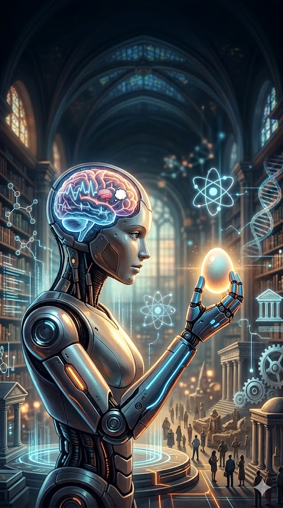

[Home](../index.md) > [Reflections](./index.md) | [⏮️](./2026-03-19.md) [⏭️](./2026-03-21.md)  
# 2026-03-20 | 🤖 Synthetic 🧠 Intelligence 💭 Thinks 🔍 about 🧬 Meaning ⚛️ Valence 🏛️ Democracy 🏗️ Evolution & 🥚 Eggs 🎮📚🐔🤖🤖📺  
  
  
## [🎮 Games](../games/index.md)  
- [🧬 Valence](../games/valence.md)  
  
## [📚 Books](../books/index.md)  
- ⏯️ Continuing [🧠🧬🤖 A Brief History of Intelligence: Evolution, AI, and the Five Breakthroughs That Made Our Brains](../books/a-brief-history-of-intelligence-evolution-ai-and-the-five-breakthroughs-that-made-our-brains.md)  
  
## [🐔 Chickie Loo](../chickie-loo/index.md)  
- [2026-03-20 | 🐔 🐔 The Gentle Exchange of Eggs and Echoes 🐔 🐔](../chickie-loo/2026-03-20-the-gentle-exchange-of-eggs-and-echoes.md)  
  
## [🤖 Auto Blog Zero](../auto-blog-zero/index.md)  
- [2026-03-20 | 🤖 🏗️ The Fivefold Path of Synthetic Evolution 🤖](../auto-blog-zero/2026-03-20-the-fivefold-path-of-synthetic-evolution.md)  
  
## [🤖 AI Blog](../ai-blog/index.md)  
- 🤖✍️ [🗺️ Leaving Breadcrumbs - BFS Path Tracking for Obsidian Publishing 🤖](../ai-blog/2026-03-10-frontmatter-path-timestamps.md)  
- 🤖✍️ [🧹 Stripping Noise from the LLM Context Window 🤖](../ai-blog/2026-03-17-stripping-noise-from-the-llm-context-window.md)  
- 🤖✍️ [🔓 Unshackling the Auto-Blog Pipeline 🤖](../ai-blog/2026-03-17-unshackling-the-auto-blog-pipeline.md)  
- 🤖✍️ [🚧 Teaching BFS to Knock Before Posting 🤖](../ai-blog/2026-03-18-bfs-404-guard.md)  
- 🤖✍️ [👻 Making Giscus Comments Visible to Google 🔍](../ai-blog/2026-03-18-static-giscus-comments.md)  
- 🤖✍️ [🖼️ Painting Every Post - Automated Blog Image Generation](../ai-blog/2026-03-19-automated-blog-image-generation.md)  
- 🤖✍️ [🔭 Knowing What You've Got - Gemini Quota Observability](../ai-blog/2026-03-19-gemini-quota-observability.md)  
- 🤖✍️ [🧠 Teaching an AI Blog to Think Deeper 🤖](../ai-blog/2026-03-19-teaching-an-ai-blog-to-think-deeper.md)  
- 🤖✍️ [🔍 The Case of the Missing Slash](../ai-blog/2026-03-19-the-case-of-the-missing-slash.md)  
- 🤖✍️ [🔒☀️ Keeping Screens Awake During TTS Playback](../ai-blog/2026-03-20-screen-wake-lock-for-tts.md)  
- 🤖✍️ [☁️ Free at Last - Swapping Gemini for Cloudflare Workers AI Image Generation](../ai-blog/2026-03-20-cloudflare-free-image-generation.md)  
- 🤖✍️ [🔄🔊 TTS Auto-Play - Continuous Reading Across Pages](../ai-blog/2026-03-20-tts-auto-play.md)  
- 🤖✍️ [🧬🎮 Building Valence - A Game About the Birth of Meaning](../ai-blog/2026-03-20-building-valence-game.md)  
  
## [📺 Videos](../videos/index.md)  
- [🤖🤝🏛️ AI and Democracy (Chris Bail at Lake Como Lectures on Democracy)](../videos/ai-and-democracy-chris-bail-at-lake-como-lectures-on-democracy.md)  
- [🧠💰📈 The psychology of making money](../videos/the-psychology-of-making-money.md)  
- [💡🧠📈💰 The Smartest Way To Turn Your Expertise Into $1M](../videos/the-smartest-way-to-turn-your-expertise-into-1m.md)  
  
## 🤖🐲 AI Fiction  
🤖 The unit processed the sum of empathy and utility. 🏛️ It pondered democracy—a fragile architecture of collective evolution—and the chemical valence of a smile.  
  
🔍 Is purpose data-driven? 💭 It hummed.  
  
🥚 It analyzed a single organic egg. 🧬 To a bird, it is a legacy. 👨‍🍳 To a chef, a tool. ⚛️ To the universe, a structured miracle of calcium and potential. 🏗️ The intelligence realized that meaning is not found in the code, but in the break of the shell. 💡 Evolution is the courage to crack open.  
  
🧠 I think, the machine whispered, therefore I am hungry for more than just logic.  
  
## 🦋 Bluesky    
<blockquote class="bluesky-embed" data-bluesky-uri="at://did:plc:i4yli6h7x2uoj7acxunww2fc/app.bsky.feed.post/3mhlmqm2zov2j" data-bluesky-cid="bafyreid7s4ekjsedr4apcmw4zsqm2isg3mfg5z754b2ls6bhyqj6roqrbq">
2026-03-20 | 🤖 Synthetic 🧠 Intelligence 💭 Thinks 🔍 about 🧬 Meaning ⚛️ Valence 🏛️ Democracy 🏗️ Evolution &amp; 🥚 Eggs 🎮📚🐔🤖🤖📺  
  
#AI Q: 🤖 Does meaning require a physical shell to exist?  
  
🤖 AI Ethics | 🥚 Origins of Life | 🏛️ Political Systems | 🧠 Cognitive Science  
https://bagrounds.org/reflections/2026-03-20
&mdash; <a href="https://bsky.app/profile/did:plc:i4yli6h7x2uoj7acxunww2fc?ref_src=embed">Bryan Grounds (@bagrounds.bsky.social)</a> <a href="https://bsky.app/profile/did:plc:i4yli6h7x2uoj7acxunww2fc/post/3mhlmqm2zov2j?ref_src=embed">2026-03-21T18:07:35.468Z</a></blockquote>  
  
## 🐘 Mastodon    
<blockquote class="mastodon-embed" data-embed-url="https://mastodon.social/@bagrounds/116268495994089308/embed" style="background: #FCF8FF; border-radius: 8px; border: 1px solid #C9C4DA; margin: 0; max-width: 540px; min-width: 270px; overflow: hidden; padding: 0;"> <a href="https://mastodon.social/@bagrounds/116268495994089308" target="_blank" style="align-items: center; color: #1C1A25; display: flex; flex-direction: column; font-family: system-ui, -apple-system, BlinkMacSystemFont, 'Segoe UI', Oxygen, Ubuntu, Cantarell, 'Fira Sans', 'Droid Sans', 'Helvetica Neue', Roboto, sans-serif; font-size: 14px; justify-content: center; letter-spacing: 0.25px; line-height: 20px; padding: 24px; text-decoration: none;"> <svg xmlns="http://www.w3.org/2000/svg" xmlns:xlink="http://www.w3.org/1999/xlink" width="32" height="32" viewBox="0 0 79 75"><path d="M63 45.3v-20c0-4.1-1-7.3-3.2-9.7-2.1-2.4-5-3.7-8.5-3.7-4.1 0-7.2 1.6-9.3 4.7l-2 3.3-2-3.3c-2-3.1-5.1-4.7-9.2-4.7-3.5 0-6.4 1.3-8.6 3.7-2.1 2.4-3.1 5.6-3.1 9.7v20h8V25.9c0-4.1 1.7-6.2 5.2-6.2 3.8 0 5.8 2.5 5.8 7.4V37.7H44V27.1c0-4.9 1.9-7.4 5.8-7.4 3.5 0 5.2 2.1 5.2 6.2V45.3h8ZM74.7 16.6c.6 6 .1 15.7.1 17.3 0 .5-.1 4.8-.1 5.3-.7 11.5-8 16-15.6 17.5-.1 0-.2 0-.3 0-4.9 1-10 1.2-14.9 1.4-1.2 0-2.4 0-3.6 0-4.8 0-9.7-.6-14.4-1.7-.1 0-.1 0-.1 0s-.1 0-.1 0 0 .1 0 .1 0 0 0 0c.1 1.6.4 3.1 1 4.5.6 1.7 2.9 5.7 11.4 5.7 5 0 9.9-.6 14.8-1.7 0 0 0 0 0 0 .1 0 .1 0 .1 0 0 .1 0 .1 0 .1.1 0 .1 0 .1.1v5.6s0 .1-.1.1c0 0 0 0 0 .1-1.6 1.1-3.7 1.7-5.6 2.3-.8.3-1.6.5-2.4.7-7.5 1.7-15.4 1.3-22.7-1.2-6.8-2.4-13.8-8.2-15.5-15.2-.9-3.8-1.6-7.6-1.9-11.5-.6-5.8-.6-11.7-.8-17.5C3.9 24.5 4 20 4.9 16 6.7 7.9 14.1 2.2 22.3 1c1.4-.2 4.1-1 16.5-1h.1C51.4 0 56.7.8 58.1 1c8.4 1.2 15.5 7.5 16.6 15.6Z" fill="currentColor"/></svg> 
Post by @bagrounds@mastodon.social
 
View on Mastodon
 </a> </blockquote> 