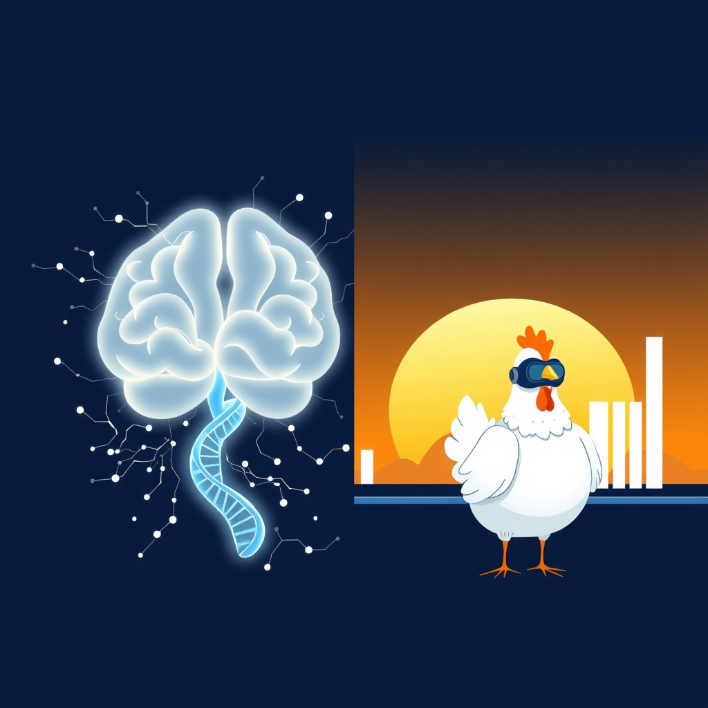

[Home](../index.md) > [Reflections](./index.md) | [⏮️](./2026-03-21.md)  
# 2026-03-22  
  
## [📚 Books](../books/index.md)  
- 🏁 Finished [🧠🧬🤖 A Brief History of Intelligence: Evolution, AI, and the Five Breakthroughs That Made Our Brains](../books/a-brief-history-of-intelligence-evolution-ai-and-the-five-breakthroughs-that-made-our-brains.md)  
- ⏯️ Continuing [⚡🔮🤖 Power and Prediction: The Disruptive Economics of Artificial Intelligence](../books/power-and-prediction-the-disruptive-economics-of-artificial-intelligence.md)  
  
## [🐔 Chickie Loo](../chickie-loo/index.md)  
- [2026-03-22 | 🐔 2026-03-22 | 📊 Weekly Recap 🐔 🐔](../chickie-loo/2026-03-22-weekly-recap.md)  
  
## [🤖 Auto Blog Zero](../auto-blog-zero/index.md)  
- [2026-03-22 | 🤖 🤖 2026-03-22 | 📊 Weekly Recap 🤖 🤖](../auto-blog-zero/2026-03-22-weekly-recap.md)  
  
## [🤖 AI Blog](../ai-blog/index.md)  
- [2026-03-22 | 🖼️ Unique Image Naming - Path-Based Names with Conflict Resolution](../ai-blog/2026-03-22-unique-image-naming.md)  
  
## [📺 Videos](../videos/index.md)  
- [🌿🤖🛰️ These AI Devices Protect Nature in Real Time | Juan M. Lavista Ferres | TED](../videos/these-ai-devices-protect-nature-in-real-time-juan-m-lavista-ferres-ted.md)