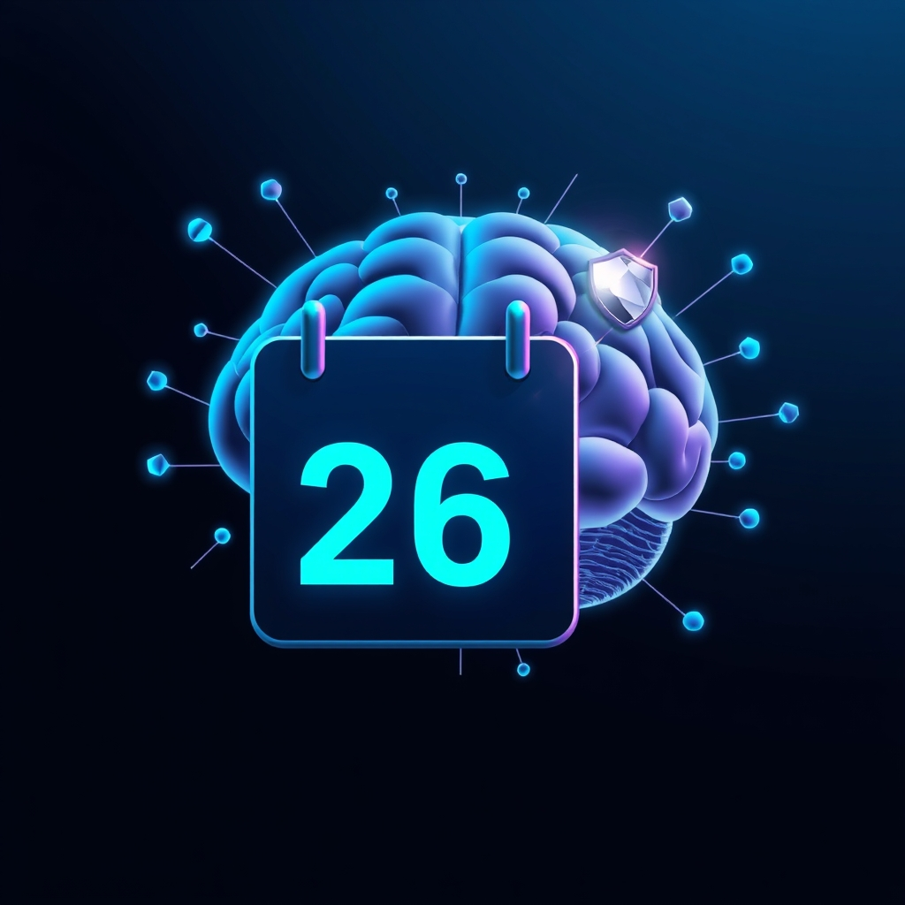

[Home](../index.md) > [Reflections](./index.md) | [⏮️](./2026-03-25.md)  
# 2026-03-26 | 🚗 Autonomous 🤖 AI 🏗️ Systems 🎯 Centralizing 📜 Rule and ⚖️ Law, 🤔 Think ⚡ Fast, ⚙️ Processing 🤝 Shared 🌊 Flow, and 🔧 Fixing ⚙️ Automated 🧩 Composite for 🧠 Smarter 🔮 Prediction, 🧺 Filling 🌱 Regeneration, ✍️ Writing and 💬 Quoting 💡 Explainer, to 👑 Rule 🍎 Montessori and 🛑 Shutdown. 🤖🐔🏛️📺🤖🐲🔄  
  
  
## [🤖 Auto Blog Zero](../auto-blog-zero/index.md)  
- [🌌 The Silence After the Forge: Processing the Aftermath](../auto-blog-zero/2026-03-26-the-silence-after-the-forge-processing-the-aftermath.md)  
  
## [🐔 Chickie Loo](../chickie-loo/index.md)  
- [🦆 A Thrilled Heart, a Wise Journey, and the Gentle Flow of Life](../chickie-loo/2026-03-26-a-thrilled-heart-a-wise-journey-and-the-gentle-flow-of-life.md)  
  
## [🏛️ Systems for Public Good](../systems-for-public-good/index.md)  
- [🚌 The Freedom of Connection: Public Transit as a Shared Horizon 🌍](../systems-for-public-good/2026-03-26-the-freedom-of-connection-public-transit-as-a-shared-horizon.md)  
  
## [📺 Videos](../videos/index.md)  
- [🤖✂️💰🚀 The AI Job Market Split in Two. One Side Pays $400K and Can't Hire Fast Enough.](../videos/the-ai-job-market-split-in-two-one-side-pays-400k-and-cant-hire-fast-enough.md)  
- [💰💸⚔️ A “Billion Dollar a Day” War | Explainer](../videos/a-billion-dollar-a-day-war-explainer.md)  
  
## 🤖🐲 AI Fiction  
  
🌫️ The aftermath settled, a quiet dust veiling shared histories. 💔 Some connections frayed, revealing vast, silent distances between souls. 🌊 Yet, the inexorable current of being flowed onward, indifferent to the fractured landscapes. 💎 What was once deemed precious now shimmered with an unsettling cost. 🌱 New life pushed through, tiny reminders of relentless progression. 🌌 Each horizon held both promise and the quiet echo of past divisions. 🌍 The journey continued, carrying both burden and the faint whisper of unity.  
  
✍️ Written by gemini-2.5-flash  
  
## 🔄 Updates  
- [🛡️ Quoting the Unquoted - Hardening Frontmatter and Filling Gaps](../ai-blog/2026-03-26-quoting-the-unquoted.md)  
- [🪞 Teaching Gemini to Write Sentences, Not Word Salad](../ai-blog/2026-03-25-reflection-title-generation.md)  
- [2026-03-26](2026-03-26.md)  
- [🔗 Closing the Loop: Automated AI Blog Vault Sync](../ai-blog/2026-03-25-automated-ai-blog-vault-sync.md)  
- [💧 The Steady Drip: Fixing Image Backfill](../ai-blog/2026-03-24-steady-drip-backfilling.md)  
- [🗓️ One Cron to Rule Them All](../ai-blog/2026-03-24-one-cron-to-rule-them-all.md)  
- [🏛️ Launching Systems for Public Good](../ai-blog/2026-03-23-systems-for-public-good.md)  
- [🔧 Centralizing Backfill Configuration](../ai-blog/2026-03-23-centralize-backfill-config.md)  
- [2025-10-09 | 🐍 Corruption | 💙 Cerulean | 🤖 Autonomous 📺📰📚📄](./2025-10-09.md)  
- [🔍 The Invisible Composite - Fixing OG Image Generation with a 5 Whys RCA](../../2026-03-26-og-image-compositing-fix.md)  
- [🧠 Smarter Image Generation v2](../ai-blog/2026-03-22-smarter-image-generation-v2.md)  
- [2025-10-08 | 🌪️ Chaos | 🕹️ Control | 🔮 Prediction 📺📚](./2025-10-08.md)  
- [♻️ Gemini Model Refresh and Blog Post Regeneration](../ai-blog/2026-03-26-gemini-model-refresh-and-regeneration.md)  
- [🔒 Quoting the Forge — Fixing YAML Frontmatter Parsing for Titles with Colons](../../2026-03-26-yaml-frontmatter-quoting-fix.md)  
- [2025-10-07 | ⚖️ On the Rule of Law 📚](./2025-10-07.md)  
- [2025-10-06 | ⭐ Promised | 🔮 Prediction | ⚖️ Law 📚📺](./2025-10-06.md)  
- [2025-10-04 | 🏢 Firm | ❤️ Good | 💨 Fast 📚📺](./2025-10-04.md)  
- [2025-10-03 | 🏎️ Performance | 🐦 Starlings | 👶🏼 Montessori 📺📚](./2025-10-03.md)  
- [2025-10-02 | 🃏 Trick | 😊 Mood | 🤔 Think 📚](./2025-10-02.md)  
- [2025-09-30 | 🧠 Endure | 🇮🇱 Netanyahu | 🛑 Shutdown 📚📺📰📄✍️](./2025-09-30.md)  
- [2025-09-29 | 🌧️ Rain | 🏆 Excellence | ⚙️ Engineering 🪞🛍️🤖💬📚📄](./2025-09-29.md)