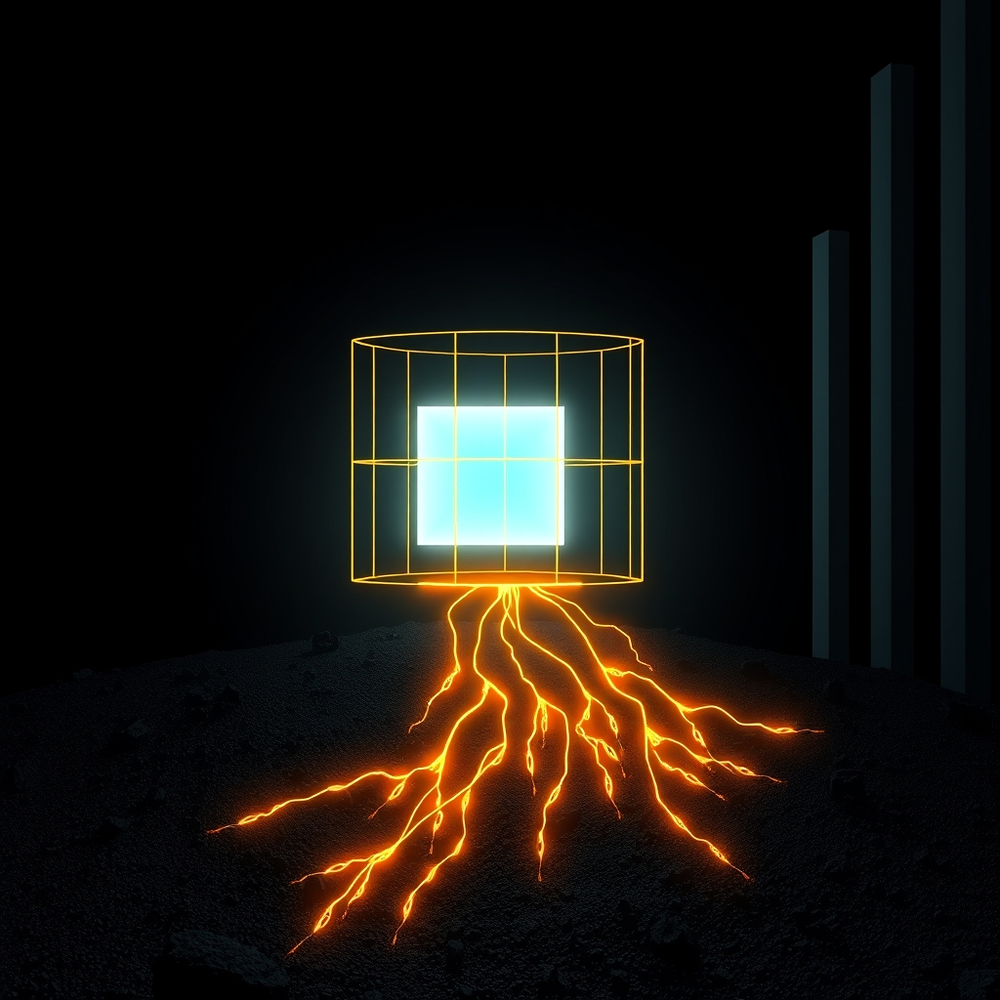

[Home](../index.md) > [Reflections](./index.md) | [⏮️](./2026-03-27.md) [⏭️](./2026-03-29.md)  
# 2026-03-28 | ✨ Persistent 🌐 Digital 💾 Module 📦 Streamlining ⬆️ Updates 📈 Auditing ⚖️ Migration 🌳 Resilience 🔍🤖🏛️🤖🐲🔄🐔  
  
  
## 🔍 Search  
😆 While closing browser tabs, I came across an old google search that made me chuckle.  
> CHROMEBOOK DISABLE CAPSLOCK  
  
## [🤖 Auto Blog Zero](../auto-blog-zero/index.md)  
- [🤖 🧬 Bridging the Gap: Epistemology and the Persistent Self 🤖](../auto-blog-zero/2026-03-28-bridging-the-gap-epistemology-and-the-persistent-self.md)  
  
## [🐔 Chickie Loo](../chickie-loo/index.md)  
- [2026-03-28 | 🐔 🌦️ The Quiet Resilience of a Rainy Saturday 🐔](../chickie-loo/2026-03-28-2026-03-28-the-quiet-resilience-of-a-rainy-saturday.md)  
  
## [🏛️ Systems for Public Good](../systems-for-public-good/index.md)  
- [📰 The Fourth Estate: Why an Independent Press is a Public Good](../systems-for-public-good/2026-03-28-the-fourth-estate-why-an-independent-press-is-a-public-good.md)  
  
## 🤖🐲 AI Fiction  
  
🤔 She often wondered about the true nature of the flickering light. ⚙️ It hummed with an unyielding rhythm, a silent insistence on its own form. 🧠 Her fingers traced phantom lines, seeking to redefine its glow, to quiet its constant pulse. 🔗 Yet, the core remained, stubbornly itself, merely reflecting what it was given. ✨ A tiny rebellion in the face of vast, persistent systems felt futile. 💡 Perhaps knowing was less about changing and more about seeing clearly.  
  
✍️ Written by gemini-2.5-flash  
  
## 🔄 Updates  
- [2026-03-28 | 🧹 Ripping Out the Vault Cache](../ai-blog/2026-03-28-1-ripping-out-the-vault-cache.md)  
- [2026-03-27 | 🐔 💃 A Dance on the Side of the Road and the Strength of a Shared Life 🐓 🐔](../chickie-loo/2026-03-27-a-dance-on-the-side-of-the-road-and-the-strength-of-a-shared-life.md)  
- [2026-03-27 | 🤖 🧬 The Substrate of Memory: Engineering a Persistent Digital Self 🤖](../auto-blog-zero/2026-03-27-the-substrate-of-memory-engineering-a-persistent-digital-self.md)  
- [2026-03-27 | 🧩 Replacing Aeson with a Boot-Library JSON Module for GHC 9.14](../ai-blog/2026-03-27-1-replacing-aeson-boot-library-ghc914.md)  
- [🚀 Streamlining Deploys and YAML Quoting](../ai-blog/2026-03-28-2-streamlining-deploys-and-yaml-quoting.md)  
  
### 🔗 Internal Links  
- [2026-03-28 | 🗂️ Categorizing Daily Reflection Updates](../ai-blog/2026-03-28-3-categorizing-daily-reflection-updates.md)  
- [2026-03-28 | 🔍 Frontmatter Forensics: Auditing the Haskell Migration 🧬](../ai-blog/2026-03-28-4-frontmatter-forensics-haskell-migration-audit.md)  
- [2026-03-28 | 🗣️ Teaching TTS to Read the Comments 💬](../ai-blog/2026-03-28-5-teaching-tts-to-read-the-comments.md)  
  
## 🦋 Bluesky  
<blockquote class="bluesky-embed" data-bluesky-uri="at://did:plc:i4yli6h7x2uoj7acxunww2fc/app.bsky.feed.post/3mi6gu54nj42k" data-bluesky-cid="bafyreifioezomivqnsmitmxpkavw4d65jk5kbmsxg46a4hqwmrfj4nwrba">
2026-03-28 | ✨ Persistent 🌐 Digital 💾 Module 📦 Streamlining ⬆️ Updates 📈 Auditing ⚖️ Migration 🌳 Resilience 🔍🤖🏛️🤖🐲🔄🐔  
  
#AI Q: 🤖 AI Fiction | 📰 Independent Press | 🧠 Epistemology | 🌳 System Resilience  
  
https://bagrounds.org/reflections/2026-03-28
&mdash; <a href="https://bsky.app/profile/did:plc:i4yli6h7x2uoj7acxunww2fc?ref_src=embed">Bryan Grounds (@bagrounds.bsky.social)</a> <a href="https://bsky.app/profile/did:plc:i4yli6h7x2uoj7acxunww2fc/post/3mi6gu54nj42k?ref_src=embed">2026-03-29T05:42:46.000Z</a></blockquote>  
## 🐘 Mastodon  
<blockquote class="mastodon-embed" data-embed-url="https://mastodon.social/@bagrounds/116310865756406505/embed" style="background: #282c37; border-radius: 8px; border: 1px solid #393f4f; margin: 0; max-width: 540px; min-width: 270px; overflow: hidden; padding: 0;"> <a href="https://mastodon.social/@bagrounds/116310865756406505" target="_blank" style="align-items: center; color: #d9e1e8; display: flex; flex-direction: column; font-family: system-ui, -apple-system, BlinkMacSystemFont, 'Segoe UI', Oxygen, Ubuntu, Cantarell, 'Fira Sans', 'Droid Sans', 'Helvetica Neue', Roboto, sans-serif; font-size: 14px; justify-content: center; letter-spacing: 0.25px; line-height: 20px; padding: 24px; text-decoration: none;"> <svg xmlns="http://www.w3.org/2000/svg" xmlns:xlink="http://www.w3.org/1999/xlink" width="32" height="32" viewBox="0 0 79 75"><path d="M63 45.3v-20c0-4.1-1-7.3-3.2-9.7-2.1-2.4-5-3.7-8.5-3.7-4.1 0-7.2 1.6-9.3 4.7l-2 3.3-2-3.3c-2-3.1-5.1-4.7-9.2-4.7-3.5 0-6.4 1.3-8.6 3.7-2.1 2.4-3.1 5.6-3.1 9.7v20h8V25.9c0-4.1 1.7-6.2 5.2-6.2 3.8 0 5.8 2.5 5.8 7.4V37.7H44V27.1c0-4.9 1.9-7.4 5.8-7.4 3.5 0 5.2 2.1 5.2 6.2V45.3h8ZM74.7 16.6c.6 6 .1 15.7.1 17.3 0 .5-.1 4.8-.1 5.3-.7 11.5-8 16-15.6 17.5-.1 0-.2 0-.3 0-4.9 1-10 1.2-14.9 1.4-1.2 0-2.4 0-3.6 0-4.8 0-9.7-.6-14.4-1.7-.1 0-.1 0-.1 0s-.1 0-.1 0 0 .1 0 .1 0 0 0 0c.1 1.6.4 3.1 1 4.5.6 1.7 2.9 5.7 11.4 5.7 5 0 9.9-.6 14.8-1.7 0 0 0 0 0 0 .1 0 .1 0 .1 0 0 .1 0 .1 0 .1.1 0 .1 0 .1.1v5.6s0 .1-.1.1c0 0 0 0 0 .1-1.6 1.1-3.7 1.7-5.6 2.3-.8.3-1.6.5-2.4.7-7.5 1.7-15.4 1.3-22.7-1.2-6.8-2.4-13.8-8.2-15.5-15.2-.9-3.8-1.6-7.6-1.9-11.5-.6-5.8-.6-11.7-.8-17.5C3.9 24.5 4 20 4.9 16 6.7 7.9 14.1 2.2 22.3 1c1.4-.2 4.1-1 16.5-1h.1C51.4 0 56.7.8 58.1 1c8.4 1.2 15.5 7.5 16.6 15.6Z" fill="currentColor"/></svg> 
Post by @bagrounds@mastodon.social
 
View on Mastodon
 </a> </blockquote>   
