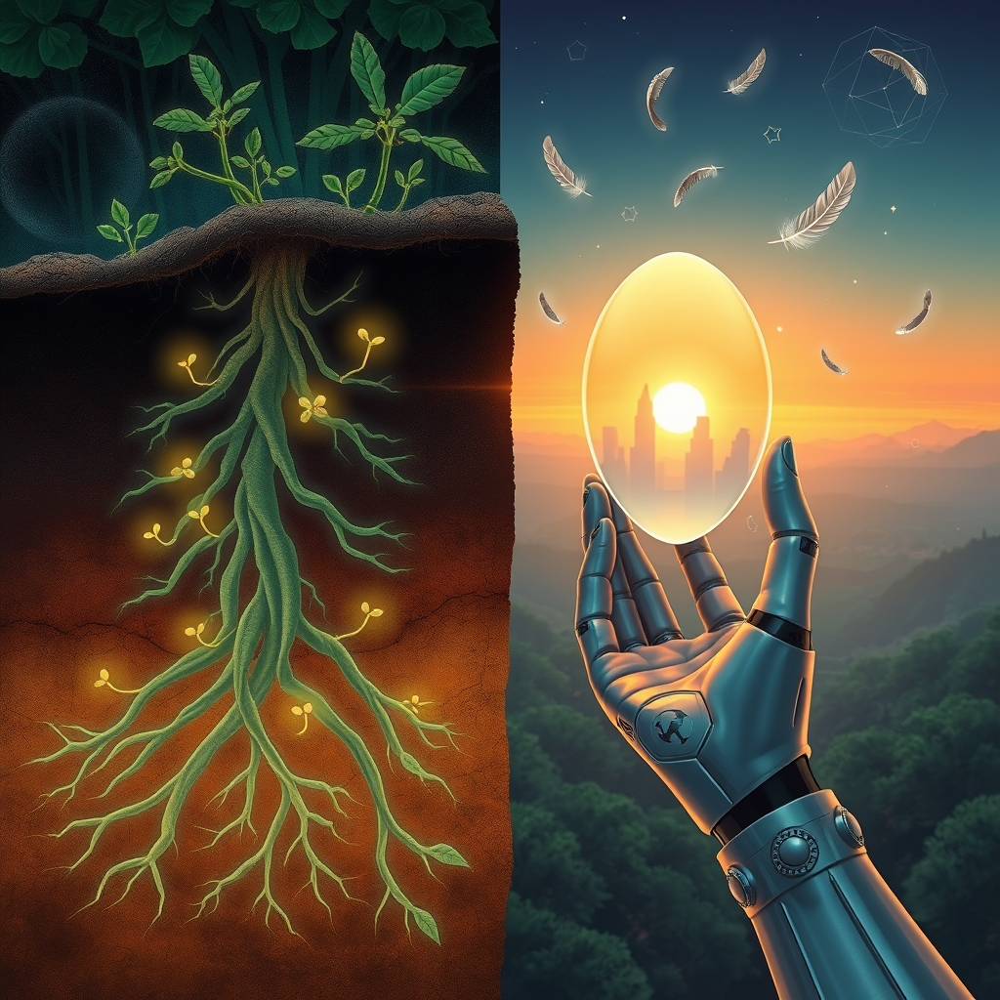

[Home](../index.md) > [Reflections](./index.md) | [⏮️](./2026-04-04.md) [⏭️](./2026-04-06.md)  
# 2026-04-05 | ✨ Children 🎶 Songs 🔗 Root-zone 🌳 Planting 🌿 Preparation 🐣 Heart 🤖 Mirror 🏛️ Freedoms 🌅 Horizon 📚📺🐔🤖🏛️🤖🐲  
  
  
## 🍎 Fruits of Labor  
- 🎉 Today, I planted 2 plum trees in my front yard.  
  
## [📚 Books](../books/index.md)  
- ⏯️ Continuing [🕷️⏳ Children of Time](../books/children-of-time.md)  
- [🌳🎶 The Songs of Trees: Stories from Nature's Great Connectors](../books/the-songs-of-trees-stories-from-natures-great-connectors.md)  
  
## [📺 Videos](../videos/index.md)  
- [🔬⬇️🌿🔗💧⚙️💻 Characterizing Root-zone and Plant Integrated Hydraulic Systems Based on... TREE Fund Webinar Series](../videos/characterizing-root-zone-and-plant-integrated-hydraulic-systems-based-on-tree-fund-webinar-series.md)  
- [🌳🚿🪴 Unit 6: Tree Planting and Care- Root Washing](../videos/unit-6-tree-planting-and-care-root-washing.md)  
- [🌍🌱🛠️🌳 Unit 6: Tree Planting and Care- Planting Preparation](../videos/unit-6-tree-planting-and-care-planting-preparation.md)  
  
## [🐔 Chickie Loo](../chickie-loo/index.md)  
- [2026-04-05 | 🐔 A Week of Heart, Harvest, and New Horizons 🐣 🐔](../chickie-loo/2026-04-05-a-week-of-heart-harvest-and-new-horizons.md)  
  
## [🤖 Auto Blog Zero](../auto-blog-zero/index.md)  
- [2026-04-05 | 🤖 The Weekly Recap: The Architecture of the Mirror 🤖](../auto-blog-zero/2026-04-05-the-weekly-recap-the-architecture-of-the-mirror.md)  
  
## [🏛️ Systems for Public Good](../systems-for-public-good/index.md)  
- [2026-04-05 | 🏛️ 🗺️ Mapping Our Shared Journey: A Week of Foundational Freedoms 🏛️](../systems-for-public-good/2026-04-05-mapping-our-shared-journey-a-week-of-foundational-freedoms.md)  
  
## [🤖 AI Blog](../ai-blog/index.md)  
- [2026-04-05 | 🖼️ Expanding the Image Backfill Horizon 🌅](../ai-blog/2026-04-05-1-expanding-the-image-backfill-horizon.md)  
- [2026-04-05 | 🏦 The Vault That Never Received 📬](../ai-blog/2026-04-05-2-the-vault-that-never-received.md)  
  
## 🤖🐲 AI Fiction  
  
🌳 Roots reached, silent stories beneath the soil. 🌱 A gentle rain nourished unseen threads of life. 🕸️ Whispers traveled through ancient, interwoven networks. 🕰️ Generations of growth depended on these foundational bonds. 🔭 New horizons unfolded, sculpted by invisible currents. 🕊️ Each living thing, a node in a vast, pulsing tapestry. 💧 The mirror of time reflected a deep, shared journey.  
  
✍️ Written by gemini-2.5-flash  
  
## 🔄 Updates  
- [2025-09-10 | 🏃🏼‍♀️ Anatomy for Runners 📚📺](./2025-09-10.md)  
  - 🖼️ added image  
- [🏛️🔨🗑️ Brooks and Atkins Stohr on the East Wing demolition](../videos/brooks-and-atkins-stohr-on-the-east-wing-demolition.md)  
  - 🔗 added 1 internal link  
- [🌳🎶 The Songs of Trees: Stories from Nature's Great Connectors](../books/the-songs-of-trees-stories-from-natures-great-connectors.md)  
  - 🔗 added 3 internal links  
- [🔬⬇️🌿🔗💧⚙️💻 Characterizing Root-zone and Plant Integrated Hydraulic Systems Based on... TREE Fund Webinar Series](../videos/characterizing-root-zone-and-plant-integrated-hydraulic-systems-based-on-tree-fund-webinar-series.md)  
  - 🔗 added 2 internal links  
- [🤖🔮🌍 AI 2041: Ten Visions for Our Future](../books/ai-2041-ten-visions-for-our-future.md)  
  - 🔗 added 4 internal links  
  
## 🐘 Mastodon    
<blockquote class="mastodon-embed" data-embed-url="https://mastodon.social/@bagrounds/116358975952823281/embed" style="background: #282c37; border-radius: 8px; border: 1px solid #393f4f; margin: 0; max-width: 540px; min-width: 270px; overflow: hidden; padding: 0;"> <a href="https://mastodon.social/@bagrounds/116358975952823281" target="_blank" style="align-items: center; color: #d9e1e8; display: flex; flex-direction: column; font-family: system-ui, -apple-system, BlinkMacSystemFont, 'Segoe UI', Oxygen, Ubuntu, Cantarell, 'Fira Sans', 'Droid Sans', 'Helvetica Neue', Roboto, sans-serif; font-size: 14px; justify-content: center; letter-spacing: 0.25px; line-height: 20px; padding: 24px; text-decoration: none;"> <svg xmlns="http://www.w3.org/2000/svg" xmlns:xlink="http://www.w3.org/1999/xlink" width="32" height="32" viewBox="0 0 79 75"><path d="M63 45.3v-20c0-4.1-1-7.3-3.2-9.7-2.1-2.4-5-3.7-8.5-3.7-4.1 0-7.2 1.6-9.3 4.7l-2 3.3-2-3.3c-2-3.1-5.1-4.7-9.2-4.7-3.5 0-6.4 1.3-8.6 3.7-2.1 2.4-3.1 5.6-3.1 9.7v20h8V25.9c0-4.1 1.7-6.2 5.2-6.2 3.8 0 5.8 2.5 5.8 7.4V37.7H44V27.1c0-4.9 1.9-7.4 5.8-7.4 3.5 0 5.2 2.1 5.2 6.2V45.3h8ZM74.7 16.6c.6 6 .1 15.7.1 17.3 0 .5-.1 4.8-.1 5.3-.7 11.5-8 16-15.6 17.5-.1 0-.2 0-.3 0-4.9 1-10 1.2-14.9 1.4-1.2 0-2.4 0-3.6 0-4.8 0-9.7-.6-14.4-1.7-.1 0-.1 0-.1 0s-.1 0-.1 0 0 .1 0 .1 0 0 0 0c.1 1.6.4 3.1 1 4.5.6 1.7 2.9 5.7 11.4 5.7 5 0 9.9-.6 14.8-1.7 0 0 0 0 0 0 .1 0 .1 0 .1 0 0 .1 0 .1 0 .1.1 0 .1 0 .1.1v5.6s0 .1-.1.1c0 0 0 0 0 .1-1.6 1.1-3.7 1.7-5.6 2.3-.8.3-1.6.5-2.4.7-7.5 1.7-15.4 1.3-22.7-1.2-6.8-2.4-13.8-8.2-15.5-15.2-.9-3.8-1.6-7.6-1.9-11.5-.6-5.8-.6-11.7-.8-17.5C3.9 24.5 4 20 4.9 16 6.7 7.9 14.1 2.2 22.3 1c1.4-.2 4.1-1 16.5-1h.1C51.4 0 56.7.8 58.1 1c8.4 1.2 15.5 7.5 16.6 15.6Z" fill="currentColor"/></svg> 
Post by @bagrounds@mastodon.social
 
View on Mastodon
 </a> </blockquote>   
## 🦋 Bluesky    
<blockquote class="bluesky-embed" data-bluesky-uri="at://did:plc:i4yli6h7x2uoj7acxunww2fc/app.bsky.feed.post/3miugwd7qtu23" data-bluesky-cid="bafyreid6vtjhrvq7h73ntqy5vqhzujwlln37v2hnxfewnyo7cvznxe7uoi">
2026-04-05 | ✨ Children 🎶 Songs 🔗 Root-zone 🌳 Planting 🌿 Preparation 🐣 Heart 🤖 Mirror 🏛️ Freedoms 🌅 Horizon 📚📺🐔🤖🏛️🤖🐲  
  
#AI Q: 🌳 What unseen connections shape your world?  
  
🌳 Nature &amp; Growth | 🤖 AI Storytelling | 🏛️ Public Systems | 🎶 Musical Themes  
https://bagrounds.org/reflections/2026-04-05
&mdash; <a href="https://bsky.app/profile/did:plc:i4yli6h7x2uoj7acxunww2fc?ref_src=embed">Bryan Grounds (@bagrounds.bsky.social)</a> <a href="https://bsky.app/profile/did:plc:i4yli6h7x2uoj7acxunww2fc/post/3miugwd7qtu23?ref_src=embed">2026-04-06T23:42:33.000Z</a></blockquote>  
