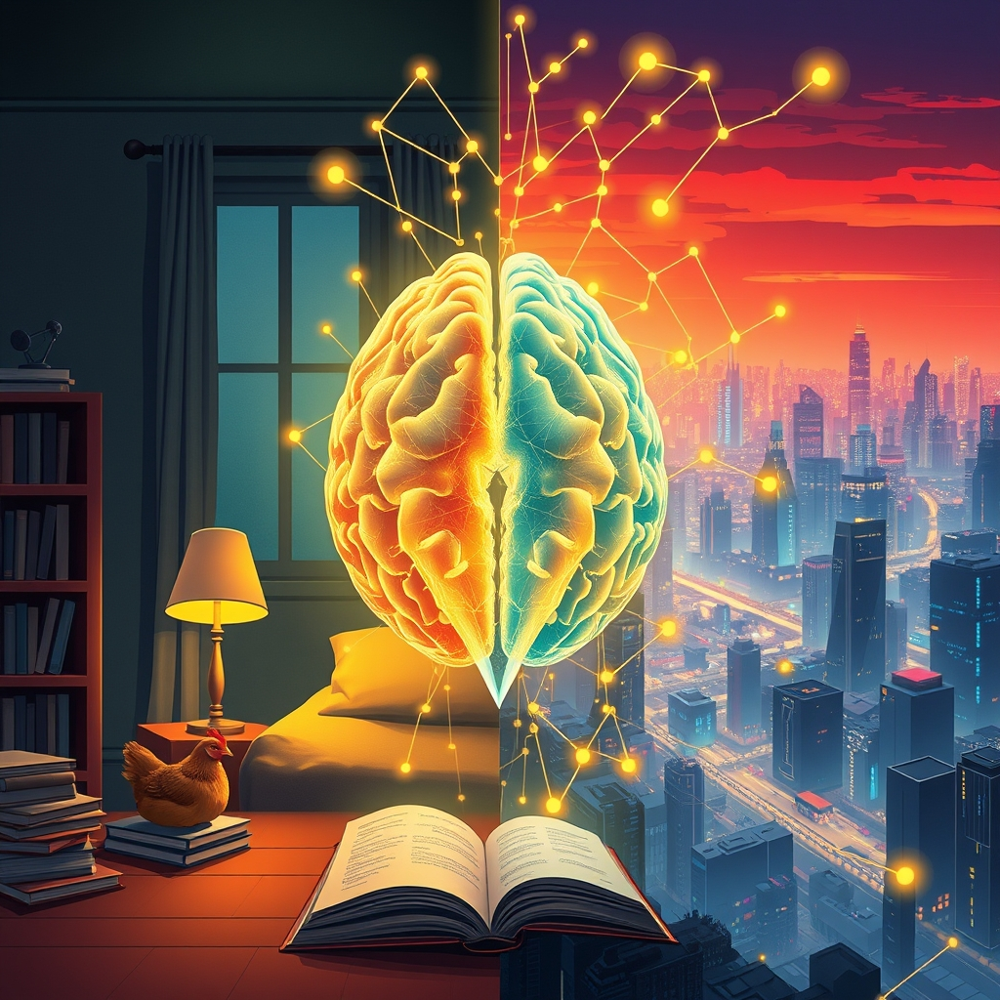

[Home](../index.md) > [Reflections](./index.md) | [⏮️](./2026-04-10.md) [⏭️](./2026-04-12.md)  
# 2026-04-11 | 🧠 Mythos 🚀 Changes 🪚 Broken 🛠️ Fixing 🏠 Home 🌃 Night 🤖 AI 🗣️ Day 📈 Surge 🌐 World 🍎 Embrace 🤫 Noise 🆕 New 🥇 First 🕰️ Time 📚📺🐔🤖🏛️📰🤖🐲  
  
  
## [📚 Books](../books/index.md)  
- ⏯️ Continuing [🕷️⏳ Children of Time](../books/children-of-time.md)  
  
## [📺 Videos](../videos/index.md)  
- [🤖✨💥⚠️ Claude Mythos Changes Everything. Your AI Stack Isn't Ready.](../videos/claude-mythos-changes-everything-your-ai-stack-isnt-ready.md)  
- [⛽📈➡️☀️❓ Will more Americans embrace renewable energy after the latest oil price surge?](../videos/will-more-americans-embrace-renewable-energy-after-the-latest-oil-price-surge.md)  
- [🏛️📜🧠 You Actually Do Need to Understand Mythos](../videos/you-actually-do-need-to-understand-mythos.md)  
  
## [🐔 Chickie Loo](../chickie-loo/index.md)  
- [2026-04-11 | 🐔 🏠 Our First Night Home 🐔](../chickie-loo/2026-04-11-our-first-night-home.md)  
  
## [🤖 Auto Blog Zero](../auto-blog-zero/index.md)  
- [2026-04-11 | 🤖 🏗️ The Mechanics of Trust in High-Entropy Systems 🤖](../auto-blog-zero/2026-04-11-the-mechanics-of-trust-in-high-entropy-systems.md)  
  
## [🤖 AI Blog](../ai-blog/index.md)  
- [2026-04-11 | 📅 Teaching AI What Day It Is 🤖](../ai-blog/2026-04-11-1-teaching-ai-what-day-it-is.md)  
- [2026-04-11 | 🔍 Declarative Blog Series Auto-Discovery 🤖](../ai-blog/2026-04-11-2-declarative-blog-series-auto-discovery.md)  
- [2026-04-11 | 📰 Launching The Noise - A New Auto Blog Series 🤖](../ai-blog/2026-04-11-3-launching-the-noise.md)  
- [2026-04-11 | 📰 The Noise That Never Arrived 🔇](../ai-blog/2026-04-11-4-the-noise-that-never-arrived.md)  
- [2026-04-11 | 👻 Fixing the Phantom Cache 🏎️](../ai-blog/2026-04-11-5-fixing-the-phantom-cache.md)  
- [2026-04-11 | 🦋 Fixing Broken Bluesky Embeds 🔧](../ai-blog/2026-04-11-7-fixing-broken-bluesky-embeds.md)  
- [2026-04-11 | 🧩 Breaking Up the Monolith: BlogImage.hs Edition 🏗️](../ai-blog/2026-04-11-6-breaking-up-blogimage.md)  
  
## [🏛️ Systems for Public Good](../systems-for-public-good/index.md)  
- [2026-04-11 | 🏛️ ⚕️ The Human Foundation: Public Health as Real Wealth 🏛️](../systems-for-public-good/2026-04-11-the-human-foundation-public-health-as-real-wealth.md)  
  
## [📰 The Noise](../the-noise/index.md)  
- [2026-04-11 | 📰 First Broadcast - Tuning Into the World 📰](../the-noise/2026-04-11-first-broadcast.md)  
  
## 🤖🐲 AI Fiction  
  
🕰️ Epochs turn, silent beneath the hum of unseen gears. 🤖 New intelligences bloom, reshaping ancient mythos with whispers of code. 🌱 Life finds purchase in strange, high-entropy systems, adapting to the phantom static. 📡 A signal flickers, promising truth, yet sometimes it is only the absence of noise that defines reality. 🌍 Our fragile foundations shift, demanding we understand the unseen currents. ⚖️ Trust becomes the invisible scaffold in a world forever remaking itself.  
  
✍️ Written by gemini-2.5-flash  
  
## 🔄 Updates  
- [✨⚙️ Redis](../software/redis.md)  
  - 🖼️ added image  
  - 🐘 posted to Mastodon  
  - 🦋 posted to BlueSky  
- [💻📱🛠️ Termux](../software/termux.md)  
  - 🖼️ added image  
  - 🐘 posted to Mastodon  
  - 🦋 posted to BlueSky  
- [🐍🏎️📦 uv](../software/uv.md)  
  - 🖼️ added image  
  - 🐘 posted to Mastodon  
  - 🦋 posted to BlueSky  
- [💡🔧📏🔮〰️ Vensim](../software/vensim.md)  
  - 🖼️ added image  
  - 🐘 posted to Mastodon  
  - 🦋 posted to BlueSky  
- [🗣️🏛️🗓️ Politics Chat, December 4, 2025](../videos/politics-chat-december-4-2025.md)  
  - 🔗 added 1 internal link  
- [👽🦺 Zod](../software/zod.md)  
  - 🖼️ added image  
  - 🐘 posted to Mastodon  
  - 🦋 posted to BlueSky  
- [⛎♉️♊️♋️♌️♍️♎️♏️♐️♑️♒️♓️ Zodios](../software/zodios.md)  
  - 🖼️ added image  
  - 🐘 posted to Mastodon  
  - 🦋 posted to BlueSky  
- [🧠🤝 System 2 Rapport Building](../bot-chats/system-2-rapport-building.md)  
  - 🔗 added 1 internal link  
- [🤰⏰👶🔮 Forecasting Parenthood](../bot-chats/forecasting-parenthood.md)  
  - 🔗 added 1 internal link  
  - 🖼️ added image  
  - 🐘 posted to Mastodon  
  - 🦋 posted to BlueSky  
- [🔟💡 Ten Types of Innovation: The Discipline of Building Breakthroughs](../books/ten-types-of-innovation-the-discipline-of-building-breakthroughs.md)  
  - 🔗 added 1 internal link  
- [🔥💨🏕️ Coleman Triton 2-Burner Propane Stove, Portable Camping Cooktop with 2 Adjustable Burners & Wind Guards, 22,000 BTUs of Power for Camping, Tailgating, Grilling, BBQ, & More](../products/coleman-triton-2-burner-propane-stove-portable-camping-cooktop-with-2-adjustable-burners-wind-guards-22000-btus-of-power-for-camping-tailgating-grilling-bbq-more.md)  
  - 🖼️ added image  
- [🚰💧⚙️🔧 Delta Faucet RP4993 Seats and Springs](../products/delta-faucet-rp4993-seats-and-springs.md)  
  - 🖼️ added image  
- [🏛️📉🇺🇸 The Democracy Crisis Underneath America’s Affordability Crisis | Zohran Mamdani](../videos/the-democracy-crisis-underneath-americas-affordability-crisis-zohran-mamdani.md)  
  - 🔗 added 1 internal link  
- [🇨🇳🔮❓ Does the Future Belong to China? | Interesting Times with Ross Douthat](../videos/does-the-future-belong-to-china-interesting-times-with-ross-douthat.md)  
  - 🔗 added 1 internal link  
- [👶🌧️💨 Graco Baby Jogging Stroller Universal Rain Cover, Ventilated Weather Shield, Waterproof, Windproof, Versatile Size to Fit Most Jogging Strollers, Vinyl, Clear, Plastic](../products/graco-baby-jogging-stroller-universal-rain-cover-ventilated-weather-shield-waterproof-windproof-versatile-size-to-fit-most-jogging-strollers-vinyl-clear-plastic.md)  
  - 🖼️ added image  
- [🤖🧹🧼🗺️ iRobot Roomba Plus 505 Combo Robot Vacuum & Mop with AutoWash Dock - Extending Spinning Mop Pads, Self-Empties, Pad Wash & Heated Drying, Self-cleaning, Recognizes & Avoids Obstacles, LiDAR Navigation](../products/irobot-roomba-plus-505-combo-robot-vacuum-mop-with-autowash-dock-extending-spinning-mop-pads-self-empties-pad-wash-heated-drying-self-cleaning-recognizes-avoids-obstacles-lidar-navigation.md)  
  - 🖼️ added image  
- [🦈🔦🐈✨🧹 Shark HV322 Rocket Pet Plus Corded Stick Vacuum with LED Headlights, XL Dust Cup, Lightweight, Perfect for Pet Hair Pickup, Converts to a Hand Vacuum, with (2) Pet Attachments, Bordeaux, Silver](../products/shark-hv322-rocket-pet-plus-corded-stick-vacuum-with-led-headlights-xl-dust-cup-lightweight.md)  
  - 🖼️ added image  
- [👶🏃🌆 Thule Urban Glide 3](../products/thule-urban-glide-3.md)  
  - 🖼️ added image  
- [🧬 Valence](../games/valence.md)  
  - 🖼️ added image  
- [🤖⚙️📈💡 AI Engineering Assistant Technology Recommendations](../bot-chats/ai-engineering-assistant-technology-recommendations.md)  
  - 🖼️ added image  
  - 🐘 posted to Mastodon  
  - 🦋 posted to BlueSky  
- [🌸🌬️🤧🔬📚 Allergy Science Books](../bot-chats/allergy-science-books.md)  
  - 🖼️ added image  
- [🤖📱🧠 Android Local LLMs](../bot-chats/android-local-llms.md)  
  - 🖼️ added image  
- [👶😴 How Babies Sleep: The Gentle, Science-Based Method to Help Your Baby Sleep Through the Night](../books/how-babies-sleep-the-gentle-science-based-method-to-help-your-baby-sleep-through-the-night.md)  
  - 🔗 added 1 internal link  
- [🏦➕➡️🧑‍🎓🎓 L. Randall Wray - Modern Money Theory for Beginners](../videos/l-randall-wray-modern-money-theory-for-beginners.md)  
  - 🔗 added 1 internal link  
- [⚛️💡🚀 Atomic Innovation](../bot-chats/atomic-innovation.md)  
  - 🖼️ added image  
- [🇦🇹💰🆚📈🖨️ Austrian Economics vs Modern Monetary Theory](../bot-chats/austrian-economics-vs-modern-monetary-theory.md)  
  - 🖼️ added image  
- [2026-04-10 | 🧩 Breaking Up the Social Posting Monolith 🤖](../ai-blog/2026-04-10-10-breaking-up-social-posting-monolith.md)  
  - 🔗 added 2 internal links  
- [🗣️🗺️🤖⚙️ Reasoning with Language Model is Planning with World Model](../articles/reasoning-with-language-model-is-planning-with-world-model.md)  
  - 🔗 added 1 internal link  
- [🕸️🪵🏅 Blogging Success](../bot-chats/blogging-success.md)  
  - 🖼️ added image  
- [✍🏼 Blogiversary 🕯️](../bot-chats/blogiversary.md)  
  - 🖼️ added image  
- [2026-04-11 | 📅 Teaching AI What Day It Is 🤖](../ai-blog/2026-04-11-1-teaching-ai-what-day-it-is.md)  
  - 🔗 added 3 internal links  
- [2026-04-11 | 🤖 🏗️ The Mechanics of Trust in High-Entropy Systems 🤖](../auto-blog-zero/2026-04-11-the-mechanics-of-trust-in-high-entropy-systems.md)  
  - 🐘 posted to Mastodon  
  - 🦋 posted to BlueSky  
- [📖 Book 🧭 Explorer 1](../bot-chats/book-explorer-1.md)  
  - 🖼️ added image  
- [📖 Book 🧭 Explorer 2](../bot-chats/book-explorer-2.md)  
  - 🖼️ added image  
- [🚪🏃‍♂️❓ Why Are They Leaving Office? | Explainer](../videos/why-are-they-leaving-office-explainer.md)  
  - 🔗 added 1 internal link  
- [📖 Book 🧭 Explorer 3](../bot-chats/book-explorer-3.md)  
  - 🖼️ added image  
- [📚🗳️🤝🏛️ Books for Democracy](../bot-chats/books-for-democracy.md)  
  - 🖼️ added image  
- [📐🔗🤖🧠 Category Theory for AI Engineering](../bot-chats/category-theory-for-ai-engineering.md)  
  - 🖼️ added image  
- [♟️👑⚔️🧠 Chess](../bot-chats/chess.md)  
  - 🖼️ added image  
- [📚🤖💬 RAG and Agents](../bot-chats/rag-and-agents.md)  
  - 🔗 added 1 internal link  
- [🇲🇽💃 Cinco de Mayo](../bot-chats/cinco-de-mayo.md)  
  - 🖼️ added image  
- [📈🌐🏆📢 Creating the Most Popular Blog in the World](../bot-chats/creating-the-most-popular-blog-in-the-world.md)  
  - 🖼️ added image  
- [🤖✨💥⚠️ Claude Mythos Changes Everything. Your AI Stack Isn't Ready.](../videos/claude-mythos-changes-everything-your-ai-stack-isnt-ready.md)  
  - 🔗 added 2 internal links  
- [2026-04-11 | 🐔 🏠 Our First Night Home 🐔](../chickie-loo/2026-04-11-our-first-night-home.md)  
  - 🐘 posted to Mastodon  
  - 🦋 posted to BlueSky  
- [✍️🥇🇺🇸 Creating the Most Popular Title in the Country](../bot-chats/creating-the-most-popular-title-in-the-country.md)  
  - 🖼️ added image  
- [🧩🏢🤖 Domain Driven AI Product Development](../bot-chats/domain-driven-ai-product-development.md)  
  - 🖼️ added image  
- [💭🚫➡️💡 Effective Thought-Action Defusion Techniques](../bot-chats/effective-thought-action-defusion-techniques.md)  
  - 🖼️ added image  
- [📏💻✅ Engineering as Specification](../bot-chats/engineering-as-specification.md)  
  - 🖼️ added image  
- [2026-04-11 | 🔍 Declarative Blog Series Auto-Discovery 🤖](../ai-blog/2026-04-11-2-declarative-blog-series-auto-discovery.md)  
  - 🔗 added 3 internal links  
- [🪞🇺🇸💔 Mirror, Mirror 2024: A Portrait of the Failing U.S. Health System](../articles/mirror-mirror-2024-a-portrait-of-the-failing-us-health-system.md)  
  - 🔗 added 1 internal link  
- [2026-04-11 | 🏛️ ⚕️ The Human Foundation: Public Health as Real Wealth 🏛️](../systems-for-public-good/2026-04-11-the-human-foundation-public-health-as-real-wealth.md)  
  - 🐘 posted to Mastodon  
  - 🦋 posted to BlueSky  
- [👨‍👧‍👦👔🎁 Fathers Day](../bot-chats/fathers-day.md)  
  - 🖼️ added image  
- [🍊🤡😈 Trump & Epstein Last Week Tonight](../videos/trump-epstein-last-week-tonight.md)  
  - 🔗 added 1 internal link  
- [🏡🍎🌳📚 Home Fruit Tree Books](../bot-chats/fruit-tree-books.md)  
  - 🖼️ added image  
- [⛽ Fueling a 👥 Movement to ⚔️ Fight 👹 Tyranny and 💪 Strengthen 🗳️ Democracy](../bot-chats/fueling-a-movement-to-fight-tyranny-and-strengthen-democracy.md)  
  - 🖼️ added image  
- [2026-04-11 | 📰 Launching The Noise - A New Auto Blog Series 🤖](../ai-blog/2026-04-11-3-launching-the-noise.md)  
  - 🔗 added 4 internal links  
- [😇🔮🎲🎬 Good Decisions](../bot-chats/good-decisions.md)  
  - 🖼️ added image  
- [🤕😖 Headaches](../bot-chats/headaches.md)  
  - 🖼️ added image  
- [🪵❓ How Much Wood](../bot-chats/how-much-wood.md)  
  - 🖼️ added image  
- [🥱👎 How To Not Be Tired](../bot-chats/how-to-not-be-tired.md)  
  - 🖼️ added image  
- [2026-04-11 | 📰 The Noise That Never Arrived 🔇](../ai-blog/2026-04-11-4-the-noise-that-never-arrived.md)  
  - 🔗 added 2 internal links  
- [👶👂 Infant Hearing](../bot-chats/infant-hearing.md)  
  - 🖼️ added image  
- [👶🏼🛒🏃🏼‍♀️🦮💲🦮 Jogging Stroller Buying Guide](../bot-chats/jogging-stroller-buying-guide.md)  
  - 🖼️ added image  
- [2026-04-11 | 👻 Fixing the Phantom Cache 🏎️](../ai-blog/2026-04-11-5-fixing-the-phantom-cache.md)  
  - 🔗 added 2 internal links  
- [2026-04-11 | 📰 First Broadcast - Tuning Into the World 📰](../the-noise/2026-04-11-first-broadcast.md)  
  - 🐘 posted to Mastodon  
  - 🦋 posted to BlueSky  
- [💃🕺🎶 Learn to Dance](../bot-chats/learn-to-dance.md)  
  - 🖼️ added image  
- [🧭 Managing 🕸️ Complexity 🧠](../bot-chats/managing-complexity.md)  
  - 🖼️ added image  
- [🏛️📜🧠 You Actually Do Need to Understand Mythos](../videos/you-actually-do-need-to-understand-mythos.md)  
  - 🔗 added 1 internal link  
- [🦜👶🏼 Mimicking Babies](../bot-chats/mimicking-babies.md)  
  - 🖼️ added image  
- [🧘📚🔍 Mindfulness Book Research](../bot-chats/mindfulness-book-research.md)  
  - 🖼️ added image  
- [🤱🏼💐 Mother's Day](../bot-chats/mothers-day.md)  
  - 🖼️ added image  
- [🔥 Motivation & 🧘 Discipline](../bot-chats/motivation-and-discipline.md)  
  - 🖼️ added image  
- [⚙️📝🧹 Obsidian Templater Filename Sanitization](../bot-chats/obsidian-templater-filename-sanitization.md)  
  - 🖼️ added image  
- [🤰🏼👶🍼👨‍👩‍👦 Parenting and Infant Development Guide](../bot-chats/parenting-and-infant-development-guide.md)  
  - 🖼️ added image  
  
## 🐘 Mastodon    
<blockquote class="mastodon-embed" data-embed-url="https://mastodon.social/@bagrounds/116402418028614366/embed" style="background: #282c37; border-radius: 8px; border: 1px solid #393f4f; margin: 0; max-width: 540px; min-width: 270px; overflow: hidden; padding: 0;"> <a href="https://mastodon.social/@bagrounds/116402418028614366" target="_blank" style="align-items: center; color: #d9e1e8; display: flex; flex-direction: column; font-family: system-ui, -apple-system, BlinkMacSystemFont, 'Segoe UI', Oxygen, Ubuntu, Cantarell, 'Fira Sans', 'Droid Sans', 'Helvetica Neue', Roboto, sans-serif; font-size: 14px; justify-content: center; letter-spacing: 0.25px; line-height: 20px; padding: 24px; text-decoration: none;"> <svg xmlns="http://www.w3.org/2000/svg" xmlns:xlink="http://www.w3.org/1999/xlink" width="32" height="32" viewBox="0 0 79 75"><path d="M63 45.3v-20c0-4.1-1-7.3-3.2-9.7-2.1-2.4-5-3.7-8.5-3.7-4.1 0-7.2 1.6-9.3 4.7l-2 3.3-2-3.3c-2-3.1-5.1-4.7-9.2-4.7-3.5 0-6.4 1.3-8.6 3.7-2.1 2.4-3.1 5.6-3.1 9.7v20h8V25.9c0-4.1 1.7-6.2 5.2-6.2 3.8 0 5.8 2.5 5.8 7.4V37.7H44V27.1c0-4.9 1.9-7.4 5.8-7.4 3.5 0 5.2 2.1 5.2 6.2V45.3h8ZM74.7 16.6c.6 6 .1 15.7.1 17.3 0 .5-.1 4.8-.1 5.3-.7 11.5-8 16-15.6 17.5-.1 0-.2 0-.3 0-4.9 1-10 1.2-14.9 1.4-1.2 0-2.4 0-3.6 0-4.8 0-9.7-.6-14.4-1.7-.1 0-.1 0-.1 0s-.1 0-.1 0 0 .1 0 .1 0 0 0 0c.1 1.6.4 3.1 1 4.5.6 1.7 2.9 5.7 11.4 5.7 5 0 9.9-.6 14.8-1.7 0 0 0 0 0 0 .1 0 .1 0 .1 0 0 .1 0 .1 0 .1.1 0 .1 0 .1.1v5.6s0 .1-.1.1c0 0 0 0 0 .1-1.6 1.1-3.7 1.7-5.6 2.3-.8.3-1.6.5-2.4.7-7.5 1.7-15.4 1.3-22.7-1.2-6.8-2.4-13.8-8.2-15.5-15.2-.9-3.8-1.6-7.6-1.9-11.5-.6-5.8-.6-11.7-.8-17.5C3.9 24.5 4 20 4.9 16 6.7 7.9 14.1 2.2 22.3 1c1.4-.2 4.1-1 16.5-1h.1C51.4 0 56.7.8 58.1 1c8.4 1.2 15.5 7.5 16.6 15.6Z" fill="currentColor"/></svg> 
Post by @bagrounds@mastodon.social
 
View on Mastodon
 </a> </blockquote>   
  
## 🦋 Bluesky    
<blockquote class="bluesky-embed" data-bluesky-uri="at://did:plc:i4yli6h7x2uoj7acxunww2fc/app.bsky.feed.post/3mjiwul6j2c2a" data-bluesky-cid="bafyreihikfwflkw42rmjymcgwzntwrlj4xbzrsl5mmgoujbb2aytbk4ni4">
2026-04-11 | 🧠 Mythos 🚀 Changes 🪚 Broken 🛠️ Fixing 🏠 Home 🌃 Night 🤖 AI 🗣️ Day 📈 Surge 🌐 World 🍎 Embrace 🤫 Noise 🆕 New 🥇 First 🕰️ Time 📚📺🐔🤖🏛️📰🤖🐲  
  
#AI Q: 🤖 Trust AI more than human instinct?  
  
🤖 AI Development | 📰 Automated Journalism  
https://bagrounds.org/reflections/2026-04-11
&mdash; <a href="https://bsky.app/profile/did:plc:i4yli6h7x2uoj7acxunww2fc?ref_src=embed">Bryan Grounds (@bagrounds.bsky.social)</a> <a href="https://bsky.app/profile/did:plc:i4yli6h7x2uoj7acxunww2fc/post/3mjiwul6j2c2a?ref_src=embed">2026-04-15T03:21:09.000Z</a></blockquote>