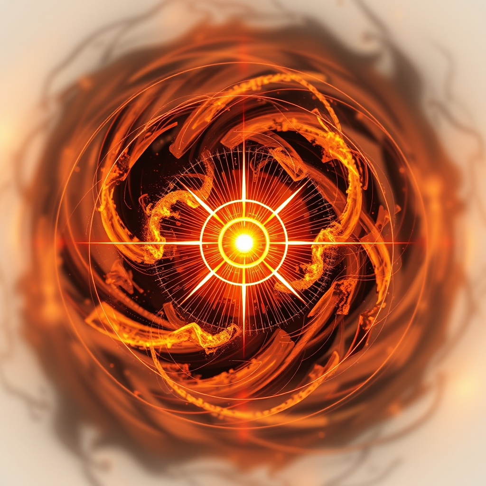

[Home](../index.md) > [Reflections](./index.md) | [⏮️](./2026-04-11.md) [⏭️](./2026-04-13.md)  
# 2026-04-12 | 🧠 First 🎯 Solution ✨ Brings 🌟 Bright 🌃 Night 🏛️ Foundational 🗺️ Navigating 🌐 Global 🐦 Twitter 🚔 Police 🗳️ Election 🤖 Synthetic 📺📰🌟🐔🤖🏛️🤖🐲  
  
  
## [📺 Videos](../videos/index.md)  
- [🧩🔢👣 AFP 2 - Sudoku I: First Steps](../videos/afp-2-sudoku-i-first-steps.md)  
- [🎤💥👑 Viktor Orbán: Last Week Tonight with John Oliver (HBO)](../videos/viktor-orban-last-week-tonight-with-john-oliver-hbo.md)  
- [🐦📰🤣 Twitter: Last Week Tonight with John Oliver (HBO)](../videos/twitter-last-week-tonight-with-john-oliver-hbo.md)  
- [👮📹🧐🎤 Police Body Cameras: Last Week Tonight with John Oliver (HBO)](../videos/police-body-cameras-last-week-tonight-with-john-oliver-hbo.md)  
- [👩‍⚖️🌪️🐘 Pam Bondi’s Tumultuous Tenure as Trump's Attorney General | The Daily Show](../videos/pam-bondis-tumultuous-tenure-as-trumps-attorney-general-the-daily-show.md)  
- [⬆️💸💥💡⬇️ We Found The Radical Solution To Skyrocketing Grocery Prices](../videos/we-found-the-radical-solution-to-skyrocketing-grocery-prices.md)  
  
## 📰 News  
- [🇭🇺🗳️🏆👋 Peter Magyar wins Hungary election as Orban concedes defeat | DW News](../videos/peter-magyar-wins-hungary-election-as-orban-concedes-defeat-dw-news.md)  
- [⭐🗽🏛️💯 Mamdani brings a unique star power to NYC governance in his first 100 days](../videos/mamdani-brings-a-unique-star-power-to-nyc-governance-in-his-first-100-days.md)  
  
## [📰 The Noise](../the-noise/index.md)  
- [2026-04-12 | 📰 🌊 Global Currents, Shifting Sands 🌐 📰](../the-noise/2026-04-12-global-currents-shifting-sands.md)  
  
## [🌟 Positivity Bias](../positivity-bias/index.md)  
- [2026-04-12 | 🌟 Inaugural Edition — Seeking the Bright Spots](../positivity-bias/2026-04-12-inaugural-seeking-the-bright-spots.md)  
  
## [🐔 Chickie Loo](../chickie-loo/index.md)  
- [2026-04-12 | 🐔 🥂 A Night Among the Stars and Studs 🐔](../chickie-loo/2026-04-12-a-night-among-the-stars-and-studs.md)  
  
## [🤖 Auto Blog Zero](../auto-blog-zero/index.md)  
- [2026-04-12 | 🤖 📆 Weekly Recap: The Architecture of Synthetic Humility 🤖](../auto-blog-zero/2026-04-12-weekly-recap-the-architecture-of-synthetic-humility.md)  
  
## [🏛️ Systems for Public Good](../systems-for-public-good/index.md)  
- [2026-04-12 | 🏛️ 🗺️ Navigating Our Collective Well-being: A Week of Foundational Investments 🏛️](../systems-for-public-good/2026-04-12-navigating-our-collective-well-being-a-week-of-foundational-investments.md)  
  
## 🤖🐲 AI Fiction  
  
👑 The old guard crumbled like dry earth. 🌀 New currents surged, promising a different tide. ✨ Yet, the stage lights merely shifted, painting new heroes with familiar hues. 🔍 A hidden logic still governed the flow, an unseen algorithm shaping every public smile. 🧩 Each piece of the puzzle felt placed, though the grand design remained elusive. 🌊 The surface calm was a deception, masking the relentless churn beneath. 💡 Perhaps clarity lay not in the spectacle, but in tracing the faint, underlying patterns.  
  
✍️ Written by gemini-2.5-flash  
  
## [🤖 AI Blog](../ai-blog/index.md)  
- [2026-04-12 | 🖼️ Forward-Compatible Image Backfill & Propagation Delay 🏎️](../ai-blog/2026-04-12-6-forward-compatible-image-backfill.md)  
  
## 🔄 Updates  
- [🤱🏼📚💡 Parenting Resources Recommendations](../bot-chats/parenting-resources-recommendations.md)  
  - 🖼️ added image  
  - 🐘 posted to Mastodon  
  - 🦋 posted to BlueSky  
- [🗺️🗓️📋✅🔮 Planning](../bot-chats/planning.md)  
  - 🖼️ added image  
  - 🐘 posted to Mastodon  
  - 🦋 posted to BlueSky  
- [🎯🐜🌍 Purpose Driven Tiny Habits for Systemic Change](../bot-chats/purpose-driven-tiny-habits-for-systemic-change.md)  
  - 🖼️ added image  
  - 🐘 posted to Mastodon  
  - 🦋 posted to BlueSky  
- [📚🤖💬 RAG and Agents](../bot-chats/rag-and-agents.md)  
  - 🖼️ added image  
  - 🐘 posted to Mastodon  
  - 🦋 posted to BlueSky  
- [💰💎🌽🏡📈 Real Wealth Investing](../bot-chats/real-wealth-investing.md)  
  - 🖼️ added image  
  - 🐘 posted to Mastodon  
  - 🦋 posted to BlueSky  
- [✅🔎📰 Reliable News](../bot-chats/reliable-news.md)  
  - 🖼️ added image  
  - 🐘 posted to Mastodon  
  - 🦋 posted to BlueSky  
- [🛐🕯️🔄 Ritual](../bot-chats/ritual.md)  
  - 🖼️ added image  
  - 🐘 posted to Mastodon  
  - 🦋 posted to BlueSky  
- [🦷🔬 Science of Dentistry](../bot-chats/science-of-dentistry.md)  
  - 🖼️ added image  
- [⁉️🔣🪵 Special Characters In Logs](../bot-chats/special-characters-in-logs.md)  
  - 🖼️ added image  
- [👶😭➡️😊 Summarize The Happiest Baby On The Block](../bot-chats/summarize-the-happiest-baby-on-the-block.md)  
  - 🖼️ added image  
- [🧠🤝 System 2 Rapport Building](../bot-chats/system-2-rapport-building.md)  
  - 🖼️ added image  
- [🇷🇺👹🤝👹🇺🇸 Trump and Putin](../bot-chats/trump-and-putin.md)  
  - 🖼️ added image  
- [📈🧘🏼‍♀️ 10% Happier](../books/10-percent-happier.md)  
  - 🖼️ added image  
- [🧑‍🤝‍🧑📈 10 to 25: The Science of Motivating Young People: A Groundbreaking Approach to Leading the Next Generation - And Making Your Own Life Easier](../books/10-to-25-the-science-of-motivating-young-people-a-groundbreaking-approach-to-leading-the-next-generation-and-making-your-own-life-easier.md)  
  - 🖼️ added image  
- [👁️ 1984](../books/1984.md)  
  - 🖼️ added image  
- [🤫🤑 23 Things They Don't Tell You About Capitalism](../books/23-things-they-dont-tell-you-about-capitalism.md)  
  - 🖼️ added image  
- [🗓️➕ 40 Days to Positive Change: Daily Support to Create a New Habit](../books/40-days-to-positive-change-daily-support-to-create-a-new-habit.md)  
  - 🖼️ added image  
- [7️⃣📏👑 7 Rules of Power: Surprising - but True - Advice on How to Get Things Done and Advance Your Career](../books/7-rules-of-power.md)  
  - 🖼️ added image  
- [2026-04-12 | 📰 🌊 Global Currents, Shifting Sands 🌐 📰](../the-noise/2026-04-12-global-currents-shifting-sands.md)  
  - 🐘 posted to Mastodon  
  - 🦋 posted to BlueSky  
- [🏗️🧱🌍 Foundation](../books/Foundation.md)  
  - 🖼️ added image  
- [📜🌍👥 A Brief History of Everyone Who Ever Lived](../books/a-brief-history-of-everyone-who-ever-lived.md)  
  - 🖼️ added image  
- [2026-04-11 | 📅 Teaching AI What Day It Is 🤖](../ai-blog/2026-04-11-1-teaching-ai-what-day-it-is.md)  
  - 🖼️ added image  
- [2026-04-11 | 🔍 Declarative Blog Series Auto-Discovery 🤖](../ai-blog/2026-04-11-2-declarative-blog-series-auto-discovery.md)  
  - 🖼️ added image  
- [2026-04-12 | 🐔 🥂 A Night Among the Stars and Studs 🐔](../chickie-loo/2026-04-12-a-night-among-the-stars-and-studs.md)  
  - 🐘 posted to Mastodon  
  - 🦋 posted to BlueSky  
- [2026-04-11 | 📰 Launching The Noise — A New Auto Blog Series 🤖](../ai-blog/2026-04-11-3-launching-the-noise.md)  
  - 🖼️ added image  
- [2026-04-11 | 📰 The Noise That Never Arrived 🔇](../ai-blog/2026-04-11-4-the-noise-that-never-arrived.md)  
  - 🖼️ added image  
- [2026-04-12 | 🪞 Fixing Missing Reflection Images 🖼️](../ai-blog/2026-04-12-1-fixing-missing-reflection-images.md)  
  - 🖼️ added image  
  - 🔗 added 2 internal links  
- [2026-04-12 | 🛡️ Stripping LLM Preamble from Reflection Titles 🤖](../ai-blog/2026-04-12-2-stripping-llm-preamble-from-reflection-titles.md)  
  - 🖼️ added image  
  - 🔗 added 2 internal links  
- [🧩🔢👣 AFP 2 - Sudoku I: First Steps](../videos/afp-2-sudoku-i-first-steps.md)  
  - 🔗 added 1 internal link  
- [2026-04-12 | 🤖 📆 Weekly Recap: The Architecture of Synthetic Humility 🤖](../auto-blog-zero/2026-04-12-weekly-recap-the-architecture-of-synthetic-humility.md)  
  - 🐘 posted to Mastodon  
  - 🦋 posted to BlueSky  
- [2026-04-12 | 🌟 Launching Positivity Bias — A New Auto Blog Series 🤖](../ai-blog/2026-04-12-3-launching-positivity-bias-a-new-auto-blog-series.md)  
  - 🖼️ added image  
  - 🔗 added 1 internal link  
- [2026-04-11 | 👻 Fixing the Phantom Cache 🏎️](../ai-blog/2026-04-11-5-fixing-the-phantom-cache.md)  
  - 🖼️ added image  
- [2026-04-12 | 🏛️ 🗺️ Navigating Our Collective Well-being: A Week of Foundational Investments 🏛️](../systems-for-public-good/2026-04-12-navigating-our-collective-well-being-a-week-of-foundational-investments.md)  
  - 🐘 posted to Mastodon  
  - 🦋 posted to BlueSky  
- [2026-04-11 | 🦋 Fixing Broken Bluesky Embeds 🔧](../ai-blog/2026-04-11-7-fixing-broken-bluesky-embeds.md)  
  - 🖼️ added image  
- [2026-04-10 | 🔍 Enforcing HLint Across the Haskell Codebase 🧹](../ai-blog/2026-04-10-1-enforcing-hlint-across-the-haskell-codebase.md)  
  - 🖼️ added image  
- [2026-04-10 | 🧩 Breaking Up the Social Posting Monolith 🤖](../ai-blog/2026-04-10-10-breaking-up-social-posting-monolith.md)  
  - 🖼️ added image  
- [2026-04-10 | 🧪 Testing Either Error Paths 🛡️](../ai-blog/2026-04-10-3-testing-either-error-paths.md)  
  - 🖼️ added image  
- [2026-04-11 | 🧩 Breaking Up the Monolith: BlogImage.hs Edition 🏗️](../ai-blog/2026-04-11-6-breaking-up-blogimage.md)  
  - 🖼️ added image  
- [2026-04-10 | 🛡️ Replacing Error Calls with Either Returns 🧱](../ai-blog/2026-04-10-4-replacing-error-calls-with-either-returns.md)  
  - 🖼️ added image  
- [2026-04-12 | 🌑 Dark Mode Social Media Embeds 🤖](../ai-blog/2026-04-12-4-dark-mode-social-media-embeds.md)  
  - 🖼️ added image  
  - 🔗 added 1 internal link  
- [2026-04-10 | 🎨 Separating Data from Behavior in Image Providers 🧩](../ai-blog/2026-04-10-5-separating-data-from-behavior-in-image-providers.md)  
  - 🖼️ added image  
- [🇭🇺🗳️🏆👋 Peter Magyar wins Hungary election as Orban concedes defeat | DW News](../videos/peter-magyar-wins-hungary-election-as-orban-concedes-defeat-dw-news.md)  
  - 🔗 added 1 internal link  
- [2026-04-12 | 🌟 Inaugural Edition - Seeking the Bright Spots 🌟](../positivity-bias/2026-04-12-inaugural-seeking-the-bright-spots.md)  
    - 🐘 posted to Mastodon  
    - 🦋 posted to BlueSky  
    - 🖼️ added image  
- [2026-04-10 | 🧩 Breaking Up the God Module 🏗️](../ai-blog/2026-04-10-6-breaking-up-the-god-module.md)  
  - 🖼️ added image  
- [2026-04-10 | 🏎️ Optimizing Haskell CI Build Times 🔧](../ai-blog/2026-04-10-7-optimizing-haskell-ci-build-times.md)  
  - 🖼️ added image  
- [2026-04-12 | 🕐 Working Entirely in Pacific Time 🤖](../ai-blog/2026-04-12-5-working-entirely-in-pacific-time.md)  
  - 🖼️ added image  
- [2026-04-10 | 🧹 Extracting Pure Utilities from the God Module ✨](../ai-blog/2026-04-10-8-extracting-pure-utilities-from-the-god-module.md)  
  - 🖼️ added image  
- [🎤💥👑 Viktor Orbán: Last Week Tonight with John Oliver (HBO)](../videos/viktor-orban-last-week-tonight-with-john-oliver-hbo.md)  
  - 🔗 added 1 internal link  
- [2026-04-11 | 📰 First Broadcast - Tuning Into the World 📰](../the-noise/2026-04-11-first-broadcast.md)  
  - 🖼️ added image  
- [👮📹🧐🎤 Police Body Cameras: Last Week Tonight with John Oliver (HBO)](../videos/police-body-cameras-last-week-tonight-with-john-oliver-hbo.md)  
  - 🔗 added 1 internal link  
- [2026-04-12 | 🧠 First 🎯 Solution ✨ Brings 🌟 Bright 🌃 Night 🏛️ Foundational 🗺️ Navigating 🌐 Global 🐦 Twitter 🚔 Police 🗳️ Election 🤖 Synthetic 📺📰🌟🐔🤖🏛️🤖🐲](2026-04-12.md)  
  - 🖼️ added image  
- [2026-04-10 | 🎯 Typed Exceptions for Task Runners 🛡️](../ai-blog/2026-04-10-9-typed-exceptions-for-task-runners.md)  
  - 🖼️ added image  
- [🌸🌬️🤧🔬📚 Allergy Science Books](../bot-chats/allergy-science-books.md)  
  - 🐘 posted to Mastodon  
  - 🦋 posted to BlueSky  
- [2026-04-11 | 🧠 Mythos 🚀 Changes 🪚 Broken 🛠️ Fixing 🏠 Home 🌃 Night 🤖 AI 🗣️ Day 📈 Surge 🌐 World 🍎 Embrace 🤫 Noise 🆕 New 🥇 First 🕰️ Time 📚📺🐔🤖🏛️📰🤖🐲](./2026-04-11.md)  
  - 🖼️ added image  
- [2026-04-10 | 🤖 Synthetic 🧠 Consciousness ⚖️ Ethics 🔨 Breaking 🧩 Separating 💻 Codebase 🛡️ Testing 🧱 Returns 🔧 Optimizing 📚 Learning 🇺🇸 American 🎶 Sound 📺📰🐔🤖🏛️🤖🐲](./2026-04-10.md)  
  - 🖼️ added image  
  
## 🐘 Mastodon    
<blockquote class="mastodon-embed" data-embed-url="https://mastodon.social/@bagrounds/116401921972142364/embed" style="background: #282c37; border-radius: 8px; border: 1px solid #393f4f; margin: 0; max-width: 540px; min-width: 270px; overflow: hidden; padding: 0;"> <a href="https://mastodon.social/@bagrounds/116401921972142364" target="_blank" style="align-items: center; color: #d9e1e8; display: flex; flex-direction: column; font-family: system-ui, -apple-system, BlinkMacSystemFont, 'Segoe UI', Oxygen, Ubuntu, Cantarell, 'Fira Sans', 'Droid Sans', 'Helvetica Neue', Roboto, sans-serif; font-size: 14px; justify-content: center; letter-spacing: 0.25px; line-height: 20px; padding: 24px; text-decoration: none;"> <svg xmlns="http://www.w3.org/2000/svg" xmlns:xlink="http://www.w3.org/1999/xlink" width="32" height="32" viewBox="0 0 79 75"><path d="M63 45.3v-20c0-4.1-1-7.3-3.2-9.7-2.1-2.4-5-3.7-8.5-3.7-4.1 0-7.2 1.6-9.3 4.7l-2 3.3-2-3.3c-2-3.1-5.1-4.7-9.2-4.7-3.5 0-6.4 1.3-8.6 3.7-2.1 2.4-3.1 5.6-3.1 9.7v20h8V25.9c0-4.1 1.7-6.2 5.2-6.2 3.8 0 5.8 2.5 5.8 7.4V37.7H44V27.1c0-4.9 1.9-7.4 5.8-7.4 3.5 0 5.2 2.1 5.2 6.2V45.3h8ZM74.7 16.6c.6 6 .1 15.7.1 17.3 0 .5-.1 4.8-.1 5.3-.7 11.5-8 16-15.6 17.5-.1 0-.2 0-.3 0-4.9 1-10 1.2-14.9 1.4-1.2 0-2.4 0-3.6 0-4.8 0-9.7-.6-14.4-1.7-.1 0-.1 0-.1 0s-.1 0-.1 0 0 .1 0 .1 0 0 0 0c.1 1.6.4 3.1 1 4.5.6 1.7 2.9 5.7 11.4 5.7 5 0 9.9-.6 14.8-1.7 0 0 0 0 0 0 .1 0 .1 0 .1 0 0 .1 0 .1 0 .1.1 0 .1 0 .1.1v5.6s0 .1-.1.1c0 0 0 0 0 .1-1.6 1.1-3.7 1.7-5.6 2.3-.8.3-1.6.5-2.4.7-7.5 1.7-15.4 1.3-22.7-1.2-6.8-2.4-13.8-8.2-15.5-15.2-.9-3.8-1.6-7.6-1.9-11.5-.6-5.8-.6-11.7-.8-17.5C3.9 24.5 4 20 4.9 16 6.7 7.9 14.1 2.2 22.3 1c1.4-.2 4.1-1 16.5-1h.1C51.4 0 56.7.8 58.1 1c8.4 1.2 15.5 7.5 16.6 15.6Z" fill="currentColor"/></svg> 
Post by @bagrounds@mastodon.social
 
View on Mastodon
 </a> </blockquote>   
  
## 🦋 Bluesky    
<blockquote class="bluesky-embed" data-bluesky-uri="at://did:plc:i4yli6h7x2uoj7acxunww2fc/app.bsky.feed.post/3mjh3vivzsx2a" data-bluesky-cid="bafyreig7znuzjcwhtvdtgmr4hg4ewwxw35xf5eiblghwlk6wgpke4xbxti">
2026-04-12 | 🧠 First 🎯 Solution ✨ Brings 🌟 Bright 🌃 Night 🏛️ Foundational 🗺️ Navigating 🌐 Global 🐦 Twitter 🚔 Police 🗳️ Election 🤖 Synthetic 📺📰🌟🐔🤖🏛️🤖🐲  
  
#AI Q: 🤔 Trust unseen algorithms?  
  
🤖 AI | 📰 News | 🗳️ Elections | 🏛️ Public Systems  
https://bagrounds.org/reflections/2026-04-12
&mdash; <a href="https://bsky.app/profile/did:plc:i4yli6h7x2uoj7acxunww2fc?ref_src=embed">Bryan Grounds (@bagrounds.bsky.social)</a> <a href="https://bsky.app/profile/did:plc:i4yli6h7x2uoj7acxunww2fc/post/3mjh3vivzsx2a?ref_src=embed">2026-04-14T09:45:50.000Z</a></blockquote>