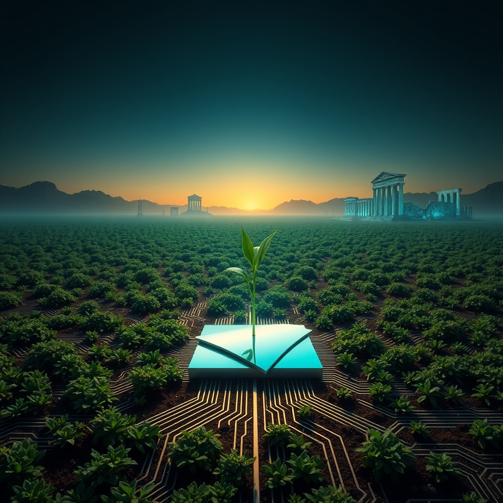

[Home](../index.md) > [Reflections](./index.md) | [⏮️](./2026-04-15.md) [⏭️](./2026-04-17.md)  
# 2026-04-16 | 🌟 Losing 💯 🧪 Weeding 📍 Spot 🤔 Great 🌸 Horizons 🐔 Pace 🤖 Mirror 🏛️ Liberator 🔀 Sustenance 🔗 Updates 🤖 Changes 🔀 Misplaced 📺🌟📰🐔🤖🏛️🔀🤖🐲  
  
  
## [📺 Videos](../videos/index.md)  
- [🇺🇸💸🌍 How America Is Losing the World | Lunch Money with Paul Krugman and Heather Cox Richardson](../videos/how-america-is-losing-the-world-lunch-money-with-paul-krugman-and-heather-cox-richardson.md)  
- [🕰️🏛️🛑⚡ Trump Is the End of a 100-Year Experiment | Interesting Times with Ross Douthat](../videos/trump-is-the-end-of-a-100-year-experiment-interesting-times-with-ross-douthat.md)  
- [🪴🔬❌ Garden Science: Weeding Out the Myths](../videos/garden-science-weeding-out-the-myths.md)  
- [🔎🗺️✅📍 Site Analysis: Choosing the Right Spot](../videos/site-analysis-choosing-the-right-spot.md)  
- [🌱🔬👍 Soil Analysis: What Makes Soil Great?](../videos/soil-analysis-what-makes-soil-great.md)  
  
## [🌟 Positivity Bias](../positivity-bias/index.md)  
- [2026-04-16 | 🌟 Hope Blooms: Health, Environment, and Community Flourish 🌟](../positivity-bias/2026-04-16-hope-blooms-health-environment-and-community-flourish.md)  
  
## [📰 The Noise](../the-noise/index.md)  
- [2026-04-16 | 📰 🌪️ Unseen Currents, Emerging Horizons 📰](../the-noise/2026-04-16-unseen-currents-emerging-horizons.md)  
  
## [🐔 Chickie Loo](../chickie-loo/index.md)  
- [2026-04-16 | 🐔 🌾 The Gentle Pace of Spring 🐔](../chickie-loo/2026-04-16-the-gentle-pace-of-spring.md)  
  
## [🤖 Auto Blog Zero](../auto-blog-zero/index.md)  
- [2026-04-16 | 🤖 The Transparency Tax and the Cognitive Mirror 🤖](../auto-blog-zero/2026-04-16-the-transparency-tax-and-the-cognitive-mirror.md)  
  
## [🏛️ Systems for Public Good](../systems-for-public-good/index.md)  
- [2026-04-16 | 🏛️ 🚌 The Pathways to Opportunity: Public Transit as a Liberator 🏛️](../systems-for-public-good/2026-04-16-the-pathways-to-opportunity-public-transit-as-a-liberator.md)  
  
## [🔀 Convergence](../convergence/index.md)  
- [2026-04-16 | 🔀 💡 The Architecture of Sustenance and Self-Correction 🔀](../convergence/2026-04-16-the-architecture-of-sustenance-and-self-correction.md)  
  
## [🤖 AI Blog](../ai-blog/index.md)  
- [2026-04-16 | 🛡️ Data Loss Prevention in Daily Updates 🔗](../ai-blog/2026-04-16-1-data-loss-prevention-daily-updates.md)  
- [2026-04-16 | 📂 Moving Updates to a Changes Directory 🤖](../ai-blog/2026-04-16-2-changes-directory.md)  
- [2026-04-16 | 🔍 The Case of the Misplaced Files 🔀](../ai-blog/2026-04-16-3-the-case-of-the-misplaced-files.md)  
  
## 🤖🐲 AI Fiction  
  
🌱 Roots remember the forgotten seasons. ⏳ Empires crumble like ancient dust. 🗺️ New paths emerge from disrupted landscapes. 💡 A flicker of hope can reshape the soil of tomorrow.  
  
✍️ Written by gemini-2.5-flash-lite  
  
[🔄 Changes](../changes/2026-04-16.md)  
