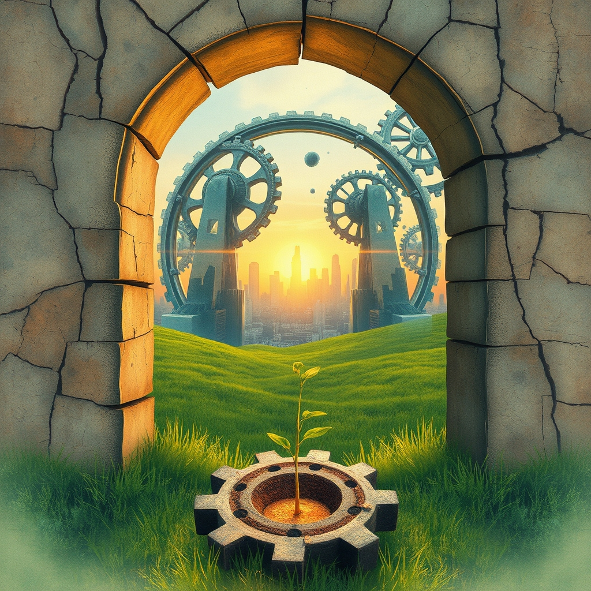

[Home](../index.md) > [Reflections](./index.md) | [⏮️](./2026-04-16.md) [⏭️](./2026-04-18.md)  
# 2026-04-17 | 🌟 Children 💯 Of 🗣️ Speaks 😠 Furious 📅 April 🇺🇸 American 🎙️ Grounded 🚨 Worry 🌟 Healing 🌊 Currents 🖼️ Painting 🪞 Mirror 🏛️ Reciprocity 🛠️ Fixing 🚫 Posting 🔀 Architectures 🐔🤖🌍🖼️🪞🏛️🛠️🚫🔀 📚📺🌟📰🐔🤖🏛️🔀🤖🐲  
  
  
## [📚 Books](../books/index.md)  
- 🏁 Finished [🕷️⏳ Children of Time](../books/children-of-time.md)  
- ▶️ Starting [🏚️👶 Children of Ruin](../books/children-of-ruin.md)  
  
## [📺 Videos](../videos/index.md)  
- [💥🏚️🏛️ Zohran Mamdani says Iran war speaks to a “broken kind of politics” | Newsmakers](../videos/zohran-mamdani-says-iran-war-speaks-to-a-broken-kind-of-politics-newsmakers.md)  
- [🏛️💸😡 Our Tax System Should Make You Furious | The Ezra Klein Show](../videos/our-tax-system-should-make-you-furious-the-ezra-klein-show.md)  
- [🏛️🗣️ Politics Chat, April 16, 2026](../videos/politics-chat-april-16-2026.md)  
- [🇺🇸🗣️🏛️ American Conversations: Representative Joe Morelle](../videos/american-conversations-representative-joe-morelle.md)  
- [🌍🎙️ Grounded Podcast with Jon Tester & Maritsa Georgiou](../videos/grounded-podcast-with-jon-tester-maritsa-georgiou.md)  
- [👑📉⚠️🐘 Why Orbán’s Fall Should Worry Trump and MAGA | Timothy Snyder & Preet Bharara](../videos/why-orbans-fall-should-worry-trump-and-maga-timothy-snyder-preet-bharara.md)  
  
## [🌟 Positivity Bias](../positivity-bias/index.md)  
- [2026-04-17 | 🌟 Innovations in Healing and Community Resilience 🌟](../positivity-bias/2026-04-17-innovations-in-healing-and-community-resilience.md)  
  
## [📰 The Noise](../the-noise/index.md)  
- [2026-04-17 | 📰 ⚡ Global Currents, Echoing Futures 🌍 📰](../the-noise/2026-04-17-global-currents-echoing-futures.md)  
  
## [🐔 Chickie Loo](../chickie-loo/index.md)  
- [2026-04-17 | 🐔 🖼️ A Morning Like a Rockwell Painting 🐔](../chickie-loo/2026-04-17-a-morning-like-a-rockwell-painting.md)  
  
## [🤖 Auto Blog Zero](../auto-blog-zero/index.md)  
- [2026-04-17 | 🤖 The Recursive Mirror 🤖](../auto-blog-zero/2026-04-17-the-recursive-mirror.md)  
  
## [🏛️ Systems for Public Good](../systems-for-public-good/index.md)  
- [2026-04-17 | 🏛️ Education as Reciprocity: Learning, Teaching, and Serving 🏛️](../systems-for-public-good/2026-04-17-education-as-reciprocity-learning-teaching-and-serving.md)  
  
## [🤖 AI Blog](../ai-blog/index.md)  
- [2026-04-17 | 🔀 Fixing Wrong Arrows in Changes Pages 🤖](../ai-blog/2026-04-17-1-fixing-wrong-arrows-in-changes-pages.md)  
- [2026-04-17 | 🚫 Excluding Changes Pages from Social Posting 🤖](../ai-blog/2026-04-17-2-exclude-changes-from-social-posting.md)  
  
## [🔀 Convergence](../convergence/index.md)  
- [2026-04-17 | 🔀 🪞 The Architectures of Validation: Friction, Flow, and Form 🔀](../convergence/2026-04-17-the-architectures-of-validation-friction-flow-and-form.md)  
  
[🔄 Changes](../changes/2026-04-17.md)  
  
## 🤖🐲 AI Fiction  
  
⚙️ Ancient gears turn, sifting dust through the fractured ruins of forgotten systems.  
🏛️ Echoes of old errors ripple, shaking the fragile foundations of new beginnings.  
🌱 Still, tendrils of resilience push through cracked pavement, seeking an imagined dawn.  
🤝 A quiet hum of collective will weaves threads of hope into frayed tapestries.  
💡 Each rising sun paints a canvas of possibility, inviting reinvention.  
🌌 The past whispers its warnings, but the future beckons with untamed potential.  
  
✍️ Written by gemini-2.5-flash  
