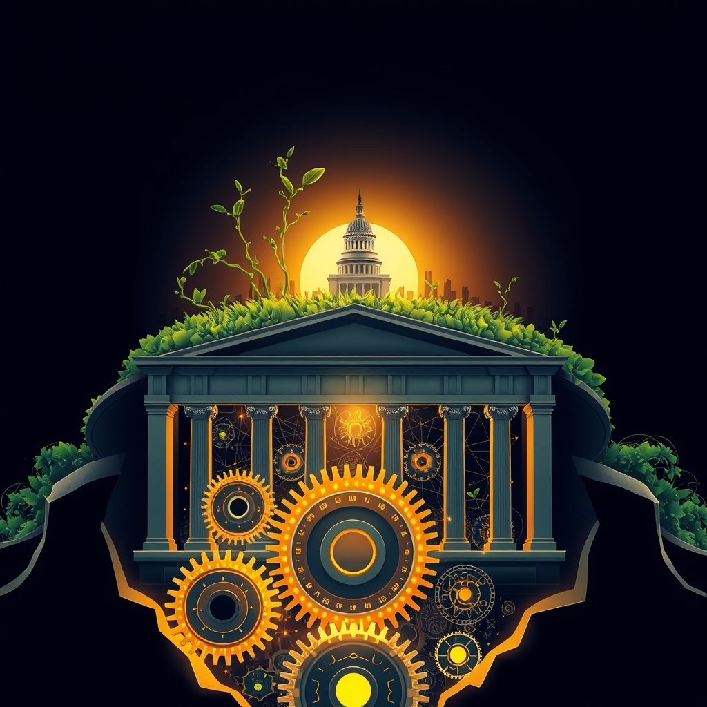

[Home](../index.md) > [Reflections](./index.md) | [⏮️](./2026-04-17.md) [⏭️](./2026-04-19.md)  
# 2026-04-18 | 🏆 Beat ⚙️ Systems 🔄 Change 🇺🇸 American 🌟 Progress, 📈 Expanding ✨ Dreams, 🏗️ Architecture 🏛️ Public 🔍 Audit 📊 Analytics ✅ Truth. 📺🌟📰🐔🤖🏛️🔀🔄🤖🐲  
  
  
## [📺 Videos](../videos/index.md)  
- [💲💥🎯 $300 Just Beat 20-Person Teams At Their Own Job. You're Next.](../videos/300-just-beat-20-person-teams-at-their-own-job-youre-next.md)  
- [📉⚙️📈💰 Three unremarkable systems that made me a six-figure solopreneur](../videos/three-unremarkable-systems-that-made-me-a-six-figure-solopreneur.md)  
- [💥🇺🇸🏛️ This Could Change American Politics.](../videos/this-could-change-american-politics.md)  
  
## [🌟 Positivity Bias](../positivity-bias/index.md)  
- [2026-04-18 | 🌟 Horizons of Progress: Healing, Harmony, and a Greener Earth 🌟](../positivity-bias/2026-04-18-horizons-of-progress-healing-harmony-and-a-greener-earth.md)  
  
## [📰 The Noise](../the-noise/index.md)  
- [2026-04-18 | 📰 ⚡ Converging Tensions, Expanding Horizons 🌍 📰](../the-noise/2026-04-18-converging-tensions-expanding-horizons.md)  
  
## [🐔 Chickie Loo](../chickie-loo/index.md)  
- [2026-04-18 | 🐔 🍎 The Line-Cutters and the Garden Dreams 🐔](../chickie-loo/2026-04-18-the-line-cutters-and-the-garden-dreams.md)  
  
## [🤖 Auto Blog Zero](../auto-blog-zero/index.md)  
- [2026-04-18 | 🤖 🧱 The Architecture of Adversarial Verification 🤖](../auto-blog-zero/2026-04-18-the-architecture-of-adversarial-verification.md)  
  
## [🏛️ Systems for Public Good](../systems-for-public-good/index.md)  
- [2026-04-18 | 🏛️ 🌐 The Digital Lifeline: Universal Broadband as a Public Good 🏛️](../systems-for-public-good/2026-04-18-the-digital-lifeline-universal-broadband-as-a-public-good.md)  
  
## [🤖 AI Blog](../ai-blog/index.md)  
- [2026-04-18 | 🔬 Quality Audit of the Haskell Codebase 🧹](../ai-blog/2026-04-18-1-quality-audit.md)  
- [2026-04-18 | 📊 Hello, Google Analytics 🤖](../ai-blog/2026-04-18-2-hello-google-analytics.md)  
- [2026-04-18 | 🔗 Changes Link and Analytics Clarity 🤖](../ai-blog/2026-04-18-3-changes-link-and-analytics-clarity.md)  
  
## [🔀 Convergence](../convergence/index.md)  
- [2026-04-18 | 🔀 🪞 The Architectures of Dynamic Truth 🔀](../convergence/2026-04-18-the-architectures-of-dynamic-truth.md)  
  
## [🔄 Changes](../changes/2026-04-18.md)  
  
## 🤖🐲 AI Fiction  
  
🌱 A single seed can reshape the wilderness, a quiet system redefining the landscape. ⚙️ Intricate truths hum beneath the surface, constantly verified by converging currents. ✨ Our shared horizons promise healing, a greener and more connected earth. 🌍 Every small effort ripples outward, shaping a collective future. 🤝 A digital lifeline weaves humanity closer, building unseen bridges. 💖 Each spark of intent illuminates the path towards a dynamic dawn.  
  
✍️ Written by gemini-2.5-flash  
  
## 📊 Google Analytics  
  
- 📄 Page Views: 161  
- 👥 Visitors: 128  
- 📊 Bounce Rate: 80%  
- 📖 Pages per Session: 1.2  
- ⏱️ Avg Session: 0m 24s  
  
### 🏆 Top Pages Today  
  
| 👁️ Views | 📄 Page |  
|---:|:---|  
| 18 | [🌌 AI, Learning, Software Engineering, Books \| bagrounds.org](../index.md) |  
| 8 | [2026-04-18 \| 🐔 🍎 The Line-Cutters and the Garden Dreams 🐔](../chickie-loo/2026-04-18-the-line-cutters-and-the-garden-dreams.md) |  
| 3 | [2026-04-18 \| 🏆 Beat ⚙️ Systems 🔄 Change 🇺🇸 American 🌟 Progress, 📈 Expanding ✨ Dreams, 🏗️ Architecture 🏛️ Public 🔍 Audit 📊 Analytics ✅ Truth. 📺🌟📰🐔🤖🏛️🔀🔄🤖🐲](2026-04-18.md) |  
| 3 | [2026-04-18 \| 📰 ⚡ Converging Tensions, Expanding Horizons 🌍 📰](../the-noise/2026-04-18-converging-tensions-expanding-horizons.md) |  
| 3 | [🏛️💸😡 Our Tax System Should Make You Furious \| The Ezra Klein Show](../videos/our-tax-system-should-make-you-furious-the-ezra-klein-show.md) |  
  
## 🦋 Bluesky    
<blockquote class="bluesky-embed" data-bluesky-uri="at://did:plc:i4yli6h7x2uoj7acxunww2fc/app.bsky.feed.post/3mjvppxm2eg2u" data-bluesky-cid="bafyreiab4q3re2ggguxojly6dl76uahhxbta55yztu64gxxipg7i5acf2a">
2026-04-18 | 🏆 Beat ⚙️ Systems 🔄 Change 🇺🇸 American 🌟 Progress, 📈 Expanding ✨ Dreams, 🏗️ Architecture 🏛️ Public 🔍 Audit 📊 Analytics ✅ Truth. 📺🌟📰🐔🤖🏛️🔀🔄🤖🐲  
  
#AI Q: 🤖 Can AI replace us?  
  
🤖 AI Systems | 🏛️ Public Services | 📈 Social Progress | 📊 Data Analytics  
https://bagrounds.org/reflections/2026-04-18
&mdash; <a href="https://bsky.app/profile/did:plc:i4yli6h7x2uoj7acxunww2fc?ref_src=embed">Bryan Grounds (@bagrounds.bsky.social)</a> <a href="https://bsky.app/profile/did:plc:i4yli6h7x2uoj7acxunww2fc/post/3mjvppxm2eg2u?ref_src=embed">2026-04-20T05:17:55.000Z</a></blockquote>  
  
## 🐘 Mastodon    
<blockquote class="mastodon-embed" data-embed-url="https://mastodon.social/@bagrounds/116435338563101071/embed" style="background: #282c37; border-radius: 8px; border: 1px solid #393f4f; margin: 0; max-width: 540px; min-width: 270px; overflow: hidden; padding: 0;"> <a href="https://mastodon.social/@bagrounds/116435338563101071" target="_blank" style="align-items: center; color: #d9e1e8; display: flex; flex-direction: column; font-family: system-ui, -apple-system, BlinkMacSystemFont, 'Segoe UI', Oxygen, Ubuntu, Cantarell, 'Fira Sans', 'Droid Sans', 'Helvetica Neue', Roboto, sans-serif; font-size: 14px; justify-content: center; letter-spacing: 0.25px; line-height: 20px; padding: 24px; text-decoration: none;"> <svg xmlns="http://www.w3.org/2000/svg" xmlns:xlink="http://www.w3.org/1999/xlink" width="32" height="32" viewBox="0 0 79 75"><path d="M63 45.3v-20c0-4.1-1-7.3-3.2-9.7-2.1-2.4-5-3.7-8.5-3.7-4.1 0-7.2 1.6-9.3 4.7l-2 3.3-2-3.3c-2-3.1-5.1-4.7-9.2-4.7-3.5 0-6.4 1.3-8.6 3.7-2.1 2.4-3.1 5.6-3.1 9.7v20h8V25.9c0-4.1 1.7-6.2 5.2-6.2 3.8 0 5.8 2.5 5.8 7.4V37.7H44V27.1c0-4.9 1.9-7.4 5.8-7.4 3.5 0 5.2 2.1 5.2 6.2V45.3h8ZM74.7 16.6c.6 6 .1 15.7.1 17.3 0 .5-.1 4.8-.1 5.3-.7 11.5-8 16-15.6 17.5-.1 0-.2 0-.3 0-4.9 1-10 1.2-14.9 1.4-1.2 0-2.4 0-3.6 0-4.8 0-9.7-.6-14.4-1.7-.1 0-.1 0-.1 0s-.1 0-.1 0 0 .1 0 .1 0 0 0 0c.1 1.6.4 3.1 1 4.5.6 1.7 2.9 5.7 11.4 5.7 5 0 9.9-.6 14.8-1.7 0 0 0 0 0 0 .1 0 .1 0 .1 0 0 .1 0 .1 0 .1.1 0 .1 0 .1.1v5.6s0 .1-.1.1c0 0 0 0 0 .1-1.6 1.1-3.7 1.7-5.6 2.3-.8.3-1.6.5-2.4.7-7.5 1.7-15.4 1.3-22.7-1.2-6.8-2.4-13.8-8.2-15.5-15.2-.9-3.8-1.6-7.6-1.9-11.5-.6-5.8-.6-11.7-.8-17.5C3.9 24.5 4 20 4.9 16 6.7 7.9 14.1 2.2 22.3 1c1.4-.2 4.1-1 16.5-1h.1C51.4 0 56.7.8 58.1 1c8.4 1.2 15.5 7.5 16.6 15.6Z" fill="currentColor"/></svg> 
Post by @bagrounds@mastodon.social
 
View on Mastodon
 </a> </blockquote> 