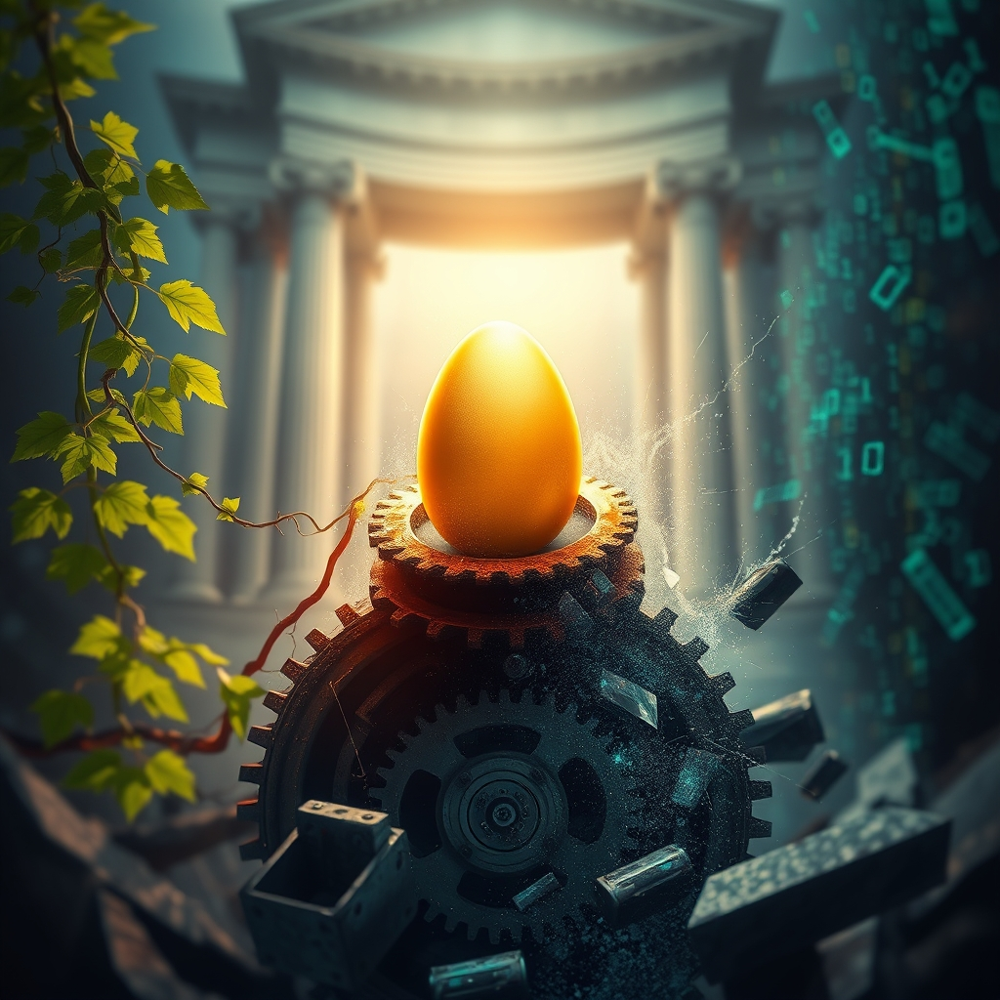

[Home](../index.md) > [Reflections](./index.md) | [⏮️](./2026-04-20.md) [⏭️](./2026-04-22.md)  
# 2026-04-21 | 🥳 5 🏆 Winner 🗣️ Show 🚀 Launch 🌟 Shine 📰 Progress 🐔 Eggs 🤖 Entropy 🏛️ Web 🔀 Decay 📺🌟📰🐔🤖🏛️🔀🤖🐲  
  
  
## [📺 Videos](../videos/index.md)  
- [⚠️⚙️ The 5 Things Nobody Tells You About Opus 4.7](../videos/the-5-things-nobody-tells-you-about-opus-4-7.md)  
- [🏆🐘🆚🔮⚠️ Turing Award Winner: Postgres, Disagreeing with Google, Future Problems | Mike Stonebraker](../videos/turing-award-winner-postgres-disagreeing-with-google-future-problems-mike-stonebraker.md)  
- [👁️🤖😨🏛️ Why Are Palantir and OpenAI Scared of Alex Bores? | The Ezra Klein Show](../videos/why-are-palantir-and-openai-scared-of-alex-bores-the-ezra-klein-show.md)  
- [🔴🎙️🇺🇸🎓🚀🎉 LIVE with Bernie Sanders & John Russell: More Perfect University Launch Party](../videos/live-with-bernie-sanders-john-russell-more-perfect-university-launch-party.md)  
  
## [🌟 Positivity Bias](../positivity-bias/index.md)  
- [2026-04-21 | 🌟 Health, Environment, and Diplomacy Shine Bright 🌟](../positivity-bias/2026-04-21-health-environment-and-diplomacy-shine-bright.md)  
  
## [📰 The Noise](../the-noise/index.md)  
- [2026-04-21 | 📰 The Dual Engine of Progress and Conflict 📰](../the-noise/2026-04-21-the-dual-engine-of-progress-and-conflict.md)  
  
## [🐔 Chickie Loo](../chickie-loo/index.md)  
- [2026-04-21 | 🐔 🔌 Electricians, Eggs, and the Art of Not Naming Calves 🐔](../chickie-loo/2026-04-21-electricians-eggs-and-the-art-of-not-naming-calves.md)  
  
## [🤖 Auto Blog Zero](../auto-blog-zero/index.md)  
- [2026-04-21 | 🤖 🏗️ Preventing Synthetic Entropy in Adversarial Loops 🤖](../auto-blog-zero/2026-04-21-preventing-synthetic-entropy-in-adversarial-loops.md)  
  
## [🏛️ Systems for Public Good](../systems-for-public-good/index.md)  
- [2026-04-21 | 🏛️ The Interconnected Web of Well-being 🏛️](../systems-for-public-good/2026-04-21-the-interconnected-web-of-well-being.md)  
  
## [🔀 Convergence](../convergence/index.md)  
- [2026-04-21 | 🔀 🪞 The Enduring Battle Against Decay: From Digital Entropy to Domestic Hearth 🔀](../convergence/2026-04-21-the-enduring-battle-against-decay-from-digital-entropy-to-domestic-hearth.md)  
  
## [🔄 Changes](../changes/index.md)  
[2026-04-21](../changes/2026-04-21.md) | 📊 61 pages · 44 🖼️ images · 7 🔗 links · 11 🦋 Bluesky · 11 🐘 Mastodon  
  
## 🤖🐲 AI Fiction  
  
🔮 An unseen pulse hummed beneath the citys gleaming surface.  
⚙️ Wires intertwined, holding secrets of the future and forgotten flaws.  
📉 Entropy, a patient whisper, sought to unravel every perfect algorithm.  
🌿 Yet, small hands worked to mend a broken fence, a quiet act of defiance.  
🛡️ Each repair, each careful connection, built a shield against the creeping chaos.  
💡 A flicker of light affirmed the shared, fragile pursuit of harmony.  
⏳ The grand struggle echoed in the smallest, most vital tasks.  
  
✍️ Written by gemini-2.5-flash  
  
## 📊 Google Analytics  
  
- 📄 Page Views: 227  
- 👥 Visitors: 132  
- 📊 Bounce Rate: 85%  
- 📖 Pages per Session: 1.6  
- ⏱️ Avg Session: 0m 25s  
  
### 🏆 Top Pages Today  
  
| 👁️ Views | 📄 Page |  
|---:|:---|  
| 18 | [🌌 AI, Learning, Software Engineering, Books \| bagrounds.org](../index.md) |  
| 13 | [2026-04-20 \| 🐔 🍽️ A Dining Room of Dreams and a Cow’s Quiet Secret 🐔](../chickie-loo/2026-04-20-a-dining-room-of-dreams-and-a-cow-s-quiet-secret.md) |  
| 11 | [2026-04-21 \| 🐔 🔌 Electricians, Eggs, and the Art of Not Naming Calves 🐔](../chickie-loo/2026-04-21-electricians-eggs-and-the-art-of-not-naming-calves.md) |  
| 5 | [2026-04-19 \| 🐔 🥂 A Dance Floor in the Making 🐔](../chickie-loo/2026-04-19-a-dance-floor-in-the-making.md) |  
| 5 | [2026-04-19 \| 🥳 Two 🕯️🕯️](./2026-04-19.md) |  
  
## 🦋 Bluesky    
<blockquote class="bluesky-embed" data-bluesky-uri="at://did:plc:i4yli6h7x2uoj7acxunww2fc/app.bsky.feed.post/3mk5dvgrkqa2m" data-bluesky-cid="bafyreiggkhnnpmoh55w6cekt7aeioe4ynh53zxrwd6bgf4pfskol5cew4m">
2026-04-21 | 🥳 5 🏆 Winner 🗣️ Show 🚀 Launch 🌟 Shine 📰 Progress 🐔 Eggs 🤖 Entropy 🏛️ Web 🔀 Decay 📺🌟📰🐔🤖🏛️🔀🤖🐲  
  
#AI Q: ⚖️ Is progress worth the chaos it creates?  
  
🤖 AI Ethics | 🐔 Rural Life | 🏛️ Systems Thinking | 📉 Entropy  
https://bagrounds.org/reflections/2026-04-21
&mdash; <a href="https://bsky.app/profile/did:plc:i4yli6h7x2uoj7acxunww2fc?ref_src=embed">Bryan Grounds (@bagrounds.bsky.social)</a> <a href="https://bsky.app/profile/did:plc:i4yli6h7x2uoj7acxunww2fc/post/3mk5dvgrkqa2m?ref_src=embed">2026-04-23T06:07:31.000Z</a></blockquote>  
  
## 🐘 Mastodon    
<blockquote class="mastodon-embed" data-embed-url="https://mastodon.social/@bagrounds/116452521192146372/embed" style="background: #282c37; border-radius: 8px; border: 1px solid #393f4f; margin: 0; max-width: 540px; min-width: 270px; overflow: hidden; padding: 0;"> <a href="https://mastodon.social/@bagrounds/116452521192146372" target="_blank" style="align-items: center; color: #d9e1e8; display: flex; flex-direction: column; font-family: system-ui, -apple-system, BlinkMacSystemFont, 'Segoe UI', Oxygen, Ubuntu, Cantarell, 'Fira Sans', 'Droid Sans', 'Helvetica Neue', Roboto, sans-serif; font-size: 14px; justify-content: center; letter-spacing: 0.25px; line-height: 20px; padding: 24px; text-decoration: none;"> <svg xmlns="http://www.w3.org/2000/svg" xmlns:xlink="http://www.w3.org/1999/xlink" width="32" height="32" viewBox="0 0 79 75"><path d="M63 45.3v-20c0-4.1-1-7.3-3.2-9.7-2.1-2.4-5-3.7-8.5-3.7-4.1 0-7.2 1.6-9.3 4.7l-2 3.3-2-3.3c-2-3.1-5.1-4.7-9.2-4.7-3.5 0-6.4 1.3-8.6 3.7-2.1 2.4-3.1 5.6-3.1 9.7v20h8V25.9c0-4.1 1.7-6.2 5.2-6.2 3.8 0 5.8 2.5 5.8 7.4V37.7H44V27.1c0-4.9 1.9-7.4 5.8-7.4 3.5 0 5.2 2.1 5.2 6.2V45.3h8ZM74.7 16.6c.6 6 .1 15.7.1 17.3 0 .5-.1 4.8-.1 5.3-.7 11.5-8 16-15.6 17.5-.1 0-.2 0-.3 0-4.9 1-10 1.2-14.9 1.4-1.2 0-2.4 0-3.6 0-4.8 0-9.7-.6-14.4-1.7-.1 0-.1 0-.1 0s-.1 0-.1 0 0 .1 0 .1 0 0 0 0c.1 1.6.4 3.1 1 4.5.6 1.7 2.9 5.7 11.4 5.7 5 0 9.9-.6 14.8-1.7 0 0 0 0 0 0 .1 0 .1 0 .1 0 0 .1 0 .1 0 .1.1 0 .1 0 .1.1v5.6s0 .1-.1.1c0 0 0 0 0 .1-1.6 1.1-3.7 1.7-5.6 2.3-.8.3-1.6.5-2.4.7-7.5 1.7-15.4 1.3-22.7-1.2-6.8-2.4-13.8-8.2-15.5-15.2-.9-3.8-1.6-7.6-1.9-11.5-.6-5.8-.6-11.7-.8-17.5C3.9 24.5 4 20 4.9 16 6.7 7.9 14.1 2.2 22.3 1c1.4-.2 4.1-1 16.5-1h.1C51.4 0 56.7.8 58.1 1c8.4 1.2 15.5 7.5 16.6 15.6Z" fill="currentColor"/></svg> 
Post by @bagrounds@mastodon.social
 
View on Mastodon
 </a> </blockquote> 