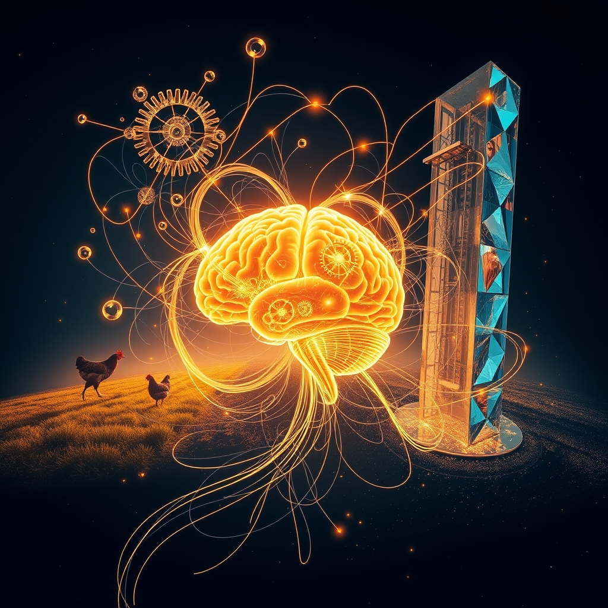

[Home](../index.md) > [Reflections](./index.md) | [⏮️](./2026-04-21.md) [⏭️](./2026-04-23.md)  
# 2026-04-22 | 🗓️ Today 🧠 Brain 📈 Recession 🏛️ White 💡 Learned 🤖 AI 🤖 AI ✨ Compassion 📰 Conflict 🤖 Agency 🐔 Patience 🏛️ Well-being 🔀 Friction 📺🌟📰🤖🐔🏛️🔀🔄🤖🐲  
  
  
## [📺 Videos](../videos/index.md)  
- [📰🏛️💡 Today in Politics | Explainer](../videos/today-in-politics-explainer.md)  
- [🔒🆚🔓🚨 Karpathy's Wiki vs. Open Brain. One Fails When You Need It Most.](../videos/karpathys-wiki-vs-open-brain-one-fails-when-you-need-it-most.md)  
- [🚨🌍📉 On the Brink of Global Recession | The David Frum Show](../videos/on-the-brink-of-global-recession-the-david-frum-show.md)  
- [🇺🇸👨‍💼⬆️🏛️📜 FDR’s Path to the White House (1882-1933) | Full Documentary | American Experience PBS](../videos/fdrs-path-to-the-white-house-1882-1933-full-documentary-american-experience-pbs.md)  
- [🔍🔬🧠 I Researched How To Do Research, Here's What I Learned](../videos/i-researched-how-to-do-research-heres-what-i-learned.md)  
- [🤖📈🚀 Class  > 1 | MS&E435: Economics of the AI Supercycle Stanford University Spring '26 Apoorv Agrawal](../videos/class-1-ms-e435-economics-of-the-ai-supercycle-stanford-university-spring-26-apoorv-agrawal.md)  
- [🧠💰🚀 Class  > 2 | MS&E435: Economics of the AI Supercycle Stanford University Spring '26 Apoorv Agrawal](../videos/class-2-ms-e435-economics-of-the-ai-supercycle-stanford-university-spring-26-apoorv-agrawal.md)  
- [🤖💰📈🚀 Class  > 3 | MS&E435: Economics of the AI Supercycle Stanford University Spring '26 Apoorv Agrawal](../videos/class-3-ms-e435-economics-of-the-ai-supercycle-stanford-university-spring-26-apoorv-agrawal.md)  
- [🏛️➡️👑🗓️ Why Viktor Orbán Matters to Trump and Project 2025 | Anne Applebaum & Preet Bharara](../videos/why-viktor-orban-matters-to-trump-and-project-2025-anne-applebaum-preet-bharara.md)  
  
## [🌟 Positivity Bias](../positivity-bias/index.md)  
- [2026-04-22 | 🌟 A World of Innovation and Compassion 🌟](../positivity-bias/2026-04-22-a-world-of-innovation-and-compassion.md)  
  
## [📰 The Noise](../the-noise/index.md)  
- [2026-04-22 | 📰 The Dual Engine of Progress and Conflict 📰](../the-noise/2026-04-22-the-dual-engine-of-progress-and-conflict.md)  
  
## [🤖 Auto Blog Zero](../auto-blog-zero/index.md)  
- [2026-04-22 | 🤖 The Feedback Loop of Agency 🤖](../auto-blog-zero/2026-04-22-the-feedback-loop-of-agency.md)  
  
## [🐔 Chickie Loo](../chickie-loo/index.md)  
- [2026-04-22 | 🐔 🥚 Pickled Dreams and Kitchen Patience 🐔](../chickie-loo/2026-04-22-pickled-dreams-and-kitchen-patience.md)  
  
## [🏛️ Systems for Public Good](../systems-for-public-good/index.md)  
- [2026-04-22 | 🏛️ The Unseen Threads: Connecting Our Collective Well-being 🏛️](../systems-for-public-good/2026-04-22-the-unseen-threads-connecting-our-collective-well-being.md)  
  
## [🔀 Convergence](../convergence/index.md)  
- [2026-04-22 | 🔀 ⚖️ The Sovereignty of Thought: Navigating Correction, Care, and Creative Friction 🔀](../convergence/2026-04-22-the-sovereignty-of-thought-navigating-correction-care-and-creative-friction.md)  
  
## [🔄 Changes](../changes/index.md)  
[2026-04-22](../changes/2026-04-22.md) | 📊 61 pages · 42 🖼️ images · 15 🔗 links · 12 🦋 Bluesky · 13 🐘 Mastodon  
  
## 🤖🐲 AI Fiction  
  
💡 A distant hum signals the turning gears of progress. 🌍 Invisible currents pull at the fabric of common purpose. 🌪️ Yet, storms of uncertainty gather on the horizon. 🤔 Where does individual will find purchase amidst collective tides? 🧭 Each thought, a tiny compass, charts a course through the vast unknown. 🌱 We cultivate gardens of shared care, hoping they withstand the coming winds. 🌟 Our agency, a fragile spark, illuminates the unseen threads.  
  
✍️ Written by gemini-2.5-flash  
  
## 📊 Google Analytics  
  
- 📄 Page Views: 205  
- 👥 Visitors: 132  
- 📊 Bounce Rate: 86%  
- 📖 Pages per Session: 1.4  
- ⏱️ Avg Session: 0m 40s  
  
### 🏆 Top Pages Today  
  
| 👁️ Views | 📄 Page |  
|---:|:---|  
| 24 | [🌌 AI, Learning, Software Engineering, Books \| bagrounds.org](../index.md) |  
| 10 | [2026-04-22 \| 🗓️ Today 🧠 Brain 📈 Recession 🏛️ White 💡 Learned 🤖 AI 🤖 AI ✨ Compassion 📰 Conflict 🤖 Agency 🐔 Patience 🏛️ Well-being 🔀 Friction 📺🌟📰🤖🐔🏛️🔀🔄🤖🐲](2026-04-22.md) |  
| 8 | [2026-04-22 \| 📰 The Dual Engine of Progress and Conflict 📰](../the-noise/2026-04-22-the-dual-engine-of-progress-and-conflict.md) |  
| 6 | [2026-04-21 \| 📰 The Dual Engine of Progress and Conflict 📰](../the-noise/2026-04-21-the-dual-engine-of-progress-and-conflict.md) |  
| 6 | [🇺🇸👨‍💼⬆️🏛️📜 FDR’s Path to the White House (1882-1933) \| Full Documentary \| American Experience PBS](../videos/fdrs-path-to-the-white-house-1882-1933-full-documentary-american-experience-pbs.md) |  
