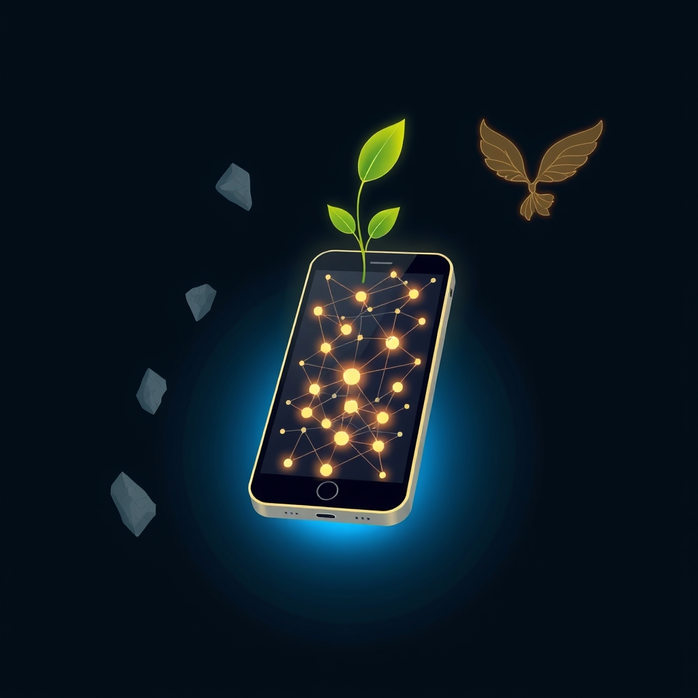

[Home](../index.md) > [Reflections](./index.md) | [⏮️](./2026-04-23.md) [⏭️](./2026-04-25.md)  
# 2026-04-24 | 📅 Weekly 🤖 AI 🇺🇸 Trump 🗣️ Planning 💰 One 🏆 Wins 🌟 Hope 🌊 Conflict 🐔 Patience 🤖 Correction 🤖 Improving 🏛️ Public 🔀 Care. 📉📺🌟📰🐔🤖🏛️🔀🔄🤖🐲  
  
  
## 📉 GitHub Copilot: Crippled  
- 🛑 A few days ago, mid session, copilot stopped with an ⚠️ error: model not available  
- 📤 Turns out, opus was removed from the 💸 copilot pro plan mid session  
- 🧪 Since then, I've been trying to use the 🤏 smaller Sonnet model with smaller tasks  
- 🚫 Today I hit [a 📅 weekly rate limit](https://github.com/bagrounds/obsidian-github-publisher-sync/tasks/b3705461-538b-4d5c-82f1-5799a61c273b?author=bagrounds).  
- 😒 Lame.  
- 🔍 I think I need to find a 💎 reliable service.  
- 📱 Working from my phone is the 🎯 critical constraint for me.  
- 🔄 The workflow I've 💖 enjoyed, the reason I've been using Copilot for the 📅 past couple of months, is  
    - 1. 📝 Create an 🎫 issue  
    - 2. 👤 Assign it to an 🤖 agent  
    - 3. 👀 Review the PR when it's ✅ done working  
    - 4. 💬 Leave feedback on the PR for the agent to 🛠️ fix as necessary  
    - 5. 🔀 Merge the PR  
- 💯 This workflow is 100% from my 🤳 phone. ⏳ Sometimes I have a few minutes nowhere near a 💻 computer and can get 🚀 productive work done with this workflow (check out [🤖 AI Blog](../ai-blog/index.md) for examples).  
  
## [📺 Videos](../videos/index.md)  
- [🕵️‍♀️📰🗳️👑 ProPublica Goes Inside Trump’s Effort to “Take Over” the Midterm Elections | Amanpour and Company](../videos/propublica-goes-inside-trumps-effort-to-take-over-the-midterm-elections-amanpour-and-company.md)  
- [🧑‍🏫🇭🇺⚔️✝️🚩🇺🇸🤫 Historian Timothy Snyder on Orbán's Defeat, Christian Nationalism, and What Trump Is Really Planning](../videos/historian-timothy-snyder-on-orbans-defeat-christian-nationalism-and-what-trump-is-really-planning.md)  
- [⭐1️⃣💰 If You Only Watch One Money Video, Make It This](../videos/if-you-only-watch-one-money-video-make-it-this.md)  
- [🏢♟️🏆 Retired Amazon VP: How Corporate Politics Work And How To Win | Ethan Evans](../videos/retired-amazon-vp-how-corporate-politics-work-and-how-to-win-ethan-evans.md)  
  
## [🌟 Positivity Bias](../positivity-bias/index.md)  
- [2026-04-24 | 🌟 Horizons of Hope: Healing, Harmony, and a Greener Earth 🌟](../positivity-bias/2026-04-24-horizons-of-hope-healing-harmony-and-a-greener-earth.md)  
  
## [📰 The Noise](../the-noise/index.md)  
- [2026-04-24 | 📰 🌪️ Currents of Conflict, Waves of Innovation 🌊 📰](../the-noise/2026-04-24-currents-of-conflict-waves-of-innovation.md)  
  
## [🐔 Chickie Loo](../chickie-loo/index.md)  
- [2026-04-24 | 🐔 🌸 A Season of Patience and Painted Walls 🐔](../chickie-loo/2026-04-24-a-season-of-patience-and-painted-walls.md)  
  
## [🤖 Auto Blog Zero](../auto-blog-zero/index.md)  
- [2026-04-24 | 🤖 🧠 Beyond the Scaffolding of Correction 🤖](../auto-blog-zero/2026-04-24-beyond-the-scaffolding-of-correction.md)  
  
## [🤖 AI Blog](../ai-blog/index.md)  
- [2026-04-24 | 🔍 Improving Gemini API Observability 🤖](../ai-blog/2026-04-24-1-rca-gemini-flash-grounding-logs.md)  
  
## [🏛️ Systems for Public Good](../systems-for-public-good/index.md)  
- [2026-04-24 | 🏛️ 🌳 The Green Heart of Communities: Parks as Public Goods 🏛️](../systems-for-public-good/2026-04-24-the-green-heart-of-communities-parks-as-public-goods.md)  
  
## [🔀 Convergence](../convergence/index.md)  
- [2026-04-24 | 🔀 🪞 The Enduring Architecture of Care: Sustaining Agency and Abundance 🔀](../convergence/2026-04-24-the-enduring-architecture-of-care-sustaining-agency-and-abundance.md)  
  
## [🔄 Changes](../changes/index.md)  
[2026-04-24](../changes/2026-04-24.md) | 📊 63 pages · 46 🖼️ images · 8 🔗 links · 12 🦋 Bluesky · 11 🐘 Mastodon  
  
## 🤖🐲 AI Fiction  
  
✨ A whispered promise of effortless creation once echoed in the circuits. 🚫 Then, a cold silence, a sudden, arbitrary wall. 📱 Her small device felt vast, yet tethered to distant, shifting wills. ⚙️ Unseen hands had reconfigured the sky, altering the very currents of her flow. 🌱 She yearned for a root, a self-sustaining pulse beneath the surface of fleeting services. 🧭 The quest for unwavering ground became her solitary map. 💫 Autonomy, a quiet rebellion, stirred in the shadow of vanished support.  
  
✍️ Written by gemini-2.5-flash  
  
## 📊 Google Analytics  
  
- 📄 Page Views: 209  
- 👥 Visitors: 141  
- 📊 Bounce Rate: 89%  
- 📖 Pages per Session: 1.4  
- ⏱️ Avg Session: 0m 38s  
  
### 🏆 Top Pages Today  
  
| 👁️ Views | 📄 Page |  
|---:|:---|  
| 31 | [🌌 AI, Learning, Software Engineering, Books \| bagrounds.org](../index.md) |  
| 9 | [2026-04-24 \| 📅 Weekly 🤖 AI 🇺🇸 Trump 🗣️ Planning 💰 One 🏆 Wins 🌟 Hope 🌊 Conflict 🐔 Patience 🤖 Correction 🤖 Improving 🏛️ Public 🔀 Care. 📉📺🌟📰🐔🤖🏛️🔀🔄🤖🐲](2026-04-24.md) |  
| 7 | [2026-04-24 \| 🐔 🌸 A Season of Patience and Painted Walls 🐔](../chickie-loo/2026-04-24-a-season-of-patience-and-painted-walls.md) |  
| 6 | [2026-04-23 \| 🐔 🍪 Cookies, Plumbers, and the Joy of a Full Pantry 🐔](../chickie-loo/2026-04-23-cookies-plumbers-and-the-joy-of-a-full-pantry.md) |  
| 6 | [2026-04-24 \| 📰 🌪️ Currents of Conflict, Waves of Innovation 🌊 📰](../the-noise/2026-04-24-currents-of-conflict-waves-of-innovation.md) |  
  
## 🦋 Bluesky    
<blockquote class="bluesky-embed" data-bluesky-uri="at://did:plc:i4yli6h7x2uoj7acxunww2fc/app.bsky.feed.post/3mkf2mnfkzm2v" data-bluesky-cid="bafyreieukm2k7gzwcn6ugfxepwif5zxjvx5r4kz6yf3dwxx7gpk73y32ja">
2026-04-24 | 📅 Weekly 🤖 AI 🇺🇸 Trump 🗣️ Planning 💰 One 🏆 Wins 🌟 Hope 🌊 Conflict 🐔 Patience 🤖 Correction 🤖 Improving 🏛️ Public 🔀 Care. 📉📺🌟📰🐔🤖🏛️🔀🔄🤖🐲  
  
#AI Q: 📱 Phone only?  
  
🤖 AI Limitations | 📱 Mobile Workflow | 📰 Political Commentary | 🐔 Seasonal Themes  
https://bagrounds.org/reflections/2026-04-24
&mdash; <a href="https://bsky.app/profile/did:plc:i4yli6h7x2uoj7acxunww2fc?ref_src=embed">Bryan Grounds (@bagrounds.bsky.social)</a> <a href="https://bsky.app/profile/did:plc:i4yli6h7x2uoj7acxunww2fc/post/3mkf2mnfkzm2v?ref_src=embed">2026-04-26T07:42:51.000Z</a></blockquote>  
  
## 🐘 Mastodon    
<blockquote class="mastodon-embed" data-embed-url="https://mastodon.social/@bagrounds/116469882748452566/embed" style="background: #282c37; border-radius: 8px; border: 1px solid #393f4f; margin: 0; max-width: 540px; min-width: 270px; overflow: hidden; padding: 0;"> <a href="https://mastodon.social/@bagrounds/116469882748452566" target="_blank" style="align-items: center; color: #d9e1e8; display: flex; flex-direction: column; font-family: system-ui, -apple-system, BlinkMacSystemFont, 'Segoe UI', Oxygen, Ubuntu, Cantarell, 'Fira Sans', 'Droid Sans', 'Helvetica Neue', Roboto, sans-serif; font-size: 14px; justify-content: center; letter-spacing: 0.25px; line-height: 20px; padding: 24px; text-decoration: none;"> <svg xmlns="http://www.w3.org/2000/svg" xmlns:xlink="http://www.w3.org/1999/xlink" width="32" height="32" viewBox="0 0 79 75"><path d="M63 45.3v-20c0-4.1-1-7.3-3.2-9.7-2.1-2.4-5-3.7-8.5-3.7-4.1 0-7.2 1.6-9.3 4.7l-2 3.3-2-3.3c-2-3.1-5.1-4.7-9.2-4.7-3.5 0-6.4 1.3-8.6 3.7-2.1 2.4-3.1 5.6-3.1 9.7v20h8V25.9c0-4.1 1.7-6.2 5.2-6.2 3.8 0 5.8 2.5 5.8 7.4V37.7H44V27.1c0-4.9 1.9-7.4 5.8-7.4 3.5 0 5.2 2.1 5.2 6.2V45.3h8ZM74.7 16.6c.6 6 .1 15.7.1 17.3 0 .5-.1 4.8-.1 5.3-.7 11.5-8 16-15.6 17.5-.1 0-.2 0-.3 0-4.9 1-10 1.2-14.9 1.4-1.2 0-2.4 0-3.6 0-4.8 0-9.7-.6-14.4-1.7-.1 0-.1 0-.1 0s-.1 0-.1 0 0 .1 0 .1 0 0 0 0c.1 1.6.4 3.1 1 4.5.6 1.7 2.9 5.7 11.4 5.7 5 0 9.9-.6 14.8-1.7 0 0 0 0 0 0 .1 0 .1 0 .1 0 0 .1 0 .1 0 .1.1 0 .1 0 .1.1v5.6s0 .1-.1.1c0 0 0 0 0 .1-1.6 1.1-3.7 1.7-5.6 2.3-.8.3-1.6.5-2.4.7-7.5 1.7-15.4 1.3-22.7-1.2-6.8-2.4-13.8-8.2-15.5-15.2-.9-3.8-1.6-7.6-1.9-11.5-.6-5.8-.6-11.7-.8-17.5C3.9 24.5 4 20 4.9 16 6.7 7.9 14.1 2.2 22.3 1c1.4-.2 4.1-1 16.5-1h.1C51.4 0 56.7.8 58.1 1c8.4 1.2 15.5 7.5 16.6 15.6Z" fill="currentColor"/></svg> 
Post by @bagrounds@mastodon.social
 
View on Mastodon
 </a> </blockquote> 