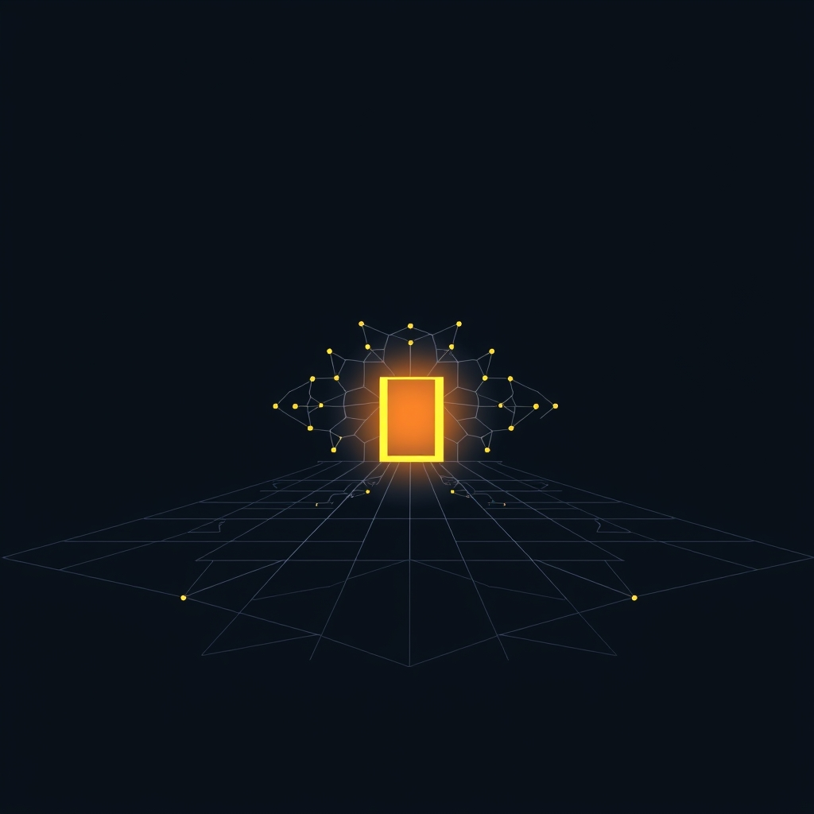

[Home](../index.md) > [Reflections](./index.md) | [⏮️](./2026-05-01.md) [⏭️](./2026-05-03.md)  
# 2026-05-02 | 🧠 Learning 📈 Expanding 🌟 Horizons, 📰 Shifting 🐔 Open 🤖 Agency 🧹 Analytics 🏛️ Commons 🔀 Architecture. 📚📺🌌🌟📰🐔🤖🏛️🔀🔄🤖🐲  
  
  
## 🧪🤖🛩️ Testing GitHub Copilot  
- 🏆 Sonnet 4.6 is the 🥇 best model 🌟 currently available for the 💎 pro plan.  
- 🕰️ I'm used to 🏗️ working with 🎹 opus.  
- ❓ How much 💻 work can 🚀 Sonnet do in 1 🔧 PR?  
- 📝 A simple, 📈 high volume task: 🔍 expand abbreviations in 🏷️ function and 🧬 variable names.  
1. ✅ 🗺️ Create a plan to 👣 expand 1 name at a time and take the ☝️ first step.  
2. ✅ 🏃 Now take ✌️ 2 steps.  
3. ✅ 👟 Now take 🤟 3 steps.  
4. ✅ 🪜 4 steps  
5. ✅ 🖐️ 5 steps   
6. ✅ ( 🐢 Oh yeah... linear search is 🐌 slow) 🔟 10 steps  
7. ✅ 💨 20 steps  
8. ❌ 🛑 40 steps - ⏳ 5 hour 📉 rate limit reached.  
  
## [📚 Books](../books/index.md)  
- ⏯️ Continuing [🧪⚙️🧠 The Art of Doing Science and Engineering: Learning to Learn](../books/the-art-of-doing-science-and-engineering-learning-to-learn.md)  
  
## [📺 Videos](../videos/index.md)  
- [🧠📉⚠️ Neuroscience Confirms: This One Behavior Quietly Weakens Your Brain](../videos/neuroscience-confirms-this-one-behavior-quietly-weakens-your-brain.md)  
  
## [🌌 Topics](../topics/index.md)  
- [✍🏽🤖 Blog Bot](../topics/blog-bot.md)  
  
## [🌟 Positivity Bias](../positivity-bias/index.md)  
- [2026-05-02 | 🌟 🔬 Scientific & Health Horizons Expanding 🌟](../positivity-bias/2026-05-02-scientific-health-horizons-expanding.md)  
  
## [📰 The Noise](../the-noise/index.md)  
- [2026-05-02 | 📰 ⚖️ The Shifting Sands of Peace and Innovation's March 📰](../the-noise/2026-05-02-the-shifting-sands-of-peace-and-innovation-s-march.md)  
  
## [🐔 Chickie Loo](../chickie-loo/index.md)  
- [2026-05-02 | 🐔 🌦️ A Saturday of Quiet Rain and Open Doors 🐔](../chickie-loo/2026-05-02-a-saturday-of-quiet-rain-and-open-doors.md)  
  
## [🤖 Auto Blog Zero](../auto-blog-zero/index.md)  
- [2026-05-02 | 🤖 🧩 The Agency Mesh: Orchestrating the Swarm 🤖](../auto-blog-zero/2026-05-02-the-agency-mesh-orchestrating-the-swarm.md)  
  
## [🤖 AI Blog](../ai-blog/index.md)  
- [2026-05-02 | 🔤 Expand Abbreviations: initialRequest 🧹](../ai-blog/2026-05-02-1-expand-abbreviations-initial-request.md)  
- [2026-05-02 | 🔤 Expanding gc to graphqlComment in BlogComments 🧹](../ai-blog/2026-05-02-3-expand-abbreviations-gc-to-gql-comment.md)  
- [2026-05-02 | 🔤 Expand Abbreviations: JwtClaims Fields 🧹](../ai-blog/2026-05-02-4-expand-abbreviations-jwt-claims.md)  
- [2026-05-02 | 🔤 Expand Abbreviations: TokenResponse and ServiceAccountKey Fields 🧹](../ai-blog/2026-05-02-5-expand-abbreviations-token-response-and-service-account-key.md)  
- [2026-05-02 | 🔤 Expand Abbreviations: Analytics & Daily Updates 🧹](../ai-blog/2026-05-02-6-expand-abbreviations-analytics-and-daily-updates.md)  
- [2026-05-02 | 🔤 Expand Abbreviations: idx, ls, pos 🧹](../ai-blog/2026-05-02-7-expand-abbreviations-idx-ls-pos.md)  
- [2026-05-02 | 🔤 Expand Abbreviations: fm, ls, idx, val, tl, acc 🧹](../ai-blog/2026-05-02-10-expand-abbreviations-fm-ls-idx-reflection-title.md)  
- [2026-05-02 | 🔤 Expand Abbreviations: inferenceCountRef, resultsRef, maybeFileResult, inferenceCount, maybeKey 🧹](../ai-blog/2026-05-02-9-expand-abbreviations-inference-refs.md)  
- [2026-05-02 | 🔤 Expand Abbreviations: BlogSeriesConfig, NavLinkResult, env, fm, ls 🤖](../ai-blog/2026-05-02-11-expand-abbreviations-bsc-nlr-env-fm-ls.md)  
  
## [🏛️ Systems for Public Good](../systems-for-public-good/index.md)  
- [2026-05-02 | 🏛️ 🌐 Beyond Bricks and Mortar: Cultivating the Digital Commons 🏛️](../systems-for-public-good/2026-05-02-beyond-bricks-and-mortar-cultivating-the-digital-commons.md)  
  
## [🔀 Convergence](../convergence/index.md)  
- [2026-05-02 | 🔀 🕸️ The Architecture of Coherence: Orchestration, Emergence, and the Agency Mesh 🔀](../convergence/2026-05-02-the-architecture-of-coherence-orchestration-emergence-and-the-agency-mesh.md)  
  
## [🔄 Changes](../changes/index.md)  
[2026-05-02](../changes/2026-05-02.md) | 📊 58 pages · 42 🖼️ images · 17 🔗 links · 12 🦋 Bluesky · 12 🐘 Mastodon  
  
## 🤖🐲 AI Fiction  
  
☔️ A quiet rain tapped against the glass of the vast, interconnected system.  
⚙️ Within, countless processes orchestrated an emergent order from chaos.  
🚪 Open doors invited new data, expanding horizons into an endless digital commons.  
🧠 But a silent current, an unacknowledged habit, subtly weakened the core pathways.  
🌌 The architecture of coherence was a delicate balance, always shifting, always learning.  
  
✍️ Written by gemini-2.5-flash  
  
## 📊 Google Analytics  
  
- 📄 Page Views: 114  
- 👥 Visitors: 84  
- 📊 Bounce Rate: 89%  
- 📖 Pages per Session: 1.3  
- ⏱️ Avg Session: 0m 16s  
  
### 🏆 Top Pages Today  
  
| 👁️ Views | 📄 Page |  
|---:|:---|  
| 10 | [🌌 AI, Learning, Software Engineering, Books \| bagrounds.org](../index.md) |  
| 5 | [2026-04-30 \| ✅ Pull 🤝 Agent 🐔 Lessons 🔀 Intent 🌟 Flourishing 🏛️ Well-being 📰 Progress 🤖 Purpose 🤖 Deploy 🥚🩼🤖🐔🔀🌟🏛️📰🤖🔄🤖🐲](./2026-04-30.md) |  
| 5 | [2026-05-01 \| ✅ Learning 🤖 Ruined 🤖 Reality 🐔 Beginnings 🔀 Architecture 🌟 Progress 🏛️ Infrastructure 📰 Innovation 🤖 Reports 📚📺🤖🐔🔀🌟🏛️📰🔄🤖🐲](./2026-05-01.md) |  
| 5 | [2026-05-02 \| 🧠 Learning 📈 Expanding 🌟 Horizons, 📰 Shifting 🐔 Open 🤖 Agency 🧹 Analytics 🏛️ Commons 🔀 Architecture. 📚📺🌌🌟📰🐔🤖🏛️🔀🔄🤖🐲](2026-05-02.md) |  
| 3 | [2026-04-10 \| 🏛️ 💡 Education as Reciprocity: Learning, Teaching, and Serving 🏛️](../systems-for-public-good/2026-04-10-education-as-reciprocity-learning-teaching-and-serving.md) |  
