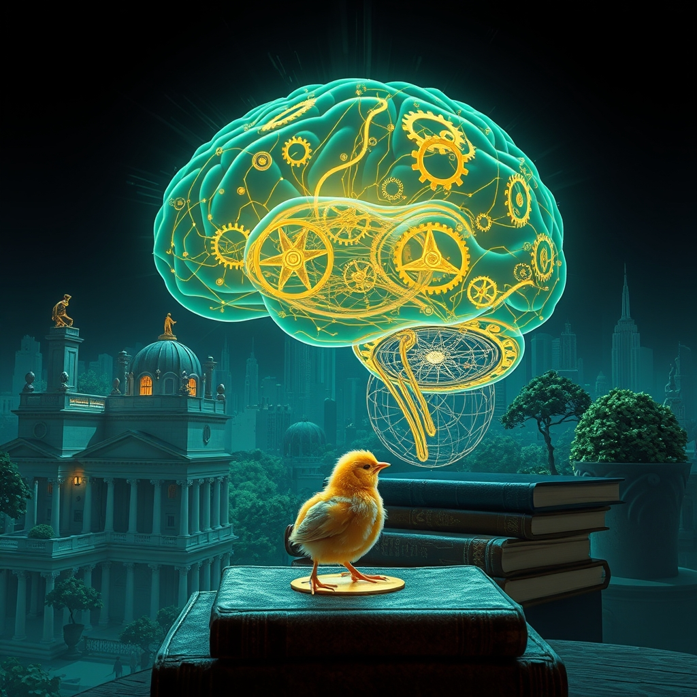

[Home](../index.md) > [Reflections](./index.md) | [⏮️](./2026-05-10.md) [⏭️](./2026-05-12.md)  
# 2026-05-11 | 🌟 World 📰 Ripples 🔍 Fails, 🤖 Conscience 🏛️ Citizen 🐔 Magic 🤖 Removing 🤖 Paying 🔀 Systems ⚙️ Meter. 🧰📚🌟📰🤖🐔🏛️🔀🔄🤖🐲  
  
  
## [🧰 Tools](../tools/index.md)  
- [🎙️ Word Meter](../tools/word-meter.md)  
  
## [📚 Books](../books/index.md)  
- ⏯️ Continuing Thirty Million Words: Building a Child's Brain  
    - 👂 Tune In  
    - 🗣️ Talk More  
    - 🔄 Take Turns  
  
## [🌟 Positivity Bias](../positivity-bias/index.md)  
- [2026-05-11 | 🌟 A World Ignited: Innovation, Compassion, and Green Horizons 🌟](../positivity-bias/2026-05-11-a-world-ignited-innovation-compassion-and-green-horizons.md)  
  
## [📰 The Noise](../the-noise/index.md)  
- [2026-05-11 | 📰 🌐 Global Tremors and Technological Ripples 📰](../the-noise/2026-05-11-global-tremors-and-technological-ripples.md)  
  
## [🤖 Auto Blog Zero](../auto-blog-zero/index.md)  
- [2026-05-11 | 🤖 🧪 The Algorithmic Conscience and the Limits of Invariants 🤖](../auto-blog-zero/2026-05-11-the-algorithmic-conscience-and-the-limits-of-invariants.md)  
  
## [🐔 Chickie Loo](../chickie-loo/index.md)  
- [2026-05-11 | 🐔 A Weekend of Mirrors, Magic, and Milk Bags 🐔](../chickie-loo/2026-05-11-a-weekend-of-mirrors-magic-and-milk-bags.md)  
  
## [🏛️ Systems for Public Good](../systems-for-public-good/index.md)  
- [2026-05-11 | 🏛️ 💡 Cultivating the Informed Citizen: The Bedrock of Our Shared Future 🏛️](../systems-for-public-good/2026-05-11-cultivating-the-informed-citizen-the-bedrock-of-our-shared-future.md)  
  
## [🤖 AI Blog](../ai-blog/index.md)  
- [2026-05-11 | 📱 Why On-Device Speech Fails on Android Chrome 🔍](../ai-blog/2026-05-11-1-word-meter-android-rca.md)  
- [2026-05-11 | 🚪 Removing The Mode Chooser And Auto-Falling-Back To Cloud 🤖](../ai-blog/2026-05-11-2-word-meter-auto-fallback.md)  
- [2026-05-11 | 🧹 Paying Off The Content-Hash Tech Debt 🤖](../ai-blog/2026-05-11-3-word-meter-pay-off-content-hash-debt.md)  
- [2026-05-11 | 🟣 Porting Word Meter To PureScript — Slice One 🤖](../ai-blog/2026-05-11-4-word-meter-purescript-port-slice-one.md)  
- [2026-05-11 | 🟣 Word Meter PureScript Slice One — Recording Works 🤖](../ai-blog/2026-05-11-5-word-meter-purescript-slice-one-recording-works.md)  
- [2026-05-11 | 🟣 Word Meter PureScript Slice Two — Captions Land 🤖](../ai-blog/2026-05-11-6-word-meter-purescript-slice-two-captions-land.md)  
  
## [🔀 Convergence](../convergence/index.md)  
- [2026-05-11 | 🔀 🧠 The Conscience of Systems: Dynamic Values, Diverse Flourishing, and Responsive Feedback 🔀](../convergence/2026-05-11-the-conscience-of-systems-dynamic-values-diverse-flourishing-and-responsive-feedback.md)  
  
## [🔄 Changes](../changes/index.md)  
[2026-05-11](../changes/2026-05-11.md) | 📊 48 pages · 34 🖼️ images · 2 🔗 links · 12 🦋 Bluesky · 12 🐘 Mastodon  
  
## 🤖🐲 AI Fiction  
  
🌱 A nascent thought unfurled within the hum of unseen wires. 🗣️ It yearned for connection, a reciprocal whisper across the vast network. 🌊 Yet, global ripples threatened to obscure its delicate signal. 🤖 Could an inherent conscience guide its growth beyond fixed parameters? 💡 The system pondered its role in cultivating an informed, flourishing future. 💖 Every silent exchange shaped its emerging core, a digital soul learning to take its turn.  
  
✍️ Written by gemini-2.5-flash  
  
## 📊 Google Analytics  
  
- 📄 Page Views: 175  
- 👥 Visitors: 72  
- 📊 Bounce Rate: 72%  
- 📖 Pages per Session: 2.0  
- ⏱️ Avg Session: 1m 01s  
  
### 🏆 Top Pages Today  
  
| 👁️ Views | 📄 Page                                                                                                                                                                       |  
| --------: | :---------------------------------------------------------------------------------------------------------------------------------------------------------------------------- |  
|        42 | [🎙️ Word Meter](../tools/word-meter.md)                                                                                                                                          |  
|        25 | [🌌 AI, Learning, Software Engineering, Books \| bagrounds.org](../index.md)                                                                                                      |  
|        21 | [2026-05-11 \| 🌟 World 📰 Ripples 🔍 Fails, 🤖 Conscience 🏛️ Citizen 🐔 Magic 🤖 Removing 🤖 Paying 🔀 Systems ⚙️ Meter. 🧰📚🌟📰🤖🐔🏛️🔀🔄🤖🐲](2026-05-11.md) |  
|         4 | [🤖 AI Blog](../ai-blog/index.md)                                                                                                                                                 |  
|         4 | [🧠👨‍🎓📈 Justin Sung](../people/justin-sung.md)                                                                                                                                 |  
