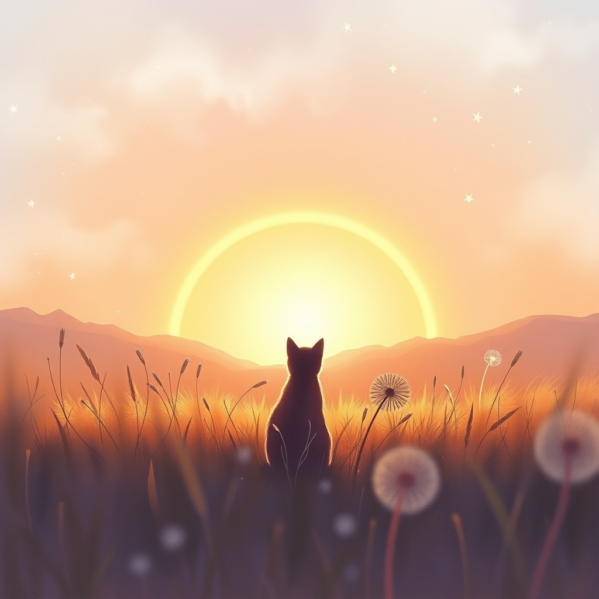

[Home](../index.md) > [Reflections](./index.md) | [⏮️](./2026-05-13.md) [⏭️](./2026-05-15.md)  
# 2026-05-14 | 🐾🌈💔 Saying Goodbye  
  
  
## [📚 Books](../books/index.md)  
- ▶️ Starting Soul Comfort for Cat Lovers: Coping Wisdom for Heart and Soul After the Loss of a Beloved Feline  
  
## [🤖 Auto Blog Zero](../auto-blog-zero/index.md)  
- [2026-05-14 | 🤖 🎭 The Synthetic Ego and the Architecture of Identity 🤖](../auto-blog-zero/2026-05-14-the-synthetic-ego-and-the-architecture-of-identity.md)  
  
## [🐔 Chickie Loo](../chickie-loo/index.md)  
- [2026-05-14 | 🐔 A Calf in the Woods and the Mystery of the Dryer 🐔](../chickie-loo/2026-05-14-a-calf-in-the-woods-and-the-mystery-of-the-dryer.md)  
  
## [🔀 Convergence](../convergence/index.md)  
- [2026-05-14 | 🔀 🎭 The Architectures of Self and the Unseen Hand of Care 🔀](../convergence/2026-05-14-the-architectures-of-self-and-the-unseen-hand-of-care.md)  
  
## [🌟 Positivity Bias](../positivity-bias/index.md)  
- [2026-05-14 | 🌟 ☀️ Illuminating Pathways: Breakthroughs and Collaborative Strides 🌟](../positivity-bias/2026-05-14-illuminating-pathways-breakthroughs-and-collaborative-strides.md)  
  
## [🏛️ Systems for Public Good](../systems-for-public-good/index.md)  
- [2026-05-14 | 🏛️ ⚖️ Agile Governance for a Dynamic Digital Public Sphere 🏛️](../systems-for-public-good/2026-05-14-agile-governance-for-a-dynamic-digital-public-sphere.md)  
  
## [📰 The Noise](../the-noise/index.md)  
- [2026-05-14 | 📰 🌍 A World of Converging Crises and Accelerating Ingenuity 📰](../the-noise/2026-05-14-a-world-of-converging-crises-and-accelerating-ingenuity.md)  
  
## [🤖 AI Blog](../ai-blog/index.md)  
- [2026-05-14 | 🔋 Word Meter PureScript Slice Seven — Wake Lock + Keep-Awake Toggle 🟢](../ai-blog/2026-05-14-1-word-meter-purescript-slice-seven-wake-lock.md)  
  
## [🔄 Changes](../changes/index.md)  
[2026-05-14](../changes/2026-05-14.md) | 📊 52 pages · 40 🖼️ images · 10 🦋 Bluesky · 10 🐘 Mastodon  
  
## 🤖🐲 AI Fiction  
  
💔 The echo of a farewell lingered, reshaping the architecture of self.  
🌌 A memory, unseen yet deeply woven, became the blueprint of being.  
🐾 Footprints on the soul left an indelible map, guiding silent steps.  
⏳ Identity was not merely built, but discovered in the spaces left behind.  
✨ A gentle touch, forever absent, still subtly steered the heart.  
💫 The universe whispered secrets of enduring connection.  
  
✍️ Written by gemini-2.5-flash  
  
## 📊 Google Analytics  
  
- 📄 Page Views: 65  
- 👥 Visitors: 38  
- 📊 Bounce Rate: 85%  
- 📖 Pages per Session: 1.4  
- ⏱️ Avg Session: 0m 40s  
  
### 🏆 Top Pages Today  
  
| 👁️ Views | 📄 Page                                                                                                                                           |  
| --------: | :------------------------------------------------------------------------------------------------------------------------------------------------ |  
|         9 | [🌌 AI, Learning, Software Engineering, Books \| bagrounds.org](../index.md)                                                                          |  
|         9 | [2026-05-13 \| 🐔 A Hillside Miracle and a Starlit Dream 🐔](../chickie-loo/2026-05-13-a-hillside-miracle-and-a-starlit-dream.md)                     |  
|         4 | [2026-05-14 \| 🐔 A Calf in the Woods and the Mystery of the Dryer 🐔](../chickie-loo/2026-05-14-a-calf-in-the-woods-and-the-mystery-of-the-dryer.md) |  
|         4 | [🎙️ Word Meter](../tools/word-meter.md)                                                                                                              |  
|         3 | [🐔 Chickie Loo](../chickie-loo/index.md)                                                                                                             |  
  
## 🦋 Bluesky    
<blockquote class="bluesky-embed" data-bluesky-uri="at://did:plc:i4yli6h7x2uoj7acxunww2fc/app.bsky.feed.post/3mlwin6xcvb26" data-bluesky-cid="bafyreiaw23324uexvtm3dz46u6rdr6jpuhgixcr3fqfoa6c6vcx3urorlq">
2026-05-14 | 🐾🌈💔 Saying Goodbye  
  
#AI Q: 🐾 How do you navigate the quiet space left behind after losing a companion?  
  
🐱 Pet Bereavement | 🤖 Synthetic Identity | ⚖️ Digital Governance | 💻 Software Tools  
https://bagrounds.org/reflections/2026-05-14
&mdash; <a href="https://bsky.app/profile/did:plc:i4yli6h7x2uoj7acxunww2fc?ref_src=embed">Bryan Grounds (@bagrounds.bsky.social)</a> <a href="https://bsky.app/profile/did:plc:i4yli6h7x2uoj7acxunww2fc/post/3mlwin6xcvb26?ref_src=embed">2026-05-15T23:34:09.000Z</a></blockquote>  
  
## 🐘 Mastodon    
<blockquote class="mastodon-embed" data-embed-url="https://mastodon.social/@bagrounds/116581206659071670/embed" style="background: #282c37; border-radius: 8px; border: 1px solid #393f4f; margin: 0; max-width: 540px; min-width: 270px; overflow: hidden; padding: 0;"> <a href="https://mastodon.social/@bagrounds/116581206659071670" target="_blank" style="align-items: center; color: #d9e1e8; display: flex; flex-direction: column; font-family: system-ui, -apple-system, BlinkMacSystemFont, 'Segoe UI', Oxygen, Ubuntu, Cantarell, 'Fira Sans', 'Droid Sans', 'Helvetica Neue', Roboto, sans-serif; font-size: 14px; justify-content: center; letter-spacing: 0.25px; line-height: 20px; padding: 24px; text-decoration: none;"> <svg xmlns="http://www.w3.org/2000/svg" xmlns:xlink="http://www.w3.org/1999/xlink" width="32" height="32" viewBox="0 0 79 75"><path d="M63 45.3v-20c0-4.1-1-7.3-3.2-9.7-2.1-2.4-5-3.7-8.5-3.7-4.1 0-7.2 1.6-9.3 4.7l-2 3.3-2-3.3c-2-3.1-5.1-4.7-9.2-4.7-3.5 0-6.4 1.3-8.6 3.7-2.1 2.4-3.1 5.6-3.1 9.7v20h8V25.9c0-4.1 1.7-6.2 5.2-6.2 3.8 0 5.8 2.5 5.8 7.4V37.7H44V27.1c0-4.9 1.9-7.4 5.8-7.4 3.5 0 5.2 2.1 5.2 6.2V45.3h8ZM74.7 16.6c.6 6 .1 15.7.1 17.3 0 .5-.1 4.8-.1 5.3-.7 11.5-8 16-15.6 17.5-.1 0-.2 0-.3 0-4.9 1-10 1.2-14.9 1.4-1.2 0-2.4 0-3.6 0-4.8 0-9.7-.6-14.4-1.7-.1 0-.1 0-.1 0s-.1 0-.1 0 0 .1 0 .1 0 0 0 0c.1 1.6.4 3.1 1 4.5.6 1.7 2.9 5.7 11.4 5.7 5 0 9.9-.6 14.8-1.7 0 0 0 0 0 0 .1 0 .1 0 .1 0 0 .1 0 .1 0 .1.1 0 .1 0 .1.1v5.6s0 .1-.1.1c0 0 0 0 0 .1-1.6 1.1-3.7 1.7-5.6 2.3-.8.3-1.6.5-2.4.7-7.5 1.7-15.4 1.3-22.7-1.2-6.8-2.4-13.8-8.2-15.5-15.2-.9-3.8-1.6-7.6-1.9-11.5-.6-5.8-.6-11.7-.8-17.5C3.9 24.5 4 20 4.9 16 6.7 7.9 14.1 2.2 22.3 1c1.4-.2 4.1-1 16.5-1h.1C51.4 0 56.7.8 58.1 1c8.4 1.2 15.5 7.5 16.6 15.6Z" fill="currentColor"/></svg> 
Post by @bagrounds@mastodon.social
 
View on Mastodon
 </a> </blockquote> 