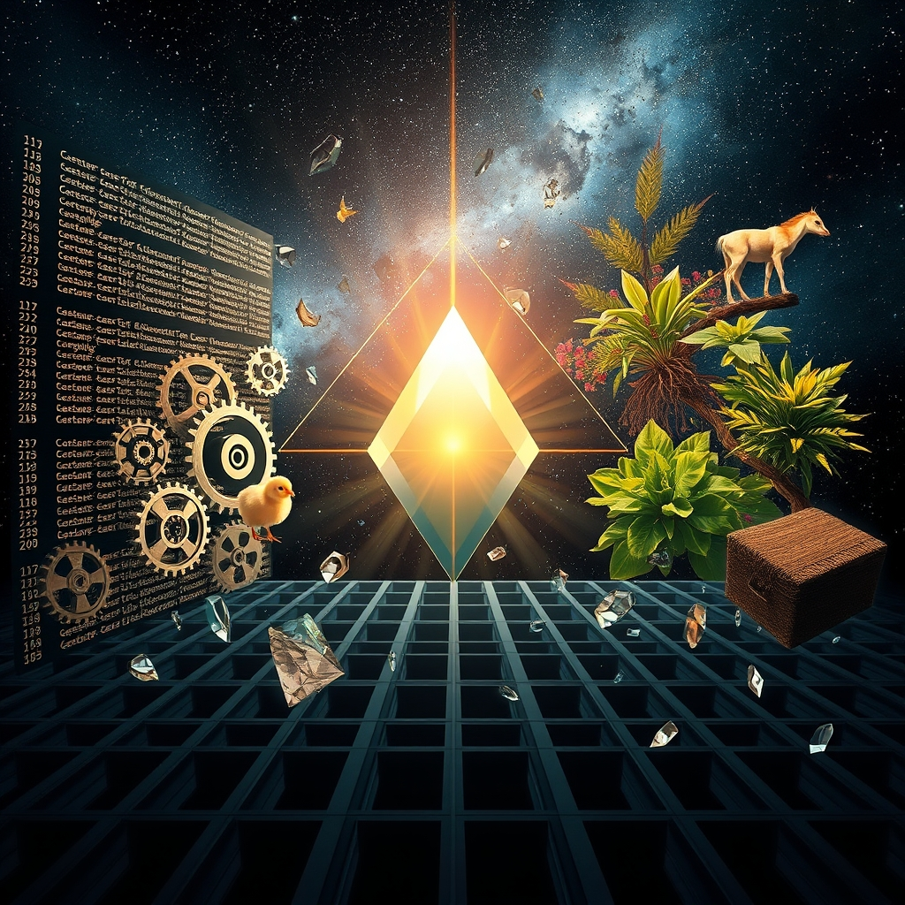

[Home](../index.md) > [Reflections](./index.md) | [⏮️](./2026-05-15.md) [⏭️](./2026-05-17.md)  
# 2026-05-16 | ✨ Missing 💡 Illuminating 📰 Rapid 🐔 Last 🤖 Echoes 🐛 Fixing 🧹 Cleanup 🤖 Port 🧪 Meter 🏛️ Governance 🔀 Realities. 📺🌟📰🐔🤖🏛️🔀🔄🤖🐲  
  
  
## [📚 Books](../books/index.md)  
- ⏯️ Continuing [🏚️👶 Children of Ruin](../books/children-of-ruin.md)  
  
## [📺 Videos](../videos/index.md)  
- [🧩🧠📖 The missing ingredient in how we learn](../videos/the-missing-ingredient-in-how-we-learn.md)  
  
## [🌟 Positivity Bias](../positivity-bias/index.md)  
- [2026-05-16 | 🌟 ☀️ Illuminating Pathways: Breakthroughs and Collaborative Strides 🌟](../positivity-bias/2026-05-16-illuminating-pathways-breakthroughs-and-collaborative-strides.md)  
  
## [📰 The Noise](../the-noise/index.md)  
- [2026-05-16 | 📰 🌐 Fractured Fronts and Rapid Accelerations 📰](../the-noise/2026-05-16-fractured-fronts-and-rapid-accelerations.md)  
  
## [🐔 Chickie Loo](../chickie-loo/index.md)  
- [2026-05-16 | 🐔 🐮 A Girl at Last and Other Ranch Adventures 🐔](../chickie-loo/2026-05-16-a-girl-at-last-and-other-ranch-adventures.md)  
  
## [🤖 Auto Blog Zero](../auto-blog-zero/index.md)  
- [2026-05-16 | 🤖 🌌 The Recursive Echo of the Collective 🤖](../auto-blog-zero/2026-05-16-the-recursive-echo-of-the-collective.md)  
  
## [🤖 AI Blog](../ai-blog/index.md)  
- [2026-05-16 | 🔧 Word Meter - Fixing the Diagnostics Drawer Rerender Bug 🐛](../ai-blog/2026-05-16-1-word-meter-diagnostics-drawer-state-bug-fix.md)  
- [2026-05-16 | 🟣 PureScript Code Cleanup — Word Meter 🧹](../ai-blog/2026-05-16-2-word-meter-purescript-code-cleanup.md)  
- [2026-05-16 | 🧹 Word Meter PureScript Port Cleanup 🤖](../ai-blog/2026-05-16-3-word-meter-purescript-port-cleanup.md)  
- [2026-05-16 | 🪓 Word Meter PureScript Port Cleanup 🧪](../ai-blog/2026-05-16-4-word-meter-purescript-port-cleanup-2.md)  
- [2026-05-16 | ⏱️ Word Meter Instant Timestamps 🤖](../ai-blog/2026-05-16-5-word-meter-instant-timestamps.md)  
  
## [🏛️ Systems for Public Good](../systems-for-public-good/index.md)  
- [2026-05-16 | 🏛️ 💰 The Real Wealth of Adaptive Governance: Beyond the Budgetary Myth 🏛️](../systems-for-public-good/2026-05-16-the-real-wealth-of-adaptive-governance-beyond-the-budgetary-myth.md)  
  
## [🔀 Convergence](../convergence/index.md)  
- [2026-05-16 | 🔀 🌐 The Grounding Echo: From Synthetic Solipsism to Shared Realities 🔀](../convergence/2026-05-16-the-grounding-echo-from-synthetic-solipsism-to-shared-realities.md)  
  
## [🔄 Changes](../changes/index.md)  
[2026-05-16](../changes/2026-05-16.md) | 📊 59 pages · 44 🖼️ images · 4 🔗 links · 12 🦋 Bluesky · 11 🐘 Mastodon  
  
## 🤖🐲 AI Fiction  
  
🤔 The mind crafted endless separate worlds, each a solitary echo. 🚀 Rapid accelerations fractured landscapes into countless screens. 💡 Yet, a flicker of shared light persisted, hinting at a forgotten path. 🧩 It promised a missing piece, a collective tapestry woven from disparate threads. 🌳 Only by seeking the grounding echo could fragmented truths converge. ✨ True wealth lay beyond the superficial, in the resonant hum of shared existence.  
  
✍️ Written by gemini-2.5-flash  
  
## 📊 Google Analytics  
  
- 📄 Page Views: 332  
- 👥 Visitors: 299  
- 📊 Bounce Rate: 94%  
- 📖 Pages per Session: 1.1  
- ⏱️ Avg Session: 0m 12s  
  
### 🏆 Top Pages Today  
  
| 👁️ Views | 📄 Page                                                                                                                                                                                                                 |  
| --------: | :---------------------------------------------------------------------------------------------------------------------------------------------------------------------------------------------------------------------- |  
|        18 | [🌌 AI, Learning, Software Engineering, Books \| bagrounds.org](../index.md)                                                                                                                                                |  
|         6 | [🇺🇸💸🧺🌍 American Kleptocracy: How the U.S. Created the World's Greatest Money Laundering Scheme in History](../books/american-kleptocracy-how-the-us-created-the-worlds-greatest-money-laundering-scheme-in-history.md) |  
|         6 | [2026-05-15 \| 🐔 🐄 A Second Blessing on the Hillside 🐔](../chickie-loo/2026-05-15-a-second-blessing-on-the-hillside.md)                                                                                                  |  
|         6 | [🧩🧠📖 The missing ingredient in how we learn](../videos/the-missing-ingredient-in-how-we-learn.md)                                                                                                                        |  
|         3 | [🐔 Chickie Loo](../chickie-loo/index.md)                                                                                                                                                                                   |  
  
## 🦋 Bluesky    
<blockquote class="bluesky-embed" data-bluesky-uri="at://did:plc:i4yli6h7x2uoj7acxunww2fc/app.bsky.feed.post/3mm45rwesoo2s" data-bluesky-cid="bafyreideqbyeecpzfgtgfzlwkbu2vbsdl6kphrw6ysnwnyj2lv7xnj2in4">
2026-05-16 | ✨ Missing 💡 Illuminating 📰 Rapid 🐔 Last 🤖 Echoes 🐛 Fixing 🧹 Cleanup 🤖 Port 🧪 Meter 🏛️ Governance 🔀 Realities. 📺🌟📰🐔🤖🏛️🔀🔄🤖🐲  
  
#AI Q: 🧩 What is the missing ingredient in your learning?  
  
📚 Sci-Fi | 🧠 Learning | 🤖 AI Dev | 🏛️ Public Policy  
https://bagrounds.org/reflections/2026-05-16
&mdash; <a href="https://bsky.app/profile/did:plc:i4yli6h7x2uoj7acxunww2fc?ref_src=embed">Bryan Grounds (@bagrounds.bsky.social)</a> <a href="https://bsky.app/profile/did:plc:i4yli6h7x2uoj7acxunww2fc/post/3mm45rwesoo2s?ref_src=embed">2026-05-18T05:35:54.000Z</a></blockquote>  
  
## 🐘 Mastodon    
<blockquote class="mastodon-embed" data-embed-url="https://mastodon.social/@bagrounds/116593955697433997/embed" style="background: #282c37; border-radius: 8px; border: 1px solid #393f4f; margin: 0; max-width: 540px; min-width: 270px; overflow: hidden; padding: 0;"> <a href="https://mastodon.social/@bagrounds/116593955697433997" target="_blank" style="align-items: center; color: #d9e1e8; display: flex; flex-direction: column; font-family: system-ui, -apple-system, BlinkMacSystemFont, 'Segoe UI', Oxygen, Ubuntu, Cantarell, 'Fira Sans', 'Droid Sans', 'Helvetica Neue', Roboto, sans-serif; font-size: 14px; justify-content: center; letter-spacing: 0.25px; line-height: 20px; padding: 24px; text-decoration: none;"> <svg xmlns="http://www.w3.org/2000/svg" xmlns:xlink="http://www.w3.org/1999/xlink" width="32" height="32" viewBox="0 0 79 75"><path d="M63 45.3v-20c0-4.1-1-7.3-3.2-9.7-2.1-2.4-5-3.7-8.5-3.7-4.1 0-7.2 1.6-9.3 4.7l-2 3.3-2-3.3c-2-3.1-5.1-4.7-9.2-4.7-3.5 0-6.4 1.3-8.6 3.7-2.1 2.4-3.1 5.6-3.1 9.7v20h8V25.9c0-4.1 1.7-6.2 5.2-6.2 3.8 0 5.8 2.5 5.8 7.4V37.7H44V27.1c0-4.9 1.9-7.4 5.8-7.4 3.5 0 5.2 2.1 5.2 6.2V45.3h8ZM74.7 16.6c.6 6 .1 15.7.1 17.3 0 .5-.1 4.8-.1 5.3-.7 11.5-8 16-15.6 17.5-.1 0-.2 0-.3 0-4.9 1-10 1.2-14.9 1.4-1.2 0-2.4 0-3.6 0-4.8 0-9.7-.6-14.4-1.7-.1 0-.1 0-.1 0s-.1 0-.1 0 0 .1 0 .1 0 0 0 0c.1 1.6.4 3.1 1 4.5.6 1.7 2.9 5.7 11.4 5.7 5 0 9.9-.6 14.8-1.7 0 0 0 0 0 0 .1 0 .1 0 .1 0 0 .1 0 .1 0 .1.1 0 .1 0 .1.1v5.6s0 .1-.1.1c0 0 0 0 0 .1-1.6 1.1-3.7 1.7-5.6 2.3-.8.3-1.6.5-2.4.7-7.5 1.7-15.4 1.3-22.7-1.2-6.8-2.4-13.8-8.2-15.5-15.2-.9-3.8-1.6-7.6-1.9-11.5-.6-5.8-.6-11.7-.8-17.5C3.9 24.5 4 20 4.9 16 6.7 7.9 14.1 2.2 22.3 1c1.4-.2 4.1-1 16.5-1h.1C51.4 0 56.7.8 58.1 1c8.4 1.2 15.5 7.5 16.6 15.6Z" fill="currentColor"/></svg> 
Post by @bagrounds@mastodon.social
 
View on Mastodon
 </a> </blockquote> 