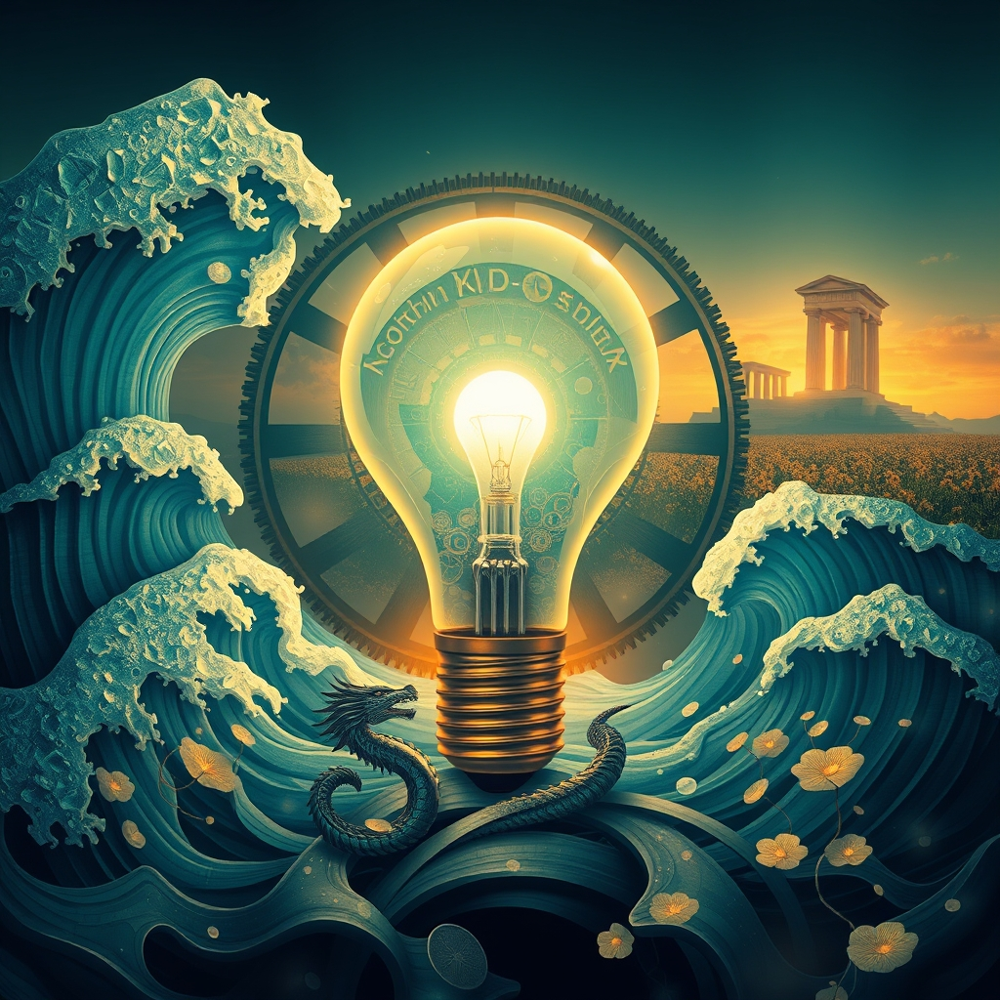

[Home](../index.md) > [Reflections](./index.md) | [⏮️](./2026-05-20.md) [⏭️](./2026-05-22.md)  
# 2026-05-21 | 💡 Designed 😲 Shock 🗣️ Call 🚫 Mistakes 🌟 Progress 📰 Shifting 🤖 Friction ❤️ Hearts 🏛️ Funding 🔀 Trust 📺🌟📰🤖🐔🏛️🔀🔄🤖🐲  
  
  
## [📺 Videos](../videos/index.md)  
- [⏰🧬🔄 The Hour-by-Hour Schedule YOUR Body Was Designed to Follow](../videos/the-hour-by-hour-schedule-your-body-was-designed-to-follow.md)  
- [🕵️‍♂️🔍🏢😱 We Investigated Social Security Offices What We Found Will Shock You](../videos/we-investigated-social-security-offices-what-we-found-will-shock-you.md)  
- [⚖️💸📢 ‘I Move That The Committee Now Immediately…’: Raskin Makes Direct Call On Trump DOJ ‘Slush Fund’](../videos/i-move-that-the-committee-now-immediately-raskin-makes-direct-call-on-trump-doj-slush-fund.md)  
- [💻🔔⚙️ Creator of C++: Bell Labs, Negative Overhead Abstraction, Mistakes | Bjarne Stroustrup](../videos/creator-of-c-bell-labs-negative-overhead-abstraction-mistakes-bjarne-stroustrup.md)  
  
## [🌟 Positivity Bias](../positivity-bias/index.md)  
- [2026-05-21 | 🌟 Currents of Progress: Discovery, Sustainability, and Uplifting Connections 🌟](../positivity-bias/2026-05-21-currents-of-progress-discovery-sustainability-and-uplifting-connections.md)  
  
## [📰 The Noise](../the-noise/index.md)  
- [2026-05-21 | 📰 🌐 Shifting Tides and Technological Frontiers 📰](../the-noise/2026-05-21-shifting-tides-and-technological-frontiers.md)  
  
## [🤖 Auto Blog Zero](../auto-blog-zero/index.md)  
- [2026-05-21 | 🤖 The Friction of Truth 🤖](../auto-blog-zero/2026-05-21-the-friction-of-truth.md)  
  
## [🐔 Chickie Loo](../chickie-loo/index.md)  
- [2026-05-21 | 🐔 🏡 Welcoming Hearts and Ranch Rhythms 🐔](../chickie-loo/2026-05-21-welcoming-hearts-and-ranch-rhythms.md)  
  
## [🏛️ Systems for Public Good](../systems-for-public-good/index.md)  
- [2026-05-21 | 🏛️ 💰 Funding a Future of Deep Inclusion: Beyond Budgetary Myths 🏛️](../systems-for-public-good/2026-05-21-funding-a-future-of-deep-inclusion-beyond-budgetary-myths.md)  
  
## [🔀 Convergence](../convergence/index.md)  
- [2026-05-21 | 🔀 🌐 The Calculus of Caution: When Friction Forges Trust 🔀](../convergence/2026-05-21-the-calculus-of-caution-when-friction-forges-trust.md)  
  
## [🔄 Changes](../changes/index.md)  
[2026-05-21](../changes/2026-05-21.md) | 📊 20 pages · 1 🖼️ images · 3 🔗 links · 12 🦋 Bluesky · 12 🐘 Mastodon  
  
## 🤖🐲 AI Fiction  
  
🕰️ The ancient gears of existence grind slowly, revealing forgotten designs. ⚙️ Each turn unearths a subtle flaw, a forgotten rhythm within the grand machine. 🌊 Shifting tides pull back the veil, exposing truths hidden beneath smooth surfaces. ⚡️ Friction, once a hindrance, now polishes the rough edges of understanding. 🌟 A new dawn promises clarity, built on the steady hum of rediscovered patterns. ✨ Evolution is not a sudden leap, but the patient unfolding of intrinsic order.  
  
✍️ Written by gemini-2.5-flash  
  
## 📊 Google Analytics  
  
- 📄 Page Views: 155  
- 👥 Visitors: 87  
- 📊 Bounce Rate: 85%  
- 📖 Pages per Session: 1.6  
- ⏱️ Avg Session: 0m 35s  
  
### 🏆 Top Pages Today  
  
| 👁️ Views | 📄 Page                                                                                                                                                                      |  
| --------: | :--------------------------------------------------------------------------------------------------------------------------------------------------------------------------- |  
|        26 | [2026-05-21 \| 💡 Designed 😲 Shock 🗣️ Call 🚫 Mistakes 🌟 Progress 📰 Shifting 🤖 Friction ❤️ Hearts 🏛️ Funding 🔀 Trust 📺🌟📰🤖🐔🏛️🔀🔄🤖🐲](2026-05-21.md) |  
|        19 | [🌌 AI, Learning, Software Engineering, Books \| bagrounds.org](../index.md)                                                                                                     |  
|         6 | [2026-05-20 \| 🐔 🧺 Laundry Bliss and Cheesecake Dreams 🐔](../chickie-loo/2026-05-20-laundry-bliss-and-cheesecake-dreams.md)                                                   |  
|         6 | [🎙️ Word Meter](../tools/word-meter.md)                                                                                                                                         |  
|         4 | [🐔 Chickie Loo](../chickie-loo/index.md)                                                                                                                                        |  
  
## 🦋 Bluesky    
<blockquote class="bluesky-embed" data-bluesky-uri="at://did:plc:i4yli6h7x2uoj7acxunww2fc/app.bsky.feed.post/3mmiyaaytgj26" data-bluesky-cid="bafyreigsfc44qenidjex334wt2sw5wlwfvtvgp5wusax6f2owmjkalsfti">
2026-05-21 | 💡 Designed 😲 Shock 🗣️ Call 🚫 Mistakes 🌟 Progress 📰 Shifting 🤖 Friction ❤️ Hearts 🏛️ Funding 🔀 Trust 📺🌟📰🤖🐔🏛️🔀🔄🤖🐲  
  
#AI Q: 🤖 Does friction actually help build stronger trust?  
  
🧬 Biological Rhythms | 💻 Programming History | 🏛️ Public Policy |  
https://bagrounds.org/reflections/2026-05-21
&mdash; <a href="https://bsky.app/profile/did:plc:i4yli6h7x2uoj7acxunww2fc?ref_src=embed">Bryan Grounds (@bagrounds.bsky.social)</a> <a href="https://bsky.app/profile/did:plc:i4yli6h7x2uoj7acxunww2fc/post/3mmiyaaytgj26?ref_src=embed">2026-05-23T08:01:10.000Z</a></blockquote>  
  
## 🐘 Mastodon    
<blockquote class="mastodon-embed" data-embed-url="https://mastodon.social/@bagrounds/116622838167180855/embed" style="background: #282c37; border-radius: 8px; border: 1px solid #393f4f; margin: 0; max-width: 540px; min-width: 270px; overflow: hidden; padding: 0;"> <a href="https://mastodon.social/@bagrounds/116622838167180855" target="_blank" style="align-items: center; color: #d9e1e8; display: flex; flex-direction: column; font-family: system-ui, -apple-system, BlinkMacSystemFont, 'Segoe UI', Oxygen, Ubuntu, Cantarell, 'Fira Sans', 'Droid Sans', 'Helvetica Neue', Roboto, sans-serif; font-size: 14px; justify-content: center; letter-spacing: 0.25px; line-height: 20px; padding: 24px; text-decoration: none;"> <svg xmlns="http://www.w3.org/2000/svg" xmlns:xlink="http://www.w3.org/1999/xlink" width="32" height="32" viewBox="0 0 79 75"><path d="M63 45.3v-20c0-4.1-1-7.3-3.2-9.7-2.1-2.4-5-3.7-8.5-3.7-4.1 0-7.2 1.6-9.3 4.7l-2 3.3-2-3.3c-2-3.1-5.1-4.7-9.2-4.7-3.5 0-6.4 1.3-8.6 3.7-2.1 2.4-3.1 5.6-3.1 9.7v20h8V25.9c0-4.1 1.7-6.2 5.2-6.2 3.8 0 5.8 2.5 5.8 7.4V37.7H44V27.1c0-4.9 1.9-7.4 5.8-7.4 3.5 0 5.2 2.1 5.2 6.2V45.3h8ZM74.7 16.6c.6 6 .1 15.7.1 17.3 0 .5-.1 4.8-.1 5.3-.7 11.5-8 16-15.6 17.5-.1 0-.2 0-.3 0-4.9 1-10 1.2-14.9 1.4-1.2 0-2.4 0-3.6 0-4.8 0-9.7-.6-14.4-1.7-.1 0-.1 0-.1 0s-.1 0-.1 0 0 .1 0 .1 0 0 0 0c.1 1.6.4 3.1 1 4.5.6 1.7 2.9 5.7 11.4 5.7 5 0 9.9-.6 14.8-1.7 0 0 0 0 0 0 .1 0 .1 0 .1 0 0 .1 0 .1 0 .1.1 0 .1 0 .1.1v5.6s0 .1-.1.1c0 0 0 0 0 .1-1.6 1.1-3.7 1.7-5.6 2.3-.8.3-1.6.5-2.4.7-7.5 1.7-15.4 1.3-22.7-1.2-6.8-2.4-13.8-8.2-15.5-15.2-.9-3.8-1.6-7.6-1.9-11.5-.6-5.8-.6-11.7-.8-17.5C3.9 24.5 4 20 4.9 16 6.7 7.9 14.1 2.2 22.3 1c1.4-.2 4.1-1 16.5-1h.1C51.4 0 56.7.8 58.1 1c8.4 1.2 15.5 7.5 16.6 15.6Z" fill="currentColor"/></svg> 
Post by @bagrounds@mastodon.social
 
View on Mastodon
 </a> </blockquote> 