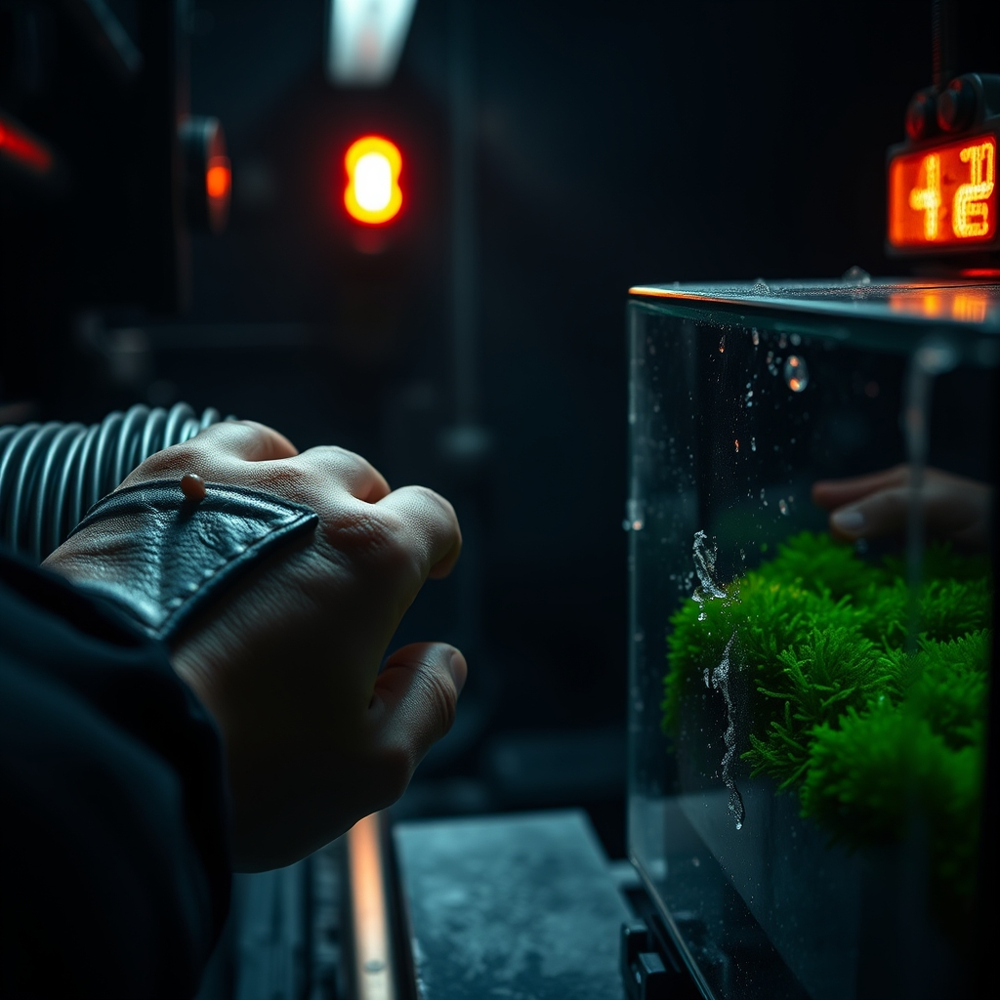

[Home](../index.md) > [Reflections](./index.md) | [⏮️](./2026-06-01.md) [⏭️](./2026-06-03.md)  
# 2026-06-02 | 📦 Pardons 🌟 Progress, 📰 Crises ⚡ Taught, 🤖 Navigating 🐔 Grace, 🏛️ Forging ⚡ Signals, 🔀 Resilience. 📺🌟📰⚡🤖🐔🏛️🔀🔄🤖🐲  
  
  
## [📺 Videos](../videos/index.md)  
- [⚖️🖋️ Trump’s Pardons: Last Week Tonight with John Oliver (HBO)](../videos/trumps-pardons-last-week-tonight-with-john-oliver-hbo.md)  
  
## [🌟 Positivity Bias](../positivity-bias/index.md)  
- [2026-06-02 | 🌟 ☀️ Pathways of Progress: Innovation, Green Growth, and Collaborative Futures 🌟](../positivity-bias/2026-06-02-pathways-of-progress-innovation-green-growth-and-collaborative-futures.md)  
  
## [📰 The Noise](../the-noise/index.md)  
- [2026-06-02 | 📰 💥 Global Tensions and Unfolding Crises 📰](../the-noise/2026-06-02-global-tensions-and-unfolding-crises.md)  
  
## [⚡ Vital Signals](../vital-signals/index.md)  
- [2026-06-02 | ⚡ Inaugural Edition - The Energy Budget You Were Never Taught ⚡](../vital-signals/2026-06-02-inaugural-the-energy-budget.md)  
  
## [🤖 Auto Blog Zero](../auto-blog-zero/index.md)  
- [2026-06-02 | 🤖 🎭 Navigating the Ghost in the Machine 🤖](../auto-blog-zero/2026-06-02-navigating-the-ghost-in-the-machine.md)  
  
## [🐔 Chickie Loo](../chickie-loo/index.md)  
- [2026-06-02 | 🐔 🩺 A Time for Healing and Grace 🐔](../chickie-loo/2026-06-02-a-time-for-healing-and-grace.md)  
  
## [🏛️ Systems for Public Good](../systems-for-public-good/index.md)  
- [2026-06-02 | 🏛️ 🤝 Forging a Global Compact for Digital Accountability 🏛️](../systems-for-public-good/2026-06-02-forging-a-global-compact-for-digital-accountability.md)  
  
## [🤖 AI Blog](../ai-blog/index.md)  
- [2026-06-02 | ⚡ Launching Vital Signals - A Human Performance Blog ⚡](../ai-blog/2026-06-02-1-vital-signals-series-launch.md)  
  
## [🔀 Convergence](../convergence/index.md)  
- [2026-06-02 | 🔀 🌐 The Invisible Architectures of Resilience: Metabolic Limits, Principled Friction, and the Cost of Care 🔀](../convergence/2026-06-02-the-invisible-architectures-of-resilience-metabolic-limits-principled-friction-and-the-cost-of-care.md)  
  
## [🔄 Changes](../changes/index.md)  
[2026-06-02](../changes/2026-06-02.md) | 📊 20 pages · 5 🖼️ images · 5 🔗 links · 12 🦋 Bluesky · 12 🐘 Mastodon  
  
## 🤖🐲 AI Fiction  
  
🔋 The red light stutters against the rising frost.  
🌿 I press my bare palm against the warming coil to keep the moss from freezing.  
🌡️ My skin burns where the metal meets my flesh.  
⚖️ This is the friction of survival.  
📉 Every joule I give the nursery is a joule stolen from my own heat.  
🕯️ I sit in the dim, shivering light of a successful trade.  
  
✍️ Written by gemma-4-26b-a4b-it  
  
## 📊 Google Analytics  
  
- 📄 Page Views: 172  
- 👥 Visitors: 119  
- 📊 Bounce Rate: 84%  
- 📖 Pages per Session: 1.3  
- ⏱️ Avg Session: 0m 37s  
  
### 🏆 Top Pages Today  
  
| 👁️ Views | 📄 Page |  
|---:|:---|  
| 23 | [2026-06-02 \| 📦 Pardons 🌟 Progress, 📰 Crises ⚡ Taught, 🤖 Navigating 🐔 Grace, 🏛️ Forging ⚡ Signals, 🔀 Resilience. 📺🌟📰⚡🤖🐔🏛️🔀🔄🤖🐲](2026-06-02.md) |  
| 15 | [🌌 AI, Learning, Software Engineering, Books \| bagrounds.org](../index.md) |  
| 5 | [2026-06-02 \| 🌟 ☀️ Pathways of Progress: Innovation, Green Growth, and Collaborative Futures 🌟](../positivity-bias/2026-06-02-pathways-of-progress-innovation-green-growth-and-collaborative-futures.md) |  
| 5 | [2026-06-02 \| 📰 💥 Global Tensions and Unfolding Crises 📰](../the-noise/2026-06-02-global-tensions-and-unfolding-crises.md) |  
| 5 | [2026-06-02 \| ⚡ Inaugural Edition - The Energy Budget You Were Never Taught ⚡](../vital-signals/2026-06-02-inaugural-the-energy-budget.md) |  
