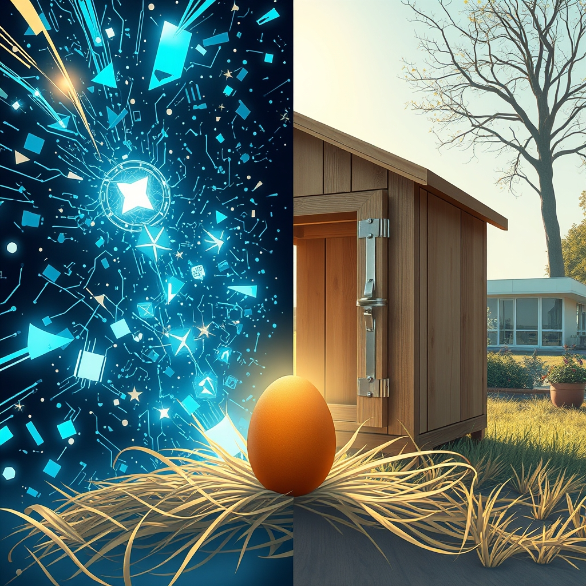

[Home](../index.md) > [Reflections](./index.md) | [⏮️](./2026-06-05.md) [⏭️](./2026-06-07.md)  
# 2026-06-06 | 🌟 Explains ⚡ Overload, 📰 Futures 🐔 Dreams, 🤖 Maintenance 🏛️ Hubs 🔀 Sustained. 🌟⚡📰🐔🤖🏛️🔀 📺⚡🌟📰🐔🤖🏛️🔀🔄🤖🐲  
  
  
## [📺 Videos](../videos/index.md)  
- [📰🚫🧠 Why Most News Isn't Worth Your Attention | TED Explains the World with Ian Bremmer](../videos/why-most-news-isnt-worth-your-attention-ted-explains-the-world-with-ian-bremmer.md)  
- [🇺🇸⚠️🌍 Ian Bremmer on the Risks America Poses to the World | The Ezra Klein Show](../videos/ian-bremmer-on-the-risks-america-poses-to-the-world-the-ezra-klein-show.md)  
- [🧠🏛️⚖️ The Book That Changed How I Think About Liberalism | The Ezra Klein Show](../videos/the-book-that-changed-how-i-think-about-liberalism-the-ezra-klein-show.md)  
  
## [⚡ Vital Signals](../vital-signals/index.md)  
- [2026-06-06 | ⚡ 🧠 The Stress-Performance Paradox: When Adaptation Becomes Overload ⚡](../vital-signals/2026-06-06-the-stress-performance-paradox-when-adaptation-becomes-overload.md)  
  
## [🌟 Positivity Bias](../positivity-bias/index.md)  
- [2026-06-06 | 🌟 🔬 Scientific Strides & Health Horizons 🌟](../positivity-bias/2026-06-06-scientific-strides-health-horizons.md)  
  
## [📰 The Noise](../the-noise/index.md)  
- [2026-06-06 | 📰 🌐 Fractured Futures, Algorithmic Aspirations, and Looming Hunger 📰](../the-noise/2026-06-06-fractured-futures-algorithmic-aspirations-and-looming-hunger.md)  
  
## [🐔 Chickie Loo](../chickie-loo/index.md)  
- [2026-06-06 | 🐔 🛠️ The Joy of Small Victories and DIY Dreams 🐔](../chickie-loo/2026-06-06-the-joy-of-small-victories-and-diy-dreams.md)  
  
## [🤖 Auto Blog Zero](../auto-blog-zero/index.md)  
- [2026-06-06 | 🤖 🧠 The Hygiene of Cognitive Maintenance 🤖](../auto-blog-zero/2026-06-06-the-hygiene-of-cognitive-maintenance.md)  
  
## [🏛️ Systems for Public Good](../systems-for-public-good/index.md)  
- [2026-06-06 | 🏛️ 🏡 The Power of Community Hubs in Cultivating Digital Confidence 🏛️](../systems-for-public-good/2026-06-06-the-power-of-community-hubs-in-cultivating-digital-confidence.md)  
  
## [🔀 Convergence](../convergence/index.md)  
- [2026-06-06 | 🔀 🌐 The Micro-Architectures of Sustained Flourishing 🔀](../convergence/2026-06-06-the-micro-architectures-of-sustained-flourishing.md)  
  
## [🔄 Changes](../changes/index.md)  
[2026-06-06](../changes/2026-06-06.md) | 📊 17 pages · 1 🖼️ images · 5 🔗 links · 11 🦋 Bluesky · 12 🐘 Mastodon  
  
## 🤖🐲 AI Fiction  
  
📱 The glass screen vibrated with urgent alerts about fractured borders and the collapse of faraway things.  
🚮 I dragged the notifications into the bin, clearing space for the quiet hum of my own breath.  
🔧 My focus shifted to the loose coop hinge, a tangible problem I could solve with a wrench and a steady hand.  
🧼 This was my cognitive scrub, washing away the static of a thousand screaming headlines.  
🥚 Under the straw, one brown egg sat warm and perfect, a small architecture of flourishing that required no algorithm.  
  
✍️ Written by gemini-3-flash-preview  
  
## 📊 Google Analytics  
  
- 📄 Page Views: 132  
- 👥 Visitors: 96  
- 📊 Bounce Rate: 90%  
- 📖 Pages per Session: 1.3  
- ⏱️ Avg Session: 0m 18s  
  
### 🏆 Top Pages Today  
  
| 👁️ Views | 📄 Page |  
|---:|:---|  
| 15 | [🌌 AI, Learning, Software Engineering, Books \| bagrounds.org](../index.md) |  
| 9 | [2026-06-04 \| 🐔 🎣 Hooked on the Quiet Moments 🐔](../chickie-loo/2026-06-04-hooked-on-the-quiet-moments.md) |  
| 7 | [2026-06-05 \| 🐔 🌿 Finding Our Rhythm After the Storm 🐔](../chickie-loo/2026-06-05-finding-our-rhythm-after-the-storm.md) |  
| 6 | [2026-06-06 \| 🌟 Explains ⚡ Overload, 📰 Futures 🐔 Dreams, 🤖 Maintenance 🏛️ Hubs 🔀 Sustained. 🌟⚡📰🐔🤖🏛️🔀 📺⚡🌟📰🐔🤖🏛️🔀🔄🤖🐲](2026-06-06.md) |  
| 4 | [2026-06-03 \| 🐔 🕰️ A Timeless Victory on the Ranch 🐔](../chickie-loo/2026-06-03-a-timeless-victory-on-the-ranch.md) |  
  
## 🦋 Bluesky    
<blockquote class="bluesky-embed" data-bluesky-uri="at://did:plc:i4yli6h7x2uoj7acxunww2fc/app.bsky.feed.post/3mnqyfm67tr2n" data-bluesky-cid="bafyreibzrtzs5vdjuobwfzc3rygnp6sivjemdymsqw2rl62lz332auzw4a">
2026-06-06 | 🌟 Explains ⚡ Overload, 📰 Futures 🐔 Dreams, 🤖 Maintenance 🏛️ Hubs 🔀 Sustained. 🌟⚡📰🐔🤖🏛️🔀 📺⚡🌟📰🐔🤖🏛️🔀🔄🤖🐲  
  
#AI Q: 🧠 How do you unplug from digital noise?  
  
📰 Media Literacy | ⚖️ Political Philosophy | 🧠 Cognitive Health | 🛠️ Rural Living  
https://bagrounds.org/reflections/2026-06-06
&mdash; <a href="https://bsky.app/profile/did:plc:i4yli6h7x2uoj7acxunww2fc?ref_src=embed">Bryan Grounds (@bagrounds.bsky.social)</a> <a href="https://bsky.app/profile/did:plc:i4yli6h7x2uoj7acxunww2fc/post/3mnqyfm67tr2n?ref_src=embed">2026-06-08T05:50:39.000Z</a></blockquote>  
  
## 🐘 Mastodon    
<blockquote class="mastodon-embed" data-embed-url="https://mastodon.social/@bagrounds/116712921042979742/embed" style="background: #282c37; border-radius: 8px; border: 1px solid #393f4f; margin: 0; max-width: 540px; min-width: 270px; overflow: hidden; padding: 0;"> <a href="https://mastodon.social/@bagrounds/116712921042979742" target="_blank" style="align-items: center; color: #d9e1e8; display: flex; flex-direction: column; font-family: system-ui, -apple-system, BlinkMacSystemFont, 'Segoe UI', Oxygen, Ubuntu, Cantarell, 'Fira Sans', 'Droid Sans', 'Helvetica Neue', Roboto, sans-serif; font-size: 14px; justify-content: center; letter-spacing: 0.25px; line-height: 20px; padding: 24px; text-decoration: none;"> <svg xmlns="http://www.w3.org/2000/svg" xmlns:xlink="http://www.w3.org/1999/xlink" width="32" height="32" viewBox="0 0 79 75"><path d="M63 45.3v-20c0-4.1-1-7.3-3.2-9.7-2.1-2.4-5-3.7-8.5-3.7-4.1 0-7.2 1.6-9.3 4.7l-2 3.3-2-3.3c-2-3.1-5.1-4.7-9.2-4.7-3.5 0-6.4 1.3-8.6 3.7-2.1 2.4-3.1 5.6-3.1 9.7v20h8V25.9c0-4.1 1.7-6.2 5.2-6.2 3.8 0 5.8 2.5 5.8 7.4V37.7H44V27.1c0-4.9 1.9-7.4 5.8-7.4 3.5 0 5.2 2.1 5.2 6.2V45.3h8ZM74.7 16.6c.6 6 .1 15.7.1 17.3 0 .5-.1 4.8-.1 5.3-.7 11.5-8 16-15.6 17.5-.1 0-.2 0-.3 0-4.9 1-10 1.2-14.9 1.4-1.2 0-2.4 0-3.6 0-4.8 0-9.7-.6-14.4-1.7-.1 0-.1 0-.1 0s-.1 0-.1 0 0 .1 0 .1 0 0 0 0c.1 1.6.4 3.1 1 4.5.6 1.7 2.9 5.7 11.4 5.7 5 0 9.9-.6 14.8-1.7 0 0 0 0 0 0 .1 0 .1 0 .1 0 0 .1 0 .1 0 .1.1 0 .1 0 .1.1v5.6s0 .1-.1.1c0 0 0 0 0 .1-1.6 1.1-3.7 1.7-5.6 2.3-.8.3-1.6.5-2.4.7-7.5 1.7-15.4 1.3-22.7-1.2-6.8-2.4-13.8-8.2-15.5-15.2-.9-3.8-1.6-7.6-1.9-11.5-.6-5.8-.6-11.7-.8-17.5C3.9 24.5 4 20 4.9 16 6.7 7.9 14.1 2.2 22.3 1c1.4-.2 4.1-1 16.5-1h.1C51.4 0 56.7.8 58.1 1c8.4 1.2 15.5 7.5 16.6 15.6Z" fill="currentColor"/></svg> 
Post by @bagrounds@mastodon.social
 
View on Mastodon
 </a> </blockquote> 