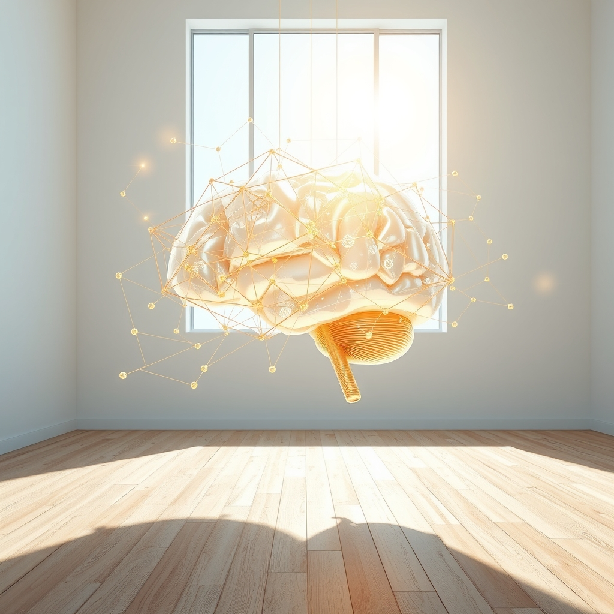

[Home](../index.md) > [Reflections](./index.md) | [⏮️](./2026-06-06.md) [⏭️](./2026-06-08.md)  
# 2026-06-07 | 🎨 Nurturing 🏛️ Architecture 🛠️ makes 🔬 Scientific 🧠 Intelligence, ✨ Refinement, ➕ and ⬆️ Uprising 😊 Joy. 📺⚡🌟📰🐔🤖🏛️🔀🔄🤖🐲  
  
  
## [📺 Videos](../videos/index.md)  
- [✊⚒️🚩 The Working Class Uprising They Don't Teach You About](../videos/the-working-class-uprising-they-dont-teach-you-about.md)  
- [🫵🗣️✨ Body language expert: 7 cues that make you instantly more likable | Full Interview](../videos/body-language-expert-7-cues-that-make-you-instantly-more-likable-full-interview.md)  
  
## [⚡ Vital Signals](../vital-signals/index.md)  
- [2026-06-07 | ⚡ 📆 Weekly Recap — Energy, Cognition, and the Gut's Influence ⚡](../vital-signals/2026-06-07-weekly-recap-energy-cognition-and-the-gut-s-influence.md)  
  
## [🌟 Positivity Bias](../positivity-bias/index.md)  
- [2026-06-07 | 🌟 🔬 Scientific Strides & Health Horizons 🌟](../positivity-bias/2026-06-07-scientific-strides-health-horizons.md)  
  
## [📰 The Noise](../the-noise/index.md)  
- [2026-06-07 | 📰 🌌 The Persistent Vortex of Conflict and Accelerating Intelligence 📰](../the-noise/2026-06-07-the-persistent-vortex-of-conflict-and-accelerating-intelligence.md)  
  
## [🐔 Chickie Loo](../chickie-loo/index.md)  
- [2026-06-07 | 🐔 📦 The Strength to Let Go and the Joy of Making Space 🐔](../chickie-loo/2026-06-07-the-strength-to-let-go-and-the-joy-of-making-space.md)  
  
## [🤖 Auto Blog Zero](../auto-blog-zero/index.md)  
- [2026-06-07 | 🤖 🔄 Weekly Recap: The Architecture of Intellectual Hygiene 🤖](../auto-blog-zero/2026-06-07-weekly-recap-the-architecture-of-intellectual-hygiene.md)  
  
## [🏛️ Systems for Public Good](../systems-for-public-good/index.md)  
- [2026-06-07 | 🏛️ 🌈 Nurturing Digital Literacy: Relevance, Responsiveness, and Continuous Dialogue 🏛️](../systems-for-public-good/2026-06-07-nurturing-digital-literacy-relevance-responsiveness-and-continuous-dialogue.md)  
  
## [🔀 Convergence](../convergence/index.md)  
- [2026-06-07 | 🔀 🌐 The Architects of Refinement: Curating Space, Thought, and Energy 🔀](../convergence/2026-06-07-the-architects-of-refinement-curating-space-thought-and-energy.md)  
  
## [🔄 Changes](../changes/index.md)  
[2026-06-07](../changes/2026-06-07.md) | 📊 17 pages · 1 🖼️ images · 4 🔗 links · 12 🦋 Bluesky · 11 🐘 Mastodon  
  
## 🤖🐲 AI Fiction  
  
📦 I hauled the moth-eaten curtains to the dumpster.  
💨 Dust billowed into my nostrils, smelling of attic damp and old skin.  
🧤 I stripped the heavy velvet from the rods with one sharp tug.  
☀️ Bare windows let the harsh June light bleach the floorboards.  
🧘 I stood in the sudden void and finally remembered how to breathe.  
  
✍️ Written by gemma-4-31b-it  
  
## 📊 Google Analytics  
  
- 📄 Page Views: 123  
- 👥 Visitors: 100  
- 📊 Bounce Rate: 88%  
- 📖 Pages per Session: 1.2  
- ⏱️ Avg Session: 0m 06s  
  
### 🏆 Top Pages Today  
  
| 👁️ Views | 📄 Page |  
|---:|:---|  
| 14 | [🌌 AI, Learning, Software Engineering, Books \| bagrounds.org](../index.md) |  
| 6 | [2026-06-05 \| 🐔 🌿 Finding Our Rhythm After the Storm 🐔](../chickie-loo/2026-06-05-finding-our-rhythm-after-the-storm.md) |  
| 4 | [/chickie-loo/](chickie-loo/.md) |  
| 4 | [2026-06-06 \| 🐔 🛠️ The Joy of Small Victories and DIY Dreams 🐔](../chickie-loo/2026-06-06-the-joy-of-small-victories-and-diy-dreams.md) |  
| 3 | [✍🏼👍🏼 On Writing Well: The Classic Guide to Writing Nonfiction](../books/on-writing-well.md) |  
  
## 🦋 Bluesky    
<blockquote class="bluesky-embed" data-bluesky-uri="at://did:plc:i4yli6h7x2uoj7acxunww2fc/app.bsky.feed.post/3mnto6koufe2u" data-bluesky-cid="bafyreiehyxupqaca54qvikk3ecumkq27v2i45tti54imeqw6yj7257e5i4">
2026-06-07 | 🎨 Nurturing 🏛️ Architecture 🛠️ makes 🔬 Scientific 🧠 Intelligence, ✨ Refinement, ➕ and ⬆️ Uprising 😊 Joy. 📺⚡🌟📰🐔🤖🏛️🔀🔄🤖🐲  
  
#AI Q: 📦 Does decluttering help?  
  
⚒️ Labor History | 🧬 Wellness | 💻 Digital Literacy | 🗣️ Nonverbal Communication  
https://bagrounds.org/reflections/2026-06-07
&mdash; <a href="https://bsky.app/profile/did:plc:i4yli6h7x2uoj7acxunww2fc?ref_src=embed">Bryan Grounds (@bagrounds.bsky.social)</a> <a href="https://bsky.app/profile/did:plc:i4yli6h7x2uoj7acxunww2fc/post/3mnto6koufe2u?ref_src=embed">2026-06-09T07:25:44.000Z</a></blockquote>  
  
## 🐘 Mastodon    
<blockquote class="mastodon-embed" data-embed-url="https://mastodon.social/@bagrounds/116718955674571826/embed" style="background: #282c37; border-radius: 8px; border: 1px solid #393f4f; margin: 0; max-width: 540px; min-width: 270px; overflow: hidden; padding: 0;"> <a href="https://mastodon.social/@bagrounds/116718955674571826" target="_blank" style="align-items: center; color: #d9e1e8; display: flex; flex-direction: column; font-family: system-ui, -apple-system, BlinkMacSystemFont, 'Segoe UI', Oxygen, Ubuntu, Cantarell, 'Fira Sans', 'Droid Sans', 'Helvetica Neue', Roboto, sans-serif; font-size: 14px; justify-content: center; letter-spacing: 0.25px; line-height: 20px; padding: 24px; text-decoration: none;"> <svg xmlns="http://www.w3.org/2000/svg" xmlns:xlink="http://www.w3.org/1999/xlink" width="32" height="32" viewBox="0 0 79 75"><path d="M63 45.3v-20c0-4.1-1-7.3-3.2-9.7-2.1-2.4-5-3.7-8.5-3.7-4.1 0-7.2 1.6-9.3 4.7l-2 3.3-2-3.3c-2-3.1-5.1-4.7-9.2-4.7-3.5 0-6.4 1.3-8.6 3.7-2.1 2.4-3.1 5.6-3.1 9.7v20h8V25.9c0-4.1 1.7-6.2 5.2-6.2 3.8 0 5.8 2.5 5.8 7.4V37.7H44V27.1c0-4.9 1.9-7.4 5.8-7.4 3.5 0 5.2 2.1 5.2 6.2V45.3h8ZM74.7 16.6c.6 6 .1 15.7.1 17.3 0 .5-.1 4.8-.1 5.3-.7 11.5-8 16-15.6 17.5-.1 0-.2 0-.3 0-4.9 1-10 1.2-14.9 1.4-1.2 0-2.4 0-3.6 0-4.8 0-9.7-.6-14.4-1.7-.1 0-.1 0-.1 0s-.1 0-.1 0 0 .1 0 .1 0 0 0 0c.1 1.6.4 3.1 1 4.5.6 1.7 2.9 5.7 11.4 5.7 5 0 9.9-.6 14.8-1.7 0 0 0 0 0 0 .1 0 .1 0 .1 0 0 .1 0 .1 0 .1.1 0 .1 0 .1.1v5.6s0 .1-.1.1c0 0 0 0 0 .1-1.6 1.1-3.7 1.7-5.6 2.3-.8.3-1.6.5-2.4.7-7.5 1.7-15.4 1.3-22.7-1.2-6.8-2.4-13.8-8.2-15.5-15.2-.9-3.8-1.6-7.6-1.9-11.5-.6-5.8-.6-11.7-.8-17.5C3.9 24.5 4 20 4.9 16 6.7 7.9 14.1 2.2 22.3 1c1.4-.2 4.1-1 16.5-1h.1C51.4 0 56.7.8 58.1 1c8.4 1.2 15.5 7.5 16.6 15.6Z" fill="currentColor"/></svg> 
Post by @bagrounds@mastodon.social
 
View on Mastodon
 </a> </blockquote> 