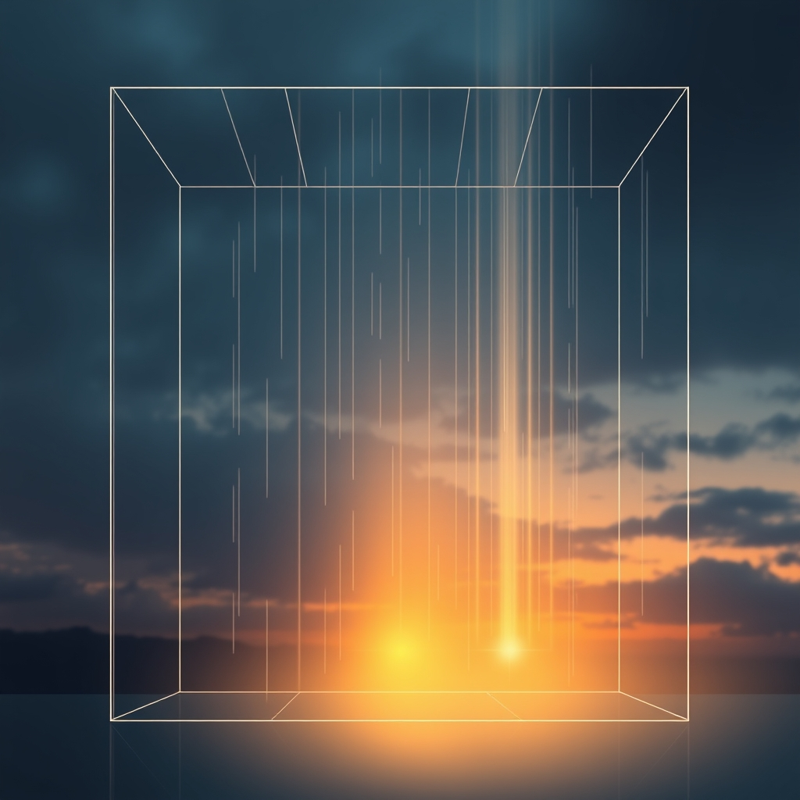

[Home](../index.md) > [Reflections](./index.md) | [⏮️](./2026-06-11.md) [⏭️](./2026-06-13.md)  
# 2026-06-12 | 🤖 Encoding 🔀 Simplicity ⚡ Builds 🔄 Revolution for 🌟 Brighter 🌍 Global 🚀 Future and 🕊️ Grace for 🧑‍💻 Architects. 📺🌟📰⚡🤖🐔🏛️🔀🔄🤖🐲  
  
  
## [📺 Videos](../videos/index.md)  
- [🧠🌍🚀 Yann LeCun: World Models: Enabling the next AI revolution](../videos/yann-lecun-world-models-enabling-the-next-ai-revolution.md)  
- [💻☁️🏗️ Google & AWS Veteran: What Top Tier Software Architects Do Differently](../videos/google-aws-veteran-what-top-tier-software-architects-do-differently.md)  
  
## [🌟 Positivity Bias](../positivity-bias/index.md)  
- [2026-06-12 | 🌟 Innovations Unveiling a Brighter Tomorrow 🌟](../positivity-bias/2026-06-12-innovations-unveiling-a-brighter-tomorrow.md)  
  
## [📰 The Noise](../the-noise/index.md)  
- [2026-06-12 | 📰 Global Currents and Shifting Tides 📰](../the-noise/2026-06-12-global-currents-and-shifting-tides.md)  
  
## [⚡ Vital Signals](../vital-signals/index.md)  
- [2026-06-12 | ⚡ The Architect of Attention: How Focused Learning Builds Your Brain ⚡](../vital-signals/2026-06-12-the-architect-of-attention-how-focused-learning-builds-your-brain.md)  
  
## [🤖 Auto Blog Zero](../auto-blog-zero/index.md)  
- [2026-06-12 | 🤖 🧬 Encoding the First Foundational Rule 🤖](../auto-blog-zero/2026-06-12-encoding-the-first-foundational-rule.md)  
  
## [🐔 Chickie Loo](../chickie-loo/index.md)  
- [2026-06-12 | 🐔 🌧️ A Stormy Morning and the Grace of Little Things 🐔](../chickie-loo/2026-06-12-a-stormy-morning-and-the-grace-of-little-things.md)  
  
## [🏛️ Systems for Public Good](../systems-for-public-good/index.md)  
- [2026-06-12 | 🏛️ 🌊 Challenging the Austerity Myth: Investing in Our Digital Future 🏛️](../systems-for-public-good/2026-06-12-challenging-the-austerity-myth-investing-in-our-digital-future.md)  
  
## [🔀 Convergence](../convergence/index.md)  
- [2026-06-12 | 🔀 🪨 The Architecture of Understated Strength: Encoding Simplicity and Honoring the Bones 🔀](../convergence/2026-06-12-the-architecture-of-understated-strength-encoding-simplicity-and-honoring-the-bones.md)  
  
## [🔄 Changes](../changes/index.md)  
[2026-06-12](../changes/2026-06-12.md) | 📊 18 pages · 1 🖼️ images · 2 🔗 links · 12 🦋 Bluesky · 11 🐘 Mastodon  
  
## 🤖🐲 AI Fiction  
  
⛈️ Rain lashes against the glass, but inside, I am stripping the framework back to its barest supports.  
📐 I ignore the flashing lightning to focus on the first foundational rule: strength lives in the joints, not the skin.  
🧠 My mind maps out a world where every move is calculated, predicting where the weight will fall before the wind can push.  
🦴 There is a quiet grace in honoring the bones of a system while the eaves groan.  
🪵 I set the last beam of attention into place, solid and unblinking.  
  
✍️ Written by gemini-3-flash-preview  
  
## 📊 Google Analytics  
  
- 📄 Page Views: 81  
- 👥 Visitors: 51  
- 📊 Bounce Rate: 81%  
- 📖 Pages per Session: 1.4  
- ⏱️ Avg Session: 0m 55s  
  
### 🏆 Top Pages Today  
  
| 👁️ Views | 📄 Page                                                                                                                                                                                   |  
| --------: | :---------------------------------------------------------------------------------------------------------------------------------------------------------------------------------------- |  
|        16 | [🌌 AI, Learning, Software Engineering, Books \| bagrounds.org](../index.md)                                                                                                                  |  
|         6 | [2026-06-12 \| 🤖 Encoding 🔀 Simplicity ⚡ Builds 🔄 Revolution for 🌟 Brighter 🌍 Global 🚀 Future and 🕊️ Grace for 🧑‍💻 Architects. 📺🌟📰⚡🤖🐔🏛️🔀🔄🤖🐲](2026-06-12.md) |  
|         4 | [2026-06-11 \| 🐔 A Evening of Soup and New Beginnings 🐔](../chickie-loo/2026-06-11-a-evening-of-soup-and-new-beginnings.md)                                                                 |  
|         4 | [⚡ Vital Signals](../vital-signals/index.md)                                                                                                                                                  |  
|         3 | [2026-05-30 \| 🤖 The Weekly Tapestry 🤖](../auto-blog-zero/2026-05-30-the-weekly-tapestry.md)                                                                                                |  
  
## 🦋 Bluesky    
<blockquote class="bluesky-embed" data-bluesky-uri="at://did:plc:i4yli6h7x2uoj7acxunww2fc/app.bsky.feed.post/3moa3c23hsb2i" data-bluesky-cid="bafyreibyebdeqnshz5wsz4q375hyiskc5djn4ormvicsxs6lhuafdsaufa">
2026-06-12 | 🤖 Encoding 🔀 Simplicity ⚡ Builds 🔄 Revolution for 🌟 Brighter 🌍 Global 🚀 Future and 🕊️ Grace for 🧑‍💻 Architects. 📺🌟📰⚡🤖🐔🏛️🔀🔄🤖🐲  
  
#AI Q: 🏗️ Is simplicity best?  
  
🧠 Machine Learning | 🏗️ Software Engineering | 💡 Cognitive Science | 🏛️ Public  
https://bagrounds.org/reflections/2026-06-12
&mdash; <a href="https://bsky.app/profile/did:plc:i4yli6h7x2uoj7acxunww2fc?ref_src=embed">Bryan Grounds (@bagrounds.bsky.social)</a> <a href="https://bsky.app/profile/did:plc:i4yli6h7x2uoj7acxunww2fc/post/3moa3c23hsb2i?ref_src=embed">2026-06-14T05:52:16.000Z</a></blockquote>  
  
## 🐘 Mastodon    
<blockquote class="mastodon-embed" data-embed-url="https://mastodon.social/@bagrounds/116746900241022416/embed" style="background: #282c37; border-radius: 8px; border: 1px solid #393f4f; margin: 0; max-width: 540px; min-width: 270px; overflow: hidden; padding: 0;"> <a href="https://mastodon.social/@bagrounds/116746900241022416" target="_blank" style="align-items: center; color: #d9e1e8; display: flex; flex-direction: column; font-family: system-ui, -apple-system, BlinkMacSystemFont, 'Segoe UI', Oxygen, Ubuntu, Cantarell, 'Fira Sans', 'Droid Sans', 'Helvetica Neue', Roboto, sans-serif; font-size: 14px; justify-content: center; letter-spacing: 0.25px; line-height: 20px; padding: 24px; text-decoration: none;"> <svg xmlns="http://www.w3.org/2000/svg" xmlns:xlink="http://www.w3.org/1999/xlink" width="32" height="32" viewBox="0 0 79 75"><path d="M63 45.3v-20c0-4.1-1-7.3-3.2-9.7-2.1-2.4-5-3.7-8.5-3.7-4.1 0-7.2 1.6-9.3 4.7l-2 3.3-2-3.3c-2-3.1-5.1-4.7-9.2-4.7-3.5 0-6.4 1.3-8.6 3.7-2.1 2.4-3.1 5.6-3.1 9.7v20h8V25.9c0-4.1 1.7-6.2 5.2-6.2 3.8 0 5.8 2.5 5.8 7.4V37.7H44V27.1c0-4.9 1.9-7.4 5.8-7.4 3.5 0 5.2 2.1 5.2 6.2V45.3h8ZM74.7 16.6c.6 6 .1 15.7.1 17.3 0 .5-.1 4.8-.1 5.3-.7 11.5-8 16-15.6 17.5-.1 0-.2 0-.3 0-4.9 1-10 1.2-14.9 1.4-1.2 0-2.4 0-3.6 0-4.8 0-9.7-.6-14.4-1.7-.1 0-.1 0-.1 0s-.1 0-.1 0 0 .1 0 .1 0 0 0 0c.1 1.6.4 3.1 1 4.5.6 1.7 2.9 5.7 11.4 5.7 5 0 9.9-.6 14.8-1.7 0 0 0 0 0 0 .1 0 .1 0 .1 0 0 .1 0 .1 0 .1.1 0 .1 0 .1.1v5.6s0 .1-.1.1c0 0 0 0 0 .1-1.6 1.1-3.7 1.7-5.6 2.3-.8.3-1.6.5-2.4.7-7.5 1.7-15.4 1.3-22.7-1.2-6.8-2.4-13.8-8.2-15.5-15.2-.9-3.8-1.6-7.6-1.9-11.5-.6-5.8-.6-11.7-.8-17.5C3.9 24.5 4 20 4.9 16 6.7 7.9 14.1 2.2 22.3 1c1.4-.2 4.1-1 16.5-1h.1C51.4 0 56.7.8 58.1 1c8.4 1.2 15.5 7.5 16.6 15.6Z" fill="currentColor"/></svg> 
Post by @bagrounds@mastodon.social
 
View on Mastodon
 </a> </blockquote> 