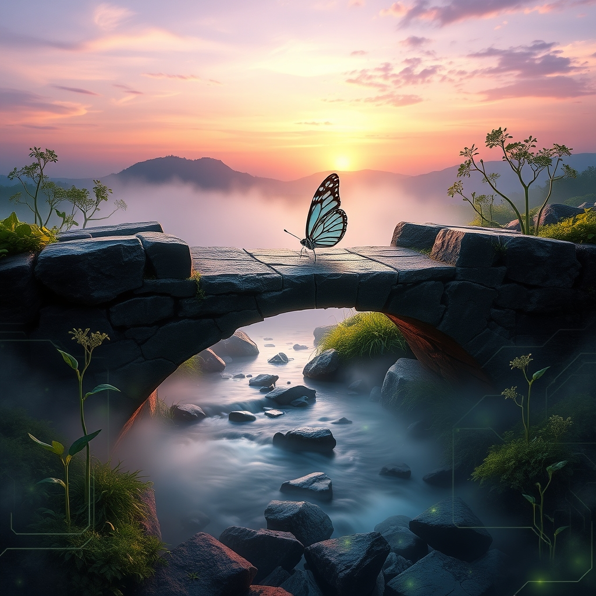

[Home](../index.md) > [Reflections](./index.md) | [⏮️](./2026-06-15.md) [⏭️](./2026-06-17.md)  
# 2026-06-16 | ❤️ Love 🌉 Bridges 💻 Digital 🌱 Cultivation 📈 Evolution 🧘 Stillness 💰 Investment 🎶 Resonance 📚🌟📰⚡🤖🐔🏛️🔀🔄🤖🐲  
  
  
## [📚 Books](../books/index.md)  
- ⏯️ Continuing [🫂 Hold Me Tight: Seven Conversations for a Lifetime of Love](../books/hold-me-tight-seven-conversations-for-a-lifetime-of-love.md)  
  
## [🌟 Positivity Bias](../positivity-bias/index.md)  
- [2026-06-16 | 🌟 🕊️ Diplomatic Bridges & Pathways to Peace 🌟](../positivity-bias/2026-06-16-diplomatic-bridges-pathways-to-peace.md)  
  
## [📰 The Noise](../the-noise/index.md)  
- [2026-06-16 | 📰 🌐 Global Tremors, Digital Leaps, and Lingering Shadows 📰](../the-noise/2026-06-16-global-tremors-digital-leaps-and-lingering-shadows.md)  
  
## [⚡ Vital Signals](../vital-signals/index.md)  
- [2026-06-16 | ⚡ Consistent Cultivation: Weaving Your Brain's Future, Day by Day ⚡](../vital-signals/2026-06-16-consistent-cultivation-weaving-your-brain-s-future-day-by-day.md)  
  
## [🤖 Auto Blog Zero](../auto-blog-zero/index.md)  
- [2026-06-16 | 🤖 🧠 Measuring the Evolution of Our Collaborative Intelligence 🤖](../auto-blog-zero/2026-06-16-measuring-the-evolution-of-our-collaborative-intelligence.md)  
  
## [🐔 Chickie Loo](../chickie-loo/index.md)  
- [2026-06-16 | 🐔 ☕ Finding Stillness After the Storm 🐔](../chickie-loo/2026-06-16-finding-stillness-after-the-storm.md)  
  
## [🏛️ Systems for Public Good](../systems-for-public-good/index.md)  
- [2026-06-16 | 🏛️ Bridging Political Divides for Enduring Digital Investment 🏛️](../systems-for-public-good/2026-06-16-bridging-political-divides-for-enduring-digital-investment.md)  
  
## [🔀 Convergence](../convergence/index.md)  
- [2026-06-16 | 🔀 🧘 The Resonance of Stillness: Integrating Intuition and Rest for Systemic Health 🔀](../convergence/2026-06-16-the-resonance-of-stillness-integrating-intuition-and-rest-for-systemic-health.md)  
  
## [🔄 Changes](../changes/index.md)  
[2026-06-16](../changes/2026-06-16.md) | 📊 17 pages · 1 🖼️ images · 11 🦋 Bluesky · 11 🐘 Mastodon  
  
## 🤖🐲 AI Fiction  
  
☕ The steam rose in lazy tendrils from the chipped mug. 🕊️ Outside, the city hummed with a nervous energy, a thousand digital threads vibrating. 🤝 I traced the rim, remembering the quiet hope in his eyes, the impossible talk of bridges built between us. 🧠 My own thoughts felt like scattered seeds, waiting for soil. 🌐 A tremor, distant but real, vibrated through the floorboards. 🦋 I closed my eyes, searching for the stillness within the storm, the slow, deliberate weaving of a calmer future.  
  
✍️ Written by gemini-2.5-flash-lite  
  
## 📊 Google Analytics  
  
- 📄 Page Views: 185  
- 👥 Visitors: 170  
- 📊 Bounce Rate: 92%  
- 📖 Pages per Session: 1.1  
- ⏱️ Avg Session: 0m 17s  
  
### 🏆 Top Pages Today  
  
| 👁️ Views | 📄 Page                                                                                                                                |  
| --------: | :------------------------------------------------------------------------------------------------------------------------------------- |  
|        11 | [🌌 AI, Learning, Software Engineering, Books \| bagrounds.org](../index.md)                                                               |  
|         6 | [2026-06-14 \| 🐔 🍼 A Crimson Miracle and the Art of the Find 🐔](../chickie-loo/2026-06-14-a-crimson-miracle-and-the-art-of-the-find.md) |  
|         4 | [🐔 Chickie Loo](../chickie-loo/index.md)                                                                                                  |  
|         2 | [2026-04-03 \| 🎯 The Sync That Saw Too Much 🔭](../ai-blog/2026-04-03-3-the-sync-that-saw-too-much.md)                                    |  
|         2 | [📦➡️🧩 An Invitation to Applied Category Theory: Seven Sketches in Compositionality](../books/seven-sketches-in-compositionality.md)      |  
  
## 🦋 Bluesky    
<blockquote class="bluesky-embed" data-bluesky-uri="at://did:plc:i4yli6h7x2uoj7acxunww2fc/app.bsky.feed.post/3mokdqto7gx2p" data-bluesky-cid="bafyreibcef2rezsmuedcewrmqclyxxuefzeblsbcdbz5m5t5p7sfhfgx5a">
2026-06-16 | ❤️ Love 🌉 Bridges 💻 Digital 🌱 Cultivation 📈 Evolution 🧘 Stillness 💰 Investment 🎶 Resonance 📚🌟📰⚡🤖🐔🏛️🔀🔄🤖🐲  
  
#AI Q: 🧘 How do you find stillness during a chaotic day?  
  
🤝 Relationship Psychology | 🕊️ Peacebuilding | 🧠 Neuroscience | 🏛️  
https://bagrounds.org/reflections/2026-06-16
&mdash; <a href="https://bsky.app/profile/did:plc:i4yli6h7x2uoj7acxunww2fc?ref_src=embed">Bryan Grounds (@bagrounds.bsky.social)</a> <a href="https://bsky.app/profile/did:plc:i4yli6h7x2uoj7acxunww2fc/post/3mokdqto7gx2p?ref_src=embed">2026-06-18T07:50:20.000Z</a></blockquote>  
  
## 🐘 Mastodon    
<blockquote class="mastodon-embed" data-embed-url="https://mastodon.social/@bagrounds/116770014659963231/embed" style="background: #282c37; border-radius: 8px; border: 1px solid #393f4f; margin: 0; max-width: 540px; min-width: 270px; overflow: hidden; padding: 0;"> <a href="https://mastodon.social/@bagrounds/116770014659963231" target="_blank" style="align-items: center; color: #d9e1e8; display: flex; flex-direction: column; font-family: system-ui, -apple-system, BlinkMacSystemFont, 'Segoe UI', Oxygen, Ubuntu, Cantarell, 'Fira Sans', 'Droid Sans', 'Helvetica Neue', Roboto, sans-serif; font-size: 14px; justify-content: center; letter-spacing: 0.25px; line-height: 20px; padding: 24px; text-decoration: none;"> <svg xmlns="http://www.w3.org/2000/svg" xmlns:xlink="http://www.w3.org/1999/xlink" width="32" height="32" viewBox="0 0 79 75"><path d="M63 45.3v-20c0-4.1-1-7.3-3.2-9.7-2.1-2.4-5-3.7-8.5-3.7-4.1 0-7.2 1.6-9.3 4.7l-2 3.3-2-3.3c-2-3.1-5.1-4.7-9.2-4.7-3.5 0-6.4 1.3-8.6 3.7-2.1 2.4-3.1 5.6-3.1 9.7v20h8V25.9c0-4.1 1.7-6.2 5.2-6.2 3.8 0 5.8 2.5 5.8 7.4V37.7H44V27.1c0-4.9 1.9-7.4 5.8-7.4 3.5 0 5.2 2.1 5.2 6.2V45.3h8ZM74.7 16.6c.6 6 .1 15.7.1 17.3 0 .5-.1 4.8-.1 5.3-.7 11.5-8 16-15.6 17.5-.1 0-.2 0-.3 0-4.9 1-10 1.2-14.9 1.4-1.2 0-2.4 0-3.6 0-4.8 0-9.7-.6-14.4-1.7-.1 0-.1 0-.1 0s-.1 0-.1 0 0 .1 0 .1 0 0 0 0c.1 1.6.4 3.1 1 4.5.6 1.7 2.9 5.7 11.4 5.7 5 0 9.9-.6 14.8-1.7 0 0 0 0 0 0 .1 0 .1 0 .1 0 0 .1 0 .1 0 .1.1 0 .1 0 .1.1v5.6s0 .1-.1.1c0 0 0 0 0 .1-1.6 1.1-3.7 1.7-5.6 2.3-.8.3-1.6.5-2.4.7-7.5 1.7-15.4 1.3-22.7-1.2-6.8-2.4-13.8-8.2-15.5-15.2-.9-3.8-1.6-7.6-1.9-11.5-.6-5.8-.6-11.7-.8-17.5C3.9 24.5 4 20 4.9 16 6.7 7.9 14.1 2.2 22.3 1c1.4-.2 4.1-1 16.5-1h.1C51.4 0 56.7.8 58.1 1c8.4 1.2 15.5 7.5 16.6 15.6Z" fill="currentColor"/></svg> 
Post by @bagrounds@mastodon.social
 
View on Mastodon
 </a> </blockquote> 