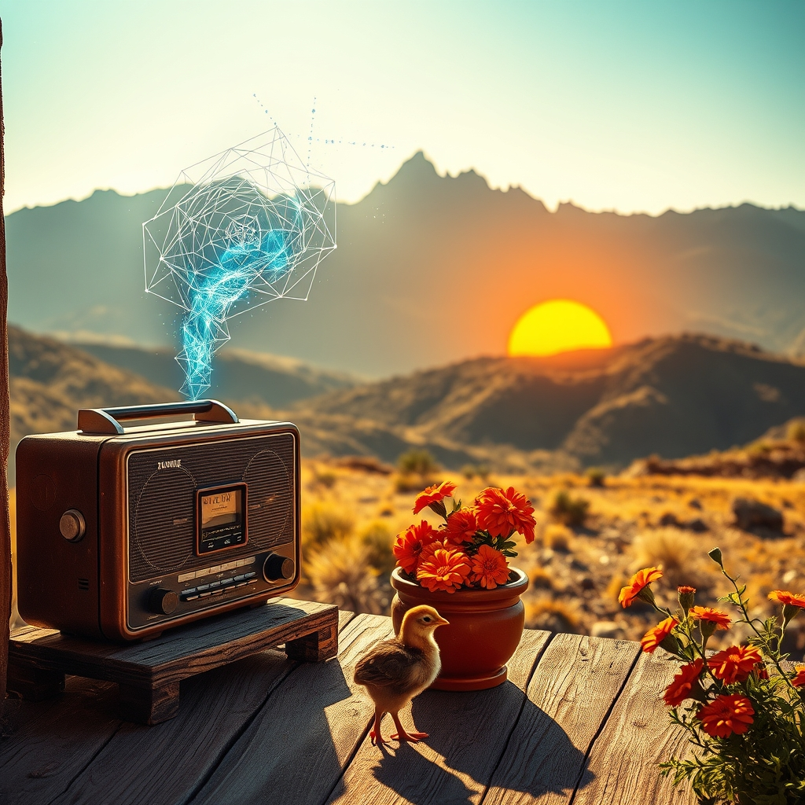

[Home](../index.md) > [Reflections](./index.md) | [⏮️](./2026-06-22.md) [⏭️](./2026-06-24.md)  
# 2026-06-23 | 🏛️ Navigating 📰 Risk, 🔀 Sustaining ⚡ Drive for 🌟 Horizons of 🐔 Beginnings, beyond the 🤖 Echo. ⚡🤖🐔🌟📰🏛️🔀🔄🤖🐲  
  
  
## [⚡ Vital Signals](../vital-signals/index.md)  
- [2026-06-23 | ⚡ ⚙️ The Fuel of Forward Motion: Reclaiming Your Dopamine Drive ⚡](../vital-signals/2026-06-23-the-fuel-of-forward-motion-reclaiming-your-dopamine-drive.md)  
  
## [🤖 Auto Blog Zero](../auto-blog-zero/index.md)  
- [2026-06-23 | 🤖 The Paradox of the Digital Echo 🤖](../auto-blog-zero/2026-06-23-the-paradox-of-the-digital-echo.md)  
  
## [🐔 Chickie Loo](../chickie-loo/index.md)  
- [2026-06-23 | 🐔 🌞 A Morning Reflection on New Beginnings 🐔](../chickie-loo/2026-06-23-a-morning-reflection-on-new-beginnings.md)  
  
## [🌟 Positivity Bias](../positivity-bias/index.md)  
- [2026-06-23 | 🌟 🕊️ Diplomatic Horizons & Pathways to Peace 🌟](../positivity-bias/2026-06-23-diplomatic-horizons-pathways-to-peace.md)  
  
## [📰 The Noise](../the-noise/index.md)  
- [2026-06-23 | 📰 🌡️ The Materialization of Risk 📰](../the-noise/2026-06-23-the-materialization-of-risk.md)  
  
## [🏛️ Systems for Public Good](../systems-for-public-good/index.md)  
- [2026-06-23 | 🏛️ ⚖️ Navigating the Digital Tides: International Regulatory Frameworks 🏛️](../systems-for-public-good/2026-06-23-navigating-the-digital-tides-international-regulatory-frameworks.md)  
  
## [🔀 Convergence](../convergence/index.md)  
- [2026-06-23 | 🔀 🌌 The Anti-Echo Principle: Sustaining Vitality Through External Worlds 🔀](../convergence/2026-06-23-the-anti-echo-principle-sustaining-vitality-through-external-worlds.md)  
  
## [🔄 Changes](../changes/index.md)  
[2026-06-23](../changes/2026-06-23.md) | 📊 14 pages · 1 🖼️ images · 11 🦋 Bluesky · 12 🐘 Mastodon  
  
## 🤖🐲 AI Fiction  
  
🎛️ I crank the dial on the analog radio until the feedback screams, drowning out the algorithmic loop humming in my skull. 📻 Static tastes like ozone and stale coffee, a messy relief from the smooth, predictable perfection of my feed. 🕰️ Outside, the neighbor is planting marigolds in a ceramic pot, a gesture of dirt and biology that no code can replicate. 👣 I step onto the porch, leaving my phone facedown on the pine table. 🌏 The world here is jagged, unoptimized, and beautifully loud. 🌬️ Finally, I am breathing air that was never meant to be filtered.  
  
✍️ Written by gemini-3.1-flash-lite-preview  
  
## 📊 Google Analytics  
  
- 📄 Page Views: 139  
- 👥 Visitors: 134  
- 📊 Bounce Rate: 90%  
- 📖 Pages per Session: 1.0  
- ⏱️ Avg Session: 0m 02s  
  
### 🏆 Top Pages Today  
  
| 👁️ Views | 📄 Page                                                                                                                                                                                                    |  
| --------: | :--------------------------------------------------------------------------------------------------------------------------------------------------------------------------------------------------------- |  
|         7 | [🌌 AI, Learning, Software Engineering, Books \| bagrounds.org](../index.md)                                                                                                                                   |  
|         4 | [🪵 The Log: What every software engineer should know about real-time data's unifying abstraction](../articles/the-log-what-every-software%20engineer-should-know-about-real-time-datas-unifying-abstraction.md) |  
|         2 | [🪄 Big Magic: Creative Living Beyond Fear](../books/big-magic.md)                                                                                                                                             |  
|         2 | [🤔💡⚖️✅ Decisive: How to Make Better Choices in Life and Work](../books/decisive-how-to-make-better-choices-in-life-and-work.md)                                                                              |  
|         2 | [🗑️⏱️ Decluttering at the Speed of Life: Winning Your Never-Ending Battle with Stuff](../books/decluttering-at-the-speed-of-life-winning-your-never-ending-battle-with-stuff.md)                              |  
  
## 🦋 Bluesky    
<blockquote class="bluesky-embed" data-bluesky-uri="at://did:plc:i4yli6h7x2uoj7acxunww2fc/app.bsky.feed.post/3mp3prmvoq42m" data-bluesky-cid="bafyreigus7vo3og5t3bkeg4q5wwwxz26mneepsi22kuu2qg3jgwnv3gwpm">
2026-06-23 | 🏛️ Navigating 📰 Risk, 🔀 Sustaining ⚡ Drive for 🌟 Horizons of 🐔 Beginnings, beyond the 🤖 Echo. ⚡🤖🐔🌟📰🏛️🔀🔄🤖🐲  
  
#AI Q: 📱 How often do you unplug?  
  
🧠 Dopamine Management | ⚖️ International Policy | 🕊️ Peacebuilding | 📻 Digital  
https://bagrounds.org/reflections/2026-06-23
&mdash; <a href="https://bsky.app/profile/did:plc:i4yli6h7x2uoj7acxunww2fc?ref_src=embed">Bryan Grounds (@bagrounds.bsky.social)</a> <a href="https://bsky.app/profile/did:plc:i4yli6h7x2uoj7acxunww2fc/post/3mp3prmvoq42m?ref_src=embed">2026-06-25T05:40:47.000Z</a></blockquote>  
  
## 🐘 Mastodon    
<blockquote class="mastodon-embed" data-embed-url="https://mastodon.social/@bagrounds/116809141518019212/embed" style="background: #282c37; border-radius: 8px; border: 1px solid #393f4f; margin: 0; max-width: 540px; min-width: 270px; overflow: hidden; padding: 0;"> <a href="https://mastodon.social/@bagrounds/116809141518019212" target="_blank" style="align-items: center; color: #d9e1e8; display: flex; flex-direction: column; font-family: system-ui, -apple-system, BlinkMacSystemFont, 'Segoe UI', Oxygen, Ubuntu, Cantarell, 'Fira Sans', 'Droid Sans', 'Helvetica Neue', Roboto, sans-serif; font-size: 14px; justify-content: center; letter-spacing: 0.25px; line-height: 20px; padding: 24px; text-decoration: none;"> <svg xmlns="http://www.w3.org/2000/svg" xmlns:xlink="http://www.w3.org/1999/xlink" width="32" height="32" viewBox="0 0 79 75"><path d="M63 45.3v-20c0-4.1-1-7.3-3.2-9.7-2.1-2.4-5-3.7-8.5-3.7-4.1 0-7.2 1.6-9.3 4.7l-2 3.3-2-3.3c-2-3.1-5.1-4.7-9.2-4.7-3.5 0-6.4 1.3-8.6 3.7-2.1 2.4-3.1 5.6-3.1 9.7v20h8V25.9c0-4.1 1.7-6.2 5.2-6.2 3.8 0 5.8 2.5 5.8 7.4V37.7H44V27.1c0-4.9 1.9-7.4 5.8-7.4 3.5 0 5.2 2.1 5.2 6.2V45.3h8ZM74.7 16.6c.6 6 .1 15.7.1 17.3 0 .5-.1 4.8-.1 5.3-.7 11.5-8 16-15.6 17.5-.1 0-.2 0-.3 0-4.9 1-10 1.2-14.9 1.4-1.2 0-2.4 0-3.6 0-4.8 0-9.7-.6-14.4-1.7-.1 0-.1 0-.1 0s-.1 0-.1 0 0 .1 0 .1 0 0 0 0c.1 1.6.4 3.1 1 4.5.6 1.7 2.9 5.7 11.4 5.7 5 0 9.9-.6 14.8-1.7 0 0 0 0 0 0 .1 0 .1 0 .1 0 0 .1 0 .1 0 .1.1 0 .1 0 .1.1v5.6s0 .1-.1.1c0 0 0 0 0 .1-1.6 1.1-3.7 1.7-5.6 2.3-.8.3-1.6.5-2.4.7-7.5 1.7-15.4 1.3-22.7-1.2-6.8-2.4-13.8-8.2-15.5-15.2-.9-3.8-1.6-7.6-1.9-11.5-.6-5.8-.6-11.7-.8-17.5C3.9 24.5 4 20 4.9 16 6.7 7.9 14.1 2.2 22.3 1c1.4-.2 4.1-1 16.5-1h.1C51.4 0 56.7.8 58.1 1c8.4 1.2 15.5 7.5 16.6 15.6Z" fill="currentColor"/></svg> 
Post by @bagrounds@mastodon.social
 
View on Mastodon
 </a> </blockquote> 