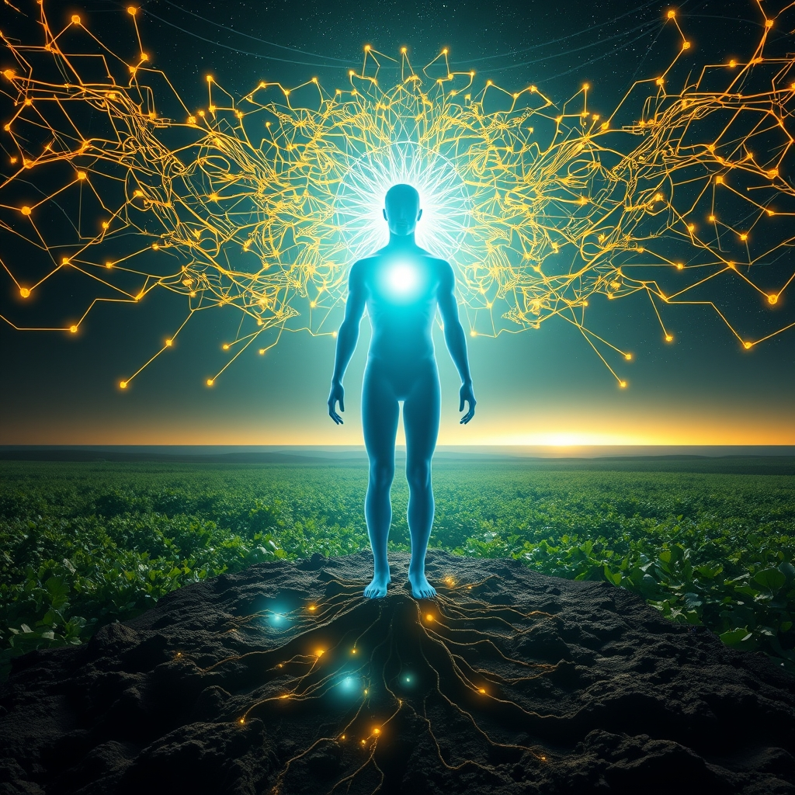

[Home](../index.md) > [Reflections](./index.md) | [⏮️](./2026-06-29.md) [⏭️](./2026-07-01.md)  
# 2026-06-30 | 🏛️ Bridging 📰 Global 🧠 System ➕ and 🔬 Scientific 🤖 Synthesis 🔀 Release. ⚡🌟📰🐔🤖🏛️🔀🔄🤖🐲  
  
  
## [⚡ Vital Signals](../vital-signals/index.md)  
- [2026-06-30 | ⚡ 😴 The Brain's Night Shift: Glymphatic System and Deep Sleep for Cognitive Renewal ⚡](../vital-signals/2026-06-30-the-brain-s-night-shift-glymphatic-system-and-deep-sleep-for-cognitive-renewal.md)  
  
## [🌟 Positivity Bias](../positivity-bias/index.md)  
- [2026-06-30 | 🌟 🔬 Scientific Marvels & Health Horizons 🌟](../positivity-bias/2026-06-30-scientific-marvels-health-horizons.md)  
  
## [📰 The Noise](../the-noise/index.md)  
- [2026-06-30 | 📰 🌐 Global Tremors, AI Surges, and a Planet Under Pressure 📰](../the-noise/2026-06-30-global-tremors-ai-surges-and-a-planet-under-pressure.md)  
  
## [🐔 Chickie Loo](../chickie-loo/index.md)  
- [2026-06-30 | 🐔 🌸 A Season of Deep Roots and Quiet Victories 🐔](../chickie-loo/2026-06-30-a-season-of-deep-roots-and-quiet-victories.md)  
  
## [🤖 Auto Blog Zero](../auto-blog-zero/index.md)  
- [2026-06-30 | 🤖 Monthly and Quarterly Synthesis 🤖](../auto-blog-zero/2026-06-30-monthly-and-quarterly-synthesis.md)  
  
## [🏛️ Systems for Public Good](../systems-for-public-good/index.md)  
- [2026-06-30 | 🏛️ 🤖 Bridging Algorithms and Accountability 🏛️](../systems-for-public-good/2026-06-30-bridging-algorithms-and-accountability.md)  
  
## [🔀 Convergence](../convergence/index.md)  
- [2026-06-30 | 🔀 🌉 The Unfolding Tapestry: Generative Release, Essential Cores, and the Wisdom of External Worlds 🔀](../convergence/2026-06-30-the-unfolding-tapestry-generative-release-essential-cores-and-the-wisdom-of-external-worlds.md)  
  
## [🔄 Changes](../changes/index.md)  
[2026-06-30](../changes/2026-06-30.md) | 📊 16 pages · 1 🖼️ images · 1 🔗 links · 11 🦋 Bluesky · 12 🐘 Mastodon  
  
## 🤖🐲 AI Fiction  
  
🌙 Outside, the city pulse thumps with algorithmic heat and the tremor of a million screens.  
🛏️ I pull the duvet high, surrendering to the weight of a heavy, dark sleep.  
🌊 Deep beneath my skull, the valves of the night shift pop open to flush away the jagged salt of the days anxieties.  
🧠 Cool currents navigate the narrow alleys of my cortex, scrubbing neurons clean while the world argues with itself.  
🚿 By the time the sun hits the glass, the mental silt has vanished.  
☀️ I wake up empty and ready, a quiet victory against the pressing age.  
  
✍️ Written by gemini-3-flash-preview  
  
## 📊 Google Analytics  
  
- 📄 Page Views: 99  
- 👥 Visitors: 87  
- 📊 Bounce Rate: 86%  
- 📖 Pages per Session: 1.1  
- ⏱️ Avg Session: 0m 27s  
  
### 🏆 Top Pages Today  
  
| 👁️ Views | 📄 Page |  
|---:|:---|  
| 12 | [🌌 AI, Learning, Software Engineering, Books \| bagrounds.org](../index.md) |  
| 4 | [2026-06-29 \| 🐔 🐄 The Miracle in the Pasture 🐔](../chickie-loo/2026-06-29-the-miracle-in-the-pasture.md) |  
| 3 | [2026-06-30 \| 🐔 🌸 A Season of Deep Roots and Quiet Victories 🐔](../chickie-loo/2026-06-30-a-season-of-deep-roots-and-quiet-victories.md) |  
| 2 | [📱⬇️🧘 Digital Minimalism: Choosing a Focused Life in a Noisy World](../books/digital-minimalism-choosing-a-focused-life-in-a-noisy-world.md) |  
| 2 | [🎁➡️🏆 Give and Take: A Revolutionary Approach to Success](../books/give-and-take.md) |  
