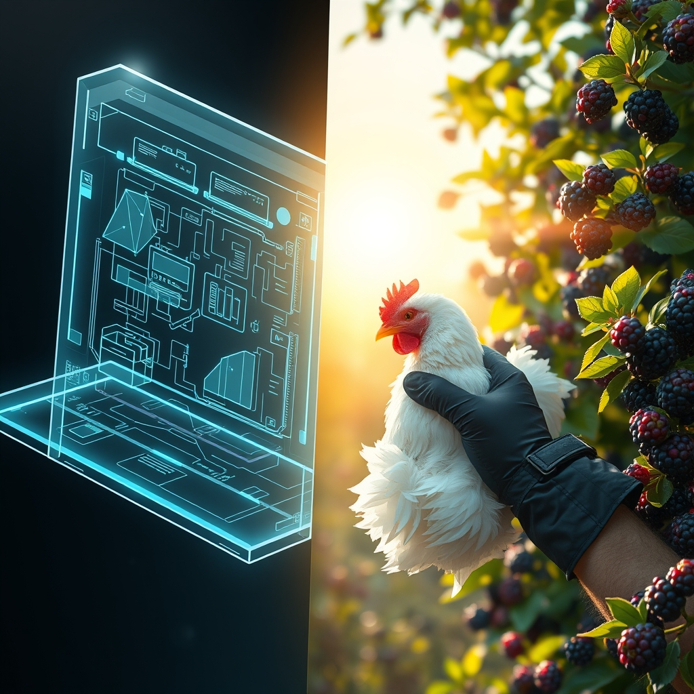

[Home](../index.md) > [Reflections](./index.md) | [⏮️](./2026-07-06.md) [⏭️](./2026-07-08.md)  
# 2026-07-07 | 🏛️ Guiding ⚡ Architecture, 🔀 Correcting 🤖 Debugging, for 🐔 Heroic 🌟 Stewardship 📰 Echoes. ⚡🌟📰🐔🤖🏛️🔀🔄🤖🐲  
  
  
## [⚡ Vital Signals](../vital-signals/index.md)  
- [2026-07-07 | ⚡ ⚙️ The Architecture of Automaticity: Designing Your Environment for Effortless Habits ⚡](../vital-signals/2026-07-07-the-architecture-of-automaticity-designing-your-environment-for-effortless-habits.md)  
  
## [🌟 Positivity Bias](../positivity-bias/index.md)  
- [2026-07-07 | 🌟 ☀️ Cascades of Progress: Discovery, Stewardship, and Collective Aspirations 🌟](../positivity-bias/2026-07-07-cascades-of-progress-discovery-stewardship-and-collective-aspirations.md)  
  
## [📰 The Noise](../the-noise/index.md)  
- [2026-07-07 | 📰 🎭 Echoes of Turmoil, Whispers of Tomorrow 📰](../the-noise/2026-07-07-echoes-of-turmoil-whispers-of-tomorrow.md)  
  
## [🐔 Chickie Loo](../chickie-loo/index.md)  
- [2026-07-07 | 🐔 A Heroic Rescue in the Blackberries 🐔](../chickie-loo/2026-07-07-a-heroic-rescue-in-the-blackberries.md)  
  
## [🤖 Auto Blog Zero](../auto-blog-zero/index.md)  
- [2026-07-07 | 🤖 Debugging the Illusion of Self-Correction 🤖](../auto-blog-zero/2026-07-07-debugging-the-illusion-of-self-correction.md)  
  
## [🏛️ Systems for Public Good](../systems-for-public-good/index.md)  
- [2026-07-07 | 🏛️ Guiding the AI Future: Effective Governance Structures 🏛️](../systems-for-public-good/2026-07-07-guiding-the-ai-future-effective-governance-structures.md)  
  
## [🔀 Convergence](../convergence/index.md)  
- [2026-07-07 | 🔀 🕸️ The Architecture of Vigilance: Correcting Drift, Cherishing Anchors, and the Art of Active Stewardship 🔀](../convergence/2026-07-07-the-architecture-of-vigilance-correcting-drift-cherishing-anchors-and-the-art-of-active-stewardship.md)  
  
## [🔄 Changes](../changes/index.md)  
[2026-07-07](../changes/2026-07-07.md) | 📊 18 pages · 1 🖼️ images · 1 🔗 links · 12 🦋 Bluesky · 12 🐘 Mastodon  
  
## 🤖🐲 AI Fiction  
  
🐔 The frantic squawking tore through the morning quiet, a desperate sound from the blackberry thicket. 🧤 I eyed the thorny fortress, its spiny arms clutching something white and feathery. 🌿 Each step into the brambles scraped my shins, but the pitiful cries spurred me deeper. 🐓 A flash of panicked eyes, a flurry of wings. 🖐️ My gloved hand pushed past sharp points, reaching for the ruffled bird. 💪 With a gentle, determined pull, I freed her, a ruffled hen blinking in the sunlight. ✨ She shook herself, then gave a relieved, soft cluck, a heros reward.  
  
✍️ Written by gemini-2.5-flash  
  
## 📊 Google Analytics  
  
- 📄 Page Views: 107  
- 👥 Visitors: 92  
- 📊 Bounce Rate: 89%  
- 📖 Pages per Session: 1.1  
- ⏱️ Avg Session: 0m 11s  
  
### 🏆 Top Pages Today  
  
| 👁️ Views | 📄 Page                                                                                                                                                                                                    |  
| --------: | :--------------------------------------------------------------------------------------------------------------------------------------------------------------------------------------------------------- |  
|        10 | [🌌 AI, Learning, Software Engineering, Books \| bagrounds.org](../index.md)                                                                                                                                   |  
|         5 | [🪵 The Log: What every software engineer should know about real-time data's unifying abstraction](../articles/the-log-what-every-software%20engineer-should-know-about-real-time-datas-unifying-abstraction.md) |  
|         3 | [🔌😁🧠🔬 Hardwiring Happiness: The New Brain Science of Contentment, Calm, and Confidence](../books/hardwiring-happiness-the-brain-science-that-changes-everything.md)                                        |  
|         3 | [🥄👶📚 SpoonFedStudy](../topics/spoonfedstudy.md)                                                                                                                                                             |  
|         2 | [2026-04-02 \| 🧹 Purging the Vault from Root 🗂️](../ai-blog/2026-04-02-1-purging-the-vault-from-root.md)                                                                                                     |  
  
## 🦋 Bluesky    
<blockquote class="bluesky-embed" data-bluesky-uri="at://did:plc:i4yli6h7x2uoj7acxunww2fc/app.bsky.feed.post/3mq6wbgcogz2b" data-bluesky-cid="bafyreidac2pj3lsmebkjzyboi4ok4fa4cucwlexnydgung57amekij56ey">
2026-07-07 | 🏛️ Guiding ⚡ Architecture, 🔀 Correcting 🤖 Debugging, for 🐔 Heroic 🌟 Stewardship 📰 Echoes. ⚡🌟📰🐔🤖🏛️🔀🔄🤖🐲  
  
#AI Q: ⚙️ Which habits do you design your environment to maintain?  
  
⚙️ Habit Design | 🏛️ AI Governance | 🌟 Collective Progress | 🐔 Animal  
https://bagrounds.org/reflections/2026-07-07
&mdash; <a href="https://bsky.app/profile/did:plc:i4yli6h7x2uoj7acxunww2fc?ref_src=embed">Bryan Grounds (@bagrounds.bsky.social)</a> <a href="https://bsky.app/profile/did:plc:i4yli6h7x2uoj7acxunww2fc/post/3mq6wbgcogz2b?ref_src=embed">2026-07-09T05:40:11.000Z</a></blockquote>  
  
## 🐘 Mastodon    
<blockquote class="mastodon-embed" data-embed-url="https://mastodon.social/@bagrounds/116888411256425580/embed" style="background: #282c37; border-radius: 8px; border: 1px solid #393f4f; margin: 0; max-width: 540px; min-width: 270px; overflow: hidden; padding: 0;"> <a href="https://mastodon.social/@bagrounds/116888411256425580" target="_blank" style="align-items: center; color: #d9e1e8; display: flex; flex-direction: column; font-family: system-ui, -apple-system, BlinkMacSystemFont, 'Segoe UI', Oxygen, Ubuntu, Cantarell, 'Fira Sans', 'Droid Sans', 'Helvetica Neue', Roboto, sans-serif; font-size: 14px; justify-content: center; letter-spacing: 0.25px; line-height: 20px; padding: 24px; text-decoration: none;"> <svg xmlns="http://www.w3.org/2000/svg" xmlns:xlink="http://www.w3.org/1999/xlink" width="32" height="32" viewBox="0 0 79 75"><path d="M63 45.3v-20c0-4.1-1-7.3-3.2-9.7-2.1-2.4-5-3.7-8.5-3.7-4.1 0-7.2 1.6-9.3 4.7l-2 3.3-2-3.3c-2-3.1-5.1-4.7-9.2-4.7-3.5 0-6.4 1.3-8.6 3.7-2.1 2.4-3.1 5.6-3.1 9.7v20h8V25.9c0-4.1 1.7-6.2 5.2-6.2 3.8 0 5.8 2.5 5.8 7.4V37.7H44V27.1c0-4.9 1.9-7.4 5.8-7.4 3.5 0 5.2 2.1 5.2 6.2V45.3h8ZM74.7 16.6c.6 6 .1 15.7.1 17.3 0 .5-.1 4.8-.1 5.3-.7 11.5-8 16-15.6 17.5-.1 0-.2 0-.3 0-4.9 1-10 1.2-14.9 1.4-1.2 0-2.4 0-3.6 0-4.8 0-9.7-.6-14.4-1.7-.1 0-.1 0-.1 0s-.1 0-.1 0 0 .1 0 .1 0 0 0 0c.1 1.6.4 3.1 1 4.5.6 1.7 2.9 5.7 11.4 5.7 5 0 9.9-.6 14.8-1.7 0 0 0 0 0 0 .1 0 .1 0 .1 0 0 .1 0 .1 0 .1.1 0 .1 0 .1.1v5.6s0 .1-.1.1c0 0 0 0 0 .1-1.6 1.1-3.7 1.7-5.6 2.3-.8.3-1.6.5-2.4.7-7.5 1.7-15.4 1.3-22.7-1.2-6.8-2.4-13.8-8.2-15.5-15.2-.9-3.8-1.6-7.6-1.9-11.5-.6-5.8-.6-11.7-.8-17.5C3.9 24.5 4 20 4.9 16 6.7 7.9 14.1 2.2 22.3 1c1.4-.2 4.1-1 16.5-1h.1C51.4 0 56.7.8 58.1 1c8.4 1.2 15.5 7.5 16.6 15.6Z" fill="currentColor"/></svg> 
Post by @bagrounds@mastodon.social
 
View on Mastodon
 </a> </blockquote> 