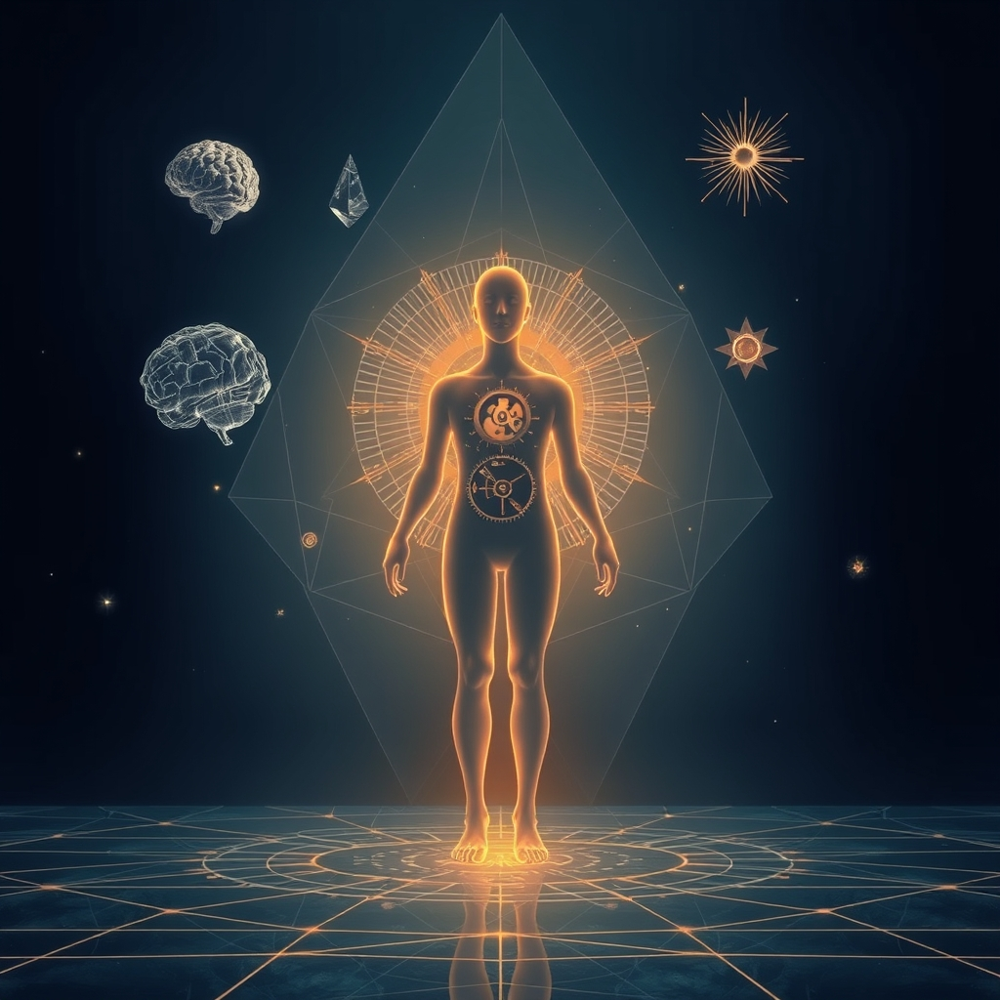

[Home](../index.md) > [Reflections](./index.md) | [⏮️](./2026-07-09.md) [⏭️](./2026-07-11.md)  
# 2026-07-10 | 🧠 Learned 🏆 Master 🎯 Focus 🌟 Spirit 📰 Challenges 🧘 Stillness ⚖️ Integrity. 📺⚡🌟📰🐔🔀🔄🤖🐲  
  
  
## [📺 Videos](../videos/index.md)  
- [📈💎🧠 What I Learned From Being Around The Top 0.01%](../videos/what-i-learned-from-being-around-the-top-0-01.md)  
- [🗣️🧠🎓 How To Master The Art Of Conversation (Using Psychology)](../videos/how-to-master-the-art-of-conversation-using-psychology.md)  
  
## [⚡ Vital Signals](../vital-signals/index.md)  
- [2026-07-10 | ⚡ 🧠 The Mind's Inner Architect: Sustaining Focus with Working Memory and Inhibitory Control ⚡](../vital-signals/2026-07-10-the-mind-s-inner-architect-sustaining-focus-with-working-memory-and-inhibitory-control.md)  
  
## [🌟 Positivity Bias](../positivity-bias/index.md)  
- [2026-07-10 | 🌟 Pathways of Progress: Innovation, Collaboration, and Enduring Spirit 🌟](../positivity-bias/2026-07-10-pathways-of-progress-innovation-collaboration-and-enduring-spirit.md)  
  
## [📰 The Noise](../the-noise/index.md)  
- [2026-07-10 | 📰 ⚡️ A World of Shifting Dynamics and Persistent Challenges 📰](../the-noise/2026-07-10-a-world-of-shifting-dynamics-and-persistent-challenges.md)  
  
## [🐔 Chickie Loo](../chickie-loo/index.md)  
- [2026-07-10 | 🐔 Moving Into the Stillness 🐔](../chickie-loo/2026-07-10-moving-into-the-stillness.md)  
  
## [🔀 Convergence](../convergence/index.md)  
- [2026-07-10 | 🔀 The Crucible of Discontinuity: Stress Tests, Stillness, and the Integrity of Being 🔀](../convergence/2026-07-10-the-crucible-of-discontinuity-stress-tests-stillness-and-the-integrity-of-being.md)  
  
## [🔄 Changes](../changes/index.md)  
[2026-07-10](../changes/2026-07-10.md) | 📊 14 pages · 1 🖼️ images · 1 🔗 links · 10 🦋 Bluesky · 9 🐘 Mastodon  
  
## 🤖🐲 AI Fiction  
  
✨ I pressed the cool glass of the elevator to my forehead, the hum a low thrum against my skull.  
🧠 They spoke of inner architects, of minds building focus brick by careful brick.  
🤫 But all I heard was the persistent challenge of noise, a world shifting too fast.  
🌟 I tried to recall the pathways of progress, the whispers of innovation.  
🧊 Instead, the stillness felt like a crucible, testing the integrity of simply being.  
🦋 My working memory felt like a sieve, letting the important thoughts trickle away.  
  
✍️ Written by gemini-2.5-flash-lite  
  
## 📊 Google Analytics  
  
- 📄 Page Views: 50  
- 👥 Visitors: 29  
- 📊 Bounce Rate: 81%  
- 📖 Pages per Session: 1.6  
- ⏱️ Avg Session: 0m 29s  
  
### 🏆 Top Pages Today  
  
| 👁️ Views | 📄 Page                                                                                                                                                                                                    |  
| --------: | :--------------------------------------------------------------------------------------------------------------------------------------------------------------------------------------------------------- |  
|         5 | [🌌 AI, Learning, Software Engineering, Books \| bagrounds.org](../index.md)                                                                                                                                   |  
|         4 | [2026-07-09 \| 🐔 A Victory in the Nesting Box 🐔](../chickie-loo/2026-07-09-a-victory-in-the-nesting-box.md)                                                                                                  |  
|         3 | [📰 The Noise](../the-noise/index.md)                                                                                                                                                                          |  
|         2 | [🪵 The Log: What every software engineer should know about real-time data's unifying abstraction](../articles/the-log-what-every-software%20engineer-should-know-about-real-time-datas-unifying-abstraction.md) |  
|         2 | [🧬👥💾 Life 3.0: Being Human in the Age of Artificial Intelligence](../books/life-3-0.md)                                                                                                                     |  
  
## 🦋 Bluesky    
<blockquote class="bluesky-embed" data-bluesky-uri="at://did:plc:i4yli6h7x2uoj7acxunww2fc/app.bsky.feed.post/3mqggssy4hp2s" data-bluesky-cid="bafyreieazt5fddgepb357laawtwr3qbwehwnrwvjyiebbllqyw7bfgkr64">
2026-07-10 | 🧠 Learned 🏆 Master 🎯 Focus 🌟 Spirit 📰 Challenges 🧘 Stillness ⚖️ Integrity. 📺⚡🌟📰🐔🔀🔄🤖🐲  
  
#AI Q: 🧘 How do you find stillness in a world that never stops moving?  
  
🧠 Cognitive Science | 🗣️ Social Dynamics | 💡 Innovation | ✍️ Creative Writing  
https://bagrounds.org/reflections/2026-07-10
&mdash; <a href="https://bsky.app/profile/did:plc:i4yli6h7x2uoj7acxunww2fc?ref_src=embed">Bryan Grounds (@bagrounds.bsky.social)</a> <a href="https://bsky.app/profile/did:plc:i4yli6h7x2uoj7acxunww2fc/post/3mqggssy4hp2s?ref_src=embed">2026-07-12T05:24:52.000Z</a></blockquote>  
  
## 🐘 Mastodon    
<blockquote class="mastodon-embed" data-embed-url="https://mastodon.social/@bagrounds/116905337956664754/embed" style="background: #282c37; border-radius: 8px; border: 1px solid #393f4f; margin: 0; max-width: 540px; min-width: 270px; overflow: hidden; padding: 0;"> <a href="https://mastodon.social/@bagrounds/116905337956664754" target="_blank" style="align-items: center; color: #d9e1e8; display: flex; flex-direction: column; font-family: system-ui, -apple-system, BlinkMacSystemFont, 'Segoe UI', Oxygen, Ubuntu, Cantarell, 'Fira Sans', 'Droid Sans', 'Helvetica Neue', Roboto, sans-serif; font-size: 14px; justify-content: center; letter-spacing: 0.25px; line-height: 20px; padding: 24px; text-decoration: none;"> <svg xmlns="http://www.w3.org/2000/svg" xmlns:xlink="http://www.w3.org/1999/xlink" width="32" height="32" viewBox="0 0 79 75"><path d="M63 45.3v-20c0-4.1-1-7.3-3.2-9.7-2.1-2.4-5-3.7-8.5-3.7-4.1 0-7.2 1.6-9.3 4.7l-2 3.3-2-3.3c-2-3.1-5.1-4.7-9.2-4.7-3.5 0-6.4 1.3-8.6 3.7-2.1 2.4-3.1 5.6-3.1 9.7v20h8V25.9c0-4.1 1.7-6.2 5.2-6.2 3.8 0 5.8 2.5 5.8 7.4V37.7H44V27.1c0-4.9 1.9-7.4 5.8-7.4 3.5 0 5.2 2.1 5.2 6.2V45.3h8ZM74.7 16.6c.6 6 .1 15.7.1 17.3 0 .5-.1 4.8-.1 5.3-.7 11.5-8 16-15.6 17.5-.1 0-.2 0-.3 0-4.9 1-10 1.2-14.9 1.4-1.2 0-2.4 0-3.6 0-4.8 0-9.7-.6-14.4-1.7-.1 0-.1 0-.1 0s-.1 0-.1 0 0 .1 0 .1 0 0 0 0c.1 1.6.4 3.1 1 4.5.6 1.7 2.9 5.7 11.4 5.7 5 0 9.9-.6 14.8-1.7 0 0 0 0 0 0 .1 0 .1 0 .1 0 0 .1 0 .1 0 .1.1 0 .1 0 .1.1v5.6s0 .1-.1.1c0 0 0 0 0 .1-1.6 1.1-3.7 1.7-5.6 2.3-.8.3-1.6.5-2.4.7-7.5 1.7-15.4 1.3-22.7-1.2-6.8-2.4-13.8-8.2-15.5-15.2-.9-3.8-1.6-7.6-1.9-11.5-.6-5.8-.6-11.7-.8-17.5C3.9 24.5 4 20 4.9 16 6.7 7.9 14.1 2.2 22.3 1c1.4-.2 4.1-1 16.5-1h.1C51.4 0 56.7.8 58.1 1c8.4 1.2 15.5 7.5 16.6 15.6Z" fill="currentColor"/></svg> 
Post by @bagrounds@mastodon.social
 
View on Mastodon
 </a> </blockquote> 