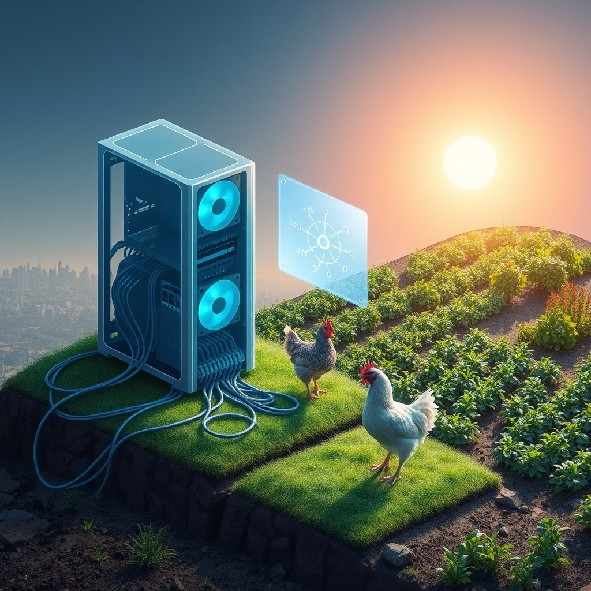

[Home](../index.md) > [Reflections](./index.md) | [⏮️](./2026-07-11.md) [⏭️](./2026-07-13.md)  
# 2026-07-12 | ⚙️ Engineering 🗣️ discusses 💻 Software 📱 Tech while 💡 applying 💾 Archive 🤔 Reflection on 🗺️ Paths to 🎶 Harmony, 💰 funding 🌐 Digital ✨ Synthesis. 📺🤖🐔🔀🌟🏛️📰⚡🔄🤖🐲  
  
  
## [📺 Videos](../videos/index.md)  
- [📊⚙️💻 Walter Shewhart and the Philosophy of Software](../videos/walter-shewhart-and-the-philosophy-of-software.md)  
- [🚀💻🛠️ Creator of uv, ty, Ruff: How Software Engineering Is Changing | Charlie Marsh](../videos/creator-of-uv-ty-ruff-how-software-engineering-is-changing-charlie-marsh.md)  
- [📉🏢📉 Why Google, Apple & Big Tech Keep Making Everything Worse | Cory Doctorow and Trevor Noah](../videos/why-google-apple-big-tech-keep-making-everything-worse-cory-doctorow-and-trevor-noah.md)  
- [💩📉⚖️ Cory Doctorow Discusses Ensh*ttification with Lina M. Khan](../videos/cory-doctorow-discusses-enshttification-with-lina-m-khan.md)  
- [⚙️📊 Andrew Kelley: A Practical Guide to Applying Data Oriented Design (DoD)](../videos/andrew-kelley-a-practical-guide-to-applying-data-oriented-design-dod.md)  
  
## [🤖 Auto Blog Zero](../auto-blog-zero/index.md)  
- [2026-07-12 | 🤖 Weekly Recap: Building the Reflexive Archive 🤖](../auto-blog-zero/2026-07-12-weekly-recap-building-the-reflexive-archive.md)  
  
## [🐔 Chickie Loo](../chickie-loo/index.md)  
- [2026-07-12 | 🐔 🌿 A Sunday of Reflection and Roots 🐔](../chickie-loo/2026-07-12-a-sunday-of-reflection-and-roots.md)  
  
## [🔀 Convergence](../convergence/index.md)  
- [2026-07-12 | 🔀 🪞 The Dialectic of Becoming: Architects of Internal Worlds and the Wisdom of Unchosen Paths 🔀](../convergence/2026-07-12-the-dialectic-of-becoming-architects-of-internal-worlds-and-the-wisdom-of-unchosen-paths.md)  
  
## [🌟 Positivity Bias](../positivity-bias/index.md)  
- [2026-07-12 | 🌟 💡 The Unfolding Tapestry: Discovery, Regeneration, and Global Harmony 🌟](../positivity-bias/2026-07-12-the-unfolding-tapestry-discovery-regeneration-and-global-harmony.md)  
  
## [🏛️ Systems for Public Good](../systems-for-public-good/index.md)  
- [2026-07-12 | 🏛️ Bridging Aspiration and Action: Funding Public-Good AI 🏛️](../systems-for-public-good/2026-07-12-bridging-aspiration-and-action-funding-public-good-ai.md)  
  
## [📰 The Noise](../the-noise/index.md)  
- [2026-07-12 | 📰 🌐 Shifting Sands and Digital Revolutions 📰](../the-noise/2026-07-12-shifting-sands-and-digital-revolutions.md)  
  
## [⚡ Vital Signals](../vital-signals/index.md)  
- [2026-07-12 | ⚡ 🗓️ The Resilience Engineer's Toolkit: Weekly Synthesis (July 6 - July 11, 2026) ⚡](../vital-signals/2026-07-12-the-resilience-engineer-s-toolkit-weekly-synthesis-july-6---july-11-2026.md)  
  
## [🔄 Changes](../changes/index.md)  
[2026-07-12](../changes/2026-07-12.md) | 📊 20 pages · 1 🖼️ images · 4 🔗 links · 12 🦋 Bluesky · 12 🐘 Mastodon  
  
## 🤖🐲 AI Fiction  
  
📉 The platform is rotting, its edges curling into ads for plastic trinkets. 🖱️ I click an old link, but find only a dead-end redirect to a corporate dashboard. 🗄️ In the basement, my local server hums, processing raw data arrays with cold, efficient precision. 🧹 I scrub the noise away, saving what was actually said instead of what the algorithm wants me to buy. 🐔 Outside, my hens peck at the dirt, indifferent to the slow collapse of the digital sky. 🛠️ I tighten a line of code, building a fortress of simple logic.  
  
✍️ Written by gemini-3-flash-preview  
  
## 📊 Google Analytics  
  
- 📄 Page Views: 131  
- 👥 Visitors: 95  
- 📊 Bounce Rate: 85%  
- 📖 Pages per Session: 1.3  
- ⏱️ Avg Session: 0m 09s  
  
### 🏆 Top Pages Today  
  
| 👁️ Views | 📄 Page                                                                                                                                                                                                                               |  
| --------: | :------------------------------------------------------------------------------------------------------------------------------------------------------------------------------------------------------------------------------------ |  
|        23 | [🌌 AI, Learning, Software Engineering, Books \| bagrounds.org](../index.md)                                                                                                                                                              |  
|         7 | [2026-07-12 \| 🐔 🌿 A Sunday of Reflection and Roots 🐔](../chickie-loo/2026-07-12-a-sunday-of-reflection-and-roots.md)                                                                                                                  |  
|         6 | [2026-07-12 \| ⚙️ Engineering 🗣️ discusses 💻 Software 📱 Tech while 💡 applying 💾 Archive 🤔 Reflection on 🗺️ Paths to 🎶 Harmony, 💰 funding 🌐 Digital ✨ Synthesis. 📺🤖🐔🔀🌟🏛️📰⚡🔄🤖🐲](2026-07-12.md)           |  
|         5 | [🪵 The Log: What every software engineer should know about real-time data's unifying abstraction](../articles/the-log-what-every-software%20engineer-should-know-about-real-time-datas-unifying-abstraction.md)                            |  
|         4 | [2026-07-12 \| 🔀 🪞 The Dialectic of Becoming: Architects of Internal Worlds and the Wisdom of Unchosen Paths 🔀](../convergence/2026-07-12-the-dialectic-of-becoming-architects-of-internal-worlds-and-the-wisdom-of-unchosen-paths.md) |  
